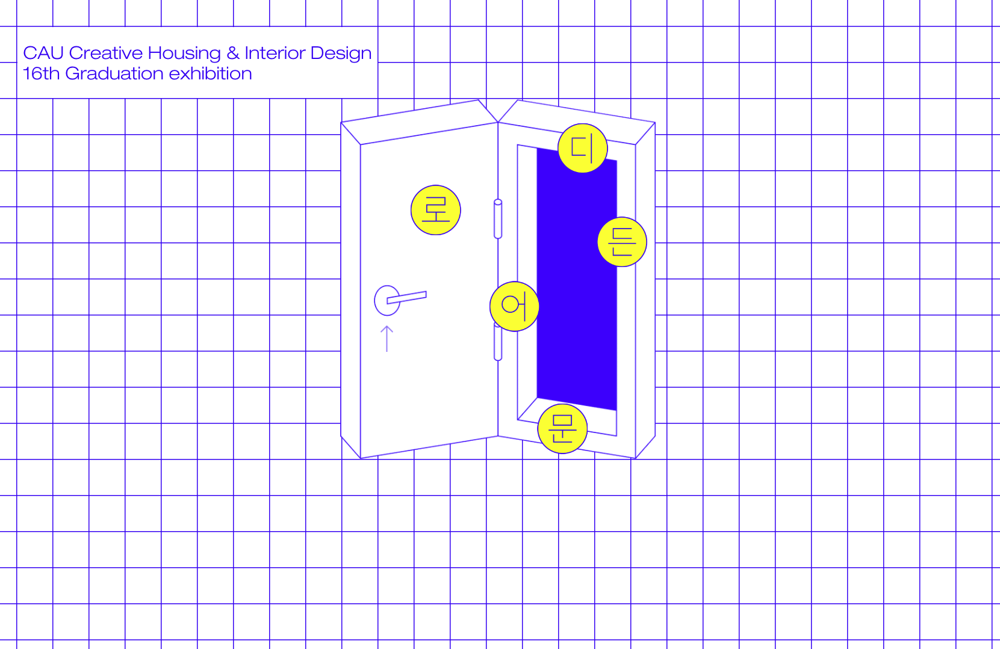

## 중앙대학교 실내환경디자인학과 졸업전시회 웹 애플리케이션

- 작업기간: 2020.10 - 2020.11
- 기술스택: React, GatsbyJS, Javscript, styled-components, HTML Canvas, Firebase Firestore, CSS, HTML
- 참여율: 100%

## 코딩 교육 플랫폼 인프런 프론트엔드 개발

- 작업기간: 2018.10 - 2019.05
- 기술스택: Javascript(VanilaJS), Scss, Webpack, Babel, HTML5, FxJS, FxDomJS, NodeJS, ExpressJS, 함수형 패러다임 기반의 자바스크립트 개발
- 참여율: 프론트엔드 80%, 백엔드 10%
- git init 부터 production까지 프론트엔드를 담당해 성공적으로 런칭했습니다.

## 인프런 어드민용 웹 애플리케이션 개발

- 작업기간: 2019.10 - 2020.01
- 기술스택: Javascript(VanilaJS), React, NextJS, Redux, Redux-Thunk, NodeJS, ExpressJS
- 참여율: 100%

## 크라우드펀딩 플랫폼 텀블벅 프론트엔드 개발 및 유지 보수

- 작업기간: 2017.07 - 2018.04
- 기술스택: React, MobX, styled-components, CSS, HTML5, Javascript
- 참여율: 20%
- 재사용 가능한 UI Component를 만들고, RoR 기반의 Server Side Rendering 프론트엔드 구현부를 React를 활용한 Single Page Application으로 마이그레이션 하는 작업을 진행했습니다.