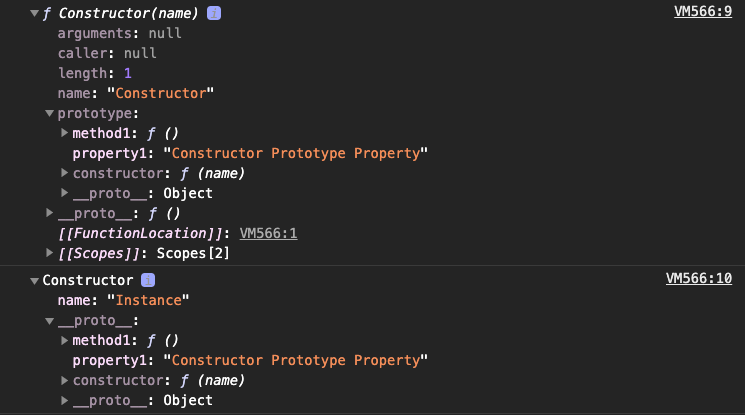

## 프로토타입의 개념 이해

자바스크립트는 프로토타입 기반 언어이다. 프로토타입 기반 언어에서는 어떤 객체를 원형으로 삼고 이를 복제(참조)함으로써 상속과 비슷한 효과를 얻는다.

### constructor, prototype, instance

```js
const instance = new Constructor();
```

어떤 생성자 함수(Constructor)를 new 연산자와 함께 호출하면, Constructor에서 정의된 내용을 바탕으로 새로운 인스턴스가 생성된다. 이때 인스턴스에는 `__proto__`라는 프로퍼티가 자동으로 부여되는데, 이 프로퍼티는 Constructor의 `prototype`이라는 프로퍼티를 참조한다.

prototype 객체 내부에는 인스턴스가 사용할 메서드를 저장한다. 그러면 인스턴스에서도 숨겨진 프로퍼티인 `__proto__`(dunder proto)를 통해 이 메서드들에 접근할 수 있게 된다.

```js
const Person = function(name) {
  this._name = name;
}

Person.prototype.getName = function() {
  return this._name;
}

const p1 = new Person("kim");
p1.getName(); // kim
Person.prototype === p1.__proto__ // true
```

Person의 인스턴스는 `__proto__` 프로퍼티를 통해 getName을 호출할 수 있다. 이렇게 동작하는 이유는 `__proto__`가 생략 가능한 프로퍼티기 때문이다. `__proto__`를 생략하지 않으면 this는 prototype을 가리키지만 생략하면 인스턴스를 가리킨다.

요약하면, **new 연산자로 Constructor를 호출하면 instance가 만들어지는데, 이 instance의 생략 가능한 프로퍼티인 `__proto__`는 Constructor의 prototype을 참조한다.**

조금 더 상세히 설명하면, 자바스크립트는 함수에 자동으로 객체인 prototype 프로퍼티를 생성해 놓는데, 해당 함수를 생성자 함수로서 사용할 경우, 즉 new 연산자와 함께 호출할 경우, 그로부터 생성된 인스턴스에는 숨겨진 프로퍼티인 `__proto__`가 자동으로 생성되며, 이 프로퍼티는 생성자 함수의 prototype 프로퍼티를 참조한다. `__proto__` 프로퍼티는 생략 가능하도록 구현돼 있기 때문에 **생성자 함수의 prototype에 어떤 메서드나 프로퍼티가 있다면 인스턴스에서도 마치 자신의 것처럼 해당 메서드나 프로퍼티에 접근할 수 있게 된다.**

```js
const Constructor = function (name) {
  this.name = name;
}

Constructor.prototype.method1 = function () { };
Constructor.prototype.property1 = 'Constructor Prototype Property';

const intance = new Constructor("Instance");
console.dir(Constructor);
console.dir(intance);
```



### constructor 프로퍼티

constructor 프로퍼티는 원래의 생성자 함수(자기자신)을 가리킨다.

```js
const arr = [1, 2];
Array.prototype.constructor === Array; // true
arr.__proto__.constructor === Array; // true
arr.constructor === Array; // true

const arr2 = new arr.constructor(3, 4);
arr2; // [3, 4]
```

인스턴스의 `__proto__`가 생성자 함수의 prototype 프로퍼티를 참조하며 `__proto__`가 생략 가능하기 때문에 인스턴스에서 직접 constructor에 접근할 수 있는 수단이 생겼다.

## 프로토타입 체인

<br />

### 메서드 오버라이드

만약 인스턴스가 동일한 이름의 프로퍼티 또는 메서드를 가지고 있는 상황이라면 인스턴스의 메서드가 호출된다.

```js
const Person = function (name) {
  this.name = name;
}

Person.prototype.getName = function () {
  return this.name;
}

const iu = new Person("지금");
iu.getName = function () {
  return "바로 " + this.name;
}
iu.getName(); // 바로 지금
```

자바스크립트 엔진이 getName이라는 메서드를 찾는 방식은 가장 가까운 대상인 자신의 프로퍼티를 검색하고, 없으면 그 다음으로 가까운 대상인 `__proto__`를 검색하는 순서로 진행된다. `__proto__`에 있는 메서드는 자신에게 있는 메서드보다 검색 순서에서 밀려 호출되지 않았다. 원본의 getName에 접근하려면 어떻게 할까?

```js
iu.__proto__.getName(); // undefined
Person.prototype.name = "이름";
iu.__proto__.getName(); // 이름
iu.__proto__.getName.call(iu); // 지금
```

### 프로토타입 체인

어떤 데이터의 `__proto__` 프로퍼티 내부에 다시 `__proto__` 프로퍼티가 연쇄적으로 이어진 것을 프로토타입 체인이라 하고, 이 체인을 따라가며 검색하는 것을 프로토타입 체이닝이라고 한다.

## 상속 구현

```js
const Rectangle = function (width, height) {
  this.width = width;
  this.height = height;
}

Rectangle.prototype.getArea = function () {
  return this.width * this.height;
}

const rect = new Rectangle(3, 4);
console.log(rect.getArea());

const Square = function (width) {
  Rectangle.call(this, width, width)
}

Square.prototype.getArea = function () {
  return this.width * this.width;
}

const sq = new Square(5);
console.log(sq.getArea());
```


<div class="reference__md">
[참고]<br/>코어 자바스크립트 146p - 174p, 정재남 저. 위키북스
</div>