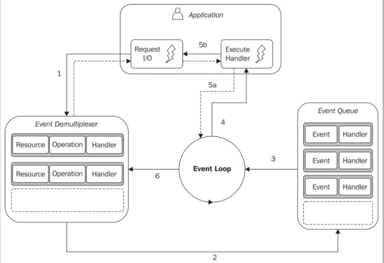

> 소프트웨어는 항상 현실의 근사치이며, 막대한 노력과 많은 코드를 유지하면서 거의 완벽한 소프트웨어를 만들려고 노력하는 것보다는 합리적 수준의 복잡성을 가지고 더 빨리 작업하는 것이 더 큰 성공이다.

## Reactor 패턴

I/O는 컴퓨터의 기본동작 중 가장 느리다. CPU 측면에서는 비용이 크지 않지만, 요청을 보낸 순간부터 작업이 완료되는 순간까지 지연을 동반한다.

### 블로킹 I/O

블로킹 I/O는 작업이 완료될 때까지 스레드의 실행이 차단된다. 블로킹 I/O를 사용해 구현된 웹 서버가 동일한 스레드에서 여러 연결을 처리할 수 없다는 것은 자명하다. 각 소켓에서의 모든 I/O 작업이 다른 연결 처리를 차단할 것이기 때문이다. 이러한 이유로 웹 서버에서 동시성을 처리하기 위해 전통적으로 각각의 동시 연결에 대해 새로운 스레드 또는 프로세스를 시작하거나 풀에서 가져온 스레드를 재사용한다. 이렇게 해서 스레드가 I/O 작업으로 차단되어도 분리된 스레드에서 처리되므로 다른 요청의 가용성에는 영향을 미치지 않는다.

### 논 블로킹 I/O

최신 운영체제는 논 블로킹 I/O를 지원한다. 시스템 호출은 데이터가 읽히거나 쓰여질떄까지 기다리지 않고 항상 즉시 반환된다. 호출하는 순간에 결과를 사용할 수 없는 경우, 이 함수는 단순히 미리 정의된 상수를 반환하여 그 순간에 반환할 수 있는 데이터가 없음을 나타낸다.

이러한 종류의 논 블로킹 I/O에 액세스하는 가장 기본적인 패턴은 실제 데이터가 반환될 때까지 루프 내에서 리소스를 적극적으로 폴링하는 것이다. 이것은 busy-waiting이라고 한다. 이 기술로 동일한 스레드에서 서로 다른 리소스를 처리할 수 있지만, 비효율적이다. 대부분의 경우 폴링을 하는데만 CPU를 소비하기 때문이다.

### 이벤트 디멀티플렉싱

이벤트 디멀리플렉싱은 감시된 일련의 리소스들로부터 들어오는 I/O 이벤트를 수집하여 큐에 넣고 처리할 수 있는 새 이벤트가 있을 때까지 차단한다. 작업은 여러 스레드로 분산되지 않고 시간에 따라 분산된다. 이를 통해 스레드의 총 유휴시간을 최소화하는 장점이 있다. 또한 하나의 스레드만 갖는 다는 것은 프로그래머가 일반적으로 동시성에 접근하는 방식에 유익한 영향을 미친다. 프로세스간의 경쟁과 여러 스레드들의 동기화 걱정 없이 간단한 동시성 전략을 사용할 수 있다.

1. 애플리케이션은 이벤트 디멀티플렉서에 요청을 전달함으로써 새로운 I/O 작업을 생성한다. 또한 애플리케이션은 처리가 완료될 때 호출될 핸들러를 지정한다. 이벤트 디멀티플렉서에 새 요청을 전달하는 것은 노 블로킹 호출이며, 즉시 애플리케이션에 제어를 반환한다.

2. 일련의 I/O 작업들이 완료되면 이벤트 디멀티플렉서는 새 이벤트를 이벤트 큐에 집어넣는다.

3. 이 시점에서 이벤트 루프가 이벤트 큐의 항목들에 대해 반복한다.

4. 각 이벤트에 대해서 관련된 핸들러가 호출된다.

5. 애플리케이션 코드의 일부인 핸들러는 실행이 완료되면 이벤트 루프에 제어를 되돌린다(5a). 그러나 핸들러의 실행 중에 새로운 비동기 동작이 요청(5b)이 발생하여 제어가 이벤트 루프로 돌아가기 전에 새로운 요청이 이벤트 디멀티플렉서(1)에 삽입될 수도 있다.

6. 이벤트 큐 내의 모든 항목이 처리되면, 루프는 이벤트 디멀티플렉서에서 다시 블록되고 처리 가능한 새로운 이벤트가 있을 때 이 과정이 다시 트리거 된다.

### Node.js의 논 블로킹 엔진 libuv

각 운영체제에는 이벤트 디멀티플렉서에 대한 자체 인터페이스가 있다. 서로 다른 운영체게에서 발생하는 불일치 때문에 보다 높은 수준의 추상화가 필요하고, Node.js는 libuv라는 C 라이브러리를 통해 주요 플랫폼과 호환되고, 서로 다른 유형의 리소스들의 논 블로킹 동작을 표준화 할 수 있다.

[참고] 
Node.js 디자인패턴, Mario Casciaro 저, 영진닷컴

