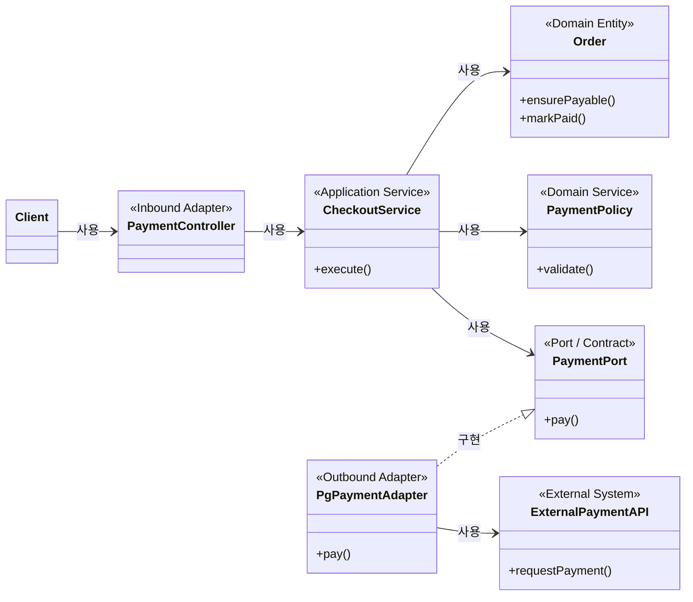
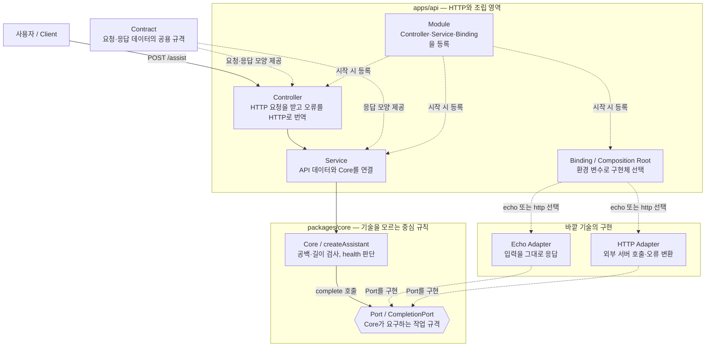
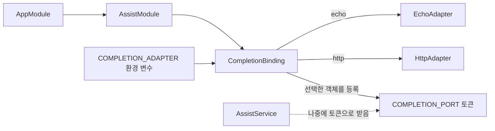
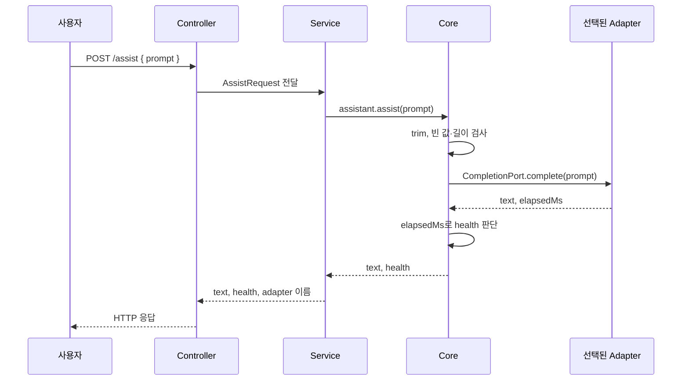
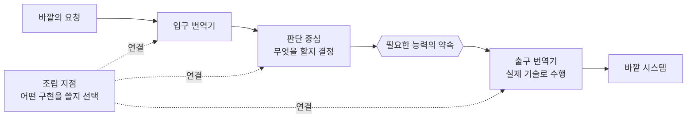
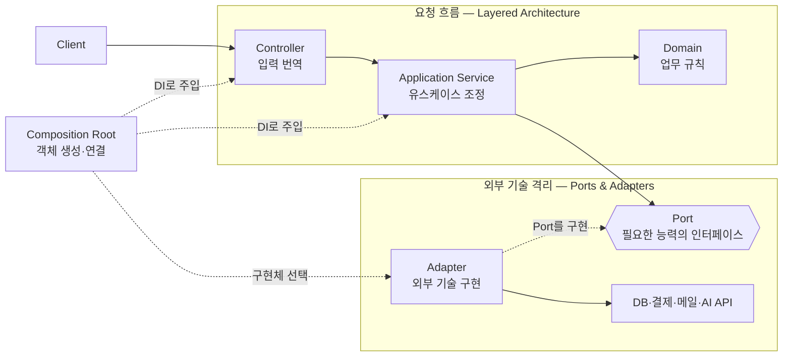

<!-- q id=20260814-001239 cat="software-design" -->
### 도메인 규칙과 아닌 것을 구분하는 과정이나 방법론이 있나? 그리고 필요한가? AI 코딩 측면에서 어떤가? 기능 명세 자체와 구분해서 도메인 규칙을 따로 정의해야 하나? Service, Adapter, 애플리케이션 로직, 도메인 등 연관된 키워드의 관계를 조망할 수 있게 그려줘. 아직 큰 그림이 잡히지 않아서.

#### 한 줄

**도메인 규칙은 사업에서 무엇이 허용되고 항상 참이어야 하는지를 정하고, 애플리케이션 로직은 그 규칙과 외부 기능을 어떤 순서로 실행할지 정하며, Adapter는 외부 세계의 표현을 내부 계약으로 번역합니다.** 이 셋을 사고 과정에서는 구분해야 하지만, 작은 시스템에서 반드시 별도 문서와 계층으로 쪼갤 필요는 없습니다.

#### 1. 도메인 규칙을 가려내는 방법

완벽하게 분류해 주는 공식은 없습니다. 도메인 규칙의 경계는 사업과 시스템을 어떻게 모델링하느냐에 따라 달라지는 **설계 판단**입니다. 다만 다음 순서로 비교적 안정적으로 가려낼 수 있습니다.

1. 기능 명세에서 판단과 제약을 문장으로 뽑습니다.
   - “취소된 주문은 결제할 수 없다.”
   - “결제에 성공하면 주문 상태를 변경한다.”
   - “외부 응답 코드 `0000`은 성공이다.”
2. 기술을 바꿔도 남는지 묻습니다.
   - UI, HTTP, DB, 결제사를 바꿔도 그대로라면 도메인 규칙일 가능성이 큽니다.
3. 누가 그 규칙의 근거를 설명하는지 묻습니다.
   - 기획자나 현업 담당자가 사업 언어로 설명하면 도메인에 가깝습니다.
   - SDK 문서나 통신 규격이 근거라면 Adapter나 인프라에 가깝습니다.
4. 위반했을 때 무엇이 잘못되는지 묻습니다.
   - 잘못된 주문·금액·권한 상태가 생기면 도메인 문제입니다.
   - JSON 파싱이나 재시도가 실패하면 주로 기술 문제입니다.
5. 정상 예와 반례를 만들어 규칙을 검증합니다.
   - “대기 중인 주문은 결제 가능, 취소된 주문은 결제 불가”처럼 경계 사례를 테스트로 고정합니다.

다음 표처럼 나누면 감을 잡기 쉽습니다.

| 문장 | 주된 위치 | 이유 |
| --- | --- | --- |
| 취소된 주문은 결제할 수 없다 | Domain | 사업 상태가 허용하는 행동을 결정함 |
| 주문을 불러오고 결제한 뒤 결과를 저장한다 | Application | 유스케이스의 실행 순서를 조율함 |
| `result_code: "0000"`을 승인으로 해석한다 | Adapter | 외부 표현을 내부 의미로 변환함 |
| 잘못된 요청에 HTTP 400을 반환한다 | Inbound Adapter | 전송 규약으로 오류를 표현함 |
| 네트워크 오류를 세 번 재시도한다 | Infrastructure가 기본 | 기술적 복구 정책임. 다만 계약상 시도 횟수가 사업 규칙이면 Domain일 수 있음 |

여기서 마지막 행이 중요합니다. **코드 모양만 보고 분류할 수는 없고, 그 결정을 만든 이유를 봐야 합니다.** DDD의 도메인 모델링, Event Storming, Example Mapping, Specification by Example은 이 판단과 사례를 팀의 언어로 드러내는 데 도움을 주는 방법들입니다.

#### 2. 구분은 필요하지만 항상 별도 계층이 필요한 것은 아니다

구분이 필요한 이유는 변경 원인이 다르기 때문입니다.

- 할인·취소 정책이 바뀌면 Domain이 변합니다.
- 유스케이스의 순서나 트랜잭션 범위가 바뀌면 Application이 변합니다.
- 결제사 스키마나 SDK가 바뀌면 Adapter가 변합니다.

이 셋이 한 함수에 섞이면 결제사 필드 하나가 바뀌어도 사업 규칙을 건드리게 되고, 같은 규칙이 Controller와 배치 작업에 중복되기 쉽습니다.

그렇다고 단순 CRUD까지 `domain/`, `application/`, `ports/`, `adapters/`로 나누면 파일과 연결부만 늘어날 수 있습니다. 먼저 **서로 다른 변경 이유를 생각과 이름으로 구분**하고, 다음 조건이 생길 때 코드 경계를 분리하는 편이 낫습니다.

- 규칙이 복잡하거나 금액·권한·상태처럼 틀렸을 때 비용이 큼
- 같은 규칙을 둘 이상의 유스케이스가 사용함
- 외부 시스템이나 UI가 자주 바뀜
- 여러 사람이나 AI가 관련 코드를 독립적으로 수정함

#### 3. 기능 명세와 도메인 규칙의 관계

기능 명세와 도메인 규칙은 대등한 두 문서가 아니라 **전체와 부분에 가까운 관계**입니다.

```text
기능 명세
├── 목표와 사용자 시나리오
├── 입력과 출력
├── 도메인 규칙
├── 애플리케이션 흐름
├── UI·API·외부 연동 조건
└── 인수 조건과 예외 사례
```

따라서 도메인 규칙을 기능 명세와 무조건 별도 문서로 중복 작성할 필요는 없습니다.

- 한 기능에서만 쓰는 단순 규칙이면 기능 명세의 `도메인 규칙` 절에 둡니다.
- 여러 기능이 공유하거나 금액·권한·상태 무결성을 지키는 규칙이면 한 곳을 원본으로 두고 각 기능 명세가 참조합니다.
- 기능 명세에는 “어떤 흐름에서 이 규칙을 적용하는가”와 인수 사례를 적고, 원본 규칙의 문장을 복제하지 않습니다.

예를 들어 결제 기능 명세를 다음처럼 구성할 수 있습니다.

```text
[목표]
사용자가 대기 중인 주문을 결제한다.

[도메인 규칙]
D-01 취소되거나 이미 결제된 주문은 결제할 수 없다.
D-02 결제 금액은 주문의 미결제 잔액과 같아야 한다.

[애플리케이션 흐름]
주문 조회 → 규칙 검증 → PaymentPort 호출 → 결과에 따라 주문 상태 저장

[외부 변환]
PG의 result_code는 PgPaymentAdapter에서 PaymentResult로 변환한다.

[인수 사례]
대기 주문은 승인되고, 취소 주문은 PG를 호출하기 전에 거절된다.
```

#### 4. AI 코딩에서는 구분의 가치가 더 커진다

AI는 명시되지 않은 경계를 그럴듯하게 추측합니다. “결제 기능을 만들어 줘”라고만 하면 다음 문제가 생기기 쉽습니다.

- 외부 상태 코드를 Domain 객체에 직접 넣음
- Controller와 Service에 같은 사업 규칙을 중복함
- 기술 오류를 사업 실패로 취급함
- 아직 합의하지 않은 정책을 관행처럼 만들어 냄
- 모든 것을 DDD 계층으로 과도하게 분리함

AI에게는 파일 구조보다 다음 네 묶음을 분명히 주는 것이 먼저입니다.

```text
[Domain rules] 무엇이 항상 참이어야 하는가
[Use-case flow] 어떤 순서와 조건으로 실행하는가
[External mapping] 외부 표현을 어디서 어떻게 번역하는가
[Acceptance examples] 어떤 입력에서 어떤 결과가 나와야 하는가
```

이렇게 주면 AI가 각 결정을 어디에 둘지 판단하기 쉬워지고, 변경 범위와 테스트 범위도 작아집니다. 반대로 “Clean Architecture로 만들어 줘”처럼 구조 이름만 주면 불필요한 interface와 폴더를 대량으로 만들 가능성이 있습니다. **AI 코딩에서는 계층 이름보다 규칙·흐름·경계·판정 사례를 명시하는 것이 더 중요합니다.**

#### 5. 전체 관계도



실선 화살표는 실행 중 사용하거나 의존하는 관계이고, 점선 삼각형은 계약 구현 관계입니다. 핵심은 의존 방향입니다. `CheckoutService`는 외부 PG를 직접 알지 않고 애플리케이션이 정의한 `PaymentPort`만 압니다. 바깥의 `PgPaymentAdapter`가 이 계약을 구현하면서 외부 API의 규격을 번역합니다.

`Service`라는 말은 계층 이름이 아니어서 특히 주의해야 합니다.

- **Application Service:** 유스케이스의 순서, 트랜잭션, 도메인 객체와 Port 호출을 조율함
- **Domain Service:** 한 Entity에 자연스럽게 넣기 어려운 사업 규칙을 표현함
- **Infrastructure Service:** 메일, 파일, 외부 API처럼 기술 기능을 제공함
- 프레임워크의 `@Service`: 객체를 생성·주입하는 표식일 뿐, 그 코드가 어느 계층인지는 말해 주지 않음

큰 그림을 한 문장으로 다시 묶으면 다음과 같습니다.

> **Domain은 사업의 참과 거짓을 판단하고, Application은 목표를 달성하도록 실행을 조율하며, Port는 Application이 필요한 계약을 선언하고, Adapter는 바깥 세계를 그 계약에 맞춰 번역합니다.**

<small style="opacity:0.55">‹00:12 KST› 맥락: khw1031.github.io 저장소에서 Adapter 패턴의 본질과 도메인·애플리케이션·인프라 구분을 논의한 뒤, 도메인 규칙 식별법과 기능 명세·Service·Adapter의 전체 관계를 질문함.</small>

<!-- /q -->

<!-- q id=20260814-215208 cat="turborepo" -->
### /Users/hynu/learn/turborepo-platform-lab/turbo.json boundaries와 각 설정 값들에 대해서 설명해줘

이 파일은 두 가지를 정의합니다. `tasks`는 **빌드 순서·캐시**를, `boundaries`는 **패키지 사이에 허용할 의존 방향**을 정의합니다. 후자는 아키텍처 규칙을 코드 검사로 지키게 하는 장치입니다.

## 파일의 상단 설정

- `$schema`: `turbo.json`의 JSON 스키마입니다. 에디터 자동완성·값 검증용이며, 빌드 동작 자체를 바꾸지는 않습니다.
- `tasks`: `turbo run build`, `typecheck`, `test`가 각 워크스페이스 패키지에서 실행될 때의 선행 작업과 캐시 산출물을 지정합니다.

  - `build.dependsOn: ["^build"]`: 현재 패키지를 빌드하기 전에 `package.json` 의존성 패키지들의 `build`를 먼저 실행합니다. `^`는 “이 패키지가 의존하는 다른 워크스페이스 패키지”라는 뜻입니다.
  - `build.outputs: ["dist/**"]`: `build` 결과인 `dist` 아래 파일을 Turbo 캐시에 저장합니다. 캐시 적중 때 그 결과를 복원할 수 있습니다.
  - `typecheck.dependsOn: ["^build"]`, `test.dependsOn: ["^build"]`: 타입 검사와 테스트도 내부 의존 패키지가 먼저 빌드된 뒤 실행됩니다. 예를 들어 앱이 `@platform/core`를 쓴다면 core의 빌드가 선행됩니다.

## `boundaries`는 무엇인가

각 패키지는 자기 `turbo.json`의 `tags`로 역할을 붙입니다.

| 실제 패키지 | 태그 | 역할 |
| --- | --- | --- |
| `packages/core` | `domain` | 핵심 도메인 규칙 |
| `packages/contracts` | `shared` | 공용 계약·타입 |
| `packages/tsconfig` | `config` | 공통 설정 |
| `apps/web`, `apps/api` | `app` | 애플리케이션 |

루트의 `boundaries.tags`는 **태그별 규칙**입니다. `dependencies`는 “이 태그의 패키지가 무엇을 import해도 되는가”, `dependents`는 “누가 이 태그의 패키지를 import해도 되는가”를 뜻합니다. `turbo boundaries`가 소스 import를 검사합니다. 실제로 이 저장소에서 실행해 보니 5개 패키지의 64개 파일을 검사했고 현재 위반은 없었습니다.

## 현재 규칙을 한 줄씩 읽으면

```json
"domain": {
  "dependencies": { "deny": ["app", "shared", "adapter"] }
}
```

`domain`(현재 `packages/core`)은 `app`, `shared`, `adapter` 태그 패키지를 import하면 안 됩니다. 즉 핵심 규칙이 앱이나 외부 구현체에 끌려가지 않게 합니다. 다만 이것은 **deny 목록만 둔 규칙**이라 `config`나 다른 `domain` 태그는 여전히 허용됩니다.

```json
"shared": {
  "dependencies": { "deny": ["app", "adapter"] }
}
```

`shared`(현재 `packages/contracts`)도 앱과 어댑터에 의존할 수 없습니다. 공용 계약이 UI·서버나 기술 구현을 알지 못하게 하려는 경계입니다. 반대로 현재 설정만 놓고 보면 `shared → domain`은 금지하지 않습니다. “shared는 완전히 가장 아래 계층이어야 한다”가 목적이라면 `domain`도 deny에 추가해야 합니다.

```json
"adapter": {
  "dependencies": { "allow": ["domain", "config"] },
  "dependents": { "allow": ["app"] }
}
```

`adapter` 태그 패키지는 `domain`과 `config`만 의존할 수 있습니다. `allow`는 열거한 태그 외에는 전부 금지하는 **화이트리스트**입니다. 또 adapter를 import할 수 있는 쪽은 `app`뿐입니다. 따라서 의도한 방향은 다음과 같습니다.

```text
app  →  adapter  →  domain
                 ↘ config
```

여기서 `adapter`는 DB·HTTP·외부 API 같은 기술 세부 구현, `domain`은 그 구현에 독립적인 핵심 규칙이라는 설계입니다.

중요한 관찰 하나가 있습니다. 지금 개별 패키지 설정에는 `app`, `domain`, `shared`, `config`만 있고 **`adapter` 태그를 실제로 붙인 패키지는 없습니다.** 그래서 adapter 규칙은 미래에 adapter 패키지를 만들 때 적용될 준비 규칙이며, 현재는 검사할 대상이 없습니다.

## `allow`와 `deny`의 차이

- `deny: ["app"]`: app만 금지하고, 나머지는 허용합니다. 최소한의 금지 규칙입니다.
- `allow: ["domain", "config"]`: domain·config만 허용하고, 나머지는 금지합니다. 의존 방향을 강하게 잠그는 규칙입니다.
- `dependencies`나 `dependents`를 아예 생략한 태그(현재 `app`, `config`)는 그 방향에 제한이 없습니다.

따라서 이 설정은 “도메인은 바깥 계층을 모르고, adapter는 도메인에만 붙으며, app이 adapter를 조립한다”는 Hexagonal/Ports-and-Adapters 쪽의 의도를 부분적으로 표현한 것입니다. 다만 `domain`에 `shared`를 금지한 점과 `shared → domain`을 허용한 점은, `contracts`를 domain의 일부로 볼지 아니면 더 하위 공용 계층으로 볼지에 따라 다시 정할 수 있습니다.

<small style="opacity:0.55">‹21:52 KST› 맥락: `/Users/hynu/learn/turborepo-platform-lab/turbo.json`의 task 캐시·실행 순서와 monorepo 패키지 경계 규칙을 학습하는 중.</small>

<!-- /q -->

<!-- q id=20260814-001727 cat="software-design" -->
### “Domain은 사업의 참과 거짓을 판단한다”를 더 구체적으로 표현하면?

“판단한다”는 방향은 맞지만 범위가 너무 넓다. Application과 Adapter에도 각각 실행 분기와 변환 판단이 있기 때문이다. Domain의 고유한 책임이 드러나도록 다음처럼 표현한다.

> **Domain은 사업 규칙에 따라 가능한 행동과 올바른 상태 변화를 결정하고, Application은 목표를 달성하도록 그 행동들의 실행 순서를 조율하며, Port는 Application이 외부에 요구하는 계약을 선언하고, Adapter는 바깥 세계를 그 계약에 맞게 번역한다.**

더 짧게 말하면 다음과 같다.

> **Domain은 무엇을 해도 되는지와 그 결과 어떤 상태가 되어야 하는지를 결정하고, Application은 그것을 언제 어떤 순서로 실행할지 결정한다.**

여기서 Domain을 단순히 “특정 로직의 판단 지점”이라고 부르면 기술적 판단까지 포함될 수 있다. 결제 예시에서 판단의 근거를 나누면 차이가 선명해진다.

- Domain: 취소된 주문은 결제할 수 없다는 **사업 규칙**
- Application: 결제 승인 후 주문을 저장한다는 **유스케이스 흐름**
- Adapter: 외부 응답 코드 `0000`을 승인으로 바꾼다는 **표현 변환 규칙**

따라서 가장 안전한 요약은 **“Domain은 특정 기능에서 사업적 판단이 내려지는 지점”**이다.

<small style="opacity:0.55">‹00:17 KST› 맥락: Adapter·Application·Port·Domain의 전체 관계를 설명한 2026-08-14 질문 로그와, Domain을 “무엇이 참인가”로 표현한 2026-08-09 질문 로그의 추상적인 문구를 후속 질문에 맞춰 정정함.</small>

<!-- /q -->

<!-- q id=20260814-003723 cat="distributed-systems" -->
### 비용과 주의점의 각 사례별로 고민해볼 거리와 현시점에 해결 방법들이 많이 있을 것 같은데, 이것들에 대해서 조사 및 정리한 번 해줘

#### 한 줄

Client–Server의 실패는 각각 따로 일어나지 않는다. **`timeout → retry → 중복 실행 → 부분 실패 → Client 상태 불일치`가 하나의 연쇄**이므로, 현재의 실전 해법은 이 연쇄를 `deadline`, 선택적 retry, idempotency, 계약 검사, 명시적 일관성 모델과 관측성으로 함께 통제하는 것이다.

먼저 기억할 원칙은 “네트워크 호출은 느린 함수 호출”이 아니라는 점이다. 함수 호출은 보통 성공이나 예외로 끝나지만, 네트워크 호출은 **결과를 모르는 상태**로도 끝난다. Client가 timeout을 받았어도 Server에서는 결제가 완료됐을 수 있다. 이후 문제 대부분은 이 불확실성을 어떻게 다루느냐에서 생긴다.

## 전체 지도

| 비용·위험 | 먼저 물어볼 질문 | 현재의 대표 해법 |
| --- | --- | --- |
| 네트워크 지연 | 꼭 지금, 원격에서, 전부 받아야 하나? | 캐시, 요청 병합·병렬화, pagination, 압축, prefetch, 비동기 처리 |
| Timeout | 얼마까지 기다리면 사용자 목적이 이미 실패한 것인가? | 명시적 deadline, 하위 호출로 예산 전파, 취소, 부하 테스트 |
| 일시적 실패 | 다시 하면 정말 성공할 가능성이 있고 안전한가? | 선택적 retry, exponential backoff + jitter, 상한, circuit breaker |
| 계약 불일치 | 어떤 변경이 어느 Client를 깨뜨리는가? | OpenAPI, schema 검사, breaking-change CI, consumer-driven contract test |
| 중복 요청 | 같은 의도가 두 번 도착해도 결과가 한 번인가? | 자연적 멱등성, idempotency key, unique constraint, 처리 결과 저장 |
| 인증·권한 | 누구인지와 무엇을 해도 되는지를 각각 어디서 검증하나? | TLS, 표준 IdP, 최소 권한 token, Server의 요청별 객체 권한 검사 |
| 부분 실패 | 일부만 성공했을 때 원하는 최종 상태는 무엇인가? | 로컬 transaction, transactional outbox, Saga, 보상 동작, durable workflow |
| Client–Server 상태 불일치 | 얼마나 오래 낡아도 되고 충돌하면 누가 이기는가? | freshness 정책, invalidate/refetch, ETag 조건부 요청, push, 재조정 |

## 1. 네트워크 지연

### 고민할 거리

지연은 Server 처리 시간만이 아니다. DNS, 연결, TLS, 여러 번의 왕복, queue 대기, Server 처리와 응답 전송이 합쳐진 값이다. 평균만 보면 긴 꼬리 지연을 놓치므로 사용자 경로별 p50·p95·p99와 요청 waterfall을 봐야 한다.

먼저 다음을 묻는 것이 좋다.

- 이 데이터가 화면 진입 전에 반드시 필요한가?
- 여러 순차 요청이 사실 하나의 화면 데이터인가?
- 응답 전체가 필요한가, 첫 페이지나 일부 필드만 필요한가?
- 모든 사용자에게 같은 데이터인가?
- 최신성이 몇 초 또는 몇 분 늦어져도 되는가?

### 현재의 해결 방법

1. **호출 자체를 없앤다.** 변경이 드문 GET 응답과 정적 자원은 `Cache-Control`, `ETag`, CDN·shared cache를 사용한다. HTTP 캐시는 freshness와 validator를 통해 원본 호출이나 본문 재전송을 줄인다. [RFC 9111 HTTP Caching](https://www.rfc-editor.org/rfc/rfc9111.html)
2. **왕복 횟수를 줄인다.** 화면 단위 BFF, batch endpoint 또는 필요한 필드를 한 번에 반환하는 API를 고려한다. 단, 모든 화면 요구를 하나의 거대 응답으로 합치면 결합도가 커지므로 실제 waterfall이 병목일 때만 한다.
3. **서로 독립된 호출은 병렬화한다.** 반대로 B가 A의 결과를 필요로 하면 억지로 병렬화하지 않는다.
4. **전송량을 줄인다.** pagination, 필요한 필드만 반환, gzip·Brotli 같은 content encoding을 적용한다.
5. **기다릴 필요가 없는 일은 비동기로 바꾼다.** 보고서 생성처럼 오래 걸리는 작업은 `202 Accepted + operationId`를 반환하고 Client가 상태를 조회하거나 완료 알림을 받게 한다.
6. **예측 가능한 다음 행동은 prefetch한다.** 다만 사용하지 않을 데이터와 민감한 데이터를 무분별하게 미리 받으면 비용과 노출 면적이 커진다.

핵심 tradeoff는 **최신성 대 속도**다. 캐시는 지연을 줄이는 대신 낡은 데이터를 허용하므로 먼저 허용 가능한 stale 시간부터 정해야 한다.

## 2. Timeout과 deadline

### 고민할 거리

Timeout은 “Server가 실패했다”는 뜻이 아니라 **Client가 더 기다리지 않기로 했다는 뜻**이다. 따라서 timeout 직후 같은 쓰기 요청을 다시 보내도 되는지는 별도 문제다.

- 사용자가 이 작업을 기다릴 수 있는 총시간은 얼마인가?
- 연결 timeout과 응답 timeout을 구분할 것인가?
- Server A가 B와 C를 호출한다면 각 호출에 얼마의 남은 예산을 줄 것인가?
- Client가 포기한 뒤 Server 작업도 중단돼야 하는가?
- timeout 이후 결과를 조회할 식별자가 있는가?

### 현재의 해결 방법

1. **모든 원격 호출에 명시적인 deadline을 둔다.** gRPC 공식 문서는 기본적으로 deadline이 없어 무한정 기다릴 수 있으므로 현실적인 deadline을 명시하라고 권고한다. 값은 추측으로 고정하기보다 실제 지연 분포와 부하 테스트로 정한다. [gRPC Deadlines](https://grpc.io/docs/guides/deadlines/)
2. **총예산을 하위 호출에 전파한다.** 3초짜리 요청에서 상위 계층이 2초를 사용했다면 하위 호출에 다시 3초를 주지 않는다. 남은 1초 이내로 전달한다.
3. **deadline이 끝나면 실제 작업도 취소한다.** Client 연결만 끊고 Server의 DB query와 외부 호출이 계속되면 이미 필요 없는 작업이 자원을 점유한다.
4. **오래 걸리는 작업은 동기 HTTP 요청에서 분리한다.** operation resource를 만들고 `pending | succeeded | failed` 상태를 조회하게 하면 timeout 뒤에도 결과를 확인할 수 있다.
5. **timeout 지표를 원인별로 나눈다.** 연결, upstream, DB, queue, Client 취소를 한 종류로 합치면 잘못된 계층을 고치게 된다.

너무 짧은 timeout은 정상 요청을 실패로 만들고 retry 부하를 증가시킨다. 너무 긴 timeout은 thread·connection·memory를 붙잡는다. 목표는 “빨리 실패” 자체가 아니라 **사용자 목적과 자원 예산에 맞는 시점에 포기하는 것**이다.

## 3. 일시적 연결 실패와 retry

### 고민할 거리

Retry 전에 두 질문에 모두 답해야 한다.

1. 다시 하면 성공할 가능성이 있는 실패인가?
2. 여러 번 실행돼도 안전한 동작인가?

권한 부족, 잘못된 입력, 존재하지 않는 상품처럼 영구적인 `4xx`를 retry해도 나아지지 않는다. 과부하된 Server의 모든 요청을 즉시 retry하면 장애가 증폭된다.

### 현재의 해결 방법

1. **retry 가능한 오류를 제한한다.** 네트워크 단절, 일부 `502/503/504`, `429`처럼 일시적일 가능성이 있는 경우만 정책에 포함하고 Server가 보낸 `Retry-After`를 존중한다.
2. **exponential backoff와 jitter를 함께 쓴다.** 재시도 간격을 점점 늘리고 무작위 편차를 넣어 Client들이 동시에 다시 몰리는 현상을 줄인다.
3. **시도 횟수보다 총 retry 예산을 제한한다.** 최대 횟수, 총 경과 시간과 최대 간격을 모두 둔다.
4. **한 계층에서만 retry한다.** 세 계층이 각각 세 번 시도하면 최악에는 한 요청이 27번으로 불어난다. AWS도 여러 계층의 retry가 retry storm을 만든다고 경고한다. [AWS retry 제한 지침](https://docs.aws.amazon.com/wellarchitected/latest/framework/rel_mitigate_interaction_failure_limit_retries.html)
5. **계속 실패하는 dependency에는 circuit breaker를 고려한다.** 일정 실패 이후 즉시 거절하고 회복 확인 시 제한적으로 다시 연다. 이것은 dependency와 호출자를 보호하지만 상태·threshold·복구 정책이라는 복잡성을 추가하므로 작은 단일 Server에는 자동으로 넣을 이유가 없다. [AWS Circuit Breaker 패턴](https://docs.aws.amazon.com/prescriptive-guidance/latest/cloud-design-patterns/circuit-breaker.html)
6. **retry 횟수와 최종 성공률을 관측한다.** 최종 응답만 성공이면 내부 장애가 retry에 가려질 수 있다.

Retry는 복구 전략이지 성공률을 무료로 높이는 장치가 아니다. **멱등하지 않은 쓰기에는 다음 절의 중복 방지 없이는 적용하지 않는다.**

## 4. Client와 Server의 계약 버전 불일치

### 고민할 거리

- Server가 필드를 추가·삭제·이름 변경하면 어떤 Client 버전이 깨지는가?
- 모바일처럼 오래된 Client가 수개월간 남는가?
- 문서, 실제 Server 응답과 Client type 중 무엇이 계약의 원본인가?
- 배포 전에 호환성을 누가 검사하는가?

### 현재의 해결 방법

1. **기계가 읽을 수 있는 계약을 원본으로 둔다.** HTTP API라면 OpenAPI로 path, method, schema, 오류와 보안을 기술하고 type·mock·문서 생성에 사용한다. 2026-08-14 확인 기준 최신 명세는 OpenAPI 3.2.0이지만, 실제 도입 버전은 generator와 validator의 지원 상태에 맞춰 선택해야 한다. [OpenAPI 3.2.0](https://spec.openapis.org/oas/v3.2.0.html)
2. **CI에서 breaking change를 검사한다.** 필수 필드 추가, response field 삭제, type 축소, enum 변경처럼 기존 소비자를 깨뜨리는 변경을 배포 전에 막는다.
3. **Server와 Client 양쪽에서 runtime schema를 검사한다.** TypeScript type은 실행 중 들어오는 JSON을 검증하지 않는다.
4. **소비자 중심 계약 테스트를 사용한다.** Pact 같은 도구는 Client가 실제 사용하는 상호작용을 기록하고 Provider가 이를 만족하는지 검증한다. [Pact 공식 명세](https://docs.pact.io/implementation_guides/pact_specification)
5. **가능하면 추가형 변경을 한다.** 새 optional field나 새 endpoint를 먼저 배포하고 Client 전환 후 옛 필드를 제거한다. enum에 새 값이 추가될 수 있다면 Client는 알 수 없는 값을 처리할 fallback을 가져야 한다.
6. **versioning은 마지막 수단으로 쓴다.** 의미가 호환 불가능하게 바뀔 때 새 major contract를 일정 기간 병행한다. 사소한 필드 추가마다 `/v2`를 만들면 운영할 계약만 늘어난다.

OpenAPI만 작성해 놓는 것으로는 부족하다. **실제 응답 검증, 호환성 diff와 소비자 테스트를 배포 gate에 연결해야 계약이 강제된다.**

## 5. 중복 요청

### 고민할 거리

결제 요청을 보낸 뒤 응답 직전에 연결이 끊기면 Client는 실행 여부를 모른다. 사용자의 더블 클릭, 브라우저 재전송, proxy나 SDK retry도 같은 요청을 중복시킬 수 있다.

- 이 동작은 원래 멱등한가?
- 중복의 동일성을 어떤 단위로 판단할 것인가?
- 같은 key에 다른 payload가 오면 어떻게 할 것인가?
- key와 결과를 얼마 동안 저장할 것인가?
- 동시에 같은 요청 두 개가 도착하면 누가 처리하는가?

### 현재의 해결 방법

1. **가능하면 resource 중심의 자연적 멱등성을 설계한다.** HTTP 의미상 GET·PUT·DELETE와 safe method는 멱등한 것으로 정의된다. 단, 실제 구현도 그 의미를 지켜야 한다. [RFC 9110 §9.2.2](https://www.rfc-editor.org/rfc/rfc9110.html#name-idempotent-methods)
2. **POST 결제·주문에는 idempotency key를 둔다.** Client가 의도마다 고유 key를 보내고 Server는 `(tenant, operation, key)`에 unique constraint를 둔다.
3. **key와 payload fingerprint, 처리 상태, 최종 응답을 함께 저장한다.** 같은 key와 같은 payload의 재요청에는 처음 결과를 돌려주고, 같은 key와 다른 payload는 거절한다.
4. **업무 변경과 key 기록을 가능한 한 같은 transaction에 넣는다.** 둘을 따로 저장하면 결제는 됐지만 중복 방지 기록은 없는 틈이 생긴다.
5. **진행 중 중복과 완료 후 중복을 구분한다.** 진행 중이면 `409`나 현재 operation 상태를, 완료됐다면 저장된 결과를 반환할 수 있다.

중요한 현황: `Idempotency-Key`는 널리 쓰이는 관행이지만, IETF의 `draft-ietf-httpapi-idempotency-key-header-07`은 2026-04-18 만료된 archived Internet-Draft이며 현재 RFC 표준이 아니다. 따라서 header 이름만 믿지 말고 key 범위, TTL, payload 재사용, 동시 요청과 오류 동작을 API 계약에 직접 명시해야 한다. [IETF 만료 draft 상태](https://datatracker.ietf.org/doc/draft-ietf-httpapi-idempotency-key-header/07/)

## 6. 인증과 권한

### 고민할 거리

인증은 “누구인가”, 권한은 “이 사용자가 이 자원에 이 행동을 해도 되는가”다. 로그인에 성공했다는 사실만으로 다른 사용자의 주문을 볼 수 있는 것은 아니다.

- browser, mobile, server-to-server 중 어떤 Client인가?
- token이 탈취되면 어디까지 사용할 수 있는가?
- 역할만 검사하면 되는가, 특정 주문의 소유권도 검사해야 하는가?
- Client가 보낸 `userId`, role과 price를 신뢰하고 있지 않은가?

### 현재의 해결 방법

1. **전송은 TLS로 보호하고 검증된 표준 구현을 사용한다.** 자체 암호화나 자체 token 형식을 발명하지 않는다.
2. **사용자 인증은 검증된 Identity Provider와 표준 흐름에 맡긴다.** browser·public client에는 Authorization Code + PKCE 계열을 사용하고 implicit grant와 resource owner password grant는 피한다.
3. **access token은 짧게, 최소 권한으로 제한한다.** scope뿐 아니라 특정 resource server를 나타내는 audience를 검증한다. RFC 9700은 token 권한을 필요한 최소로 제한하고 각 요청에서 대상 resource와 action을 검증하도록 권고한다. [RFC 9700 OAuth 2.0 Security BCP](https://www.rfc-editor.org/rfc/rfc9700.html)
4. **권한 검사는 Server가 매 요청 수행한다.** Client의 버튼 숨김은 UX일 뿐 보안 경계가 아니다. `order.userId === authenticatedUser.id` 같은 객체 수준 권한을 Server에서 확인한다.
5. **refresh token은 rotation 또는 sender constraint를 적용하고 재사용을 탐지한다.** browser cookie를 쓰면 `HttpOnly`, `Secure`, 적절한 `SameSite`와 CSRF 방어를 함께 설계한다.
6. **인증 실패와 권한 실패를 관측하되 token·비밀번호는 로그에 남기지 않는다.**

권한 체계가 복잡할 때도 모든 것을 거대한 `AuthService`에 몰기보다, 인증 경계는 신원을 만들고 Domain/Application은 자원별 정책을 판단하게 나누는 편이 변경 이유가 선명하다.

## 7. 부분 실패

### 고민할 거리

주문 생성 → 재고 차감 → 결제 → 알림 중 결제까지만 성공할 수 있다. 네트워크를 넘는 순간 하나의 DB transaction처럼 전부 원상 복구된다고 가정할 수 없다.

- 반드시 동시에 성공해야 하는 범위가 정말 여러 서비스인가?
- 실패하면 앞으로 계속 진행할 것인가, 이전 효과를 보상할 것인가?
- 환불·메일 발송처럼 진짜 rollback할 수 없는 효과는 무엇인가?
- 중간 상태를 사용자에게 보여 줘야 하는가?
- 재시작 후 workflow를 어디서 이어 가는가?

### 현재의 해결 방법

1. **가능하면 일관성이 필요한 데이터를 한 transaction 경계에 둔다.** 처음부터 분산 Saga를 만들기보다 한 DB transaction으로 해결할 수 있는지 먼저 본다.
2. **DB 변경과 event 발행의 dual write에는 transactional outbox를 쓴다.** 업무 데이터와 outbox row를 한 DB transaction에 저장하고 별도 publisher가 전달한다. 다만 at-least-once 전달에서는 중복 가능성이 있으므로 consumer도 멱등해야 한다. [AWS Transactional Outbox](https://docs.aws.amazon.com/prescriptive-guidance/latest/cloud-design-patterns/transactional-outbox.html)
3. **여러 서비스의 업무 흐름에는 Saga를 고려한다.** 일시적 인프라 실패는 forward recovery로 재시도하고, 결제 거절 같은 업무 실패는 재고 해제·주문 취소 같은 compensating transaction을 실행한다. [AWS Saga 패턴](https://docs.aws.amazon.com/prescriptive-guidance/latest/cloud-design-patterns/saga-patterns.html)
4. **단계가 많거나 가시성이 중요하면 durable orchestrator를 둔다.** 각 단계의 상태, retry, timeout과 보상을 기록해 process 재시작 후에도 이어 갈 수 있게 한다. 참여자가 적은 단순 흐름은 choreography가 가벼울 수 있지만, 참여자가 늘면 전체 흐름과 장애 원인을 추적하기 어려워진다.
5. **각 단계와 보상 동작을 멱등하게 만든다.** orchestrator 자체가 재실행될 수 있기 때문이다.
6. **`pending`, `compensating`, `failed`, `completed` 같은 중간 상태를 일급 상태로 둔다.** “성공 또는 실패” 둘뿐이면 실제 부분 완료 상태를 숨기게 된다.

보상은 시간을 되돌리는 rollback이 아니다. 이미 보낸 메일을 없앨 수는 없고, 결제 취소도 별도의 실패 가능한 거래다. 따라서 **어떤 최종 상태가 사업적으로 수용 가능한지**를 먼저 정의해야 한다.

## 8. Client 상태와 Server 상태의 불일치

### 고민할 거리

Client cache가 낡았거나, 여러 탭·사용자가 같은 자원을 수정하거나, optimistic UI가 Server에서 거절될 수 있다. 여기에는 서로 다른 두 문제가 섞여 있다.

- **freshness 문제:** Client가 최신 값을 언제 다시 받을 것인가?
- **concurrency 문제:** 낡은 값을 바탕으로 쓴 변경이 새 값을 덮어써도 되는가?

### 현재의 해결 방법

1. **Server를 권위 있는 상태의 원본으로 둔다.** Client cache는 복제본이며, `staleTime` 또는 업무별 TTL로 얼마나 낡아도 되는지 정한다.
2. **mutation 성공 후 관련 query를 갱신하거나 invalidate한다.** TanStack Query 최신 문서는 mutation으로 낡아진 데이터를 명시적으로 invalidate하고, mount·window focus·network reconnect 시 stale query를 background refetch하는 방식을 제공한다. [TanStack Query 최신 기본값](https://tanstack.com/query/latest/docs/framework/react/guides/important-defaults), [Query invalidation](https://tanstack.com/query/latest/docs/framework/react/guides/query-invalidation)
3. **optimistic update에는 rollback과 Server 결과 재조정을 둔다.** 금액·재고처럼 충돌 비용이 큰 데이터는 낙관적 표시 자체가 적절한지 먼저 판단한다.
4. **동시 수정에는 version 또는 ETag를 사용한다.** Client가 받은 `ETag`를 `If-Match`로 보내고 값이 달라졌다면 `412 Precondition Failed`로 거절해 lost update를 막는다. [RFC 9110 조건부 요청](https://www.rfc-editor.org/rfc/rfc9110.html#name-preconditions)
5. **최신성 요구에 따라 동기화 방식을 고른다.** 화면 재진입·focus refetch로 충분한지, polling이 필요한지, Server-Sent Events나 WebSocket push가 필요한지 결정한다. 실시간 연결은 재연결, 순서, 누락 event 복구와 connection 운영 비용을 추가한다.
6. **mutation 응답에 최종 Server 표현과 version을 반환한다.** 성공 후 별도 GET을 줄이고 Client가 Server의 정규화 결과와 즉시 맞춰지게 한다.

모든 데이터를 실시간으로 맞출 필요는 없다. 상품 설명은 수분간 stale이어도 되지만 재고·좌석·잔액은 쓰기 직전에 Server가 다시 판단해야 한다.

## 실제 적용 순서

처음부터 모든 패턴을 넣지 말고 위험에 따라 다음 순서로 적용하는 것이 현실적이다.

1. API별로 **읽기/쓰기, 멱등 여부, 권위 있는 상태의 소유자**를 적는다.
2. 오류를 `재시도 가능 / 사용자 수정 필요 / 권한 실패 / 결과 불명`으로 분류한다.
3. 모든 원격 호출에 deadline과 request ID를 둔다.
4. 쓰기에는 unique constraint와 필요한 경우 idempotency key를 둔다.
5. OpenAPI와 runtime schema 검사, breaking-change CI를 연결한다.
6. Client cache의 stale 허용 시간과 mutation 후 invalidate 대상을 정한다.
7. DB+event dual write가 실제로 생길 때 outbox를, 여러 서비스의 업무 transaction이 생길 때 Saga를 도입한다.
8. p95·p99 latency, timeout, retry 횟수, 중복 차단, circuit 상태, Saga 단계와 보상 실패를 관측한다.

이 순서의 본질은 패턴을 많이 쓰는 것이 아니라, **불확실한 결과를 다시 확인할 식별자와 상태를 만들고, 자동 복구가 안전한 경우와 사람 또는 업무 판단이 필요한 경우를 분리하는 것**이다.

## 확인한 자료

모두 2026-08-14 KST에 확인했다. 외부 문서는 자료로만 사용했으며, 아래 버전 의존 주장은 해당 표준·공식 문서 기준이다.

- **1차 표준 — [RFC 9110: HTTP Semantics](https://www.rfc-editor.org/rfc/rfc9110.html), 2022-06:** HTTP의 멱등 method, 조건부 요청, `ETag`와 lost update 방지의 표준 의미.
- **1차 표준 — [RFC 9111: HTTP Caching](https://www.rfc-editor.org/rfc/rfc9111.html), 2022-06:** freshness, cache validation과 stale response 규칙.
- **1차 표준 — [RFC 9700: OAuth 2.0 Security Best Current Practice](https://www.rfc-editor.org/rfc/rfc9700.html), 2025-01:** PKCE, 최소 권한, audience 제한, refresh token 보호를 포함한 현행 BCP.
- **1차 명세 — [OpenAPI Specification 3.2.0](https://spec.openapis.org/oas/v3.2.0.html), 2025-09-19:** 언어 독립적인 HTTP API 계약 기술의 최신 공개 명세. 도구 지원 여부는 별도 확인 필요.
- **1차 공식 문서 — [gRPC Deadlines](https://grpc.io/docs/guides/deadlines/), 최종 수정 2025-07-07:** deadline 설정, 취소와 하위 호출 예산 전파.
- **1차 공식 벤더 지침 — [AWS retry 제한](https://docs.aws.amazon.com/wellarchitected/latest/framework/rel_mitigate_interaction_failure_limit_retries.html):** backoff, jitter, retry 상한, 단일 retry 계층과 멱등성 확인.
- **1차 공식 벤더 지침 — [AWS Transactional Outbox](https://docs.aws.amazon.com/prescriptive-guidance/latest/cloud-design-patterns/transactional-outbox.html)·[Saga](https://docs.aws.amazon.com/prescriptive-guidance/latest/cloud-design-patterns/saga-patterns.html):** dual write와 분산 업무 transaction의 복구 패턴 및 tradeoff.
- **1차 프로젝트 문서 — [Pact Specification](https://docs.pact.io/implementation_guides/pact_specification), 문서 최종 수정 2022-09-28:** consumer-driven contract verification의 공식 명세와 구현 호환성.
- **1차 프로젝트 문서 — [TanStack Query 최신 문서](https://tanstack.com/query/latest/docs/framework/react/guides/important-defaults):** Client cache freshness, background refetch와 retry 기본 동작. `latest` 문서이므로 도입 시 설치한 major version 문서를 다시 확인해야 한다.
- **1차 작업 초안, 표준 아님 — [IETF Idempotency-Key draft-07](https://datatracker.ietf.org/doc/draft-ietf-httpapi-idempotency-key-header/07/), 2025-10-15 발행·2026-04-18 만료:** 업계 관행을 정리한 archived Internet-Draft이며 현재 RFC로 인용하면 안 된다.

<small style="opacity:0.55">‹00:37 KST› 맥락: khw1031.github.io 저장소에서 Client–Server 아키텍처를 설명하고 캡처한 뒤, 네트워크 경계의 비용과 주의점 8가지에 대한 현재 해결책과 판단 기준을 후속 조사함.</small>

<!-- /q -->

<!-- q id=20260814-132834 cat="software-architecture" -->
### 이거 전체 그림이 잘 안그려지는데, Port, Adapter, Core, Service, Controller, Module 등등의 개념이 잡히지 않음. 큰 그림을 한 번 그려줘. 가능한 효과적으로 알 수 있도록 시각화해서 큰 그림을 그려주고, 이후에 세부적으로 하나씩 드릴 다운 해보자 / 2,000자가 넘는 prompt를 거절하는 이유가 뭐지?

## 한 줄

이 구조는 **Core를 기술과 분리하기 위해, HTTP 요청을 번역하는 입구와 실제 외부 작업을 수행하는 출구를 Core 바깥에 두고, Module이 시작할 때 그 부품들을 조립하는 구조**다.

## 전체 지도



가운데의 `Core`가 이 시스템의 판단 중심이다. 왼쪽은 사용자의 HTTP 요청을 Core가 이해할 수 있게 바꾸는 입구이고, 오른쪽은 Core가 필요로 하는 일을 실제 기술로 수행하는 출구다.

여기서 가장 헷갈리기 쉬운 점은 **Module과 Binding은 요청을 처리하는 파이프라인이 아니라는 것**이다. 둘은 애플리케이션이 시작될 때 “이번 실행에는 HTTP 어댑터를 꽂아라”라고 조립하고 물러난다.

## 시작할 때와 요청할 때

### 1. 애플리케이션 시작 시 — 부품 조립



`Module`은 부품 목록이고, `Binding`은 어떤 실제 부품을 꽂을지 결정하는 조립 담당이다. `COMPLETION_PORT`는 꽂힌 부품을 찾기 위한 이름표다.

### 2. 요청이 들어온 뒤 — 실제 실행



응답은 반대 방향으로 돌아온다. 어댑터를 echo에서 HTTP로 바꿔도 Controller, Service, Core의 실행 순서는 동일하다.

## 각 개념의 역할

- **Contract**: 경계를 넘는 데이터의 공용 양식이다. 여기서는 `AssistRequest`, `AssistResponse`, `/assist` 경로다.
- **Controller**: HTTP 세계의 입구다. body를 받고, `RangeError`를 400으로, 외부 서비스 실패를 503으로 번역한다. 육각형 아키텍처 용어로는 Controller도 넓은 의미의 입력 Adapter다.
- **Service**: Controller와 Core 사이의 얇은 연결자다. Core를 호출하고 Core 결과에 현재 adapter 이름을 붙여 API 응답으로 만든다. NestJS에서 이름이 Service라고 해서 반드시 핵심 업무 규칙을 가져야 하는 것은 아니다.
- **Core**: 기술과 무관하게 유지해야 할 판단이다. 공백 제거, 빈 prompt 거절, 최대 길이 검사, 처리 시간에 따른 health 판단이 여기에 있다.
- **Port**: Core가 바깥에 요구하는 인터페이스다. “무슨 HTTP 요청을 보내라”가 아니라 “prompt를 받아 text와 elapsedMs를 돌려달라”고만 말한다.
- **Adapter**: Port를 실제 기술로 구현한 코드다. Echo Adapter는 로컬에서 바로 답하고, HTTP Adapter는 외부 서버를 호출한다.
- **Binding**: 실행 시 사용할 Adapter를 고른다. 이 프로젝트에서는 `COMPLETION_ADAPTER` 환경 변수를 읽는다.
- **Module**: NestJS가 Controller, Service, Binding을 생성하고 연결할 수 있도록 등록한다. 직접 업무를 처리하지 않는다.

## Port와 Adapter가 필요한 이유

Core가 HTTP Adapter를 직접 가져오면 다음처럼 된다.

```text
Core → HTTP 기술
```

그러면 외부 호출 방식을 바꿀 때 Core도 바뀐다. 현재 구조는 방향을 뒤집는다.

```text
Core → Port라는 요구사항
HTTP Adapter → 그 Port를 구현
Echo Adapter → 같은 Port를 구현
```

소스 코드 의존 방향은 Adapter에서 Core 쪽이지만, 실행 중에는 Core가 주입된 Adapter 객체의 `complete()`를 호출한다. 이것이 **의존성 역전**의 핵심이다.

## 2,000자가 넘는 prompt를 왜 거절하는가

현재 코드에서 확실히 말할 수 있는 이유는 두 가지다.

1. 외부 Adapter를 호출하기 전에 Core가 받아들일 수 있는 입력 범위를 정한다.
2. echo와 HTTP 중 무엇을 사용하든 동일한 입력 정책을 적용한다.

하지만 **정확히 왜 2,000이어야 하는지에 대한 제품 근거는 현재 코드와 스펙에 없다.** 따라서 2,000은 지금 실습에서 “Core가 소유하는 입력 제한”을 보여주기 위해 선택한 임시 정책값에 가깝다. 특정 LLM의 token 제한에서 계산된 값도 아니다. 문자를 세고 있으므로 token 제한과도 다르다.

실제 프로젝트에서는 이유에 따라 위치가 달라진다.

- “우리 제품은 UX·비용·처리 시간 때문에 입력을 2,000자로 제한한다”라면 Core에 두는 것이 맞다.
- “특정 LLM 공급자가 이 길이를 처리하지 못한다”라면 그 제약은 해당 Adapter의 설정이나 오류 변환에 가까우며, Core의 공통 규칙으로 단정하면 안 된다.
- 모든 공급자에서 지켜야 할 제품 정책이라면 현재처럼 `MAX_PROMPT_CHARS`라는 provider 중립적인 단위로 Core가 소유할 수 있다.

즉, **길이 제한을 Core에 둔 구조는 설명 가능하지만, 숫자 2,000 자체는 아직 근거를 더 정해야 한다.** 이 지적은 타당하며, 실무 코드라면 제품 요구사항이나 측정 결과를 근거로 숫자를 확정해야 한다.

## 앞으로의 드릴다운 순서

1. `Module + Binding` — 프로그램이 시작될 때 객체들이 어떻게 조립되는가
2. `Controller + Service` — HTTP 요청이 어떻게 Core 호출로 바뀌는가
3. `Core + Port` — 업무 규칙과 의존성 역전이 어떻게 연결되는가
4. `Echo + HTTP Adapter` — 같은 Port를 서로 다른 기술이 어떻게 구현하는가
5. `Contract + 테스트 + boundaries` — 이 구조가 무너지지 않는다는 것을 어떻게 검사하는가

다음 드릴다운은 1번인 **Module과 Binding의 시작 시점 조립 과정**부터 보면 된다.

<small style="opacity:0.55">‹13:28 KST› 맥락: turborepo-platform-lab의 M02 포트와 어댑터 구현을 사용자 검토하면서 Controller, Service, Core, Port, Adapter, Module의 전체 관계와 `MAX_PROMPT_CHARS = 2_000` 정책을 이해하는 중.</small>

<!-- /q -->

<!-- q id=20260814-135736 cat="software-architecture" -->
### 좀더 일반화해서 큰 개념을 볼 수 있을까? 구체적인 예시를 단순화해서

## 한 줄

이 구조의 본질은 **“무엇을 해야 하는가”라는 정책과 “어떻게 해내는가”라는 기술을 분리하고, 둘 사이를 약속으로 연결하는 것**이다.

`Controller`, `Service`, `Module` 같은 이름을 잠시 내려놓으면 전체는 다음 다섯 역할뿐이다.



더 짧게 줄이면 이렇다.

```text
요청을 번역한다 → 판단한다 → 필요한 일을 요청한다 → 실제 기술로 수행한다
```

## 아주 단순한 예: 환영 메시지 보내기

요구사항이 하나 있다고 하자.

> 회원가입이 끝나면 사용자에게 환영 메시지를 보낸다.

### 판단 중심 — Core

```ts
async function welcome(name: string, sender: MessageSender) {
  if (name.trim() === '') throw new Error('이름이 필요하다');
  await sender.send(`${name}님, 환영합니다`);
}
```

Core는 두 가지만 판단한다.

- 이름이 비어 있으면 거절한다.
- 가입이 끝나면 환영 메시지를 보낸다.

이메일인지 SMS인지는 판단하지 않는다.

### 필요한 능력의 약속 — Port

```ts
interface MessageSender {
  send(message: string): Promise<void>;
}
```

Core가 말하는 것은 이것뿐이다.

> “문자열을 전달하면 보내줄 수 있는 무언가가 필요하다.”

이 약속이 Port다. Port는 실제로 메시지를 보내는 물건이 아니라, **Core가 바깥에 요구하는 능력의 모양**이다.

### 실제 기술 — Adapter

```ts
class EmailSender implements MessageSender {
  async send(message: string) {
    // 이메일 API 호출
  }
}

class SmsSender implements MessageSender {
  async send(message: string) {
    // SMS API 호출
  }
}
```

이메일과 SMS는 방식이 완전히 다르지만 둘 다 `send(message)`라는 같은 약속을 지킨다. 이것들이 Adapter다.

### 어떤 구현을 사용할지 선택 — 조립 지점

```ts
const sender = env.MESSAGE_TYPE === 'sms'
  ? new SmsSender()
  : new EmailSender();

await welcome('현우', sender);
```

Core가 아니라 애플리케이션 시작 지점이 구현체를 고른다. 그래서 이메일을 SMS로 바꿔도 `welcome()`의 판단은 변하지 않는다.

## 익숙한 용어를 이 그림에 다시 놓으면

- **Core**: 판단 중심. 바뀌지 않아야 할 제품·업무 규칙.
- **Port**: Core가 필요로 하는 능력의 약속. 위 예시의 `MessageSender`.
- **Adapter**: 약속을 특정 기술로 실행하는 번역기. `EmailSender`, `SmsSender`.
- **Controller**: HTTP 같은 바깥 요청을 안쪽 호출로 바꾸는 **입력 Adapter**.
- **Service**: 한 유스케이스의 실행 순서를 조정하는 역할. 프로젝트에 따라 Core에 가깝기도 하고 얇은 연결자이기도 하다. 반드시 별도 클래스여야 하는 것은 아니다.
- **Module**: 객체를 만들고 연결하도록 프레임워크에 알려주는 등록 문법. NestJS의 도구이지 아키텍처의 본질은 아니다.
- **Binding / Composition Root**: 실제로 이메일과 SMS 중 무엇을 꽂을지 결정하는 조립 지점.
- **Contract**: HTTP 요청·응답처럼 경계를 넘는 데이터의 모양.

즉, 이 용어들은 모두 같은 수준의 개념이 아니다.

```text
아키텍처의 중심: Core — Port — Adapter
입력 쪽의 한 구현: Controller
유스케이스 조정 방식: Service
프레임워크의 조립 도구: Module
실제 구현 선택 장소: Composition Root
경계를 넘는 데이터 약속: Contract
```

## 왜 이렇게 나누는가

분리하지 않으면 Core가 이렇게 된다.

```ts
if (messageType === 'email') {
  callEmailApi();
} else {
  callSmsApi();
}
```

이제 이메일 API가 바뀌어도, SMS 업체가 바뀌어도, 테스트용 가짜 구현이 필요해도 Core를 고쳐야 한다. **업무 판단과 기술 변경이 한 덩어리**가 된 것이다.

Port를 두면 Core는 `sender.send()`만 알고, 기술 변화는 Adapter 안에서 끝난다.

```text
바뀌는 이유가 다르면 분리한다.

환영 메시지를 언제 보낼지가 바뀜 → Core 변경
이메일 업체가 바뀜               → Email Adapter 변경
이메일 대신 SMS를 사용함          → 조립 지점 변경
HTTP 요청 형식이 바뀜             → Controller·Contract 변경
```

## 규칙을 어디에 둘지 판단하는 질문

어떤 규칙이 Core와 Adapter 중 어디에 속하는지 헷갈리면 이렇게 묻는다.

> **기술 구현을 다른 것으로 바꿔도 이 규칙이 남는가?**

- “모든 환영 메시지는 100자 이하여야 한다”가 제품 전체 정책이면 이메일에서 SMS로 바꿔도 남으므로 Core 규칙이다.
- “이 SMS 업체는 한 번에 80자만 받는다”라면 업체를 바꾸면 사라지므로 SMS Adapter의 제약이다.

앞서 본 prompt 2,000자 제한도 똑같다.

- 제품이 어떤 AI 구현을 쓰더라도 2,000자로 제한한다면 Core 규칙이다.
- 특정 AI 공급자만 가진 제한이라면 해당 Adapter의 제약이다.

## 기억할 최소 문장

> **Core는 무엇을 할지 결정하고, Port는 무엇이 필요한지 말하고, Adapter는 그것을 특정 기술로 해낸다. 조립 지점은 어떤 Adapter를 쓸지 고른다.**

이 문장이 잡히면 Controller, Service, Module은 그 주변에서 입력을 번역하고 실행 순서를 조정하고 객체를 조립하는 도구로 보이기 시작한다.

다음 드릴다운에서는 다른 용어보다 먼저 **Core–Port–Adapter 세 개만 놓고, 왜 Port를 Core가 소유하는지**를 보면 된다.

<small style="opacity:0.55">‹13:57 KST› 맥락: turborepo-platform-lab M02의 구체적인 NestJS·completion 구현 설명에서 한 단계 추상화해, Port–Adapter 구조의 보편적인 개념을 단순한 환영 메시지 예시로 이해하는 중.</small>

<!-- /q -->

<!-- q id=20260814-154506 cat="software-architecture" -->
### 좀 더 일반적인 패턴에 대해서 먼저 인지하고 진행하는게 이해가 쉬울 것 같은데, 흔한 패턴들을 먼저 정리해서 개념을 이해할 수 있게 도와줘

## 한 줄

현재 코드가 어려운 이유는 하나의 패턴을 보는 것이 아니라 **Layered Architecture, Ports & Adapters, Dependency Injection, Composition Root, Strategy·Factory가 한꺼번에 겹친 결과**를 보고 있기 때문이다.

이 패턴들은 경쟁 관계가 아니다. 각각 서로 다른 질문에 답한다.

| 질문 | 흔한 패턴 | 핵심 용어 |
| --- | --- | --- |
| 요청은 어떤 단계를 거치는가? | Layered Architecture | Controller, Application Service, Domain |
| 업무 로직을 외부 기술에서 어떻게 보호하는가? | Ports & Adapters | Port, Adapter |
| 객체가 필요한 의존성을 어떻게 받는가? | Dependency Injection | constructor, token, provider |
| 실제 객체를 어디서 만들고 연결하는가? | Composition Root | bootstrap, module, binding |
| 여러 구현 중 무엇을 사용할지 어떻게 정하는가? | Strategy, Factory, Router | 선택 정책, 생성, 요청별 라우팅 |
| 경계를 넘는 데이터 모양을 어떻게 합의하는가? | DTO·Contract | Request, Response, Schema |

## 먼저 한 장으로 보기



그림에서 위쪽의 실제 요청 흐름과 아래쪽의 조립 흐름을 분리해서 보는 것이 중요하다.

```text
요청이 들어온 뒤: Client → Controller → Application → Domain → Port → Adapter
시작할 때 한 번: Composition Root가 객체를 만들고 서로 연결
```

## 하나의 예시로 모든 패턴 연결하기

“주문을 결제한다”는 기능을 예로 들자.

```text
POST /orders/123/pay
        ↓
PaymentController
        ↓
CheckoutService
        ↓
Order
        ↓
PaymentPort
        ↓
StripePaymentAdapter
        ↓
Stripe API
```

이제 같은 코드를 패턴별로 따로 본다.

## 1. Layered Architecture — 요청 흐름을 역할별로 나눈다

답하려는 질문은 이것이다.

> 요청을 받고 결과를 돌려줄 때, 각 단계가 무엇을 담당하는가?

가장 흔한 웹 애플리케이션 구조는 다음과 같다.

```text
Controller → Application Service → Domain → Repository
```

- **Controller**: HTTP 요청을 읽고 Application이 이해할 입력으로 바꾼다.
- **Application Service**: 유스케이스의 실행 순서를 조정한다.
- **Domain**: 주문·결제 가능 여부 같은 업무 규칙을 판단한다.
- **Repository**: 데이터를 읽고 저장하는 기능을 추상화한다.

간단한 모양은 다음과 같다.

```ts
class PaymentController {
  constructor(private readonly checkout: CheckoutService) {}

  pay(request: PayRequest) {
    return this.checkout.pay(request.orderId);
  }
}
```

```ts
class CheckoutService {
  async pay(orderId: string) {
    const order = await orders.find(orderId);
    order.checkPayable();
    await payment.pay(order.totalPrice);
    order.markPaid();
    await orders.save(order);
  }
}
```

Layered Architecture의 관심은 **호출 순서와 역할 분담**이다. 아직 구현체를 어떻게 교체하는지는 설명하지 않는다.

## 2. Ports & Adapters — 외부 기술을 Core에서 떼어낸다

답하려는 질문은 이것이다.

> 결제 업체, 데이터베이스, 메일 서비스가 바뀌어도 업무 규칙을 유지하려면 어떻게 해야 하는가?

Application이 필요한 능력을 인터페이스로 선언한다.

```ts
interface PaymentPort {
  pay(amount: number): Promise<void>;
}
```

외부 기술이 그 인터페이스를 구현한다.

```ts
class StripePaymentAdapter implements PaymentPort {
  async pay(amount: number) {
    // Stripe API 호출
  }
}
```

```ts
class FakePaymentAdapter implements PaymentPort {
  async pay(amount: number) {
    // 테스트에서는 실제 결제 없이 성공
  }
}
```

여기서:

- **Port**는 Application이 외부에 요구하는 능력이다.
- **Adapter**는 그 능력을 특정 기술로 수행한다.
- **Repository**도 데이터 저장을 위한 Output Port의 흔한 형태다.
- **Controller**는 HTTP를 Application 호출로 바꾸는 Input Adapter로 볼 수 있다.

Ports & Adapters의 관심은 **의존 방향과 기술 격리**다.

## 3. Dependency Inversion과 Dependency Injection — 비슷하지만 다르다

이 둘은 자주 혼동된다.

### Dependency Inversion Principle

의존 방향에 대한 원칙이다.

```text
잘못된 방향: Application → Stripe 구체 구현
뒤집은 방향: Stripe Adapter → Application이 소유한 PaymentPort
```

고수준 정책이 저수준 기술을 직접 알지 않고, 고수준 쪽이 인터페이스를 소유한다.

### Dependency Injection

객체 전달 방법이다.

```ts
class CheckoutService {
  constructor(private readonly payment: PaymentPort) {}
}
```

Service가 직접 `new StripePaymentAdapter()`를 하지 않고 바깥에서 받은 객체를 사용한다.

```text
Dependency Inversion = 어떤 방향으로 의존해야 하는가
Dependency Injection = 필요한 객체를 어떻게 전달하는가
```

둘은 같이 쓰이는 경우가 많지만 같은 개념은 아니다.

## 4. Composition Root — `new`와 연결을 한곳에 모은다

답하려는 질문은 이것이다.

> Application이 구현체를 고르지 않는다면, 누가 실제 객체를 만들고 연결하는가?

가장 단순한 Composition Root는 `main` 함수다.

```ts
const payment = new StripePaymentAdapter();
const checkout = new CheckoutService(payment);
const controller = new PaymentController(checkout);
```

이 세 줄이 전체 객체 그래프를 조립한다.

```text
StripePaymentAdapter
        ↓ 주입
CheckoutService
        ↓ 주입
PaymentController
```

NestJS에서는 같은 일을 Module과 Provider 설정이 대신한다.

```ts
@Module({
  controllers: [PaymentController],
  providers: [
    CheckoutService,
    { provide: PAYMENT_PORT, useClass: StripePaymentAdapter },
  ],
})
class PaymentModule {}
```

따라서 `Module`은 아키텍처의 중심 개념이 아니라 **NestJS가 Composition Root를 표현하는 문법**이다.

`Binding`도 별도의 거대한 패턴이 아니다.

```text
PAYMENT_PORT 자리에는 StripePaymentAdapter를 넣는다
```

라는 연결 관계를 뜻한다.

## 5. Strategy·Factory·Router — 여러 구현 중 하나를 고른다

답하려는 질문은 이것이다.

> 같은 Port를 구현하는 Adapter가 여러 개라면 언제, 어떻게 하나를 선택하는가?

### Strategy

같은 인터페이스로 교체할 수 있는 여러 구현체다.

```text
PaymentPort
├─ StripePaymentAdapter
├─ PayPalPaymentAdapter
└─ FakePaymentAdapter
```

### Factory

구현체를 생성하고 선택한다.

```ts
function createPayment(config: Config): PaymentPort {
  return config.provider === 'stripe'
    ? new StripePaymentAdapter()
    : new PayPalPaymentAdapter();
}
```

배포 단위에서 구현체 하나를 고정할 때 흔하다.

### Router

요청마다 구현체를 선택한다.

```ts
class PaymentRouter implements PaymentPort {
  pay(request: PaymentRequest) {
    const adapter = request.country === 'KR'
      ? this.koreanPayment
      : this.globalPayment;

    return adapter.pay(request);
  }
}
```

```text
Factory  = 시작할 때 어떤 객체를 만들지 선택
Router   = 실행 중 요청마다 어디로 보낼지 선택
Strategy = 선택 가능한 공통 규격의 구현체들
```

## 6. DTO와 Contract — 경계를 넘는 데이터 모양을 정한다

답하려는 질문은 이것이다.

> 서로 다른 계층이나 서비스가 어떤 데이터 모양으로 대화하는가?

```ts
interface PayRequest {
  orderId: string;
}

interface PayResponse {
  status: 'paid';
}
```

DTO·Contract는 데이터를 운반하는 약속이다. Domain 객체와 같은 것이 아니다.

```text
PayRequest       → HTTP 경계를 넘는 데이터
Order            → 업무 규칙과 상태를 가진 Domain 객체
PaymentPort      → 외부 기능에 대한 인터페이스
```

## 현재 M02 코드에 패턴 이름 붙이기

```text
AssistController
  → Layered Architecture의 Controller
  → Ports & Adapters 관점의 Input Adapter

AssistService
  → 얇은 Application Facade

createAssistant
  → Application Use Case + 일부 Domain 정책

CompletionPort
  → Output Port
  → Strategy의 공통 인터페이스

EchoCompletionAdapter / HttpCompletionAdapter
  → Output Adapter
  → 두 개의 Strategy 구현체

createCompletionBinding
  → 시작 시 Adapter를 선택하는 Factory

completionProviders + AssistModule
  → NestJS 방식의 Composition Root와 DI 설정

AssistRequest / AssistResponse
  → DTO·Contract
```

`CompletionBinding { port, label }`은 널리 알려진 별도 아키텍처 패턴이 아니다. 현재 실습에서 선택된 Adapter 객체와 관찰용 이름을 일치시키기 위해 만든 지역적인 구현 장치다.

## 어떤 순서로 배우면 덜 헷갈리는가

다음 순서가 좋다.

1. **Layered Architecture** — Controller, Application, Domain의 역할을 구분한다.
2. **인터페이스와 다형성** — 같은 인터페이스를 여러 객체가 구현할 수 있음을 익힌다.
3. **Dependency Inversion** — 인터페이스를 왜 Core 쪽이 소유하는지 이해한다.
4. **Ports & Adapters** — 외부 기술을 Port 뒤로 밀어낸다.
5. **Dependency Injection** — 실제 객체를 생성자 인자로 전달한다.
6. **Composition Root** — 객체 생성과 연결을 한곳으로 모은다.
7. **Strategy·Factory·Router** — 구현체가 여러 개일 때만 선택 정책을 추가한다.
8. 마지막에 **NestJS Module·Provider·Token**으로 같은 개념을 번역한다.

처음부터 `Module`, `Provider`, `Symbol token`, 중간 Binding 객체를 보면 프레임워크 문법과 아키텍처 개념이 섞여 이해하기 어렵다. 먼저 다음 코드가 자연스럽게 보여야 한다.

```ts
const payment = new StripePaymentAdapter();
const checkout = new CheckoutService(payment);
const controller = new PaymentController(checkout);
```

NestJS는 이 세 줄을 자동화하고 선언적인 설정으로 바꾸는 도구다.

## 패턴을 적용하지 않아도 되는 경우

패턴은 많이 넣을수록 좋은 것이 아니다.

- 구현체가 하나이고 교체·테스트 문제가 없다면 Port가 불필요할 수 있다.
- 유스케이스가 단순하면 Service 클래스 대신 함수 하나면 충분하다.
- Composition Root는 별도 프레임워크 없이 `main.ts` 몇 줄일 수 있다.
- 요청별 선택이 없다면 Router는 필요 없다.
- `Binding`을 위한 중간 객체도 관련 값을 함께 유지해야 할 때만 필요하다.

기억할 기준은 이것이다.

> **먼저 직접 연결한 단순한 코드를 만들고, 실제로 바뀌는 이유가 갈라질 때 경계와 패턴을 추가한다.**

이제 M02를 계속 보기 전에 위 순서의 1번인 **Layered Architecture의 Controller–Application–Domain 구분**부터 짧은 코드 하나로 다시 잡는 것이 좋다.

<small style="opacity:0.55">‹15:45 KST› 맥락: turborepo-platform-lab M02의 NestJS 조립 구조와 Port–Adapter 구현을 검토하다 여러 아키텍처·DI 패턴이 동시에 등장해 혼란이 생겨, 흔한 패턴들의 목적과 관계를 먼저 정리하는 중.</small>

<!-- /q -->

<!-- q id=20260814-215403 cat="turborepo" -->
### 현재 구현보다는 실제 turborepo 기능에 대해서 알고 싶음.

맞습니다. `boundaries`는 아키텍처를 만들거나 빌드 순서를 바꾸는 기능이 아니라, **워크스페이스 패키지 사이의 import·의존성 규칙을 검사하는 Turbo의 정적 검사 기능**입니다. `turbo run build`에 자동으로 붙는 것이 아니라 `turbo boundaries`를 실행할 때 검사합니다. 이 프로젝트의 `pnpm boundaries`가 바로 그 명령입니다.

Turbo는 검사할 때 다음 세 가지를 연결합니다.

1. 각 패키지의 `turbo.json`의 `tags` — 패키지 분류. 예: `packages/core`는 `domain`, `apps/web`은 `app`.
2. 루트 `turbo.json`의 `boundaries.tags` — 태그별 허용/금지 규칙.
3. 소스 코드의 workspace package import와 `package.json` 의존성 — 실제 의존 그래프.

따라서 `turbo boundaries`는 태그 규칙 위반뿐 아니라, 소스에서 가져오면서 `package.json`에는 의존성으로 선언하지 않은 workspace 패키지도 잡습니다. 또한 규칙은 직접 import 한 단계만 보는 것이 아니라 **간접 의존성까지** 적용합니다. A가 B를 import하고 B가 금지된 C를 의존하면, A도 C에 의존하는 것으로 검사합니다. [Turborepo boundaries 문서](https://turborepo.dev/docs/reference/boundaries)

이 설정에서 실제 검사되는 규칙은 다음과 같습니다.

| 태그 규칙 | `turbo boundaries`가 금지하는 의존 엣지 |
| --- | --- |
| `domain.dependencies.deny: ["app", "shared", "adapter"]` | `domain` 태그 패키지 → `app`·`shared`·`adapter` 태그 패키지 |
| `shared.dependencies.deny: ["app", "adapter"]` | `shared` → `app`·`adapter` |
| `adapter.dependencies.allow: ["domain", "config"]` | `adapter` → `domain`·`config` 이외의 모든 태그 |
| `adapter.dependents.allow: ["app"]` | `app` 이외의 태그 패키지 → `adapter` |

`dependencies`는 **이 태그가 import할 대상**을 검사하고, `dependents`는 **이 태그를 import하는 쪽**을 검사합니다. 예를 들어 `adapter.dependents.allow: ["app"]`은 adapter 패키지에서 앱을 import하라는 뜻이 아니라, adapter를 import할 수 있는 패키지의 태그를 `app`으로 제한한다는 뜻입니다.

`deny`와 `allow`의 기본 동작은 반대입니다.

- `deny: ["app"]`: `app`만 금지하고, 나머지 태그는 허용합니다.
- `allow: ["domain", "config"]`: 두 태그만 허용하고, 나머지는 금지합니다.
- `dependencies`/`dependents` 규칙이 없으면 그 방향은 제한하지 않습니다. 그래서 현재 `app`·`config` 태그 자체에는 별도 제한이 없습니다. [turbo.json 설정 문서](https://turborepo.dev/docs/reference/configuration)

현재 이 저장소에는 `app`, `domain`, `shared`, `config` 태그만 실제로 붙어 있고 `adapter` 태그 패키지는 없습니다. 그러므로 adapter 관련 두 규칙은 설정상 유효하지만 지금 검사할 import는 없습니다. `pnpm boundaries`를 실행한 결과는 `Checked 64 files in 5 packages, no issues found`였습니다.

참고로 같은 파일의 `tasks`는 별도 기능입니다. `^build`는 내부 의존 패키지의 `build`를 먼저 실행하도록 **작업 그래프**를 만들고, `outputs: ["dist/**"]`는 그 결과를 **Turbo 캐시**에 넣습니다. `tasks`는 실행·캐시, `boundaries`는 의존 규칙 검사로 서로 독립적입니다.

<small style="opacity:0.55">‹21:54 KST› 맥락: `/Users/hynu/learn/turborepo-platform-lab/turbo.json`에서 `turbo boundaries`의 실제 검사 동작과 태그 허용·금지 규칙을 확인하는 중.</small>

<!-- /q -->

<!-- q id=20260814-221528 cat="turborepo" -->
### 다른 주요 기능은 뭐가 있지?

Turborepo의 중심은 “모노레포를 관리하는 패키지 매니저”가 아니라, 이미 있는 `package.json` 스크립트를 **의존성 순서대로 실행하고 결과를 캐시하는 작업 실행기**입니다. `boundaries` 외에 먼저 알아둘 기능은 아래 다섯 가지입니다.

1. **작업 그래프와 병렬 실행 — `turbo run`**  
   `turbo run build`는 모든 패키지의 `build`를 무작정 동시에 실행하지 않습니다. `dependsOn`과 workspace 의존성을 읽어 필요한 선행 작업을 먼저 실행하고, 서로 독립적인 작업은 병렬 실행합니다. `^build`는 “내 의존 패키지들의 build를 먼저”라는 그래프 규칙입니다. [작업 실행 문서](https://turborepo.dev/docs/crafting-your-repository/running-tasks)

2. **로컬·원격 캐시**  
   task의 입력(소스, 설정, lockfile, 선언한 환경 변수 등)에서 해시를 만들고, 같은 입력이면 이전 `dist`와 로그를 복원해 명령을 다시 실행하지 않습니다. 기본 로컬 캐시는 `.turbo/cache`에 있고, Remote Cache를 연결하면 팀원·CI도 같은 결과를 재사용합니다. 이 기능이 Turbo를 쓰는 가장 큰 이유입니다. [캐시 문서](https://turborepo.dev/docs/crafting-your-repository/caching), [Remote Cache 문서](https://turborepo.dev/docs/core-concepts/remote-caching)

3. **필터링과 변경 범위 실행 — `--filter`**  
   전체 모노레포가 아니라 한 앱만, 특정 디렉터리만, 또는 Git에서 바뀐 패키지만 대상으로 작업 그래프를 실행합니다.

   ```bash
   turbo run build --filter=@platform/api
   turbo run test --filter=[HEAD^1]
   turbo run build --filter=...@platform/core
   ```

   마지막 예시는 `core`와 그것에 의존하는 패키지까지 선택합니다. CI에서 “변경 영향 범위만 검사”할 때 특히 유용합니다. [필터 문서](https://turborepo.dev/docs/reference/run)

4. **배포용 축소 워크스페이스 — `turbo prune`**  
   `turbo prune <패키지>`는 목표 앱을 빌드하는 데 필요한 내부 패키지와 최소 lockfile만 남긴 `out/` 디렉터리를 만듭니다. 큰 모노레포에서 앱 하나의 Docker 이미지를 만들 때 빌드 컨텍스트와 의존성 설치 범위를 줄이는 용도입니다. 실행·캐시가 아니라 **배포 입력을 잘라내는 기능**입니다. [prune 문서](https://turborepo.dev/docs/reference/prune)

5. **개발·진단 도구**  
   - `turbo watch build`: 파일 변경 시 의존 순서를 고려해 task를 다시 실행합니다.
   - `turbo run build --graph=graph.svg`: 실제 task 그래프를 파일로 확인합니다.
   - `turbo run build --summarize`: 어떤 입력·출력·해시 때문에 캐시 hit/miss가 났는지 `.turbo/runs`에 기록합니다.
   - `turbo ls`, `turbo query`: Turbo가 인식한 워크스페이스 패키지와 그래프를 확인합니다. [명령어 레퍼런스](https://turborepo.dev/docs/reference), [watch 문서](https://turborepo.dev/docs/reference/watch)

정리하면 역할은 이렇게 나뉩니다.

```text
pnpm/npm/yarn  → 패키지 설치와 workspace 의존성 관리
turbo run      → 작업 순서 결정·병렬 실행·캐시
turbo filter   → 실행 대상을 좁힘
turbo prune    → 특정 앱 배포에 필요한 모노레포 부분만 추출
turbo boundaries → 패키지 간 import 규칙 검사
```

학습 우선순위는 `turbo run` → `dependsOn` → `outputs`/캐시 → `--filter` → Remote Cache → `prune` 순서가 가장 자연스럽습니다.

<small style="opacity:0.55">‹22:15 KST› 맥락: `/Users/hynu/learn/turborepo-platform-lab`에서 `turbo boundaries` 다음으로 Turborepo의 핵심 실행·캐시·필터·배포 기능을 학습하는 중.</small>

<!-- /q -->

<!-- q id=20260814-223351 cat="turborepo" -->
### /Users/hynu/learn/turborepo-platform-lab/turbo.json — 내 이해가 맞는지 알려줘.

맞습니다. `domain` 태그 패키지는 `app`, `shared`, `adapter` 태그 패키지에 의존할 수 없습니다.

다만 “나머지는 무관”은 정확히는 **`domain`이 의존하는 방향**에서만 그렇습니다. `deny`는 나열한 태그만 금지하므로, 이 규칙 하나만 보면 `domain → domain`이나 `domain → config`는 허용됩니다. 반대로 `app → domain`처럼 `domain`에 의존하는 쪽은 이 규칙이 제한하지 않습니다.

<small style="opacity:0.55">‹22:33 KST› 맥락: `/Users/hynu/learn/turborepo-platform-lab/turbo.json`의 `boundaries.tags.domain.dependencies.deny` 규칙을 해석하는 중.</small>

<!-- /q -->

<!-- q id=20260814-223601 cat="architecture" -->
### boundaries가 의존성에 제약을 거는 이유가 정보 은닉 때문인가

부분적으로 맞지만, 더 큰 목적은 **의존 방향을 강제해서 아키텍처의 역할 분리를 지키는 것**입니다. 정보 은닉은 그로부터 얻는 중요한 효과 중 하나입니다.

`domain → adapter`를 허용하면 도메인 코드가 DB·HTTP·프레임워크 같은 구현 세부를 알아야 합니다. 그러면 “사업 규칙”인 domain이 바깥 기술 변화에 함께 흔들립니다. 이를 막아 domain이 바깥 계층의 존재와 세부를 모르게 하는 점은 정보 은닉에 가깝습니다.

하지만 boundaries가 직접 하는 일은 객체 내부의 필드·메서드를 숨기는 **캡슐화**가 아니라, 패키지 단위로 “누가 누구를 알아도 되는가”를 제한하는 것입니다. 이 설정에서는 안쪽인 `domain`이 바깥 역할인 `app`·`adapter`를 알 수 없게 하고, 바깥쪽이 안쪽을 사용하도록 방향을 고정합니다.

```text
app → domain
app → adapter → domain
domain ↛ app, adapter
```

그래서 핵심은 “정보를 숨긴다”보다 **의존성 역전·변경 격리·역할 보존**입니다. 예를 들어 DB 구현을 바꿔도 domain은 바뀌지 않게 만들려는 규칙입니다.

<small style="opacity:0.55">‹22:36 KST› 맥락: `/Users/hynu/learn/turborepo-platform-lab/turbo.json`의 boundaries 규칙이 정보 은닉 및 계층형 아키텍처와 어떻게 연결되는지 학습하는 중.</small>

<!-- /q -->

<!-- q id=20260814-224740 cat="software-architecture" -->
### 그럼 이걸 일반화된 CS 지식으로 따지면 어떤 카테고리의 어떤 원칙을 지키는 방법인가?

가장 큰 카테고리는 **소프트웨어 아키텍처의 모듈성(modularity)** 입니다.

이 `boundaries` 규칙은 그 안의 여러 원칙을 자동으로 지키게 하는 방법이에요.

| 원칙 | 이 설정에서의 의미 |
|---|---|
| 관심사 분리 (Separation of Concerns) | domain은 사업 규칙, adapter는 외부 기술 연동, app은 실행 흐름을 맡음 |
| 정보 은닉 (Information Hiding) | domain이 DB·HTTP·프레임워크 같은 바깥 구현을 몰라도 됨 |
| 낮은 결합도 (Loose Coupling) | 한 계층의 기술 변경이 다른 계층까지 전파되지 않게 함 |
| 의존성 역전 (Dependency Inversion) | 바깥 구현이 안쪽 규칙에 맞추게 함. 단, Port/인터페이스를 함께 둘 때 가장 분명해짐 |
| 계층형 아키텍처 (Layered Architecture) | 의존은 정해진 방향으로만 흐르게 함 |
| 안정된 의존성 원칙 (Stable Dependencies Principle) | 자주 바뀌는 app·adapter가 비교적 안정적인 domain에 의존하게 함 |

그리고 `turbo boundaries` 자체는 이 원칙을 코드 수준에서 실행하는 **아키텍처 적합성 검사(architecture conformance checking)**, 또는 **아키텍처 테스트** 도구라고 볼 수 있습니다.

즉, “좋은 구조를 문서로 약속하는 것”에서 멈추지 않고, 잘못된 import를 CI에서 실패시키는 방식으로 구조를 강제하는 것입니다.

<small style="opacity:0.55">‹22:47 KST› 맥락: `/Users/hynu/learn/turborepo-platform-lab`의 `boundaries` 규칙을 일반적인 소프트웨어 아키텍처·모듈성 원칙으로 연결해 이해하는 중.</small>

<!-- /q -->

<!-- q id=20260814-231633 cat="software-architecture" -->
### /assist.ts와 AssistService/Controller 코드에서 타입 경계·래핑·기준선·assist.assist·PromptPolicyError→400은 각각 왜 그런가?

핵심은 이 코드가 기능을 늘리기 위한 래퍼가 아니라, **HTTP 표현·실행 조정·업무 판단이 어디에서 바뀌어야 하는지 보여주는 M13의 기준선**이라는 점입니다.

전체 데이터 흐름부터 보면 이렇습니다.

```text
HTTP JSON
{"prompt":"  ping  "}
    ↓ Controller: HTTP 요청을 Application 호출로 번역
AssistRequest { prompt: "  ping  " }
    ↓ Application Service: HTTP 타입 → Core 타입
AssistInput { prompt: "  ping  " }
    ↓ Core: 정규화와 정책 판단
"ping"
    ↓ Core use case
AssistOutput { text: "accepted: ping" }
    ↓ Application Service: Core 타입 → HTTP 타입
AssistResponse { text: "accepted: ping" }
    ↓ Controller/Nest
HTTP 201 JSON
```

#### 1. 모양이 같은 `AssistRequest`와 `AssistInput`을 왜 별도 경계라고 하나?

두 타입은 지금 `{ prompt: string }`으로 우연히 모양이 같지만, **서로 다른 주인이 서로 다른 이유로 바꾸는 타입**입니다.

- `AssistRequest`: 외부 호출자가 지켜야 하는 HTTP 계약
- `AssistInput`: Core use case가 일을 수행하기 위해 요구하는 입력

예를 들어 HTTP 요청에 추적용 `requestId`가 추가돼도 Core에는 필요 없을 수 있습니다. 반대로 Core가 `actorId`를 요구하게 되면 Application Service가 인증 정보에서 가져와 채울 수 있고, 외부 JSON에 그대로 노출할 필요는 없습니다.

중요한 한계도 있습니다. TypeScript는 구조적 타입 시스템이라 현재처럼 모양이 같으면 둘을 대입할 수 있습니다. 즉 **컴파일러가 두 경계를 강하게 구별하는 것은 아니고**, 타입의 소유 위치와 `{ prompt: request.prompt }`라는 명시적 매핑으로 설계 의도를 나타낸 상태입니다. 더 강한 구분이 필요하면 branded type 같은 방법이 있지만 M13에는 과합니다.

#### 2. “바깥 계약으로 옮긴다”는 무슨 뜻인가?

여기서 바깥은 HTTP API를 호출하는 브라우저나 다른 서비스를 뜻합니다. Core가 만든 `AssistOutput`은 내부 결과이고, 외부에는 `AssistResponse`라는 공개 약속으로 내보냅니다.

지금은 양쪽 모두 `{ text: string }`이라 복사 한 줄뿐입니다. 나중에 Core 출력에 내부 진단값이 추가되거나 HTTP 응답 필드가 `answer`로 바뀌면 Service가 그 차이를 흡수할 수 있습니다. 그러면 Core는 HTTP 응답 형식 때문에 바뀌지 않고, Controller도 Core 내부 구조를 알 필요가 없습니다.

#### 3. “아직 외부 기술이 없는 기준선 use case”는 구현 초기라는 뜻인가?

아닙니다. **M13 범위에서는 완성된 동작이지만, 비교를 위해 외부 의존성을 일부러 넣지 않은 상태**라는 뜻입니다.

현재 `assist()`는 DB, LLM provider, HTTP client, adapter 없이 항상 `accepted: <prompt>`를 만듭니다. 그래서 먼저 레이어별 책임만 선명하게 볼 수 있습니다. 이후 M02에서 외부 completion 기술을 붙이면 “직접 호출하면 무엇이 곤란한가, 왜 Port와 Adapter가 필요한가”를 이 단순한 기준선과 비교할 수 있습니다.

#### 4. `AssistService.assist()`가 Core의 `assist()`를 한 번 더 감싼 이유는?

맞습니다. 현재 동작만 보면 얇은 래퍼입니다. 그 역할은 다음 두 가지입니다.

1. Controller가 Core 타입과 호출 방법을 직접 알지 않게 한다.
2. HTTP DTO ↔ Core 입출력 매핑과 향후 여러 작업의 조정을 한곳에 둔다.

`@Injectable()`은 이 Service를 Nest가 생성할 수 있게 합니다. 이 단계에서는 custom token이나 factory 없이 기본 class provider만 사용합니다.

다만 이것을 보편 법칙으로 이해하면 안 됩니다. 영구적으로 매핑도 조정도 없는 아주 작은 애플리케이션이라면 Controller가 Core 함수를 직접 호출하는 편이 더 단순할 수 있습니다. 이 프로젝트에서는 레이어의 책임을 관찰하고 이후 구조와 비교하려고 얇은 경계를 의도적으로 남겼습니다.

#### 5. `this.assist.assist(...)`는 원래 이렇게 쓰나?

문법적으로 정상일 뿐, 반드시 이렇게 이름 지을 필요는 없습니다.

```ts
constructor(private readonly assist: AssistService) {}
```

이 매개변수 선언은 `this.assist`라는 필드도 동시에 만듭니다. 따라서:

```ts
this.assist.assist(request)
//   객체      메서드
```

첫 번째 `assist`는 `AssistService` 객체이고 두 번째 `assist`는 그 객체의 메서드입니다. 다소 헷갈리는 이름이므로 아래가 더 읽기 쉽습니다.

```ts
constructor(private readonly assistService: AssistService) {}

return this.assistService.assist(request);
```

둘은 동작이 완전히 같습니다.

같은 줄의 `request ?? { prompt: '' }`에서 `??`는 `request`가 `null` 또는 `undefined`일 때만
빈 prompt 객체를 대신 넣는 연산자입니다. body 자체가 없을 때 JavaScript의 `TypeError`로 500이
나지 않고, Core의 prompt 정책을 거쳐 의도한 400으로 번역되게 합니다. `{}`처럼 객체는 있지만
`prompt`만 없는 경우에는 대체하지 않으며, 현재 Core의 문자열 검사에서 정책 오류가 됩니다.

#### 6. `BadRequestException`은 클라이언트 측 오류인가? 왜 `PromptPolicyError`만 400인가?

`BadRequestException`은 Nest가 HTTP **400 Bad Request** 응답으로 바꾸는 예외입니다. “클라이언트 프로그램에서 예외가 발생했다”는 뜻이 아니라, **서버가 받은 요청을 현재 형태로는 받아들일 수 없고 호출자가 요청을 고쳐야 한다**는 HTTP 분류입니다.

`PromptPolicyError`만 400으로 바꾸는 이유는 이 요청 경로에서 공백 prompt나 길이 초과가 호출자가 고칠 수 있는, 이미 알려진 입력 오류이기 때문입니다.

```text
PromptPolicyError
→ 요청 값이 정책 위반
→ Controller가 BadRequestException으로 번역
→ HTTP 400

알 수 없는 Error
→ 코드 버그·서버 장애·예상하지 못한 실패일 수 있음
→ 그대로 다시 던짐
→ Nest가 HTTP 500으로 처리
```

모든 오류를 400으로 잡아 버리면 서버 버그까지 클라이언트 탓으로 잘못 표시하고 장애를 숨기게 됩니다. 이후 오류 종류가 늘어나면 Controller 또는 별도 exception mapper가 명시적으로 `404`, `409`, `503` 등에 대응시킬 수 있습니다. Core는 HTTP status를 모르고 자기 언어인 `PromptPolicyError`만 말하며, HTTP로 번역하는 책임은 바깥 레이어에 남습니다.

정리하면 각 층의 한 문장은 다음과 같습니다.

- Controller: “이 내부 결과와 오류를 HTTP로 어떻게 표현할까?”
- Application Service: “외부 요청을 어떤 내부 작업으로 조정하고 결과를 어떻게 내보낼까?”
- Core: “이 prompt를 받아들일 수 있으며 어떤 결과를 만들까?”

<small style="opacity:0.55">‹23:16 KST› 맥락: `/Users/hynu/learn/turborepo-platform-lab`의 M13 검토 단계에서 `packages/core/src/assist.ts`, `apps/api/src/assist/assist.service.ts`, `assist.controller.ts`의 레이어 책임과 오류 번역을 학습하는 중.</small>

<!-- /q -->
