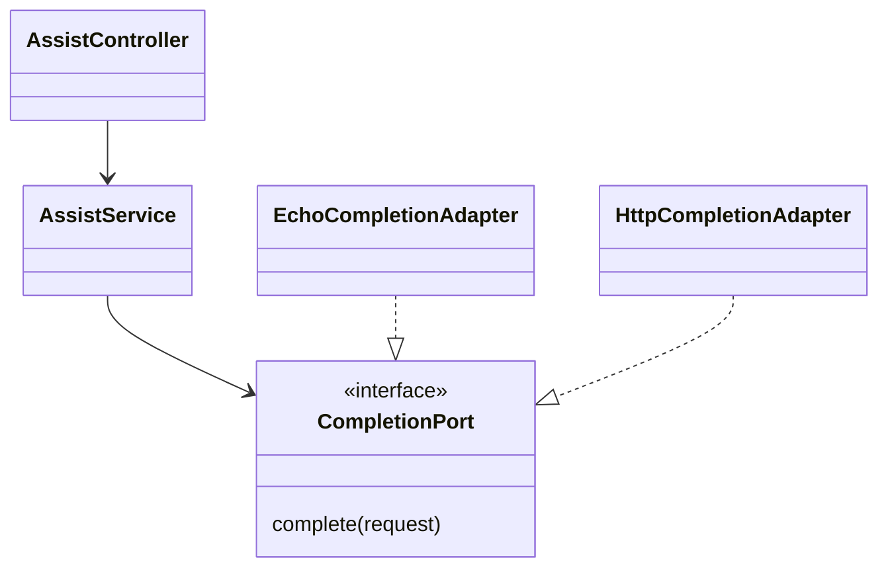

> 한 줄: DI 컨테이너는 **누가 `new` 할지를 대신 맡는 런타임 레지스트리**이고, Provider는 그 레지스트리에 넣는 "이 토큰을 요청하면 이렇게 만들어 줘"라는 등록 정보다 — 순수 도메인은 꽂아 바꿀 이유가 없어 이 그래프에 등장하지 않는다.

## 큰 그림

먼저 Nest를 지우고 손으로 조립한 세 줄이 구조의 본체다.

```ts
const completion = new EchoCompletionAdapter();   // Port 규격을 구현한 Adapter
const service = new AssistService(completion);    // 능력을 요구하는 Application Service
const controller = new AssistController(service); // HTTP 진입점
```

이 세 줄에 등장하는 역할과 관계는 이렇게 갈린다. 실선은 의존·호출, 점선 삼각형은 구현이다.



DI 컨테이너는 이 그림을 바꾸지 않는다. **위 세 줄의 `new` 사슬을 설정으로 옮겨 Nest가 대신 실행하게 만드는 것**뿐이다.

## 핵심

부품 창고 관리인을 떠올리면 된다. 각 클래스는 생성자에 "나는 이런 부품이 필요하다"고 적어 두고, 관리인(컨테이너)은 등록된 부품 목록을 보고 필요한 순서대로 만들어 꽂아 준다. 조립 코드는 사라지고 **등록 목록만 남는다.**

돌아가는 최소 예시.

```ts
// health.controller.ts
@Controller()
export class HealthController {
  constructor(private readonly health: HealthService) {}   // ← "필요하다"고 적기만 함
}

// health.module.ts
@Module({
  controllers: [HealthController],
  providers: [HealthService],                              // ← "만들 줄 안다"고 등록
})
export class HealthModule {}

// main.ts
const app = await NestFactory.create(AppModule);           // ← 여기서 실제로 조립
```

`new HealthService()`를 아무도 직접 부르지 않는다. `NestFactory.create()`가 모듈에 등록된 provider 목록을 읽고, 생성자가 요구하는 타입을 맞춰 인스턴스를 만들어 넣는다. 여기서 Nest가 컨테이너다.

**왜 타입만 적었는데 알아보나.** TypeScript 타입은 컴파일하면 지워지므로 이 지점이 마법처럼 보인다. `emitDecoratorMetadata`를 켜면 컴파일러가 데코레이터 붙은 클래스에 한해 생성자 파라미터 타입 목록을 `design:paramtypes` 런타임 메타데이터로 남기고, Nest가 실행 중에 `reflect-metadata`로 그것을 읽는다. 그래서 프로젝트에 `experimentalDecorators`·`emitDecoratorMetadata` 설정과 진입점의 `import 'reflect-metadata'`가 함께 있어야 한다.

## 깊이

**메타데이터 사슬이 끊기면 DI가 조용히 죽는다(필수).** esbuild는 `design:paramtypes`를 emit하지 않는다. 그래서 vitest의 기본 변환기를 그대로 두면 프로덕션 실행은 되는데 테스트에서만 DI 해석이 실패한다. 변환기를 SWC로 바꾸는 설정은 취향이 아니라 이 메타데이터를 살리기 위한 조치다. 반대로 말하면 `@nestjs/testing`으로 앱을 실제로 띄우는 테스트 하나가 tsconfig → 변환기 → `reflect-metadata` 사슬 전체가 살아 있음을 증명한다.

**DI 패턴 ≠ DI 컨테이너(가깝지만 아닌 것).** 생성자로 의존을 받는 것까지가 DI 패턴이고, 이는 컨테이너 없이도 성립한다 — `new AssistService(new EchoCompletionAdapter())`도 엄연히 DI다. 컨테이너는 그 조립을 자동화하는 도구일 뿐이다. 작은 프로젝트에서 컨테이너 없이 손으로 조립하는 선택은 정상이며, "DI를 쓴다"와 "DI 컨테이너를 쓴다"는 다른 문장이다.

**Provider는 등록 정보다.** Provider의 본체는 클래스가 아니라 "이 토큰을 요청하면 이렇게 만들어 줘"라는 항목이다.

```ts
{
  provide: COMPLETION_PORT,
  useFactory: () => new EchoCompletionAdapter(),
}
```

평범한 JavaScript로 옮기면 생성 함수를 `Map`에 등록한 것과 같다.

```ts
const registry = new Map();
registry.set(COMPLETION_PORT, () => new EchoCompletionAdapter());
const completion = registry.get(COMPLETION_PORT)();
```

Nest는 이 `Map`보다 많은 일을 한다 — 생성 순서를 계산하고, 생성자 자리에 넣어 주고, singleton이나 request scope 같은 수명을 관리한다. `useClass`는 "이 클래스를 new 해서 주라", `useFactory`는 "이 함수를 실행한 결과를 주라"는 지시다.

**Provider ⊃ Service(분류 기준이 다르다).** Service는 "이 객체가 애플리케이션에서 무슨 일을 하는가"라는 업무 역할이고, Provider는 "이 객체를 Nest가 생성·주입 대상으로 관리하는가"라는 등록 상태다. `AssistService`는 둘 다에 해당하지만, 모든 Provider가 Service는 아니다 — Adapter, 설정 객체, Factory 결과도 등록하면 Provider가 된다.

```text
Provider라는 큰 분류
├─ AssistService          (Application Service)
├─ EchoCompletionAdapter  (Adapter)
├─ HttpCompletionAdapter  (Adapter)
├─ CompletionRouter       (선택 위임)
└─ 설정값이나 Factory 결과
```

**Port·Adapter·Service·Provider의 관계는 문장 네 개로 닫힌다.** 처음 혼란스러운 이유는 이 넷이 같은 층의 용어처럼 보여서인데, 실제로는 아키텍처 용어(Application Service, Port, Adapter)와 프레임워크 용어(Controller, Module, Provider, Scope)가 겹쳐 있을 뿐이다.

```text
Service : "completion 능력이 필요해."
Port    : "그 능력은 complete() 모양이어야 해."
Adapter : "내가 Echo 또는 HTTP 기술로 실제 수행할게."
Provider: "Nest야, 이번 실행에서는 이 Adapter를 넣어줘."
```

**도메인은 DI 컨테이너 안에 없다(경계).** 순수 함수로 된 도메인은 컨테이너 그래프에 등장하지 않고, 연결은 평범한 import 한 줄이다.

```ts
import { evaluateHealth } from '@platform/core';   // ← DI가 아니라 그냥 import

@Injectable()
export class HealthService {
  check(latencyMs: number) {
    return { status: evaluateHealth(latencyMs), service: '@platform/api' };
  }
}
```

세 이유가 겹친다. ① **주입할 이유가 없다** — DI가 값을 내는 건 그 자리에 들어올 구현이 바뀔 수 있을 때이고, 상태 없는 순수 함수는 갈아 끼울 필요가 없다. ② **넣으려면 도메인이 프레임워크를 알아야 한다** — `@Injectable()`을 붙이려면 core가 `@nestjs/common`을 import해야 하고, 그 순간 "도메인은 바깥을 모른다"가 깨진다. ③ **경계 화살표 방향과 어긋난다** — api(바깥) → core(안)로 흐르는데, DI 등록은 core가 Nest를 향해 화살표를 되쏘는 모양이 된다.

**그 위반은 도구가 잡아 주지 않는다(곁가지지만 중요).** `turbo boundaries`의 tag 규칙은 workspace package 사이에만 적용되고 `@nestjs/common`은 외부 npm이라 tag가 없다. 즉 "도메인이 프레임워크를 import하지 않는다"는 현재 **사람이 지키는 규칙**이며, 리뷰에서만 걸린다.

**DI가 도메인과 만나는 지점은 Port다.** 포트-어댑터가 들어오면 관계가 뒤집힌다.

```text
core         : interface LlmPort { complete(...): Promise<string> }   ← 포트 소유(안쪽)
adapters/xxx : class AnthropicAdapter implements LlmPort             ← 어댑터 구현(바깥)
api          : providers: [{ provide: LLM_PORT, useClass: AnthropicAdapter }]
```

애플리케이션 서비스가 생성자로 `@Inject(LLM_PORT) port: LlmPort`를 받는다. **도메인이 정한 인터페이스에 컨테이너가 바깥 구현을 꽂는다** — 이것이 의존성 역전(DIP)이고 DI 컨테이너의 원래 용도다. 다만 인터페이스는 TS 타입이라 컴파일하면 사라지므로 `design:paramtypes`로는 찾을 수 없고, **문자열/심볼 토큰과 `@Inject()`가 필요**하다. 클래스 타입만으로 주입되던 방식과 여기서 갈라진다.

## 용어 풀이

- **의존성 주입 컨테이너(DI Container)** — 등록된 생성 방법을 읽어 객체를 만들고 생성자에 꽂아 주는 런타임. / 깨짐: DI 패턴과 동일시하면 "컨테이너가 없으면 DI가 아니다"는 오해가 생긴다.
- **제어의 역전(IoC, Inversion of Control)** — 내가 라이브러리를 부르는 대신 프레임워크가 내 코드를 부르는 구조. DI는 이 역전을 객체 생성에 적용한 한 형태다. / 깨짐: DI와 IoC를 같은 크기의 개념으로 보면 범위를 잘못 잡는다.
- **Provider(프로바이더)** — "이 토큰을 요청하면 이렇게 만들어 줘"라는 등록 정보(`useClass`/`useFactory`/`useValue`). / 깨짐: Service의 동의어로 읽으면 Adapter·설정 객체가 Provider인 사실이 설명되지 않는다.
- **토큰(token)** — 주입 대상을 식별하는 키. 클래스 자체이거나 심볼·문자열 상수. / 깨짐: 인터페이스를 토큰으로 쓸 수 있다고 착각하면 런타임에 사라져 실패한다.
- **`design:paramtypes`** — `emitDecoratorMetadata`가 남기는 생성자 파라미터 타입 목록 메타데이터. / 깨짐: 변환기를 바꾸면 조용히 사라져 테스트에서만 깨진다.
- **의존성 역전 원칙(DIP, Dependency Inversion Principle)** — 안쪽이 인터페이스를 소유하고 바깥 구현이 그것을 따르게 하는 원칙. / 깨짐: "인터페이스를 쓴다"와 혼동하면 인터페이스를 바깥에 두고도 지켰다고 착각한다.
- **Composition Root(조립 루트)** — 객체 그래프를 조립하는 단 한 곳(여기서는 `AppModule`). / 깨짐: 여러 곳에서 조립하면 설정 출처가 흩어진다.

## 확인 질문

1. 프로덕션 실행은 정상인데 `@nestjs/testing`으로 띄운 테스트에서만 의존성 해석이 실패한다면 어디를 먼저 보나? <details><summary>답</summary>테스트 런너의 변환기. esbuild는 `design:paramtypes`를 emit하지 않으므로 SWC 등 메타데이터를 내보내는 변환기로 바꿔야 한다. `tsconfig`의 `emitDecoratorMetadata`와 진입점 `reflect-metadata` import도 함께 확인한다.</details>
2. `class AssistService`는 클래스 타입만으로 주입받는데 `LlmPort`는 왜 `@Inject(LLM_PORT)`가 필요한가? <details><summary>답</summary>클래스는 컴파일 후에도 런타임 값으로 남아 `design:paramtypes`에 실릴 수 있지만, interface는 타입이라 컴파일 시 사라진다. 그래서 심볼·문자열 토큰을 따로 만들어 명시적으로 지정해야 한다.</details>
3. (본문 밖) 도메인 함수가 순수 함수가 아니라 캐시를 들고 있고, 테스트에서는 캐시를 끄고 싶어졌다. 이때도 도메인을 컨테이너에 등록하지 않는 판단이 유지되나? <details><summary>답</summary>바뀌는 것은 "갈아 끼울 이유가 없다"는 전제 하나뿐이다. 그렇다고 도메인에 `@Injectable()`을 붙이면 경계가 깨지므로, 캐시를 Port로 뽑아 도메인 밖(Adapter)으로 밀어내고 도메인은 여전히 순수하게 두는 쪽이 경계와 교체 가능성을 동시에 만족한다.</details>

## 근거

- 실측(`turborepo-platform-lab`, M01): `apps/api/src/health/health.controller.ts`(생성자 주입), `apps/api/src/health/health.module.ts`(`providers`/`controllers` 등록), `apps/api/src/main.ts`(`NestFactory.create(AppModule)`, 첫 줄 `import 'reflect-metadata'`), `apps/api/tsconfig.json`(`experimentalDecorators`·`emitDecoratorMetadata`), `vitest.config.mts`(변환기를 esbuild → SWC로 교체), `apps/api/src/health/health.test.ts`(DI 해석까지 검증).
- 실측(M15): `apps/api/src/assist/completion.binding.ts`(`{ provide: COMPLETION_PORT, useFactory }` 등록), `apps/api/src/assist/assist.service.ts`(Port를 생성자로 받음).
- [NestJS Providers](https://docs.nestjs.com/providers) — Provider는 Nest가 생성·주입할 수 있는 대상 전체(Service·Repository·Factory·Helper)를 가리킨다. 1차. 확인 2026-08-16.
- 같은 계열 구현: Spring의 Bean, Angular의 Provider, ASP.NET Core의 Service 등록 — 컨테이너가 객체를 대신 만들고 연결한다는 개념은 Nest 고유가 아니다. 2차.

## 관련 개념

- 앞: [Core–Port–Adapter의 역할 분담과 의존성 역전](/study-note/software-architecture/hexagonal-core-port-adapter/) — Port/Adapter 경계가 먼저 서야 Provider 등록이 "무엇을 꽂는 일"인지 보인다.
- 뒤: [NestJS Dynamic Module](/study-note/nestjs/dynamic-module/) — 어떤 Provider를 등록할지를 설정에 따라 결정하는 단계.
- 관련: [겹치는 아키텍처 패턴들의 질문별 역할 지도](/study-note/software-architecture/common-patterns-map/) — DI·IoC가 다른 패턴들과 어디서 겹치는지.
- 관련: [TypeScript static 메서드와 인스턴스 메서드의 선택 기준](/study-note/typescript/static-vs-instance/) — `useFactory`·`static register`가 인스턴스 없이 호출되는 문법적 배경.
