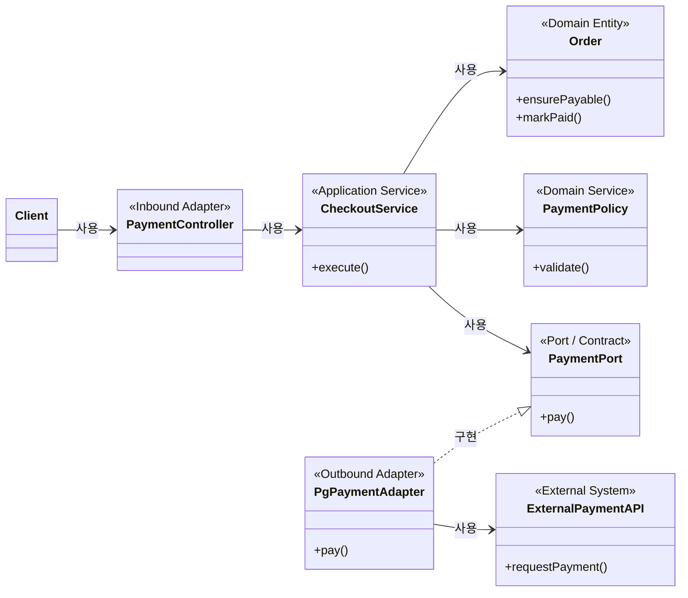

> 한 줄: **Domain은 사업 규칙에 따라 가능한 행동과 올바른 상태 변화를 결정하고, Application은 그 행동들의 실행 순서를 조율하며, Port는 Application이 외부에 요구하는 계약을 선언하고, Adapter는 바깥 세계를 그 계약에 맞게 번역한다.**

## 큰 그림



실선 화살표는 실행 중 사용·의존 관계, 점선 삼각형은 계약 구현 관계다. 읽어야 할 것은 화살표의
**방향**이다. `CheckoutService`는 외부 PG를 직접 알지 않고 애플리케이션이 정의한 `PaymentPort`만
안다. 바깥의 `PgPaymentAdapter`가 그 계약을 구현하면서 외부 API 규격을 번역한다.

## 핵심

한 가게를 생각하면 층이 나뉜다. **점장의 규칙**("환불은 영수증이 있어야 한다")은 카드 단말기를
바꿔도 그대로 남고, **접객 순서**("주문 확인 → 결제 → 영수증 발급")는 규칙이 아니라 일을 진행하는
절차이고, **단말기 사용법**("응답 코드 00은 승인")은 단말기가 바뀌면 함께 바뀐다. 세 가지가 한
사람의 머릿속에 있어도 서로 다른 이유로 바뀐다는 사실은 변하지 않는다.

같은 문장들을 코드 위치로 옮기면 이렇게 갈린다.

| 문장 | 주된 위치 | 이유 |
| --- | --- | --- |
| 취소된 주문은 결제할 수 없다 | Domain | 사업 상태가 허용하는 행동을 결정한다 |
| 주문을 불러오고 결제한 뒤 결과를 저장한다 | Application | 유스케이스의 실행 순서를 조율한다 |
| `result_code: "0000"`을 승인으로 해석한다 | Adapter | 외부 표현을 내부 의미로 변환한다 |
| 잘못된 요청에 HTTP 400을 반환한다 | Inbound Adapter | 전송 규약으로 오류를 표현한다 |
| 네트워크 오류를 세 번 재시도한다 | Infrastructure가 기본 | 기술적 복구 정책. 다만 계약상 시도 횟수가 사업 규칙이면 Domain일 수 있다 |

마지막 행이 이 표의 요점이다. **코드 모양만 보고 분류할 수 없고, 그 결정을 만든 이유를 봐야 한다.**

도메인 규칙의 최소 예시는 규칙 자체를 자기 안에서 지키는 객체다.

```ts
class Order {
  constructor(
    private status: "pending" | "paid" | "cancelled",
    readonly totalAmount: number,
  ) {}

  ensurePayable(): void {
    if (this.status !== "pending") {
      throw new Error("결제 가능한 주문이 아닙니다.");
    }
  }
}
```

`order.ensurePayable()`을 호출하고 결제 결과를 저장하는 `checkout`은 도메인 규칙이 아니라 그
규칙을 **조율하는 애플리케이션 로직**이다. 따라서 "내 코드 대 외부 코드"와 "도메인 로직 대 인프라
로직"은 같은 구분이 아니다 — 내가 쓴 코드라고 다 도메인이 되지는 않는다.

## 깊이

**도메인 규칙을 가려내는 네 가지 질문(필수).** 완벽히 분류해 주는 공식은 없다. 경계는 사업과
시스템을 어떻게 모델링하느냐에 따라 움직이는 **설계 판단**이다. 다만 다음 순서로 비교적 안정적으로
가려낼 수 있다.

1. 기능 명세에서 판단과 제약을 문장으로 뽑는다. ("취소된 주문은 결제할 수 없다", "결제에 성공하면
   주문 상태를 변경한다", "외부 응답 코드 `0000`은 성공이다")
2. **기술을 바꿔도 남는가.** UI·HTTP·DB·결제사를 바꿔도 그대로면 도메인 규칙일 가능성이 크다.
3. **누가 그 규칙의 근거를 설명하는가.** 기획자나 현업 담당자가 사업 언어로 설명하면 도메인에
   가깝고, SDK 문서나 통신 규격이 근거면 Adapter나 인프라에 가깝다.
4. **위반하면 무엇이 깨지는가.** 잘못된 주문·금액·권한 상태가 생기면 도메인 문제이고, JSON 파싱이나
   재시도가 실패하면 주로 기술 문제다.
5. **정상 예와 반례로 검증한다.** "대기 중인 주문은 결제 가능, 취소된 주문은 결제 불가"처럼 경계
   사례를 테스트로 고정한다.

DDD의 도메인 모델링, Event Storming, Example Mapping, Specification by Example은 이 판단과 사례를
팀의 언어로 드러내는 데 쓰는 방법들이다.

**구분은 필요하지만 항상 별도 계층이 필요한 것은 아니다(필수).** 구분이 필요한 이유는 변경 원인이
다르기 때문이다 — 할인·취소 정책이 바뀌면 Domain이, 유스케이스 순서나 트랜잭션 범위가 바뀌면
Application이, 결제사 스키마나 SDK가 바뀌면 Adapter가 변한다. 셋이 한 함수에 섞이면 결제사 필드
하나가 바뀌어도 사업 규칙을 건드리게 되고, 같은 규칙이 Controller와 배치 작업에 중복된다. 그렇다고
단순 CRUD까지 `domain/`, `application/`, `ports/`, `adapters/`로 나누면 파일과 연결부만 늘어난다.
먼저 **서로 다른 변경 이유를 생각과 이름으로 구분**하고, 다음이 생길 때 코드 경계를 분리한다.

- 규칙이 복잡하거나 금액·권한·상태처럼 틀렸을 때 비용이 크다
- 같은 규칙을 둘 이상의 유스케이스가 쓴다
- 외부 시스템이나 UI가 자주 바뀐다
- 여러 사람이나 AI가 관련 코드를 독립적으로 수정한다

**"Service"는 계층 이름이 아니다(필수).** 같은 단어가 네 가지를 가리키므로, 이름만 보고 계층을
추론하면 반드시 틀린다.

- **Application Service** — 유스케이스의 순서·트랜잭션, 도메인 객체와 Port 호출을 조율한다
- **Domain Service** — 한 Entity에 자연스럽게 넣기 어려운 사업 규칙을 표현한다
- **Infrastructure Service** — 메일·파일·외부 API처럼 기술 기능을 제공한다
- 프레임워크의 `@Service`·`@Injectable()` — 객체를 생성·주입하는 표식일 뿐, 그 코드가 어느 계층인지
  전혀 말해 주지 않는다

**Adapter의 본질은 이름 바꾸기가 아니다(필수).** `pay()`를 `requestPayment()`로 바꾸기만 하는
예시는 최소 설명은 되지만 실제로는 단순 wrapper다. Adapter의 가치는 여러 차이가 겹칠 때 드러난다 —
요청 필드·자료형이 다르고, 통화·날짜 표현이 다르고, 외부 상태 코드를 내부의 의미 있는 결과로 바꿔야
하고, 외부 오류를 내부 오류 체계로 바꿔야 하고, 호출 순서·인증 방식이 내부 계약과 다를 때다.

애플리케이션이 알고 싶은 계약은 이것뿐이다.

```ts
type PaymentResult =
  | { status: "approved"; transactionId: string }
  | { status: "pending"; redirectUrl: string }
  | { status: "declined"; reason: "insufficient_funds" | "unknown" };

interface PaymentPort {
  pay(input: { orderId: string; amount: number; currency: "KRW" }): Promise<PaymentResult>;
}
```

그런데 오래된 결제사는 `merchant_uid`, `total_amount: string`, `currency_code: "410"`을 받고
`{ tx_no, result_code, redirect_url? }`을 준다. Adapter는 필드명뿐 아니라 **상태의 의미**를
번역한다.

```ts
class LegacyPgAdapter implements PaymentPort {
  constructor(private readonly client: LegacyPgClient) {}

  async pay(input: { orderId: string; amount: number; currency: "KRW" }): Promise<PaymentResult> {
    const response = await this.client.request({
      merchant_uid: input.orderId,
      total_amount: String(input.amount),
      currency_code: "410",
    });

    switch (response.result_code) {
      case "0000":
        return { status: "approved", transactionId: response.tx_no };
      case "1001":
        if (!response.redirect_url) throw new Error("결제사의 응답 형식이 올바르지 않습니다.");
        return { status: "pending", redirectUrl: response.redirect_url };
      case "2001":
        return { status: "declined", reason: "insufficient_funds" };
    }
  }
}
```

이제 소비자는 `merchant_uid`·통화 코드 `410`·`result_code`를 전혀 모르고, 결제사가 필드명이나 상태
코드를 바꿔도 주로 Adapter만 고치면 된다.

**한계: Adapter는 의미를 만들어 내지 않는다(곁가지).** Adapter는 **같은 의미의 다른 표현**을
바꾸는 경계다. 외부가 더 이상 필요한 의미를 제공하지 않으면 Adapter가 임의로 꾸며 내서는 안 된다.
외부에 `pending`이 있는데 내부 계약이 성공·실패만 허용한다면, 정보를 억지로 버리기보다 내부 계약을
다시 설계해야 한다.

**BFF는 Adapter 역할을 할 수 있지만 동의어가 아니다(곁가지).** 백엔드의 범용 스키마를 특정 웹·
모바일 클라이언트용 스키마로 바꾸는 BFF는 아키텍처 수준에서 Adapter 역할을 한다.

```ts
type OrderSummaryView = { orderNumber: string; totalText: string; canCancel: boolean };

function toOrderSummaryView(order: BackendOrder): OrderSummaryView {
  return {
    orderNumber: order.order_id,
    totalText: `${order.total_amount.toLocaleString("ko-KR")}원`,
    canCancel: order.status === "PAYMENT_COMPLETED",
  };
}
```

다만 Adapter는 맞지 않는 계약을 변환하는 **역할·설계 패턴**이고, BFF는 특정 frontend를 위해 둔
**서비스 경계와 배포 단위**다. BFF 안에는 변환 Adapter뿐 아니라 여러 API를 합치는 유스케이스,
인증, 캐시, 오류 처리도 들어간다. 반대로 백엔드 응답을 그대로 넘기는 단순 proxy라면 BFF라고 부를
수는 있어도 Adapter로서 하는 일은 거의 없다. 정확한 표현은 이렇다.

> BFF는 클라이언트와 백엔드 사이의 Adapter 역할을 수행할 수 있으며, 보통 그 안에 하나 이상의
> Adapter와 애플리케이션 조율 로직을 함께 가진다.

**기능 명세와 도메인 규칙은 대등한 두 문서가 아니다(곁가지).** 전체와 부분에 가까운 관계다.

```text
기능 명세
├── 목표와 사용자 시나리오
├── 입력과 출력
├── 도메인 규칙
├── 애플리케이션 흐름
├── UI·API·외부 연동 조건
└── 인수 조건과 예외 사례
```

따라서 도메인 규칙을 별도 문서로 무조건 중복 작성할 필요는 없다. 한 기능에서만 쓰는 단순 규칙은
기능 명세의 `도메인 규칙` 절에 두고, 여러 기능이 공유하거나 금액·권한·상태 무결성을 지키는 규칙은
한 곳을 원본으로 두고 각 명세가 **참조**한다. 기능 명세에는 "어떤 흐름에서 이 규칙을 적용하는가"와
인수 사례를 적고 원본 규칙의 문장을 복제하지 않는다.

**AI 코딩에서는 계층 이름보다 규칙·흐름·경계·판정 사례가 먼저다(필수).** AI는 명시되지 않은 경계를
그럴듯하게 추측한다. "결제 기능을 만들어 줘"라고만 하면 외부 상태 코드를 Domain 객체에 직접 넣고,
Controller와 Service에 같은 사업 규칙을 중복하고, 기술 오류를 사업 실패로 취급하고, 합의하지 않은
정책을 관행처럼 만들어 내고, 모든 것을 DDD 계층으로 과도하게 분리한다. 파일 구조보다 다음 네 묶음이
먼저다.

```text
[Domain rules]        무엇이 항상 참이어야 하는가
[Use-case flow]       어떤 순서와 조건으로 실행하는가
[External mapping]    외부 표현을 어디서 어떻게 번역하는가
[Acceptance examples] 어떤 입력에서 어떤 결과가 나와야 하는가
```

반대로 "Clean Architecture로 만들어 줘"처럼 구조 이름만 주면 불필요한 interface와 폴더를 대량으로
만들 가능성이 크다.

## 용어 풀이

- **도메인(Domain)** — 사업 규칙에 따라 가능한 행동과 올바른 상태 변화를 결정하는 층. 깨짐:
  "판단하는 곳"으로만 요약하면 Application의 실행 분기와 Adapter의 변환 판단까지 빨려 들어온다.
  안전한 요약은 "특정 기능에서 **사업적** 판단이 내려지는 지점"이다.
- **애플리케이션 로직(Application logic) / 유스케이스(use case)** — 목표를 달성하도록 도메인 행동과
  외부 기능의 실행 순서·트랜잭션을 조율한다. 깨짐: 여기에 사업 규칙을 넣으면 같은 규칙이 배치
  작업·다른 유스케이스에 복제된다.
- **포트(Port)** — Application이 외부에 요구하는 계약 선언. 소유자는 안쪽이다. 깨짐: 외부 SDK
  모양을 그대로 옮겨 적으면 계약이 아니라 wrapper가 된다.
- **어댑터(Adapter)** — 바깥 세계의 표현·상태·오류를 그 계약에 맞게 번역하는 경계. 깨짐: 이름
  변환만 하는 wrapper와 혼동.
- **Inbound / Outbound Adapter** — 들어오는 요청을 번역하는 쪽(Controller)과 나가는 호출을
  번역하는 쪽(PG client). 깨짐: Controller를 Adapter로 안 세면 HTTP 지식이 안쪽으로 새어 든다.
- **BFF(Backends for Frontends)** — 특정 frontend를 위해 둔 별도 서비스 경계·배포 단위. 깨짐:
  Adapter의 동의어로 사용.

## 확인 질문

1. "네트워크 오류를 세 번 재시도한다"는 Infrastructure인가 Domain인가? <details><summary>답</summary>기본은 Infrastructure(기술적 복구 정책). 다만 계약서에 "시도 횟수 3회"가 사업 약속으로 적혀 있다면 Domain 규칙이 된다 — 코드 모양이 아니라 그 결정의 근거가 어디인지가 갈림길이다.</details>
2. 어떤 클래스에 `@Service`가 붙어 있다. 이 사실만으로 계층을 알 수 있나? <details><summary>답</summary>알 수 없다. `@Service`/`@Injectable()`은 컨테이너가 객체를 생성·주입하게 하는 표식일 뿐이다. Application/Domain/Infrastructure Service 중 무엇인지는 그 코드가 조율을 하는지, 사업 규칙을 담는지, 기술 기능을 제공하는지를 봐야 한다.</details>
3. (본문 밖) 재고 시스템에서 "재고가 0이면 주문을 받을 수 없다"를 Adapter가 창고 API의
   `stock_flag: "N"`을 보고 판정하도록 구현했다. 무엇이 잘못됐고 어디로 옮겨야 하나?
   <details><summary>답</summary>사업 규칙(무엇을 해도 되는가)이 외부 표현 번역 층에 들어가 있다. Adapter는 `stock_flag: "N"` → `availableQuantity: 0` 같은 표현 변환까지만 하고, "0이면 주문 불가"라는 판정은 Domain이 소유해야 한다. 그러지 않으면 창고 API를 바꿀 때 사업 규칙이 함께 사라지고, 배치·다른 유스케이스에서 같은 규칙이 다시 복제된다.</details>

## 근거

- 출처는 2026-08-13·08-14 질문 로그의 자기 정리다. 결제 예시(`PaymentPort`/`LegacyPgAdapter`)와
  관계도는 그 논의에서 직접 작성·검토한 코드·다이어그램이다.
- 도메인 규칙 식별 절차의 배경 방법론: DDD 도메인 모델링, Event Storming, Example Mapping,
  Specification by Example (2차, 방법론 이름 수준의 참조).
- 실측 맥락: `turborepo-platform-lab`의 `packages/core`(Domain), `apps/api`의
  Controller/Service(Inbound Adapter + Application), `packages/adapter-*`(Outbound Adapter)가
  같은 배치를 코드로 갖고 있다.

## 관련 개념

- 앞: [Hexagonal 아키텍처의 Core·Port·Adapter 구성](/study-note/software-architecture/hexagonal-core-port-adapter/) — 여기서 나눈 책임이 의존 역전과 함께 구조로 굳는다.
- 관련: [경계 검증과 도메인 불변식의 역할 분리 규칙](/study-note/software-architecture/validation-at-boundary/) — "검증"이 Adapter와 Domain 중 어디에 속하는지가 이 구분의 대표적인 시험 문제다.
- 관련: [요청 경로에서 Controller·Application Service·Core의 책임 배분과 오류 번역](/study-note/software-architecture/layer-responsibility/) — 같은 구분을 실제 요청 하나의 데이터 흐름에서 확인한다.
