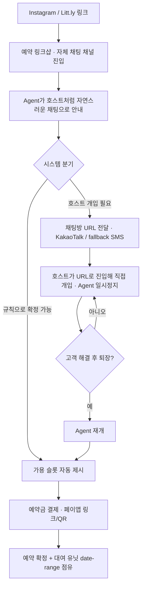

# PRD — 소유한 예약 링크샵 (대여형 vertical, v1)

**제품 한 줄**: Instagram→Kakao로 유입되는 대여형 소상공인(백일상/돌상)이, 고객 문의마다 반복하던 확인을 없애도록, 링크 하나에서 상품·행사일·대여 재고·상담·예약금이 도는 owned 예약 흐름. 승부처는 appointment-slot 도구가 못 푸는 **대여형 date-range 재고 충돌**을 한국 채널 위에서 HITL로 확정하는 것.

**상태**: Phase 0(검증) 대기 · **작성일** 2026-07-24

---

## 1. 문제

- 대여형 소상공인은 Instagram/Litt.ly로 유입돼 결국 카카오톡 상담으로 예약을 받는다.
- 병목은 **응답 속도가 아니라 사장이 문의마다 같은 확인을 손으로 반복**하는 것: 상품/컨셉, 행사일, 재고 가용, 정책, 예약 확정.
- 기존 도구는 이 업종을 못 받는다: appointment-slot 예약 툴(Square·Calendly·Cal.com)은 **하루짜리 슬롯**만 다루고, **유닛 하나가 며칠 점유되는 대여형 재고 충돌**을 네이티브로 모델링하지 못한다. 한국 link-in-bio(Litt.ly)엔 예약 자체가 없다.

## 2. 목표 / 비목표

**목표 (v1)**
- G1. 고객이 링크에서 **상품·행사일·재고 가용을 직접 확인·요청**하게 해 사장의 반복 확인을 줄인다.
- G2. 대여 유닛의 **date-range 충돌(더블부킹)을 0으로** 만드는 재고 코어를 제공한다.
- G3. 확정 가능한 요청과 **사장 확인이 필요한 요청을 분리**하고, 후자는 사장 승인 큐로 보낸다(HITL).
- G4. 확정 시 **예약금 결제**를 심사 대기 없이 받는다(컨시어지·초기 단계에서 즉시 시작).

**비목표 (v1에서 하지 않음)**
- N1. Instagram DM 자동응답 / DM을 AI로 대체.
- N2. 사장 승인 없는 full automation(자동 확정 전면화).
- N3. 범용·다업종 동시 지원(범용 예약 SaaS).
- N4. KakaoTalk 상담 스레드 자체를 채팅 표면으로 쓰거나, 사장이 Kakao 스레드로 점프하는 것에 **의존하지 않음** — 상담은 자체 채팅 채널에서 열고, 방 URL을 호스트에게 전달해 개입시킨다(§6 FR6). Kakao/SMS는 채팅 표면이 아니라 **URL 전달 채널**로만 쓴다.
- N5. 자동 알림톡/친구톡 발송(파트너 계약 필요), 해외 결제(Stripe 등, 한국 payout 제약).

## 3. 대상 사용자

- **사장(shop, 1인/소상공인)** — job: "대여 문의 때 상품·날짜·가용·정책을 매번 되풀이하지 않고, 사람 없이도 예약을 빨리 확정한다."
- **고객(예: 백일/돌 준비 부모)** — job: "내 행사일에 뭐가 가능하고 얼마인지 즉시 보고 바로 잡는다. DM 왕복·품절 뒷북 없이."

## 4. 범위

**In-scope (v1)**: 구조화 인테이크, 대여 date-range 재고 코어, 확정 분기, 사장 승인 큐(HITL), 예약금 결제(페이앱), 카톡 채널 진입 링크, 사장 대시보드.
**Out-of-scope → Later(v2+)**: 외부 캘린더(Google) mirror sync, 자동 알림톡, 정식 카드 PG 전환, 2번째 vertical 규칙 템플릿.

## 5. 핵심 사용자 흐름

상담은 KakaoTalk 스레드가 아니라 **자체 채팅 채널**(대화별 URL)에서 열린다. 기본은 Agent가 호스트 톤으로 자연스럽게 안내하고, 필요한 구조화 블록만 이벤트 카드(json-render, §6 FR8)로 얹는다. 개입이 필요하면 그 방 URL을 호스트에게 KakaoTalk(가능 시)·SMS(fallback)로 전달하고, 호스트가 진입해 직접 개입한다. **고객이 해결 후 채팅방을 나가면 Agent가 다시 개입**한다.

## 6. 기능 요구사항

**P0 (v1 must-have)**

| ID | 요구사항 | 수용 기준 |
|---|---|---|
| FR1 | 자연 채팅 인테이크 | 고객이 상품/컨셉·행사일·옵션을 **호스트 톤의 자연스러운 채팅**으로 입력(폼 강제 아님); 사장은 안내 문항을 업종 프리셋에서 구성 |
| FR2 | 대여 date-range 재고 코어 | 유닛 × 대여기간(체크인~체크아웃) 모델; 겹치는 기간 예약 자동 거절; 세팅/회수 버퍼 반영 |
| FR3 | 확정 분기 | 규칙으로 자동 확정 가능한 요청과 호스트 확인 필요 요청을 분리 |
| FR4 | Agent 대화 + HITL 초안 | Agent가 호스트 톤으로 대화하며 누락질문·확정 초안을 생성; 호스트 개입이 필요하면 FR6 핸드오프로 넘김 |
| FR5 | 예약금 결제 | 확정 시 페이앱 링크/QR로 예약금 청구; shop이 금액·ON/OFF 설정; 취소 시 환불 |
| FR6 | 채팅 채널 + 호스트 핸드오프 | 대화별 URL을 갖는 자체 채팅 채널. 기본은 Agent 안내. 개입 필요 시 **방 URL을 호스트에 KakaoTalk(가능 시)·SMS(fallback)로 전달** → 호스트가 진입해 직접 개입(Agent 일시정지) → **고객이 해결 후 퇴장하면 Agent 재개**. 상태(AGENT/ESCALATED/HOST) 추적 |
| FR7 | 사장 대시보드 | 문의·예약 현황, 대여 유닛 캘린더(date-range 점유) 뷰, 활성 채팅방 목록 |
| FR8 | 이벤트 카드 렌더링 | 상품·가용·견적 등 구조화 블록을 **json-render(Vercel)** 로 채팅 내 리치 카드로 렌더; 단 **카드 없이 자연 채팅만으로도 안내가 완결**돼야 함(카드는 향상, 대화가 기본) |

**P1 (Later)**: 외부 캘린더 mirror sync / 자동 알림톡(파트너 계약 후) / 정식 카드 PG 전환(토스·PortOne) / 다중 vertical 규칙 템플릿.

## 7. 기술 결정 (확정)

- **재고/스케줄: 자체 build.** date-range 유닛 충돌은 Cal.com·Square·Calendly가 네이티브로 못 푼다(Cal.com #16026 close, Calendly 24h 제한). 외부 캘린더는 sync/mirror 표면으로만, v1 제외.
- **결제: 페이앱(PayApp) 우선.** 비사업자도 즉시 시작(심사 대기 0), 링크/QR + API. 대가는 비사업자 수수료 4.0%. 토스페이먼츠 등 정식 카드 PG는 심사 7~10일이라 초기 병목 → 볼륨이 붙어 수수료가 아까워질 때 전환. PortOne·부트페이는 PG 묶는 레이어일 뿐 심사 지연을 승계하므로 초기 부적합.
- **채널: 자체 채팅 채널 + URL 전달 핸드오프.** 상담은 KakaoTalk 스레드가 아니라 우리 채팅 채널(대화별 URL)에서 열린다 — 이래야 Kakao의 "사장→특정 고객 스레드 진입 불가"를 우회한다. 개입이 필요하면 그 방 URL을 호스트에게 전달한다: **KakaoTalk 비즈메시지(알림톡/친구톡)는 파트너 계약 확보 시, 그전까지는 SMS가 계약 없이 즉시 도달하는 baseline.** 호스트는 URL로 진입해 직접 개입하고, 고객이 해결 후 퇴장하면 Agent가 재개한다.
- **가이드 UI: 자연 채팅 우선, 카드는 향상.** 고객 안내의 기본은 호스트 톤의 자연스러운 채팅이다. 상품·가용·견적 같은 구조화 블록은 json-render(Vercel)로 리치 이벤트 카드를 채팅에 얹을 수 있으나, **카드 없이 대화만으로도 안내가 완결**돼야 한다.
- **AI 어시스트: HITL 핸드오프(LangGraph interrupt류).** Agent가 호스트 톤으로 대화하고 누락질문·확정 초안을 만들되, 확인 필요 건은 pause하고 호스트에게 방 URL을 전달(개입) → 호스트 처리 후 고객 퇴장 시 resume. v1의 "AI"는 자연 채팅 안내 + 누락질문 초안 + 확정/개입 분리까지.

## 8. 단계 / 마일스톤

- **Phase 0 — 검증(코드 0).** 백일상/돌상 대여 1개 shop, 2주 컨시어지 파일럿. 인테이크 폼(Google Form/Litt.ly) + 공유 가용 시트 + "확정 가능/확인 필요" 손 분리. **게이트(A1)**: ①문의당 사장 처리시간 감소 ②인테이크 완료율 ③2주 뒤 자발적 재사용. → 미달 시 build 보류.
- **Phase 1 — v1 build(게이트 통과 시).** FR1–FR7. 결제 페이앱. 파일럿 shop에서 예약금 ON/OFF A/B.
- **Phase 2 — 확장.** P1 항목 + 2번째 vertical(§11 트리거 충족 시).

## 9. 성공 지표

- **North star**: 문의→확정 리드타임 단축 + 사장 반복 확인 시간 감소.
- **Phase 0 게이트**: 위 A1 지표 3종.
- **v1**: 예약금 결제 완료율(예약금 ON vs OFF A/B), 자동 확정 비율(규칙 커버리지), **더블부킹 0건**, 사장 승인 큐 처리시간.

## 10. 리스크 & 가정 (검증 대상)

- **A1 value(최고 risk)**: 사장이 순수 DM 대신 구조화 흐름을 실제로 쓸까 → Phase 0로 게이트.
- **A3 예약금 마찰**: 선결제가 전환을 올릴지 낮출지 미검증 → v1 A/B로 측정.
- **A6 일반화**: 다른 Instagram-first 소상공인에게도 병목이 있는지 미검증 → §11 트리거로 관리, v1 out-of-scope.
- **수수료**: 페이앱 비사업자 4.0% → 볼륨 시 PG 전환으로 완화.
- **호스트 알림 도달**: KakaoTalk 비즈메시지는 파트너 계약 필요 → **SMS fallback으로 도달 보장**. 채팅 표면(방 URL)은 우리 시스템 소유라 Kakao 정책 변경이 상담 자체를 끊지 않음.
- **핸드오프 상태 정합성**: Agent↔호스트 전환 중 이중 응답/누락 위험 → 방 상태(AGENT/ESCALATED/HOST)를 단일 소스로 관리하고 고객 퇴장 이벤트로만 Agent 재개.

## 11. 확장 트리거 (vertical → horizontal)

2번째 vertical은 다음 **둘 다** 충족 시에만 연다: (a) vertical 1의 리텐션(사장이 N주 뒤에도 자발적 사용) **AND** (b) 인테이크/확정 규칙의 **재사용률 ≥ 임계치**(규칙을 재구축하지 않고 재사용). 규칙 재사용률이 horizontal 확장의 구체 신호.

## 부록 — 근거 (핵심만, 1차 우선, 확인일 2026-07-24)

- 대여 date-range gap: Cal.com issue #16026(1차, 창업자가 multi-day/PMS를 close), Calendly 24h 제한(1차).
- 결제 온보딩: 페이앱 즉시 시작(1차, payapp.kr), 토스페이먼츠 심사 ~7~10일(2차, PortOne 헬프센터 — 토스 공식 아님, 확인 필요).
- 카톡 제약: Kakao Developers 메시지 API(1차, self/같은-앱 친구만·스레드 딥링크 없음), 채널 JS(1차, 채널 단위 진입), 상담톡(1차, 상담원 선발신 불가).
- HITL: LangGraph interrupt/Command(resume=)(1차).
