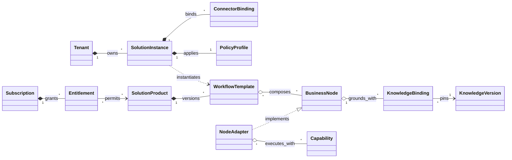

> 한 줄 명제: 소형 사업자는 앱의 API 동작을 조립하는 대신 청구·기록·후속 처리처럼 자기 사업의 의미가 담긴 노드를 연결해 검증된 AI 업무 파이프라인을 실행할 수 있어야 한다.

## 핵심

이 아이디어의 출발점은 타당하다. 대기업은 자체 AI 전환 조직이나 FDE(Forward Deployed Engineer, 고객 현장에 깊이 들어가 문제를 풀고 그 피드백을 제품에 되돌리는 엔지니어)를 둘 수 있지만, 소상공인·1인 기업·소규모 스타트업은 ChatGPT 같은 도구를 구독해도 **어떤 업무를 바꿔야 하는지, 기존 도구와 어떻게 연결하는지, 결과가 맞는지 어떻게 관리하는지**까지 스스로 설계하기 어렵다. 한국 소상공인 조사에서도 디지털·AI 기술을 쓴다는 응답은 80%였지만 그중 83.3%가 기초·입문 단계였다. 서울 소상공인 조사에서는 AI를 이미 쓰는 비율이 9.7%에 그쳤고, 실습 중심 훈련과 성공 사례를 가장 필요로 했다. 도구 접근성보다 **적용 역량과 실행 지원의 간극**이 문제라는 근거다.

하지만 "상담을 받은 뒤 무엇이든 만들어준다"고 시작하면 고객도, 문제도, 상품도 너무 넓다. 음식점의 예약 전화, 온라인 판매자의 상품 등록, 소규모 에이전시의 제안서 작성은 데이터·도구·위험·지불 능력이 모두 다르다. 고객마다 새로 만드는 저가 SI·컨설팅 회사가 되고, "공통 사항을 솔루션화한다"는 약속은 끝내 실현되지 않을 가능성이 높다.

사용자가 제안한 관점은 이 약점을 더 직접적으로 줄인다. **실제 소형 사업자의 전후 사례를 먼저 조사해 검증된 업무 키트로 만들고, 고객은 자기 상황과 닮은 사례를 골라 직접 복제·시험한다.** 무료 단계는 무에서 요구사항을 만드는 상담이 아니라 사례와 고객 도구의 호환성을 판정한다. 이후 `Lead → Frontend → Backend`를 무료 사례·유료 DIY 키트·업데이트 및 새 키트로 설계하고, 직접 설치가 어려운 고객만 선택적으로 지원한다.

==따라서 더 정확한 사업 정의는 **사례 선행형 업무 의미 노드 플랫폼**이다.== 바깥에서는 완성 파이프라인의 결과·가격·호환성이 보이고, 안쪽에서는 사업 완료 계약을 가진 노드가 고객의 앱 동작으로 변환된다. 처음부터 모든 업종을 자동화하는 플랫폼을 만드는 것이 아니라, 검증 사례 하나를 끝까지 구현한 뒤 반복되는 업무 단위만 노드로 승격한다.

제품 내부에서는 고객과 기능을 같은 분류 트리에 넣지 않는다. 고객은 격리해야 할 `Tenant`, 기능은 재사용할 `Capability`, 고객이 구매하는 것은 기능을 업무 흐름으로 묶은 `Solution Product`, 실제 적용 결과는 고객 설정을 결합한 `Solution Instance`다. ==**서로 다른 축은 마지막 배치 인스턴스에서만 만나야 한다.**==

현재 판단은 **사례 중심 DIY는 유입·판매 방식이고, 업무 의미 노드 기반 파이프라인이 실제 제품 구조**다. 예약 채팅처럼 한 기능을 대표 제품으로 세우는 방향은 기존 플랫폼에 흡수되기 쉽고, 모든 고객을 직접 진단·설치·운영하는 모델은 낮은 계약금액과 지원 원가가 충돌한다. 반면 사례에서 검증된 파이프라인을 먼저 제공하고, 반복되는 업무 단위를 `청구 초안 생성`, `매출 기록`, `후속 할 일 등록` 같은 노드로 승격하면 새로운 사례를 더 빠르게 조립할 수 있다. 다만 Microsoft Power Platform과 Zapier도 재사용 가능한 사용자 정의 액션을 제공하므로, 노드라는 추상화 자체가 아니라 **소형 사업자의 업무 계약·업종 정책·실패 복구·성과 기준이 내장된 노드 카탈로그**가 제품이어야 한다.

- **수요 신호: 강함** — 활용 수준, 인력·기술 부족, 실습·멘토링 수요, 정부 예산이 같은 방향을 가리킨다.
- **초기 제품 정의: 개선됨** — 솔루션 카탈로그와 구독 전환 경로가 생겼다. 대표 고객은 반복 디지털 업무가 있지만 전담 IT·AI 인력이 없는 3~30인 사업자로 좁힌다.
- **사업성: 미검증** — 사례 열람이 유료 DIY 키트 구매와 업데이트 멤버십으로 이어지는지 확인해야 한다.
- **솔루션화 가능성: 조건부** — “따라 할 수 있다”는 주장은 초보자의 30분 자가 설치율과 2주 뒤 실제 사용률로 증명해야 한다.

## 방법론

**Jobs-to-be-Done(JTBD)으로 고객이 사는 진전을 정의하고, First Principles로 사업 완료와 앱 구현을 분리한 뒤, Lean Startup으로 가장 위험한 가정을 먼저 검증한다.**

- JTBD는 고객을 "소상공인"이라는 인구통계로 묶지 않고, 특정 상황에서 이루려는 진전으로 나눈다. 이 아이디어는 업종보다도 반복 업무의 빈도, 사람을 뽑기 어려운 상황, 기존 도구와 데이터 상태가 구매를 더 잘 설명하므로 이 틀이 맞다.
- First Principles는 `Google Docs 문서 복제` 같은 현재 구현을 걷어내고 고객이 실제로 끝내야 하는 `청구 초안 생성`을 입력·출력·정책·성공 기준으로 다시 정의한다. 앱별 동작은 이 계약을 구현하는 Adapter로 내린다.
- Lean Startup은 "실제 사례를 보면 고객이 직접 복제하고 돈을 낼 것"이라는 믿음을 검증 가능한 가설로 바꾼다. 사례 장터나 자체 실행 엔진을 먼저 만들지 않고, 사례 한 개와 DIY 키트 한 개로 설치 완료·반복 사용·지불 의사를 측정한다.
- 위험 검토에는 Pre-mortem을 보조로 썼다. 1년 뒤 실패했다고 가정해 에이전시 함정, 낮은 단가, 대형 플랫폼의 기능 흡수, 개인정보 사고 같은 실패 경로를 먼저 드러냈다.

방법론 근거는 §근거에 별도로 표시했다.

## 전개

### 1. 고객이 실제로 사는 것

초기 고객의 job을 다음처럼 가정할 수 있다.

> 주문·문의·문서·마케팅 같은 반복 업무는 계속 늘지만 사람을 더 뽑기는 어려울 때, AI 도구를 공부하고 조립하는 데 시간을 쓰지 않고 지금 쓰는 업무 도구 안에서 안전하게 일을 줄여, 매출을 놓치지 않으면서 본업에 집중하고 싶다.

이 job에는 세 층이 있다.

| 층 | 원하는 진전 | 기존 대안의 한계 |
| --- | --- | --- |
| 기능 | 반복 업무 시간과 누락을 줄이고 응답 속도를 높임 | 직접 처리, 아르바이트, 외주, 여러 SaaS를 각각 사용 |
| 감정 | "AI를 뒤처지지 않게 써야 한다"는 불안을 줄임 | 교육을 들어도 내 업무에 옮기지 못함 |
| 신뢰 | 고객정보와 결과 오류를 통제하면서 쓸 수 있음 | 개인 계정에 자료를 붙여 넣거나 결과를 검증하지 않음 |

따라서 경쟁 상대는 ChatGPT만이 아니다. **직접 야근하기, 직원을 뽑기, 외주 주기, 업무를 포기하기**도 경쟁 대안이다. 판매 문구도 "AI 전환"보다 "문의 응답 시간을 하루 90분 줄인다", "상담 누락을 줄인다"처럼 고객이 이미 계산하는 결과로 바꿔야 한다.

### 2. 문제의 존재를 뒷받침하는 신호

서로 다른 조사들이 같은 간극을 보여준다.

- 2026년 중소기업중앙회 조사에서 소상공인 500개사 중 80%가 디지털·AI 기술을 활용한다고 답했지만, 활용자의 83.3%는 기초·입문 단계였다. 업무 효율 개선을 체감했다는 응답은 69.8%였고, 정부 지원사업 참여 경험은 3.2%뿐이었다. "안 쓴다"보다 **얕게 쓰며 고도화하지 못한다**가 더 정확한 문제 정의다.
- 2025년 서울 소상공인 300개사 조사에서는 AI 활용 중 9.7%, 계획 있음 23.0%, 경험도 계획도 없음 67.3%였다. 도입 어려움은 비용 69.0%, AI 지식 30.7%, 기존 시스템 연계 23.0%였고, 필요한 지원은 실습 중심 훈련 47.7%, 성공 사례·정보 41.0% 순이었다.
- OECD의 7개국 5,000여 개 중소기업 조사에서 한국 중소기업의 생성형 AI 활용률은 25.2%였고, 한국 비사용자의 가장 큰 장벽은 직원 기술 부족 53.0%, 가장 선호하는 지원은 교육 77.4%였다. 1인 기업의 활용률은 23.6%로 50~249인 기업 45.8%의 약 절반이었다.
- 같은 OECD 조사에서 생성형 AI를 쓰는 1인 기업의 36.4%는 업무량 감소를 보고했다. 생성형 AI를 핵심 업무에 쓸 때 기술 격차와 인력 부족을 보완했다는 응답도 단순 주변 업무 사용보다 높았다. **효과가 없어서가 아니라 핵심 업무에 들어가는 과정이 막혀 있다**는 해석과 맞는다.

다만 이 수치들은 시장의 존재를 보여줄 뿐, 이 사업에 돈을 낼 고객 수를 보여주지 않는다. 교육 선호가 곧 구축·운영 서비스 구매 의사는 아니며, 정부 지원을 원한다는 응답은 자기 돈으로 결제한다는 뜻도 아니다.

### 3. 제안 상품: Lead–Frontend–Backend 오퍼 퍼널

고객이 처음 보는 것은 상담 신청 버튼이 아니라 **자기 업무와 닮은 완성형 솔루션 카드**여야 한다. 카드는 기술 기능이 아니라 업무의 전후 차이를 보여준다.

| 솔루션 카드 | 고객이 보는 결과 | 주요 연결 | 사람 승인 |
| --- | --- | --- | --- |
| 현장 업무 마감 키트 | 음성 메모 한 번으로 청구 초안·매출 장부·후속 할 일을 만든다 | 음성 폼, 스프레드시트, 문서·할 일 도구 | 고객·금액·작업 내용 확인 |
| AI 영업 팔로업 | 상담 내용을 정리하고 견적·후속 연락을 제때 생성 | 메일, CRM, 캘린더 | 견적 발송·계약 조건 |
| AI 상품 운영자 | 상품 원본을 채널별 설명·광고 소재로 변환하고 반려 사유를 점검 | 쇼핑몰, 스프레드시트, 광고 채널 | 최종 게시 |
| AI 리뷰·고객의견 분석가 | 리뷰·문의에서 반복 불만과 개선 항목을 주간 보고 | 쇼핑몰, 설문, 문서 | 대외 답변 |
| AI 경영 브리핑 | 매출·광고·문의 데이터를 묶어 이번 주 이상과 할 일을 보고 | POS, 광고, 스프레드시트 | 의사결정은 대표자 |

초기에는 실제 고객 사례가 없어도 작동 데모와 가상 시나리오를 만들 수 있다. 다만 이를 "도입 사례"라고 부르면 안 된다. **`작동 예시`, `예상 효과`, `검증된 고객 사례`를 시각적으로 분리**해 신뢰를 지켜야 한다.

이 문서에서 Lead–Frontend–Backend는 개발의 프런트엔드·백엔드가 아니라 **고객을 무료 사례에서 첫 DIY 구매, 지속 업데이트로 옮기는 오퍼 퍼널**을 뜻한다. 고객 흐름은 다음처럼 고정한다.

```text
검증 사례 발견 → Lead: 무료 호환성 확인 → Frontend: 유료 DIY Workflow Kit → Backend: 업데이트·새 키트·선택적 설치 지원
```

| 단계 | 고객에게 주는 것 | 사업자가 확인하는 것 | 다음 단계 조건 |
| --- | --- | --- | --- |
| Lead Offer | 실제 전후 사례, 필요한 도구, 3분 호환성 확인, 예상 절약 시간 | 어떤 사례와 앱 조합에 수요가 모이는지 | 호환되는 키트와 반복 문제 |
| Frontend Offer | Recipe, 실행 도구별 템플릿, 설치 안내, 샘플 시험, 효과 기록표 | 실제 결제 의사, 자가 설치율, 첫 시험 통과율 | 2주 반복 사용과 다음 키트 수요 |
| Backend Offer | 앱 변경 대응, 키트 업데이트, 새 키트 묶음, 선택적 설치 지원 | 유지율, 업데이트 가치, 반복 구매, 지원 원가 | 멤버십 갱신 또는 업종 묶음 확장 |

Lead가 연락처만 받는 사례집이라면 조회수는 나와도 구매 적합성을 알 수 없다. 반대로 무료 단계에서 고객별 설계까지 해주면 비용이 너무 크다. 따라서 Lead Offer는 **사례 자체가 고객에게 쓸모 있으면서도 현재 앱 조합에 맞는 유료 키트를 자동으로 좁혀주는 도구**여야 한다.

#### Lead Offer: 무료 상담이 아니라 사례와 호환성 확인

무료 호환성 확인은 좋은 유입 장치지만, 사람이 한 시간씩 맞춤 설계를 해주면 고객 획득비가 키트 매출을 삼킨다. 따라서 사례·앱 조합·현재 처리량을 구조화된 입력으로 받고 자동 판정해야 한다.

1. 고객이 자기 상황과 닮은 실제 사례 한 개를 고른다.
2. 현재 사용하는 도구, 주간 처리량, 건당 시간, 누락·오류를 3분 안에 입력한다.
3. 시스템이 `바로 사용 가능 / 대체 앱으로 가능 / 현재 부적합`을 판정한다.
4. 고객은 예상 절약 시간, 필요한 계정, 사람 승인 지점, 맞는 DIY 키트를 확인한다.
5. 반복해서 부적합 판정을 받는 앱 조합은 다음 Adapter 후보 수요로 집계한다.

무료 단계에서는 맞춤 아키텍처, 데이터 정제, 실제 계정 연결, 자동화 제작을 하지 않는다. 무료 사례의 목적은 읽을거리를 늘리는 것이 아니라 **고객이 자기 문제를 알아보고 바로 실행 가능한 키트로 이동하게 하는 것**이다.

#### Frontend Offer: 직접 설치하고 시험하는 유료 키트

무료 사례 직후 곧바로 장기 구독을 요구하지 않는다. Frontend Offer는 `현장 음성→청구·장부·할 일`, `신규 문의→즉시 회신·후속 일정`, `매출·문의→주간 브리핑`처럼 **한 업무·한 지표·30분 설치·고정 가격**으로 구성한다. 무료 템플릿과 달리 샘플 시험과 예상 출력, 실패 해결 안내, 효과 기록표가 포함돼야 한다.

Frontend Offer의 가격은 사례 조사·키트 제작·앱 변경 유지비를 회수할 수 있어야 한다. 사람 설치 지원이 기본 포함되면 다시 서비스 원가가 커진다. 지원 앱 조합, 포함된 실행 도구, 환불 조건, 지원 범위를 구매 전에 고정한다.

#### Backend Offer: 업데이트와 다음 사례 구독

첫 키트를 2주 이상 반복 사용하면 Backend Offer로 전환한다. 고객은 실행 횟수보다 `앱이 바뀌어도 키트가 계속 작동하는 상태`, `검증된 다음 사례를 바로 복제할 수 있는 권리`를 구독한다. 직접 설치가 어려운 고객에게만 고정 가격 설치 지원을 제공하고, 반복 실패는 Installer와 Test Kit 개선으로 되돌린다.

오퍼 퍼널과 별개로 실제 제공 과정은 다음처럼 표준화한다.

```text
사례 선택 → 호환성 판정 → Recipe 변환 → 계정·필드 연결 → 샘플 시험 → 실제 적용·효과 확인
```

각 단계의 입력·산출물·중단 조건을 고정하면 사용자가 어디서 실패했는지 알 수 있다. 이 제공 파이프라인이 없으면 키트는 복사 링크와 동영상 강의의 묶음에 그친다.

#### 유료 키트와 멤버십이 실제로 포함하는 것

고객은 모델 이름이나 프롬프트를 구독하지 않는다. 구매 단위는 `검증된 업무 사례 1개`이며 다음이 묶인다.

- 도구와 무관한 Recipe와 지원되는 실행 도구별 템플릿
- 고객 앱 조합의 호환성 판정과 계정·필드 연결 안내
- 샘플 입력·예상 출력·실패 조건이 있는 Test Kit
- 사람 승인·오류 알림·되돌리기 기준
- 실제 절약 시간과 누락을 기록하는 Outcome Check
- 멤버십 고객을 위한 앱 변경 대응과 버전 업데이트

기술적으로는 사업자가 API 비용을 묶어 제공하는 방식과, 보안 요구가 있는 고객이 자기 모델 계정을 연결하는 방식을 둘 다 둘 수 있다. 고객의 LLM 계정이나 자격 증명을 공유·재판매하는 구조는 피한다. **"LLM 대신 우리 서비스를 구독한다"는 말은 구매 예산과 사용자 경험을 대체한다는 뜻이지, 다른 회사의 구독권을 그대로 되파는 뜻이 아니다.**

업무 후보의 우선순위는 다음처럼 계산할 수 있다. 정확한 수학 모델이라기보다 솔루션 카드 추가 여부를 정하는 규율이다.

$$S = \frac{F \times T \times E \times R \times D}{I \times K}$$

여기서 $$F$$는 빈도, $$T$$는 소요 시간, $$E$$는 오류 비용, $$R$$은 표준화 가능성, $$D$$는 데이터 준비도, $$I$$는 연동 난도, $$K$$는 위험도다.

### 4. 검토한 대안: 소형 사업자를 위한 관리형 AI 운영팀

예약 채팅안을 후속 검토한 결과, 설명은 쉽지만 사업의 대표 제품으로는 탈락이다. 네이버·카카오·상담 SaaS가 기존 제품에 기능 하나를 추가하면 독립 구매 이유가 크게 줄어든다. 하이브리드 RAG, 채팅 UI, 예약 연동도 구현 요소이지 방어선이 아니다. 그 뒤 관리형 AI 운영팀을 대안으로 검토했지만, 낮은 고객 단가와 높은 지원 원가가 충돌했다. 이 절은 DIY 모델의 고급 설치 지원으로 남길 요소와 버릴 요소를 구분한 검토 기록이다.

따라서 사업을 다음처럼 다시 정의한다.

> 전담 AI 조직을 둘 수 없는 3~30인 사업자에게 업무 진단, 첫 워크플로 설치, 지속 평가·복구·개선을 하나의 월 구독으로 제공하고, 현장에서 반복되는 패턴을 업종별 Workflow Pack으로 축적하는 AI 운영팀

첫 고객은 모든 소상공인이 아니다. `직원 3~30명`, `세 개 이상의 디지털 도구`, `매주 반복되는 디지털 업무`, `전담 IT·AI 인력 없음`을 모두 만족하는 사업자를 우선한다. 1인 기업은 디지털 업무 비중이 높고 표준 팩으로 낮은 지원 원가를 유지할 수 있을 때만 받는다. 오프라인 업무가 대부분이고 데이터가 정리되지 않은 영세 사업자까지 초기에 포함하면 사회적 의미는 커져도 단위 경제가 무너진다.

==이 시장의 피난처는 기술 독점이 아니라 **낮은 계약금액과 높은 현장 마찰의 조합**이다.==

| 대기업이 꺼리는 조건 | 이 사업의 기회 | 이 사업도 함께 맞는 위험 |
| --- | --- | --- |
| 고객별 계약금액이 작음 | 여러 업무를 묶은 월 구독과 동종 업종 묶음 판매 | 직접 영업비가 고객 생애가치를 넘음 |
| 도구·데이터가 파편화됨 | 특정 플랫폼에 종속되지 않는 연결·운영 | 고객마다 새 연동을 만드는 SI가 됨 |
| 초기 자료 정리와 현장 설정이 필요함 | 진단부터 배치·복구까지 맡는 관리형 서비스 | 사람 투입이 줄지 않아 총이익이 남지 않음 |
| 업종별 예외가 많고 시장이 잘게 나뉨 | 반복 예외를 Workflow Pack으로 축적 | 작은 세그먼트마다 별도 영업이 필요함 |

이것은 자동으로 생기는 해자가 아니다. 같은 조건 때문에 대기업보다 이 스타트업이 먼저 지칠 수도 있다. ==**10번째 고객도 첫 고객과 같은 시간과 새 코드를 요구한다면 플랫폼이 아니라 저가 에이전시다.**== 경쟁력은 배치 횟수가 늘수록 온보딩 시간, 수동 운영 시간, 오류율이 함께 내려가는 원가 곡선으로만 증명된다.

잠재적 방어 자산은 다음 다섯 가지다.

- 반복 업무별 `Workflow Pack`: 단계, 승인, 실패 복구, 연결 구성을 함께 담는다.
- 고객 현장에서 축적한 직무 지도, 정책 묶음, 평가셋, 커넥터 실패 사례, 전후 기준치다.
- 특정 모델·플랫폼을 교체해도 운영 흐름을 유지하는 도구 중립성이다.
- 설치 이후 모니터링, 오류 복구, 성과 보고까지 책임지는 운영 생애주기다.
- 세무사·협회·프랜차이즈 본사·POS 공급사·지역 운영 파트너를 통한 묶음 유통이다.

반대로 `프롬프트`, `챗봇`, `하이브리드 RAG`, `연동 개수`는 독립적인 해자가 아니다. 경쟁자가 복제하기 쉽고 고객도 그 자체에는 돈을 내지 않는다. RAG는 여러 솔루션에서 재사용하는 공통 Capability로 내리고, 고객이 사는 단위는 항상 완료된 업무 결과로 유지한다.

서비스가 제품으로 수렴하도록 고객 수락과 개발 범위를 강하게 제한한다.

- 기존 Workflow Pack과 70% 이상 맞는 고객만 표준 가격으로 받는다.
- 고객 한 곳만 원하는 커넥터는 별도 고가 구축으로 분리하고, 세 곳 이상에서 반복될 때만 공통 제품 후보로 올린다.
- 무료 진단은 사람 20분, 첫 설치는 7~14일, 월 수동 운영은 고객당 2시간을 상한으로 둔다.
- 매 배치에서 `재사용 / 설정 / 신규 개발 / 수동 운영` 시간을 나눠 기록한다.
- 정부 지원 고객도 지원 종료 뒤 자기 돈으로 갱신하는 비율을 별도 측정한다.

성장 경로는 단일 기능의 사용자 수를 늘리는 것이 아니다.

```text
직접 배치로 현장 학습
→ 반복 패턴을 Workflow Pack으로 승격
→ 동종 업종 여러 곳에 묶음 판매
→ 협회·프랜차이즈·지역 운영 파트너를 통해 배포
```

장기적으로 만드는 것은 예약 SaaS가 아니라 **소형 사업자용 AI 운영체계와 이를 배치하는 서비스 네트워크**다. 고객은 한 기능을 사지만 사업은 여러 현장에서 같은 기능을 더 싸고 안전하게 배치하는 능력을 축적한다.

### 4-1. 폐기된 대표 출품안: 채팅과 예약 현황을 잇는 AI 예약 운영자

이 안은 사업의 대표 제품과 출품 전면에서 제외한다. 다만 지식 검색, 실시간 데이터 조회, 승인, 상태 변경, 성과 측정을 한 흐름에서 보여줄 수 있으므로 **솔루션 카탈로그의 작동 예시나 공통 Capability 검증용 카드**로는 남길 수 있다. 고객이 원하는 진전은 챗봇과 대화하는 것이 아니라, 사장 답변을 기다리지 않고 자기 조건에 맞는 시간을 찾아 예약을 끝내는 것이다.

> 인스타그램·카카오톡·웹 채팅에서 “토요일 오후 두 명 가능해요?”라고 물으면, 실제 빈 시간과 상품별 소요 시간·인원·준비 시간을 확인해 가능한 선택지를 제시하고 예약 상태까지 갱신하는 운영 계층

기존 예약 서비스와 정면 경쟁하면 안 된다. 카카오톡 예약하기와 네이버 스마트플레이스는 이미 예약 접수, 예약 현황, 확정·취소, 채팅과 고객관리 기능을 제공한다. 채널톡 같은 상담 제품도 AI 답변과 상담 운영을 고도화하고 있다. 따라서 차별점은 새 예약표나 FAQ 챗봇이 아니라 ==흩어진 자연어 문의와 기존 예약 원장을 연결하고, 예외가 많은 예약 대화를 완료 상태로 바꾸는 것==이다.

```text
예약 문의 수신
→ 날짜·인원·서비스·담당자·요청사항 추출
→ 실제 예약 원장에서 가능 시간 조회
→ 운영 규칙을 반영한 후보 시간 제안
→ 고객 선택
→ 임시 홀드
→ 자동 확정 또는 사장 승인
→ 예약 원장 갱신·알림
→ 변경·취소·재예약까지 같은 대화에서 처리
```

핵심 상태는 `문의`, `정보 부족`, `시간 제안`, `임시 홀드`, `승인 대기`, `예약 확정`, `변경 대기`, `취소`, `방문 완료`, `노쇼`다. 단순 대화 로그만 저장하지 않고 각 채팅을 예약 상태 머신에 연결해야 어떤 문의가 매출로 이어졌는지 측정할 수 있다.

| 고객 질문 | 필요한 예약 데이터 | 시스템 행동 | 사람 승인 |
| --- | --- | --- | --- |
| “토요일 오후 두 명 가능해요?” | 인원, 상품별 소요 시간, 빈 슬롯 | 가능한 시간 2~3개 제안 | 가격·특이 조건이 없으면 생략 가능 |
| “기존 예약 한 시간 늦출 수 있나요?” | 고객 예약 식별, 뒤 슬롯, 변경 정책 | 변경 가능 여부와 대안 제시 | 당일 변경은 승인 |
| “강아지가 8kg인데 미용 얼마나 걸려요?” | 품종·무게별 서비스 규칙, 담당자 일정 | 추가 질문 뒤 예상 시간과 가능한 슬롯 제안 | 건강·행동 특이사항은 승인 |
| “촬영 인원 한 명 추가할게요” | 상품별 정원·추가요금·준비 시간 | 예약 변경안과 추가금 초안 | 추가금 확정 승인 |

초기 업종은 예약 전에 자연어 상담이 많이 필요한 곳이어야 한다. `예약 링크를 누르면 끝나는 표준 예약`은 네이버·카카오가 이미 잘 풀고 있기 때문이다. 반려동물 미용, 촬영 스튜디오, 공간 대여, 소규모 클래스처럼 **예약 가능 시간 외에도 대상·인원·옵션·준비 조건을 확인해야 하는 업종**이 후보가 된다. 출품 신청서에는 이 중 창업자가 실제로 다섯 곳을 만날 수 있는 업종 하나만 쓴다.

첫 MVP는 모든 메신저를 연동하지 않는다. 공개된 카카오톡 채널 API의 제공 기능에는 채널 추가, 고객 그룹, 친구 관계 관리가 중심이고 일반 1:1 대화 전체를 읽고 쓰는 범용 API는 명시돼 있지 않다. 채널별 제약을 우회하는 비공식 자동화는 제품 기반으로 삼지 않는다. **웹 채팅 한 개와 Google Calendar 한 개**로 대화→빈 시간 조회→임시 홀드→확정까지 먼저 검증하고, 카카오톡 예약하기 공식협력사나 허용된 채널 연동은 별도 Connector로 추가한다.

Google Calendar는 FreeBusy 조회와 이벤트 생성 API를 공식 제공하므로 첫 예약 원장으로 쓰기 좋다. 다만 FreeBusy는 단순히 바쁜 시간만 알려준다. 서비스 소요 시간, 준비·정리 간격, 담당자·공간·장비의 동시 가용성, 당일 변경 정책은 이 제품의 `AvailabilityPolicy`로 별도 관리해야 한다.

#### 예약 카드에서 검증할 수 있는 공통 자산

예약은 사업의 중심은 아니지만 기술 검증용 첫 세로 조각은 될 수 있다. 하나의 대화 안에서 지식 검색, 실시간 데이터 조회, 규칙 판단, 사람 승인, 외부 시스템 변경, 결과 측정이 모두 필요하기 때문이다. 이 조합은 이후 영업 후속 조치, 견적, 고객지원, 재구매 운영에도 반복된다. 다만 예약 고객을 구하지 못해도 전체 사업 가설이 함께 무너지지는 않으며, 더 강한 반복 업무가 확인되면 데모도 교체한다.

| 예약에서 만든 자산 | 예약에서 하는 일 | 다음 솔루션에서의 재사용 |
| --- | --- | --- |
| `KnowledgePack` | 가격·상품·준비물·취소 정책을 검색 | 상품 문의, 영업 자료, 내부 업무 안내 |
| `HybridRetriever` | 정확한 상품명과 자연어 표현을 함께 검색 | 모든 고객별 RAG |
| `ActionConnector` | 캘린더·예약 원장을 읽고 씀 | CRM, 쇼핑몰, 메일, 회계 도구 연결 |
| `WorkflowTemplate` | 문의→제안→홀드→승인→확정 상태 전환 | 리드→견적→계약, 문의→환불→완료 |
| `PolicyProfile` | 상품 시간·버퍼·변경·취소 규칙 | 업종별 금지 규칙과 승인 기준 |
| `EvaluationSet` | 정확한 답변·슬롯·상태 변경을 회귀 테스트 | 고객별 AI 품질 검증 |
| `OutcomeLedger` | 채팅이 예약·방문·매출로 이어졌는지 기록 | 자동화가 실제 성과로 이어졌는지 측정 |

다만 이 표를 보고 범용 플랫폼부터 만들면 다시 실패한다. 첫 고객 세 곳에서는 예약 흐름을 끝까지 구현하고, 두 번째 고객부터 설정만 바꿔 재사용된 코드와 새로 만든 코드를 기록한다. **세 고객에서 실제로 반복된 자산만 공통 Capability로 승격한다.** 예약은 플랫폼을 미리 만드는 명분이 아니라 공통 자산을 발견하는 첫 현장이어야 한다.

확장 순서도 예약 업무 가까이에서 시작한다.

```text
예약 문의·확정
→ 변경·취소·노쇼 방지
→ 방문 전 준비 안내
→ 방문 후 리뷰·재예약
→ 고객별 재방문 시점 추천
→ 견적·영업·고객지원 같은 인접 업무
```

#### RAG는 지식 검색이고 예약 현황은 트랜잭션이다

RAG가 답할 데이터와 예약 엔진이 조회할 데이터를 분리해야 한다. `주차 가능한가`, `강아지 무게별 가격`, `당일 취소 수수료`는 문서·정책 지식이다. `금요일 4시에 두 명이 가능한가`, `이 예약이 확정됐는가`는 계속 바뀌는 운영 상태다. 후자를 임베딩 검색 결과로 답하면 오래된 정보 때문에 중복 예약과 잘못된 확정이 생긴다.

| 계층 | 데이터 | 조회 방식 | 허용하는 행동 |
| --- | --- | --- | --- |
| Knowledge Plane | 상품 설명, 가격표, 준비물, 환불·취소 정책, 과거 승인 답변 | 메타데이터 필터 + 키워드 검색 + 벡터 검색 + 재정렬 | 근거가 있는 답변 초안 생성 |
| Transaction Plane | 빈 시간, 임시 홀드, 확정·변경·취소 상태, 담당자·공간·장비 | 예약 원장과 도구 API의 실시간 조회 | 승인 규칙을 통과한 상태 변경 |
| Control Plane | 고객·업종 설정, 권한, 승인 기준, 버전, 평가셋 | 구조화 데이터 조회 | 배포·권한·품질 통제 |

하이브리드 검색은 기본 기능으로 두는 편이 맞다. 벡터 검색은 `애견`, `반려견`, `강아지`처럼 표현이 달라도 의미가 가까운 문서를 찾는 데 유리하고, 키워드 검색은 상품 코드, 고유 상품명, 날짜, 금액, 약관 조항처럼 정확한 문자열에 강하다. Azure AI Search, Elasticsearch, pgvector의 공식 문서 모두 전문 검색과 벡터 검색을 병렬로 수행하고 RRF(Reciprocal Rank Fusion, 순위 역수 결합)나 재정렬로 합치는 방식을 지원하거나 권장한다.

```text
질문 분류
→ tenant_id·업종·상품·시행일로 메타데이터 필터
→ 키워드 검색 상위 후보 + 벡터 검색 상위 후보
→ RRF로 결합
→ 필요하면 cross-encoder 재정렬
→ 근거·시행일·신뢰도와 함께 반환
→ 답변 / 추가 질문 / 사람에게 전환
```

소상공인에게 RAG를 쉽게 제공한다는 것은 검색 방식 선택 화면을 주는 것이 아니다. 사용자는 `웹사이트`, `가격표`, `FAQ`, `취소 규정`, `과거 승인 답변`을 연결하고 다음 다섯 단계만 거쳐야 한다.

1. **연결** — URL, 파일, 스프레드시트, 직접 입력 중 하나로 자료를 넣는다.
2. **구조화** — 시스템이 상품, 가격, 적용 기간, 정책, 금지 답변을 추출하고 충돌을 보여준다.
3. **미리보기** — 실제 고객 질문에 어떤 근거가 검색되는지 확인한다.
4. **평가** — 자주 묻는 질문 20개와 반드시 사람에게 넘길 질문 10개를 테스트한다.
5. **배포·동기화** — 승인한 지식 버전만 배포하고 원본 변경 시 재색인·회귀 테스트한다.

기본 설정은 키워드+벡터 병렬 검색, RRF 결합, 테넌트와 시행일 필터, 상위 문서 재정렬로 고정한다. chunk 크기, 임베딩 모델, 검색 가중치 같은 기술 매개변수는 운영자가 고급 설정에서만 다룬다. 제품의 사용성은 “벡터 DB를 쉽게 만든다”가 아니라 **무엇을 근거로 답했고, 어떤 질문에서 실패했으며, 원본이 바뀌었을 때 안전하게 다시 배포되는지**를 보여주는 데서 나온다.

#### 왜 대표 출품안에서 탈락했는가

네이버 안에서 고객이 업체를 발견하고, 톡톡으로 묻고, 네이버 예약상품을 선택해 결제·변경·취소하는 표준 흐름은 네이버가 구조적으로 유리하다. 스마트플레이스는 이미 여러 업종별 예약 템플릿을 제공하고 톡톡에 예약상품을 연동한다. 병의원처럼 특정 업종에서는 외부 EMR·CRM 공식협력사까지 확장하고 있다. 네이버는 2026년 AI 리뷰 답글 초안도 제공하기 시작했으므로 예약 상담 AI를 추가할 가능성을 방어 계획에 포함해야 한다.

| 네이버가 흡수하기 쉬운 기능 | 이 제품이 가져야 할 더 깊은 가치 |
| --- | --- |
| FAQ와 상품 설명 답변 | 고객이 소유한 여러 자료의 버전·충돌·평가까지 관리하는 KnowledgePack |
| 네이버 예약 빈 시간 제안 | 카카오·인스타그램·웹 등 다른 유입의 맥락을 잃지 않고 하나의 예약 상태로 연결 |
| 네이버 안의 예약 확정·변경 | 여러 담당자·공간·장비·보증금·상담 승인 같은 복합 예외 워크플로 |
| AI 답변 초안 | 답변 뒤 실제 상태 변경과 사람 승인, 실패 복구, 감사 기록 |
| 네이버 내부 전환 통계 | 채널을 가로지른 문의→예약→방문→매출과 사장 개입 비용 측정 |
| 업종별 기본 템플릿 | 특정 업종의 상담 질문·예약 규칙·평가셋·운영 기준치가 누적되는 Vertical Pack |
| 셀프서비스 도구 | 자료 정리, 연결, 평가, 오류 복구를 포함한 관리형 AI 운영 구독 |

이 차별점들은 특정 고객에게 추가 가치를 줄 수 있지만, 독립 시장을 방어하기에는 조건이 너무 많다. 네이버가 표준 예약을 더 잘 만들수록 남는 고객은 복합 예외가 많고 지원 원가도 높은 곳이 된다. ==예약 제품의 흡수 내성을 만들려 할수록 오히려 작은 맞춤 시장으로 밀려나는 구조==다.

다음 네 조건 중 하나라도 성립하지 않으면 네이버 예약의 기능 추가로 사라질 가능성이 높다.

- 네이버 예약의 비공개·제휴 API 없이도 첫 고객에게 독립적인 가치를 줄 수 있다.
- 네이버가 톡톡 AI 예약을 출시해도 다른 채널과 복합 예외 때문에 고객이 계속 필요로 한다.
- 고객이 지식, 정책, 평가셋, 전환 데이터를 소유하고 다른 예약 원장으로 옮길 수 있다.
- 같은 Vertical Pack을 고객 다섯 곳 이상에 고객별 코드 없이 배치할 수 있다.

따라서 다음 문장은 전체 사업의 포지셔닝이 아니라 예약 카드의 설명으로만 사용한다.

> 예약 링크로 끝나지 않는 상담형 매장을 위해, 여러 채널의 자연어 문의를 기존 예약 원장과 운영 규칙에 연결해 예약 완료율을 높이는 AI 운영 계층

### 4-2. 우선안: 실제 사례를 복제하는 DIY AI 업무 키트

소형 사업자에게 필요한 것은 “무엇을 자동화할 수 있다”는 기능 목록보다 **나와 비슷한 사업자가 어떤 일을 어떻게 줄였는지, 내 도구에서도 그대로 되는지**에 대한 증거다. 2025년 서울 소상공인 조사에서 가장 필요한 지원은 실습 중심 훈련 47.7%, 성공 사례·정보 41.0%, 기초·실무 교육 30.3% 순이었다. 기대 효과도 업무시간 단축이 39.7%로 가장 높았다. 사례를 보고 직접 따라 할 수 있게 하자는 방향과 맞는다.

OECD 조사에서는 생성형 AI 사용이 마케팅·영업에 가장 많이 몰렸고, 핵심 업무보다 주변 업무, 반복 업무보다 일회성 업무에 더 많이 쓰였다. 이는 사례가 부족해서라기보다 **반복 가능한 업무 흐름으로 옮기는 다리**가 없다는 신호다. 따라서 가치 제안을 관리 대행에서 다음과 같이 바꾼다.

> 실제 사업자의 전후 사례를 보고, 내 도구와 맞는지 3분 안에 확인한 뒤, 검증된 워크플로를 복제하고 샘플 데이터로 성공 여부까지 시험하는 DIY AI 업무 키트

==고객 경험은 `사례 탐색 → 적합성 확인 → 키트 선택 → 계정 연결 → 시험 실행 → 실제 적용 → 효과 확인`으로 이어진다.== 이 흐름에서 무료 사례는 광고가 아니라 고객이 자신의 미해결 업무를 발견하는 진단 도구다.

#### 템플릿 장터와 다른 점

Zapier와 Make는 이미 수천 개의 자동화 템플릿을 제공한다. Zapier는 연결할 앱과 안내 문구를 함께 보여주는 Guided Template도 제공한다. 따라서 `한국어 설명`, `단계별 튜토리얼`, `복사 버튼`만으로는 독립 사업이 되기 어렵다.

| 기존 템플릿이 주는 것 | 사례 실행형 키트가 추가해야 하는 것 |
| --- | --- |
| 앱 A의 이벤트를 앱 B로 전달하는 흐름 | 어떤 사업 상황에서 무엇이 얼마나 좋아지는지 보여주는 검증 사례 |
| 특정 앱 조합의 복사본 | 고객이 쓰는 앱 조합에 따른 대체 연결과 호환성 판정 |
| 계정 연결 뒤 사용자가 직접 필드 설정 | 질문에 답하면 필드·정책·승인 지점이 채워지는 설치 마법사 |
| 실행 성공 여부 | 샘플 입력과 예상 출력이 포함된 인수 시험 |
| 워크플로 자체 | 오류 알림, 사람 승인, 되돌리기, 비용 상한, 버전 업데이트 |
| 실행 횟수 | 절약 시간·누락·후속 완료처럼 사례가 약속한 결과 측정 |

제품 객체도 사례와 실행을 분리한다.

```text
Case: 누가 어떤 문제를 어떤 결과로 바꿨는가
→ Recipe: 도구와 무관한 업무 단계·규칙·승인
→ Adapter: Zapier·Make·n8n·자체 실행기별 구현
→ Installer: 고객 계정·필드·정책을 묻고 설정
→ Test Kit: 샘플 입력·예상 출력·실패 조건
→ Outcome Check: 실제 전후 지표 확인
```

이 구조라면 하나의 사례를 특정 자동화 서비스에 가두지 않고 고객 환경에 맞게 변환할 수 있다. 고객은 Zapier나 Make를 이미 구독하고 있으면 자기 계정을 연결하고, 그렇지 않으면 가장 단순한 실행 방식을 추천받는다. 모델과 자동화 사용료도 고객 계정 사용과 포함형 요금을 선택할 수 있다.

#### 조사에서 좁힌 첫 사례 후보

공개 사례는 공급기업의 마케팅 자료이므로 국내 구매 의사를 증명하지는 않는다. 다만 어떤 업무가 실제 자동화로 닫히고 전후 효과를 측정할 수 있는지 찾는 후보 신호로는 쓸 수 있다.

| 사례 후보 | 실제 문제와 공개 신호 | DIY 적합성 | 플랫폼 흡수 위험 | 현재 판단 |
| --- | --- | --- | --- | --- |
| 현장 업무 종료 음성 메모 → 청구·지출·할 일 초안 | 현장 서비스 사업자가 업무 뒤 행정처리를 미루는 문제. 소규모 정원 관리 사업이 음성 입력으로 청구·지출·할 일을 기록한 공개 사례가 있음 | 높음 — 입력이 음성 하나이고 결과가 문서·표로 보임 | 보통 — 회계 앱 하나가 아니라 음성·업무·여러 도구를 잇음 | **첫 키트 우선 후보** |
| 신규 문의 → 분류·즉시 회신·담당자 알림·후속 일정 | 소규모 팀에서 문의가 메일에 머물러 후속이 늦는 사례가 반복됨 | 높음 | 높음 — CRM·광고·메신저가 흡수 가능 | 무료 대표 사례 또는 두 번째 키트 |
| 미팅 취소·노쇼 → 재접촉·후속 상태 기록 | 취소·노쇼 뒤 아무도 후속하지 않아 매출이 누락되는 공개 사례 | 높음 | 높음 — 예약·CRM 제품이 구현하기 쉬움 | 단독 제품이 아닌 키트 |
| 매출·광고·문의 → 주간 이상 징후와 할 일 | 서울 조사에서 경영지원이 AI 활용·계획 분야 1위 22.3%, 시간 단축 기대 39.7% | 보통 — 데이터 열 정의와 기준선 설정 필요 | 보통 이하 — 여러 도구를 횡단할수록 남음 | 데이터가 준비된 3~30인 사업자용 후보 |
| 주제 한 줄 → 블로그·메일·SNS 초안 | 마케팅·영업이 중소기업 AI의 가장 흔한 사용 분야 | 매우 높음 | 매우 높음 — 모델과 마케팅 도구의 기본 기능 | 유입용 무료 키트, 유료 핵심에서는 제외 |

첫 MVP는 **현장 업무 마감 키트**로 가정한다.

```text
“오늘 김고객 집 에어컨 두 대 청소, 18만원. 필터 하나 다음 주 교체.”
→ 고객·작업·금액·후속 일정 추출
→ 청구서 초안 생성
→ 매출 장부 행 추가
→ 필터 교체 할 일 생성
→ 사장 확인 뒤 발송·저장
```

자동 세금계산서 발행이나 회계 신고까지 처음부터 맡지 않는다. 첫 버전은 `음성 메모 → 구조화 → 청구 초안·스프레드시트·할 일 → 사람 승인`으로 제한한다. 청소, 설치, 수리, 촬영, 방문 교육처럼 현장에서 일하고 밤에 행정업무를 처리하는 1~10인 사업자가 공통 후보가 된다.

#### 사례 하나를 유료 키트로 승격하는 기준

- 실제 사업자 세 곳 이상이 같은 문제를 주 1회 이상 겪는다.
- 자동화 전후 시간을 분 단위로 측정할 수 있다.
- 고객이 이미 쓰는 도구 두세 개 안에서 구현할 수 있다.
- 샘플 입력 열 건 중 아홉 건 이상이 예상 출력과 승인 지점에 도달한다.
- 초보자가 설명서만 보고 30분 안에 설치하고 시험할 수 있다.
- 특정 플랫폼의 기본 기능이 생겨도 다른 도구 조합이나 결과 검증 가치가 남는다.

검증되지 않은 사례는 콘텐츠로만 남기고, 위 기준을 통과한 것만 `Verified Kit`로 판매한다. 이렇게 해야 사례 수를 늘리는 콘텐츠 사업과 안정적으로 작동하는 제품 사업이 섞이지 않는다.

#### 오퍼 구조

| 단계 | 제공 가치 | 가격 가설 | 검증 지표 |
| --- | --- | --- | --- |
| 무료 사례 라이브러리 | 실제 문제·전후 흐름·필요 도구·예상 효과 | 무료 | 사례→호환성 진단 시작률 |
| DIY Workflow Kit | 복제 가능한 워크플로, 설치 마법사, 시험 데이터, 평가표 | 건당 3만~10만원 | 설치 완료율, 첫 시험 통과율, 환불률 |
| 업데이트 멤버십 | 앱 변경 대응, 키트 업데이트, 새 키트 이용 | 월 1만~5만원 | 3개월 유지율, 업데이트 사용률 |
| 설치 지원 | 화면 공유 설치, 데이터 정리, 제한된 설정 변경 | 별도 고정 가격 | 사람 투입 시간, DIY 전환 실패 원인 |
| 업종 묶음 라이선스 | 협회·프랜차이즈·교육기관에 키트 묶음 제공 | 계약형 | 사업자당 활성화율과 반복 배포 원가 |

지원 서비스가 주인공이 되어서는 안 된다. DIY 설치 실패 로그를 모아 Installer와 Test Kit를 개선하는 피드백 통로로만 사용한다. 같은 실패를 사람이 세 번 해결했다면 안내·검사·자동 설정으로 제품에 흡수한다.

#### 방어력의 정직한 범위

개별 키트는 복제되거나 기존 SaaS에 흡수될 수 있다. 가능한 방어 자산은 특정 워크플로가 아니라 **한국 소형 사업자의 반복 니즈를 빠르게 발견하는 사례 공급망, 여러 실행 도구로 변환되는 Recipe, 실제 설치 실패 데이터, 전후 효과 기준치, 계속 갱신되는 호환성 정보**다.

이것도 충분하지 않을 수 있다. Zapier 같은 플랫폼이 사례·가이드·설치·평가를 한 번에 제공하고 국내 도구 연결까지 넓히면 우위가 줄어든다. 따라서 모두의 창업에서는 “템플릿 장터”라고 제출하지 않고, **검증된 사례를 고객 환경에 맞게 실행하고 결과까지 확인하는 소형 사업자용 사례 실행기**로 정의해야 한다.

### 4-3. 제품 구조: 앱 노드가 아니라 업무 의미 노드

사례 실행형 DIY 키트는 고객에게 파는 포장이고, 실제로 반복 생산성을 만드는 제품 구조는 **구체적인 사업 의미를 가진 노드와 그 노드를 연결한 파이프라인**이다. Zapier와 Power Automate의 기본 노드는 `Gmail로 메일 보내기`, `Google Sheets에 행 추가`, `CRM 레코드 갱신`처럼 앱이 제공하는 동작을 일반화한다. 사용자는 자기 사업의 한 단계를 여러 앱 노드로 번역해야 한다.

이 제품은 일반화의 단위를 바꾼다.

| 앱 동작 노드 | 업무 의미 노드 |
| --- | --- |
| `Google Docs 문서 생성` | `청구 초안 생성` |
| `Google Sheets 행 추가` | `완료 작업을 매출 장부에 기록` |
| `Notion 페이지 생성` | `재방문 작업 등록` |
| `Gmail 메시지 전송` | `승인된 청구서를 고객에게 발송` |
| `조건 분기` | `금액·고객정보가 불완전하면 사장 승인 요청` |

==업무 의미 노드는 여러 기술 동작을 감싼 매크로가 아니라, **사업에서 무엇이 완료됐다고 볼지에 대한 계약**이다.== 같은 `청구 초안 생성` 노드라도 고객이 Zoho Books를 쓰면 초안 인보이스를 만들고, Google Workspace만 쓰면 문서 템플릿과 장부 행을 생성할 수 있다. 바깥의 입력·출력과 성공 기준은 같고 안쪽 Adapter만 바뀐다.

#### 업무 의미 노드의 계약

노드 하나는 다음 정보를 함께 가져야 한다.

| 항목 | `청구 초안 생성` 예시 |
| --- | --- |
| 업무 이름 | 현장 작업에 대한 청구 초안을 만든다 |
| 표준 입력 | 고객, 작업 항목, 수량, 금액, 작업일, 세금·할인 조건 |
| 표준 출력 | 초안 식별자, 미리보기 주소, 합계, 검증 경고 |
| 선행 조건 | 고객 식별 가능, 작업 항목 1개 이상, 금액 0원 이상 |
| 정책 | 업종별 부가 항목, 할인 한도, 발송 금지 조건 |
| 사람 승인 | 고객·금액·세금 조건이 완전할 때까지 발송 금지 |
| 성공 기준 | 초안이 저장되고 입력 합계와 출력 합계가 일치 |
| 실패·복구 | 중복 생성 방지 키, 재시도, 기존 초안 반환 |
| Adapter | Google Docs+Sheets, Zoho Books, 다른 공식 회계·문서 API |
| 평가셋 | 정상·할인·누락·중복·잘못된 금액 사례 |
| 버전 | 입력·출력 계약과 업종 정책의 변경 이력 |

앱 API 필드는 Adapter 안으로 숨긴다. 사용자가 노드에서 고르는 것은 문서 ID나 API 파라미터가 아니라 `청구 방식`, `승인자`, `금액 검토 기준`, `고객에게 보낼 문구` 같은 업무 설정이다.

#### 첫 파이프라인

현장 업무 마감 사례는 다음 업무 노드로 표현할 수 있다.

```text
현장 업무 완료 접수
→ 음성에서 작업 내역 구조화
→ 고객·금액·후속 일정 검증
→ 청구 초안 생성
→ 사장 승인
→ 매출 장부 기록
→ 후속 작업 등록
→ 고객 발송
```

각 업무 노드는 내부에서 여러 범용 노드로 변환된다.

```text
[청구 초안 생성]
  ├─ Google Workspace Adapter
  │   └─ 문서 템플릿 복제 → 필드 치환 → PDF 미리보기 → 장부 행 준비
  └─ Zoho Books Adapter
      └─ 고객 조회 → 품목 매핑 → 초안 인보이스 생성 → 합계 검증
```

상위 파이프라인은 고객의 업무 언어로 읽히고, 하위 실행 그래프는 Zapier·n8n·Make 또는 자체 실행기가 이해하는 앱 동작으로 구성된다. 즉 이 제품은 처음부터 범용 자동화 엔진과 경쟁하지 않고 **업무 의미 노드를 기존 실행 엔진으로 변환하는 컴파일 계층**으로 시작할 수 있다.

#### 사용자마다 다른 제품 표면

노드를 모든 고객에게 그대로 노출할 필요는 없다.

| 사용자 | 보는 것 | 하는 일 |
| --- | --- | --- |
| 소형 사업자 | “현장 업무 마감”, “노쇼 후속”, “주간 경영 보고” 같은 완성 파이프라인 | 사례를 고르고 계정·정책·승인자만 설정 |
| 자동화에 익숙한 사업자 | 업무 의미 노드 캔버스 | 검증된 노드를 연결해 자기 업무 변형 |
| 업종 전문가·파트너 | 노드 제작·검증 도구 | 업종 정책과 평가셋을 넣어 새 노드·파이프라인 제안 |
| 플랫폼 운영자 | Adapter·버전·실패 로그·성과 기준 | 실행 도구 변경에 대응하고 품질을 인증 |

따라서 첫 화면부터 빈 캔버스를 주지 않는다. 일반 고객은 완성 파이프라인을 고르고, 고급 사용자와 파트너만 노드 조합 화면을 쓴다. 노드 카탈로그는 고객에게 복잡성을 떠넘기기 위한 것이 아니라 **사례를 더 빠르고 일관되게 생산하기 위한 내부 플랫폼**에서 출발한다.

#### 사례와 노드가 서로 커지는 순환

```text
현장 사례 조사
→ 작동하는 파이프라인 구현
→ 여러 사례에서 반복되는 업무 단위 발견
→ 입력·출력·정책·성공 기준을 고정한 업무 의미 노드로 승격
→ 기존 노드를 조합해 다음 사례 파이프라인을 더 빠르게 제작
→ 실제 사용·실패·성과 데이터로 노드 개선
```

이 순환은 “먼저 일반화한 뒤 사례를 찾기”와 반대다. 처음에는 한 사례를 끝까지 작동시키고, 두세 사례에서 반복된 부분만 노드로 추출한다. 그래야 `AI 요약`, `데이터 저장`처럼 고객이 이해하지 못하는 기술 노드가 아니라 실제 사업 언어가 남는다.

#### 기존 제품과의 실제 거리

이 발상 자체가 완전히 새롭지는 않다. Microsoft Dataverse의 Custom Process Action은 테이블 생성·수정 같은 기술 단계 대신 `Escalate`, `Convert`, `Schedule`, `Route`, `Approve`처럼 사업 행위를 하나의 동사로 정의할 수 있고, 전체 성공·실패를 한 단위로 기록한다. Zapier도 여러 단계를 재사용하는 Sub-Zap과 앱 API를 감싼 Custom Action을 제공한다.

따라서 경쟁 우위는 “여러 단계를 노드 하나로 묶었다”가 아니다. Microsoft 기능은 고객 조직이 자기 비즈니스 동사를 만들 수 있는 기반이고, Zapier 기능은 앱 연결과 재사용성을 제공한다. 이 제품이 가져야 할 차이는 다음과 같다.

- 소형 사업자가 직접 정의하기 어려운 업무 동사를 먼저 조사·제공한다.
- 노드마다 업종 정책, 사람 승인, 실패 복구, 평가셋, 성과 기준을 함께 넣는다.
- 하나의 노드 계약을 여러 앱 조합과 실행 엔진의 Adapter로 바꾼다.
- 실제 사례와 연결해 “어디에 쓰는 노드인지”와 전후 효과를 보여준다.
- 파트너가 만든 노드를 실행 성공률과 현장 결과로 검증해 인증한다.

큰 플랫폼은 같은 추상화를 기능으로 제공할 수 있다. 그러나 여러 작은 업종의 업무 계약과 국내 도구 조합을 지속적으로 조사·관리하는 일은 플랫폼의 범용 커넥터 전략과 다른 운영을 요구한다. ==방어력은 노드 편집기가 아니라 **업무 의미 사전, 업종별 정책·평가 데이터, Adapter 호환성, 검증된 파이프라인 유통망**에 있다.==

#### 첫 MVP 경계

첫 버전에서는 새 시각적 워크플로 엔진이나 노드 장터를 만들지 않는다.

1. `현장 업무 마감` 파이프라인 하나를 고른다.
2. 그 안의 업무 의미 노드 5~7개와 표준 입력·출력 계약을 정의한다.
3. 선형 단계와 사람 승인 한 곳을 재개할 수 있는 작은 TypeScript 상태 머신을 만든다.
4. `청구 초안 생성` 노드에 Google Workspace Adapter 하나를 구현하고, 외부 실행 도구 변환은 별도 실험으로 둔다.
5. 전체 파이프라인을 샘플 음성 열 건으로 회귀 시험한다.
6. 사업자 세 명이 앱 노드가 아니라 업무 노드의 설정만 보고 파이프라인을 이해·설치하는지 확인한다.

MVP 통과 기준은 `기술 노드 수가 줄었다`가 아니다. 사용자가 “이 노드는 무슨 API를 호출하나요?”가 아니라 “우리 사업에서는 얼마 이상이면 승인받게 바꾸면 되나요?”라고 질문하면 추상화가 맞게 작동한 것이다.

### 4-4. 상담→예약 제품의 UI와 구현 기반

상담→예약 서비스에는 화면이 하나가 아니라 세 개 필요하다. 고객은 채팅 안에서 필요한 정보를 주고 시간을 고르며, 사업자는 대화와 예약 상태를 함께 관리하고, 제품 제작자만 업무 노드 파이프라인을 편집한다. 모든 사용자에게 Zapier 같은 빈 캔버스를 주면 소형 사업자의 설정 부담을 다시 만들게 된다.

| 제품 표면 | 주 사용자 | 중심 UI | 노드 그래프 노출 |
| --- | --- | --- | --- |
| 고객 상담 | 예약 고객 | 채팅, 누락 조건 폼, 시간 후보 카드, 예약 요약·확정 | 노출하지 않음 |
| 사업자 운영 | 사장·직원 | 상담 목록, 대화, 예약표, 현재 단계, 예외·승인함 | 읽기 전용 단계 표시 |
| 파이프라인 제작 | 내부 운영자·업종 전문가 | 업무 노드 캔버스, 정책 패널, Adapter·평가 결과 | 편집 가능 |

고객 채팅은 자유 대화만 이어지는 화면보다 대화 중간에 구조화된 UI를 끼워 넣는다.

```text
고객: 금요일 저녁에 푸들 미용 가능해요?

[확인된 조건]
푸들 · 전체 미용 · 금요일 17시 이후

[추가로 필요한 정보]
체중  [  ] kg    엉킴  [없음 | 조금 | 많음]

[예약 가능 시간]
[17:20]  [18:00]  [다른 날 보기]

[예약 전 확인]
예상 2시간 · 예상가 범위 · 취소 정책
                         [이 시간 임시 확보]
```

사업자 화면은 캔버스보다 운영함에 가깝다.

```text
┌ 상담 목록 ─────┬ 대화·고객 정보 ─────────┬ 현재 처리 단계 ─────┐
│ 신규 4         │ 고객 메시지              │ 조건 수집       완료 │
│ 예약 대기 2    │ 확인된 예약 조건         │ 시간 산정       완료 │
│ 승인 필요 1    │ 이전 방문·주의사항       │ 임시 확보       진행 │
│ 예외 1         │ 답변·시간 후보           │ 사장 승인       대기 │
└───────────────┴──────────────────────────┴───────────────────┘
```

내부 제작 화면에서만 React Flow 기반 캔버스를 사용한다. React Flow는 드래그, 연결, 확대·축소, 선택과 사용자 정의 React 노드를 제공하는 MIT 라이선스 UI 도구다. 실행 엔진은 아니므로 캔버스 상태를 그대로 업무 정의로 삼지 않는다. `PipelineDefinition`과 `BusinessNodeDefinition`을 별도 도메인 모델로 두고, React Flow의 노드 위치와 접힘 상태는 `UILayout`에만 저장한다.

```text
React Flow UI
    ↓ 편집·검증
버전이 있는 PipelineDefinition
    ↓ 실행 요청
Workflow Runtime
    ↓ 노드 계약 선택
BusinessNode → NodeAdapter → 외부 앱·데이터
```

최소 도메인 모델은 다음 정도면 된다.

```text
BusinessNodeDefinition  # 입력·출력·정책·승인·성공 기준
PipelineDefinition      # 노드 연결과 분기, 버전
PipelineRun             # 고객 한 명의 전체 실행 상태
NodeRun                 # 노드별 입력·출력·오류·재시도
ApprovalTask            # 사장 확인이 필요한 중단 지점
ConnectorBinding        # 고객별 예약표·메신저·문서 계정
UILayout                # 캔버스 좌표와 표시 상태만
```

#### 재활용할 기반의 판정

| 후보 | 재활용 방식 | 판정 |
| --- | --- | --- |
| React Flow | 내부 제작 캔버스와 읽기 전용 진행 그래프 | **첫 선택**. 제품 도메인과 실행기는 직접 소유 |
| Node-RED | 기술 검증용 실행기 또는 Connector 실험 | Apache 2.0이고 앱에 임베드할 수 있지만 메시지 흐름과 기술 노드 중심이라 고객 UI로는 부적합 |
| n8n | Adapter 흐름을 빠르게 시험하거나 고객 소유 인스턴스에 내보내기 | 고객 워크플로·자격 증명을 대신 호스팅하거나 UI를 임베드하면 Enterprise·Embed 계약이 필요하므로 기본 엔진으로 확정하지 않음 |
| ComfyUI | 노드 템플릿, 실행 큐, 결과 미리보기 같은 상호작용 참조 | 이미지 처리 DAG에 맞고 공식 Frontend가 GPL-3.0이며 UI 구조도 전환 중이어서 제품 베이스로 포크하지 않음 |
| bpmn-js | 표준 프로세스 교환·감사 요구가 생긴 뒤 검토 | BPMN 모델러로 강력하지만 초기 소형 사업자 UX에는 기호와 개념이 과함 |

Node-RED는 실행기와 편집기를 기존 Express 앱에 임베드할 수 있고 사용자 정의 노드를 만들 수 있어 빠른 실험에는 유용하다. 그러나 상담→예약은 `메시지가 흘러간다`보다 `예약 한 건이 조건 수집·임시 확보·승인·확정 중 어디에 있는가`가 중요하다. 따라서 운영 상태의 정본은 자체 PostgreSQL 상태 머신에 두고, Node-RED를 쓰더라도 NodeAdapter 뒤의 보조 실행기로 제한한다.

#### AI SDK의 역할과 경계

Vercel AI SDK는 Apache 2.0의 TypeScript 도구이고, 모델 제공자 추상화, 구조화 출력, 스트리밍, tool calling, 사용자 승인이 필요한 tool UI를 제공한다. 상담 화면에는 잘 맞지만 전체 예약 파이프라인의 실행 엔진으로 쓰면 안 된다. AI SDK 공식 문서도 유연한 Agent는 비결정적이며 반복 가능하고 명시적인 흐름에는 조건문·일반 함수·오류 처리를 조합한 structured workflow를 권한다.

| 단계 | AI SDK 사용 | 실행 원칙 |
| --- | --- | --- |
| 상담 의도·예약 조건 추출 | `generateText`와 구조화 출력 | 원문과 함께 저장하고 필수 필드를 검증 |
| 정책 질문 답변 | RAG 검색 결과를 넣어 `streamText` | 근거가 없으면 답변 대신 사람에게 넘김 |
| 누락 조건 수집 | `useChat`과 구조화된 UI part | 모델이 폼을 만들 수는 있지만 값은 스키마로 검증 |
| 예약 가능 시간 계산 | 사용하지 않음 | 예약 원장·직원·소요 시간 규칙을 결정적 코드로 계산 |
| 임시 확보·예약 확정 | tool UI는 가능, 실제 처리는 도메인 서비스 | 데이터베이스 트랜잭션, 멱등키, 만료 시간, 사람 승인 적용 |
| 방문 알림·취소·재예약 | 문구 초안에만 사용 | 일정과 상태 변경은 Workflow Runtime이 수행 |

`ToolLoopAgent`는 자유로운 상담이나 여러 조회 도구를 오가는 탐색에는 쓸 수 있다. 그러나 모델이 `조건 수집 → 시간 산정 → 임시 확보 → 확정` 순서를 매번 스스로 고르게 하지 않는다. ==**AI SDK는 노드 안의 추론과 대화 UI를 담당하고, 예약 상태와 다음 단계는 결정적인 Workflow Runtime이 소유한다.**==

#### 권장 첫 기술 조합

TypeScript를 선택한다면 첫 구현은 다음 조합으로 충분하다.

```text
Next.js 또는 React 앱
├── 고객 채팅·사업자 운영 UI: AI SDK UI + 일반 React 컴포넌트
├── 내부 제작 캔버스: @xyflow/react
├── 상담 AI: AI SDK Core
├── 업무 실행: TypeScript 상태 머신 + 작업 큐
├── 정본 데이터: PostgreSQL
└── 외부 연결: NodeAdapter 모듈
```

첫 파이프라인은 선형 단계와 사람 승인 한 곳만 지원한다. 캔버스에서 임의의 반복·병렬·하위 파이프라인을 허용하기 전에 `예약 한 건이 장애 뒤에도 정확히 재개되는가`, `같은 메시지가 두 번 와도 임시 예약이 하나만 생기는가`, `정책 버전과 실행 기록을 재현할 수 있는가`를 통과시킨다. 이 요구가 커질 때 durable workflow 엔진을 검토하되, React Flow와 AI SDK를 교체하지 않고 Workflow Runtime만 바꿀 수 있게 경계를 둔다.

### 4-5. 파이프라인은 실행 정본이고 RAG는 공유 지식 계층

파이프라인은 고객에게 보여주기 위한 그림만이 아니다. 하나의 업무 파이프라인에는 세 표현이 있고, 그중 실행 정의가 정본이다.

| 표현 | 목적 | 포함하는 것 |
| --- | --- | --- |
| 실행 정의 | 시스템이 실제 다음 단계를 결정 | 노드 계약, 전이 조건, 정책 버전, 승인, 재시도·중단 기준 |
| 제작자 캔버스 | 내부에서 정의를 편집·시험 | 업무 노드와 연결, 정책 패널, Adapter·평가 결과 |
| 고객 투영 | 현재 진행과 결과를 이해 | 완료·대기·승인·예외 단계와 다음 행동 |

React Flow는 실행 정의를 편집하는 UI일 뿐이다. 캔버스를 지워도 같은 `PipelineDefinition`을 실행할 수 있어야 하고, 반대로 실행 코드와 무관한 장식용 그래프라면 Workflow Pack의 재사용·버전 업데이트·실패 재현 이점이 사라진다. 고객에게는 내부 기술 노드를 숨기되 `왜 답변하지 못했는지`, `무엇을 기다리는지`, `어떤 승인 뒤 예약되는지`는 실행 기록에서 투영해 보여준다.

#### 지식 수집과 업무 실행은 서로 다른 파이프라인

RAG를 쉽게 제공하려면 두 흐름을 분리한다.

```text
지식 수집 파이프라인
문서 연결·업로드 → 파싱 → 분할 → 임베딩 → 색인 → 시험 → 승인·배포
```

```text
상담→예약 실행 파이프라인
문의 접수 → 의도 판정 → 지식 조회·근거 답변 → 예약 조건 수집 → 시간 산정 → 확정
```

첫 흐름은 지식을 준비하고 버전으로 배포한다. 두 번째 흐름은 배포된 지식을 사용한다. 문서를 올렸다는 이유만으로 바로 고객 답변에 쓰면 오래된 정책, 잘못 파싱된 표, 다른 고객의 자료가 운영에 들어갈 수 있다. 따라서 `업로드됨`과 `운영 배포됨`을 다른 상태로 둔다.

```text
초안 → 수집 중 → 색인 완료 → 시험 실패·통과 → 사장 승인 → 운영 배포 → 폐기
```

최소 지식 모델은 다음처럼 둔다.

| 객체 | 책임 |
| --- | --- |
| `KnowledgeBase` | 한 고객·업무 범위의 지식 묶음 |
| `KnowledgeSource` | 파일, Drive, Notion, 웹 주소 같은 원본 연결 |
| `KnowledgeVersion` | 어떤 원본·파싱·분할·임베딩 설정으로 배포됐는지 |
| `IngestionRun` | 수집 상태, 실패 문서, 청크·비용 통계 |
| `RetrievalProfile` | semantic·hybrid, 필터, 결과 수, reranking 정책 |
| `KnowledgeBinding` | 어떤 BusinessNode가 어느 지식 버전을 사용하는지 |
| `EvaluationSet` | 대표 질문, 기대 문서·답변, 거절·사람 전환 사례 |

#### RAG는 고객이 연결하는 기술 노드가 아니다

고객이 캔버스에서 `문서 로더 → 청크 분할 → 임베딩 → 벡터 검색 → LLM`을 연결하게 하면 범용 AI 빌더와 같아진다. 고객은 다음과 같이 업무 의미를 설정해야 한다.

```text
[서비스 정책 질문 답변]
사용 지식: 미용실 운영정책 v12
허용 범위: 가격·준비사항·취소 규칙
답변 기준: 출처가 있는 내용만
사람 전환: 근거 없음, 정책 충돌, 의료 질문
```

내부에서는 `서비스 정책 질문 답변` BusinessNode가 `KnowledgeCapability.retrieve()`를 호출한다. Amazon Bedrock Knowledge Bases, PostgreSQL+pgvector, 다른 검색 서비스는 `KnowledgeAdapter` 구현이 된다. 파이프라인은 벡터 저장소를 알지 않고 다음 계약만 사용한다.

```text
입력: tenant_id, knowledge_version, query, retrieval_profile
출력: chunks, citations, scores, applied_filters, retrieval_trace
```

상담→예약 예시는 다음과 같다.

```text
“예방접종이 끝나지 않았는데 미용할 수 있나요?”
→ 서비스 정책 질문으로 판정
→ 현재 매장의 운영정책 버전만 조회
→ 관련 문서와 시행일을 확인
→ 근거가 충분하면 출처와 함께 답변
→ 근거가 없거나 정책이 충돌하면 사장 승인함으로 전환
```

#### Amazon Bedrock Knowledge Bases가 맡을 수 있는 범위

Amazon Bedrock Knowledge Bases는 연결한 문서를 파싱·분할하고 임베딩을 만들어 벡터 저장소에 색인하는 수집 과정을 관리한다. `Retrieve`로 관련 청크를 돌려주거나 `RetrieveAndGenerate`로 검색과 답변 생성을 합치고 출처를 제공할 수 있으며, metadata filter와 reranking도 지원한다. OpenSearch Serverless에 검색 가능한 텍스트 필드가 있을 때는 vector와 원문을 함께 쓰는 `HYBRID` 검색을 선택할 수 있지만 다른 벡터 저장소 구성은 `SEMANTIC`만 가능하다.

따라서 Bedrock을 첫 `KnowledgeAdapter`로 쓰면 문서 업로드 뒤 파싱·분할·임베딩·색인 구현 시간을 줄일 수 있다. 그러나 다음 제품 책임은 여전히 남는다.

- 어느 고객의 어떤 업무 지식인지 판정하고 격리한다.
- 초안과 운영 배포 버전을 분리한다.
- 시행일·서비스·지점·문서 상태 metadata를 부여한다.
- 대표 질문 평가를 통과한 버전만 BusinessNode에 연결한다.
- 검색 근거 부족, 정책 충돌, 답변 금지 상황을 사람에게 넘긴다.
- 고객 화면에서 출처와 현재 적용 정책을 보여준다.

특히 관리형 지식베이스의 ACL-aware retrieval도 완전한 인증·인가 경계가 아니다. AWS 문서도 애플리케이션이 사용자를 인증하고 검증된 사용자 맥락을 넘겨야 한다고 명시한다. 초기에는 고객별 KnowledgeBase를 분리하거나 최소한 모든 수집·검색에 강제 `tenant_id` 범위를 적용하고, 모델이 추론한 필터만으로 고객 격리를 맡기지 않는다.

#### 고객이 보는 지식 UI

고객은 임베딩 모델이나 청크 크기보다 자료가 정상 반영되고 답변 가능한지 알아야 한다.

```text
[운영 지식]

서비스·가격표.pdf       운영 중 v7   마지막 동기화 10분 전
취소·노쇼 정책.md       운영 중 v3   시험 18/18 통과
직원별 가능 서비스.xlsx 초안         필수 열 2개 누락

[대표 질문 시험]
“당일 취소 수수료는?”       ✓ 근거 답변
“접종 전 미용 가능한가요?”   ! 사장 확인으로 전환

[변경사항]
초안 v8을 운영에 배포하면 3개 상담 노드가 영향을 받습니다.
                                      [시험] [승인·배포]
```

==제품의 결합점은 **실행 가능한 업무 파이프라인 + 배포 가능한 지식 버전 + 고객별 Adapter·정책**이다.== 파이프라인만 있으면 근거 없는 자동화가 되고, 지식베이스만 있으면 질문에 답하지만 예약 상태를 바꾸지 못한다. 둘을 결합해야 `정책을 근거로 상담하고 실제 예약까지 완료한다`는 결과가 생긴다.

### 5. 고객과 기능이 섞이지 않는 제품 구조

혼재의 원인은 `온라인 판매자용 문의 봇`, `음식점용 문의 봇`, `학원용 문의 봇`처럼 고객 구분과 기능 구분을 한 이름과 코드에 동시에 넣는 데 있다. 고객과 업종이 늘 때마다 기능을 복제하면 고객 수와 기능 수의 곱만큼 변형이 생긴다.

이를 막으려면 제품을 다음 일곱 축으로 분리한다.

| 축 | 핵심 객체 | 답하는 질문 | 변경 주기 |
| --- | --- | --- | --- |
| 고객 맥락 | `Tenant`, `TenantProfile`, `Segment` | 누가 쓰며 어떤 데이터·규칙·환경을 가졌는가? | 고객 온보딩 때 |
| 업무 의미 | `BusinessNode`, `NodeContract` | 사업에서 어떤 완료 단위를 어떤 입력·출력·정책으로 부르는가? | 사례가 반복될 때 |
| 지식 관리 | `KnowledgeBase`, `KnowledgeVersion`, `RetrievalProfile` | 어떤 고객의 어느 승인된 지식을 어떤 검색 정책으로 쓰는가? | 문서·정책이 바뀔 때 |
| 기술 실행 | `Capability`, `Connector`, `NodeAdapter` | 업무 노드를 어떤 앱 동작과 모델 호출로 실행하는가? | 도구·API가 바뀔 때 |
| 판매 파이프라인 | `SolutionProduct`, `WorkflowTemplate`, `Version` | 어떤 업무 노드를 어떤 순서와 승인 규칙으로 해결해 파는가? | 제품 릴리스 때 |
| 고객 배치 | `SolutionInstance`, `ConnectorBinding`, `PolicyProfile` | 이 고객에게 어떤 버전과 설정을 실제로 적용했는가? | 배치·운영 때 |
| 검증·성과 | `EvaluationSet`, `OutcomeMetric` | 노드가 기술적으로 성공했고 사업 결과도 냈는가? | 실행·평가 때 |



예를 들어 `문의 내용 분류`는 기술 Capability이고, `신규 문의를 영업 기회로 판정`은 업무 의미 노드다. 온라인 판매자용 `문의·리뷰 운영`과 학원용 `상담 후속 조치`는 같은 분류 Capability를 쓰더라도 입력 계약·업종 정책·성공 기준이 다른 BusinessNode를 가질 수 있다. 카카오톡·메일 같은 실제 계정은 `ConnectorBinding`에, 각 앱 조합의 구현은 `NodeAdapter`에 둔다. 고객에게 배치할 때 `SolutionInstance`가 특정 WorkflowTemplate 버전, 정책, 연결을 묶는다.

#### 변형을 어디에 둘지 판정하는 규칙

| 발견한 차이 | 둘 위치 | 예시 |
| --- | --- | --- |
| 흐름은 같고 값만 다름 | 고객 설정 | 영업시간, 브랜드 어조, 승인자, 임계치 |
| 같은 job인데 업종 규칙이 다름 | 업종 정책팩 | 환불 표현, 의료·법률 금지 답변, 업종 용어 |
| 단계 순서나 승인 지점이 다름 | WorkflowTemplate의 명시적 버전·변형 | 자동 발송형과 대표 승인형 |
| 여러 솔루션에서 독립적으로 재사용됨 | Capability | 분류, 요약, 개인정보 제거, 알림 |
| 요금제에 따라 사용 가능 여부가 다름 | Entitlement | 고급 보고서, 추가 채널, 월 처리량 |
| 한 고객에게만 필요한 예외 | 격리된 유료 확장 | 사내 전용 시스템 커넥터 |

고객 유형은 코드 상속 구조로 만들지 않는다. `OnlineSellerTenant extends Tenant`처럼 구현하면 업종이 바뀔 때 도메인 전체가 갈라진다. `Tenant`는 하나로 두고, `segment`, 정책팩, 연결, 구독 권한을 데이터로 조합한다. 한 고객만 원하는 조건문도 공통 워크플로에 바로 넣지 않는다. 별도 확장으로 격리한 뒤 여러 고객에게 반복될 때만 정책팩이나 Capability로 승격한다.

#### Control Plane과 Execution Plane

시스템은 설정을 결정하는 면과 실제 업무를 실행하는 면으로 나누는 것이 좋다.

| 면 | 책임 | 주요 데이터 |
| --- | --- | --- |
| Control Plane | 고객 온보딩, 진단, 상품·버전, 구독 권한, 배치 설정, 비밀값 참조 | Tenant, Product, Entitlement, SolutionInstance, Binding |
| Execution Plane | 이벤트 수신, 워크플로 실행, 사람 승인, 재시도, 평가, 사용량 기록 | WorkflowRun, StepRun, ApprovalTask, Evaluation, UsageRecord |

Control Plane이 `누가 어떤 솔루션을 어떤 조건으로 쓸 수 있는가`를 확정하면 Execution Plane은 그 스냅샷만 받아 실행한다. 실행 도중 고객 분류를 다시 추론하거나 상품 권한을 계산하지 않는다. 모든 실행 기록에는 `tenant_id`, `solution_instance_id`, `workflow_version`을 남겨 고객 격리, 장애 재현, 비용 계산이 가능해야 한다.

AWS는 인증·권한만으로 테넌트 격리가 완성되지 않으며 모든 자원 접근에 테넌트 맥락을 적용해야 한다고 설명한다. 초기 소상공인 상품은 비용 때문에 공유 데이터베이스와 실행기를 쓰는 Pool 모델이 현실적이지만, 모든 테이블과 작업 큐를 `tenant_id`로 제한하고 커넥터 자격 증명은 암호화·분리해야 한다. 규제·대형 고객이 생기면 같은 Control Plane 아래 데이터나 실행 환경만 별도 격리하는 Hybrid 모델로 확장한다.

#### 초기 구현은 모듈러 모놀리스

처음부터 고객별 서비스나 기능별 마이크로서비스를 만들 필요는 없다. 다음 경계만 지킨 모듈러 모놀리스와 비동기 작업 큐로 시작하는 편이 낫다.

```text
app/
├── tenants/       # 고객 맥락과 격리
├── catalog/       # Capability, SolutionProduct, WorkflowTemplate
├── diagnostics/   # Lead 진단과 추천
├── provisioning/  # SolutionInstance와 연결 생성
├── runtime/       # 실행, 승인, 재시도
├── connectors/    # 외부 도구 어댑터
├── guardrails/    # 정책, 평가, 감사 기록
└── billing/       # 구독, 권한, 사용량
```

워크플로가 며칠 동안 이어지고 사람 승인·외부 API 장애 뒤에도 정확히 재개해야 하는 시점에 durable workflow 엔진을 검토한다. 그 전에는 데이터베이스 상태 머신과 작업 큐로도 검증할 수 있다. 인프라를 먼저 복잡하게 만들기보다 `같은 WorkflowTemplate을 고객 두 곳에 설정만 바꿔 배치할 수 있는가`를 첫 아키텍처 합격선으로 둔다.

#### 무엇을 언제 솔루션으로 승격할 것인가

"공통 사항"을 느낌으로 제품화하면 범용 자동화 빌더가 된다. 다음 승격 기준을 미리 고정해야 한다.

- 독립 고객 **최소 5곳**에서 같은 job이 관찰된다.
- 입력, 출력, 사람 승인, 예외 처리 흐름의 **70% 이상**이 같다.
- 4주 이상 운영하며 목표 지표가 반복 개선된다.
- 고객별 코드는 만들지 않고 설정·커넥터 교체로 배치할 수 있다.
- 사람이 손으로 복구하는 예외가 전체 처리의 **20% 미만**이다.
- 개인정보·저작권·고객 고지 같은 위험 통제가 공통 정책으로 가능하다.

승격 뒤에는 카탈로그와 배치 파이프라인이 같은 제품 구조를 공유한다.

| 층 | 담는 것 | 고객별 변화 허용 |
| --- | --- | --- |
| 공통 코어 | 권한, 실행 기록, 평가, 비용, 사람 승인, 오류 복구 | 거의 없음 |
| 업무 솔루션 | 프런트 데스크, 영업 후속 조치, 상품 운영 같은 job별 실행 흐름 | 없음 또는 제한적 버전 차이 |
| 업종 설정 | 업종 용어, 위험 규칙, 자주 쓰는 커넥터 묶음 | 승인된 설정 묶음만 |
| 고객 설정 | 계정 연결, 브랜드 어조, 승인자, 임계치 | 설정으로만 처리 |

==해자는 프롬프트 모음이 아니라 **어떤 업무가 어떤 조건에서 얼마만큼 개선되는지에 대한 업종별 기준치, 실패 데이터, 커넥터, 배포·운영 체계**다.== 범용 모델과 자동화 도구는 빠르게 평준화되므로, 고객 현장의 운영 문맥과 성과 데이터가 남지 않는 프로젝트는 매출은 되어도 제품 자산은 되지 않는다.

### 6. 경쟁 구도와 차별화

| 대안 | 강점 | 빈틈 | 이 사업의 대응 |
| --- | --- | --- | --- |
| 범용 LLM 구독 | 싸고 즉시 사용 | 어떤 사례를 자기 업무로 옮길지 알기 어려움 | 검증 사례와 바로 시험 가능한 업무 흐름 제공 |
| AI 교육·프롬프트 강의 | 접근 장벽을 낮춤 | 수업 뒤 실제 프로세스가 그대로일 수 있음 | 학습이 아니라 자가 설치·시험 완료를 산출물로 둠 |
| Zapier·Make 템플릿·사용자 정의 액션 | 앱 연결과 하위 흐름을 빠르게 복제·재사용 | 소형 사업자의 업무 의미·업종 정책·평가 기준은 사용자가 직접 정의 | 검증 사례에서 추출한 업무 계약과 Adapter·Test Kit·Outcome Check를 묶음 |
| 통화비서·세무·마케팅 등 포인트 SaaS | 싸고 특정 업무에 완성도 높음 | 다른 도구 조합과 인접 업무는 범위 밖 | 좋은 포인트 SaaS를 교체하지 않고 Recipe의 Adapter로 활용 |
| 맞춤 SI·AX 컨설팅 | 복잡한 문제 해결 가능 | 소상공인에게 비싸고 기간이 김 | 검증된 앱 조합의 DIY 키트를 먼저 제공하고 지원은 선택형으로 제한 |
| 정부 바우처·지원사업 | 초기 비용을 낮춤 | 선발·기간 의존, 지속 운영 주체가 없을 수 있음 | 고객 획득 채널로 활용하되 민간 반복 매출 유지 |

KT의 AI 통화비서와 네이버의 판매자 AI 지원은 이미 소상공인용 단일 문제를 낮은 가격에 푼다. Zapier와 Make는 방대한 템플릿을 제공하고, Zapier와 Microsoft는 재사용 가능한 사용자 정의 액션도 제공하며, NIPA의 2026년 AI 바우처 공급기업 풀도 1,428개사다. 따라서 “좋은 AI 도구나 템플릿을 골라준다”거나 “여러 단계를 노드 하나로 묶는다”는 제안은 방어력이 약하다. 차별화는 **실제 사례에서 업무 완료 계약을 추출하고, 고객 도구에 맞게 변환한 뒤, 시험과 효과 확인까지 완료하는 경험**에 있어야 한다.

Palantir는 FDE를 고객 문제 가까이에서 일하고 핵심 제품팀에 피드백을 보내 기능으로 반영하는 개발 방법론으로 설명한다. 이 아이디어가 가져올 것은 이름이 아니라 그 피드백 루프다. 초기 지원에서 발견한 막힘을 Installer와 Test Kit로 되돌리되, 고객에게는 FDE나 AI 전환이 아니라 **“다른 사장님이 검증한 일을 내 도구에서 직접 실행하는 업무 키트”**로 설명한다.

### 7. 수익 모델: 무료 사례에서 유료 실행 키트로

아래 가격은 시장 사실이 아니라 인터뷰에서 검증할 출발 가설이다. 오퍼 단계와 구독 요금제를 분리해야 첫 결제 전환과 장기 수익성을 각각 볼 수 있다.

| 오퍼 단계 | 가설 가격 | 역할 |
| --- | --- | --- |
| 실제 사례·호환성 확인 | 무료 | 문제 발견과 적합 키트 추천 |
| DIY Workflow Kit | 건당 3만~10만원 | Recipe, 템플릿, 설치 안내, 샘플 시험, 효과 기록표 |
| 업데이트 멤버십 | 월 1만~5만원 | 앱 변경 대응, 키트 새 버전, 새 키트 묶음 |

| 상품 | 가설 가격 | 포함 범위 |
| --- | --- | --- |
| 키트 단품 | 건당 3만~10만원 | 지원 앱 조합 하나와 30분 자가 설치 범위 |
| 키트 묶음 | 10만~30만원 | 같은 업종·직무의 인접 키트 3~5개 |
| 설치 지원 | 별도 고정 가격 | 화면 공유 설치와 제한된 데이터 정리, 맞춤 개발 제외 |
| 협회·프랜차이즈·교육기관 | 별도 계약 | 키트 묶음, 공동 사례 제작, 다수 사업자 활성화 리포트 |

키트 단품으로 사례 조사·제작 원가의 일부를 회수하고, 업데이트 멤버십과 업종 묶음 라이선스로 지속 수익을 만든다. 표준 앱 조합으로 처리할 수 없는 고객은 무료 대기 목록에 넣거나 별도 설치 지원으로 분리한다. 맞춤 개발을 단품 가격에 포함하면 판매가 늘수록 손해가 커진다.

이 키트가 무료 템플릿보다 비싸도 구매 이유는 설치 실패를 줄이고 실제 결과를 확인하는 데 있다. 반대로 사용자가 결국 사람에게 계정 연결과 필드 설정을 맡겨야 한다면 DIY 가치 제안은 실패다. 가격보다 `30분 자가 설치율`, `첫 시험 통과율`, `2주 뒤 반복 사용률`을 먼저 검증해야 한다.

정부 사업은 강한 초기 채널이다. 중기부는 2026년 소상공인 AI 활용지원에 신규 예산 144억원을 배정했고, NIPA AI 바우처에는 소상공인 분과가 따로 있다. 그러나 보조금이 사라지면 고객도 사라지는 구조는 사업이 아니다. **직접 결제 고객의 갱신률과 지원 종료 뒤 잔존율을 별도 지표로 관리해야 한다.**

가격보다 먼저 단위 경제와 제품성을 고정해야 한다.

- 무료 사례 한 건의 호환성 상담에 사람을 투입하지 않는다.
- 구매자의 70% 이상이 사람의 대신 조작 없이 설치와 샘플 시험을 끝낸다.
- 구매자의 절반 이상이 2주 뒤에도 실제 업무에 키트를 사용한다.
- 한 키트의 월 유지보수 시간이 2시간을 넘으면 지원 앱 조합을 줄이거나 판매를 중단한다.
- 키트 구매자의 30% 이상이 두 번째 키트나 업데이트 멤버십을 구매하는지 본다.

첫해 매출을 크게 보이게 만들기 위해 전체 소상공인 수에 멤버십 가격을 곱하지 않는다. 먼저 사례 방문 100건 중 호환성 확인 시작, 키트 구매, 자가 설치, 2주 반복 사용, 두 번째 구매가 각각 몇 건인지 전환 계단을 만든다. 이 계단이 확인돼야 사례 콘텐츠가 제품 매출로 이어지는 사업인지 판정할 수 있다.

### 8. 시장 크기를 말하는 법

2023년 기준 국내 소상공인 기업체는 약 596.1만 개, 2022년 기준 법정 정의의 1인 창조기업은 약 100.8만 개다. 넓은 문제 영역은 충분히 크다. 그러나 이 전체에 월 구독료를 곱한 수치는 의미 있는 TAM이 아니다. 물리 업무 비중이 큰 업종, 디지털 데이터가 없는 업종, 지불 여력이 없는 사업자, 이미 플랫폼 기능으로 해결된 고객을 빼야 한다.

모두의 창업 신청서에는 다음의 아래에서 위로 계산한 시장을 쓰는 편이 정직하다.

1. 첫 업종에서 반복 업무와 디지털 도구를 가진 사업체 수
2. 그중 인터뷰 조건을 만족하고 연간 비용을 낼 수 있는 비율
3. 선택한 판매 채널로 3년 안에 실제 도달 가능한 수
4. 구축비와 월 구독의 평균 계약액

현재 공개 통계로 1번의 정확한 교집합을 구하기 어렵다. 고객 인터뷰 20건과 협회·플랫폼의 업종 데이터를 통해 보완해야 한다. 지금 확실히 말할 수 있는 것은 **큰 모집단이 있다**는 것까지이고, 서비스 가능한 시장과 획득 가능한 시장은 아직 미검증이다.

### 9. 모두의 창업에서의 표현

이 아이디어는 지역 자원보다 기술과 운영 혁신이 중심이므로 **일반/기술트랙**이 자연스럽다. 2026년 2차 공고에서 일반/기술트랙 1라운드는 도전신청서를 바탕으로 아이디어의 차별성과 효과성을 평가한다. 단순히 "AI 전환을 돕는다"고 쓰면 교육·컨설팅·자동화 업체와 구분되지 않는다.

#### 현재 출품 판정

==**제출할 만한 아이디어는 맞지만, 현재 범위 그대로는 통과 경쟁력이 충분하다고 말하기 어렵다.**== 문제와 시장 근거, 오퍼 구조, 반복 배치 구조는 갖췄다. 반면 첫 고객과 첫 업무가 아직 여러 후보로 열려 있고, 실제 작동 화면·결제·전후 효과가 없다. 아이디어의 넓이는 장점이 아니라 평가자가 효과를 상상해야 하는 부담이 된다.

2차 공고는 1라운드 평가 항목을 차별성과 효과성으로 간단히 제시한다. 그러나 1기 때 공개된 운영기관별 세부 평가지표를 함께 보면 평가자가 실제로 찾는 정보는 더 구체적이다. 기관마다 표현은 달라도 다음 여섯 질문이 반복된다.

1. 창업자가 직접 겪거나 관찰한 문제가 구체적인가?
2. 목표 고객과 사용 상황을 한눈에 이해할 수 있는가?
3. 기존 제품·서비스와 다른 해결 원리가 있는가?
4. 고객과 사회에 생기는 변화가 크고 측정 가능한가?
5. 고객·시장·수익모델과 시장 진입 방법이 구체적인가?
6. 단기간에 MVP, 고객 검증, 파일럿으로 실행할 수 있는가?

일부 기관은 창업자의 실행 의지와 관련 경험도 별도로 본다. 따라서 아이디어를 고르는 일과 신청자 서사를 쓰는 일을 분리하면 안 된다. 같은 아이디어라도 `왜 내가 이 문제를 발견했고 마감 뒤 30일 안에 무엇을 만들 수 있는가`가 없으면 점수가 빠진다.

1기 선정 아이디어의 전체 명단과 신청서는 공개되지 않았다. 공개적으로 확인 가능한 예시는 `인생 재정 계산기`, `TOPIK 쓰기용 AI 원고지 연습 앱`, `지역사회 연계 정기 안부 확인`, `마늘껍질 기반 친환경 연료`, `아동 독서 플랫폼` 등이다. 표본이 작아 합격 공식을 일반화할 수는 없지만, 적어도 거대한 플랫폼이나 완성된 기술만 뽑힌 것은 아니다. **특정 사용자의 특정 문제와 결과물이 짧은 문장 안에 보이는 아이디어도 선정됐다.**

#### 평가 기준으로 다시 고른 출품안

아래 점수는 공식 배점이 아니라, 위 여섯 공통 질문에 현재 확보한 근거를 대입한 비교 도구다. 창업자의 실제 고객 접근성과 관련 경험이 확인되면 순위가 바뀔 수 있다.

| 후보 | 문제·고객 명확성 | 차별성 | 효과 측정 | MVP·검증 | 사업 확장 | 종합 판단 |
| --- | --- | --- | --- | --- | --- | --- |
| 업무 의미 노드로 구성하는 사례 기반 AI 파이프라인 | 높음 | 매우 높음 | 매우 높음 | 보통 이상 | 매우 높음 | **현재 우선 출품안** |
| 실제 사례를 복제하는 DIY AI 업무 키트 | 높음 | 높음 | 매우 높음 | 높음 | 높음 | 고객 유입·판매 방식으로 유지 |
| 3~30인 사업자를 위한 관리형 AI 운영 구독 | 보통 | 높음 | 높음 | 보통 | 매우 높음 | 설치 지원과 고급 상품으로 후순위 |
| 온라인 판매자 문의·리뷰 운영 | 높음 | 보통 | 높음 | 높음 | 높음 | 데이터 접근이 쉽다면 안전한 차선 |
| 무료 AI 진단·솔루션 추천 | 보통 | 보통 | 보통 이하 | 매우 높음 | 높음 | Lead Offer로 사용, 독립 출품안으로는 약함 |
| 예약형 소상공인의 채팅→예약 운영 | 매우 높음 | 낮음 | 매우 높음 | 높음 | 보통 | 탈락 — 기존 플랫폼의 기능 추가에 흡수될 위험 |

현재 제출 문장은 다음처럼 재구성한다.

> Gmail·스프레드시트 같은 앱 동작 대신 청구 초안·매출 기록·후속 등록처럼 사업의 의미를 가진 노드를 연결해, 소형 사업자가 자기 업무 언어로 AI 파이프라인을 실행하는 플랫폼

범용 자동화 도구의 노드는 앱이 할 수 있는 동작을 표현한다. 이 제품의 노드는 사업자가 끝내려는 일을 표현하고, 앱별 차이는 Adapter 안에 숨긴다. 고객은 API 필드 대신 업무 정책과 승인자를 설정하며, 각 노드는 입력·출력·정책·복구·성공 기준·평가셋을 가진다. 사례 페이지와 DIY 키트는 이 파이프라인을 발견하고 구매하는 방식이다.

심사에서는 **현장 작업자가 음성 한 번으로 청구 초안·매출 장부·후속 할 일을 만드는 장면**을 먼저 보여준다. 화면에는 `작업 내역 구조화 → 청구 초안 생성 → 매출 기록 → 후속 등록`이라는 업무 노드가 보인다. 그다음 `청구 초안 생성`의 Google Workspace Adapter를 다른 회계 도구 Adapter로 바꿔도 상위 파이프라인이 유지되는 장면으로 확장성을 설명한다. ==구체 사례는 첫 제품이고, 업무 노드 카탈로그와 변환 계층이 회사다.==

한 차례 검토한 예약 데모는 다음과 같았다.

```text
“금요일 저녁 두 명 가능해요?”
→ 날짜·인원·서비스 조건 추출
→ 예약 원장과 운영 규칙 조회
→ 가능한 시간 2~3개 제안
→ 고객 선택과 임시 홀드
→ 자동 확정 또는 사장 승인
→ 예약 원장 갱신과 안내
→ 변경·취소·방문 결과까지 추적
```

이 데모가 설명 자료로 유용한 이유는 다음과 같다.

- **문제가 눈에 보인다.** 고객은 예약 가능 여부를 물었지만 답변을 기다리거나 링크에서 다시 조건을 입력하다 이탈한다. 사장은 채팅방과 예약표를 반복해서 오간다.
- **효과를 돈과 운영 지표로 측정할 수 있다.** 최초 응답 시간, 시간 제안까지 걸린 시간, 채팅→예약 전환율, 사장 개입률, 중복 예약, 변경·취소 처리 시간, 예약 매출이 지표가 된다.
- **60초 데모가 가능하다.** 자연어 질문이 실제 빈 시간 조회와 임시 홀드, 예약 확정으로 바뀌는 한 장면이면 제품을 설명할 수 있다.
- **범용 챗봇과 구분된다.** 문서에서 답을 생성하는 것이 아니라 실시간 예약 상태를 읽고 쓰며 다음 행동을 완료한다.
- **공통 능력을 한 번에 검증한다.** 가용성 규칙, 커넥터, 사람 승인, 실행 기록, 성과 측정을 이후 영업·문의·재방문 솔루션에도 재사용할 수 있다.

반대로 무료 진단은 독립 아이디어의 주인공으로 세우지 않는다. 진단 결과만으로는 고객의 매출이나 시간이 실제로 바뀌지 않아 효과성 설명이 간접적이고, AI 컨설팅이나 추천 서비스와의 차이도 약하다. 진단은 이 제품에 맞는 고객을 찾고 첫 설치 범위를 정하는 **Lead Offer**로 두는 편이 강하다.

예약 데모의 직접 경쟁자는 LLM 구독이 아니라 카카오톡 예약하기, 네이버 예약, 채널톡, 업종별 예약 SaaS다. 이들이 이미 예약표와 채팅을 제공하므로 “둘을 한 화면에 모은다”는 설명만으로는 부족하다. 복합 예외와 여러 채널을 강조할 수는 있지만, 이것만으로 플랫폼 흡수 위험을 뒤집지는 못했다.

예약을 데모로 사용할지는 72시간 안에 확인한다. 반려동물 미용, 촬영 스튜디오, 공간 대여, 소규모 클래스 중 접근 가능한 한 업종의 사업자 5명에게 최근 7일 예약 채팅 수, 빈 시간을 확인하느라 오간 메시지 수, 예약으로 끝나지 않은 대화, 변경·취소 처리 방식, 사용 중인 예약 원장을 묻는다. 다음 조건을 만족하더라도 예약은 대표 사업이 아니라 첫 Workflow Pack 후보가 된다.

- 5명 중 3명 이상이 주당 열 건 이상의 예약 관련 채팅을 처리한다.
- 대화 한 건당 예약표 확인과 왕복 메시지가 평균 두 번 이상 발생한다.
- 5명 중 2명 이상이 자기 예약표의 가상 복사본으로 데모를 시험해 보겠다고 한다.
- 5명 중 1명 이상이 10만~30만원 설치팩을 조건부로라도 결제하겠다고 한다.
- 웹 채팅과 Google Calendar만으로 첫 데모를 만들고, 채널 연동을 제외해도 가치가 남는다.

#### 현재 아이디어의 출품 적합성

| 1라운드 관점 | 현재 판정 | 강점 | 제출 전 보완 |
| --- | --- | --- | --- |
| 차별성 | 조건부 매우 높음 | 앱 API 동작 대신 정책·승인·평가를 포함한 사업 완료 계약을 노드로 제공 | Zapier Custom Action·Sub-Zap과 Microsoft Custom Process Action보다 소형 사업자에게 무엇이 미리 완성돼 있는지 데모로 제시 |
| 효과성 | 높고 측정 가능 | 사례별 절약 시간·누락률과 DIY 설치 완료율·첫 시험 통과율을 함께 측정 | 국내 현장 사업자 세 곳의 기준선과 30분 자가 설치 성공 증거 확보 |

`소상공인을 위한 AI Transformation 플랫폼`은 제출 주제이지 아직 제품 설명은 아니다. 신청서의 시작 문장은 다음과 같이 쓴다.

> 청구 초안·매출 기록·후속 등록처럼 소형 사업자의 업무 언어로 된 노드를 조합하면, 고객의 기존 앱에 맞는 AI 실행 흐름으로 변환되는 사례 기반 업무 파이프라인

이 문장도 현장 인터뷰 전의 초기 가설이다. 1라운드에서 이해도를 높일 때는 `예약 회사`처럼 사업을 단일 기능으로 바꾸는 대신, 한 고객의 구체적인 전후 장면을 바로 붙인다. 예를 들어 “세 곳의 장부와 메일을 사람이 모아 만들던 주간 보고를 매주 자동 생성하고, 이상 항목만 대표가 승인한다”처럼 보여준다. **구체적인 사례는 사업 모델의 증거이지 사업 전체의 경계가 아니다.**

신청서의 서사는 다음처럼 압축할 수 있다.

- **문제** — 소상공인은 AI 도구가 없어 못 쓰는 것이 아니라, 자신의 업무에 고르고 연결하고 검증할 조직이 없어 기초 활용에 머문다.
- **해결** — 검증 사례를 업무 의미 노드 파이프라인으로 제공하고 고객의 기존 앱 조합에 맞는 하위 실행 그래프로 변환한다.
- **확장** — 여러 사례에서 반복된 완료 단위를 BusinessNode로 승격하고, 앱과 실행 도구가 늘 때는 NodeAdapter만 추가한다.
- **차별성** — 범용 자동화는 앱 API 동작을 연결하지만 우리는 업무 정책·사람 승인·복구·평가·성과 기준을 포함한 사업 완료 계약을 제공한다.
- **효과** — 업무 절약 시간·누락률과 함께 30분 내 자가 설치율, 첫 시험 통과율, 4주 뒤 실제 사용률로 검증한다.

공고 자체가 1라운드 진출자에게 약 50개의 AI 솔루션을 지원할 예정이므로, "여러 AI 도구를 제공한다"는 메시지는 특히 약하다. **도구가 주어져도 업무가 바뀌지 않는 이유를 해결하는 실행 계층**임을 보여줘야 한다.

신청 마감은 2026년 9월 17일 16시다. 신청서 외 별도 제출 서류는 없고, 이해를 돕는 이미지 최대 10장과 30~60초 숏폼을 선택 제출할 수 있다. 가능하다면 마감 전 업무 노드 파이프라인 화면, 한 노드의 Adapter 교체 장면, 업무 시간 기준선, DIY 키트 실제 결제 한 건을 만들어 이미지에 넣는 것이 설명 문장 여러 개보다 강하다.

기창업자로 지원한다면 자격을 별도로 확인해야 한다. 공고일 기준 업력 7년 이내여야 하며, 기존 사업과 다른 한국표준산업분류 세세분류로 이종창업하고 일반/기술트랙 3라운드 진출 뒤 정해진 시점까지 새 사업자 등록이 필요하다. 예비창업자는 공고일 기준 본인 명의 사업자등록이 없어야 한다.

### 10. Pre-mortem: 1년 뒤 실패했다면

| 실패 원인 | 조기 신호 | 방어 또는 중단 기준 |
| --- | --- | --- |
| 무료 진단이 무료 컨설팅이 됨 | 진단 한 건에 사람 한 시간 이상 소요 | 구조화 입력·자동 리포트로 선별하고 20분 상담을 넘는 요구는 Frontend Offer로 전환 |
| 상상 가능한 카드를 실제 사례처럼 포장 | 고객이 효과 수치의 출처를 물었을 때 답하지 못함 | 작동 예시·예상 효과·검증 사례를 분리하고 예상치는 범위로 표시 |
| 사례는 읽지만 키트를 설치하지 않음 | 사례 조회는 많지만 복제 시작률과 시험 통과율이 낮음 | 사례 페이지에서 호환성 판정과 샘플 시험까지 한 흐름으로 연결하고 30분 설치 기준을 넘는 키트는 판매 중단 |
| 무료 자동화 템플릿과 구분되지 않음 | 고객이 “Zapier에서 검색하면 된다”고 답함 | Recipe보다 호환성 판정·설치 검사·Test Kit·효과 기준치를 유료 가치로 검증하고 결제하지 않으면 방향 중단 |
| 기술 매크로에 업무 이름만 붙임 | 노드 설정 화면에 API 필드·문서 ID·앱별 조건이 그대로 드러남 | 안정된 업무 입력·출력, 정책, 승인, 성공 기준, 평가셋을 갖추지 못한 묶음은 BusinessNode로 승격하지 않음 |
| 업무 노드의 경계가 너무 크거나 작음 | 한 사례에서만 쓰이거나 노드마다 다시 긴 하위 흐름을 편집해야 함 | 독립 사례 두 곳 이상에서 계약을 유지한 채 재사용되고 정책 설정만 달라지는지 확인 |
| Adapter 유지비가 폭증 | 앱 하나가 바뀔 때 여러 파이프라인을 각각 수정 | 첫해에는 실행 엔진 한 곳과 앱 조합 한두 개만 지원하고 Adapter 회귀 시험을 통과한 조합만 판매 |
| 앱 변경으로 키트가 빠르게 깨짐 | 로그인·필드·API 변경 문의가 반복됨 | 지원 앱 조합을 제한하고 자동 회귀 시험·버전 표시·업데이트 멤버십으로 유지비 검증 |
| 고객마다 달라 에이전시가 됨 | 5번째 고객도 절반 이상 새 코드 | 같은 업종 5곳에서 70% 재사용 못 하면 세그먼트 변경 |
| 현금이 되는 맞춤 SI를 거절하지 못함 | 한 고객만 쓰는 커넥터와 분기가 계속 공통 코드에 들어옴 | 세 곳 이상 반복되기 전에는 별도 고가 구축으로 분리하고 표준 구독 손익에서 제외 |
| 소상공인이 돈을 내지 않음 | 인터뷰는 호의적이나 유료 파일럿 0건 | 무료 실증 대신 작은 실제 결제를 요구, 20번 제안 후 3건 미만이면 중단·변경 |
| 대기업보다 먼저 서비스 원가에 무너짐 | 고객 수가 늘수록 지원 인원도 같은 비율로 늘어남 | 10번째 고객에도 월 수동 운영 2시간을 넘으면 가격·대상·팩을 변경하고 저가 요금제 판매 중단 |
| 포인트 솔루션이 특정 카드를 흡수 | 예약·리뷰·상담 카드가 기존 플랫폼의 무료 기능이 됨 | 카드를 회사 정체성으로 삼지 않고 더 나은 기존 제품을 연결하는 도구 중립 운영 계층 유지 |
| RAG가 다른 고객·과거 정책을 검색 | 근거에는 있지만 현재 정책과 다르거나 tenant가 섞임 | tenant·상품·시행일 필터, 지식 버전 승인, 배포 전 회귀 평가를 강제 |
| RAG가 실시간 운영 상태를 대신 답변 | 이미 바뀐 재고·일정·거래 상태를 사실처럼 답함 | 실시간 상태는 항상 Transaction Plane에서 다시 조회하고 변경은 멱등키·승인·재시도로 통제 |
| 개인정보·환각 사고 | 직원이 고객 데이터를 개인 AI 계정에 입력, 수정 없이 외부 발송 | 최소 권한, 처리 기록, 사람 승인, 금지 데이터 정책을 공통 코어로 선행 |
| 정부 사업 의존 | 지원 기간이 끝나면 해지 | 민간 유료 고객 비중과 지원 종료 뒤 3개월 잔존율을 별도 관리 |
| 성과를 증명하지 못함 | "편해졌다" 외 전후 수치 없음 | 배치 전 기준선을 먼저 수집하지 못하는 업무는 파일럿에서 제외 |

가장 위험한 것은 기술 실패나 대기업 진입보다 **낮은 계약금액을 받으면서 맞춤 서비스 원가를 떠안는 것**이다. 진단이 요구사항 수집 회의가 되고 현금이 되는 맞춤 요청을 계속 받다 보면 공통 솔루션을 만들 시간이 사라진다. 매 온보딩 종료 때 `재사용된 자산 / 고객 설정 / 새로 만든 자산 / 수동 예외`를 기록하고, 제품 승격 기준을 못 넘은 코드는 공통 제품에 넣지 않아야 한다. 10번째 고객의 배치·운영 시간이 줄지 않으면 “아직 제품화 전”이 아니라 사업 가설이 틀린 것으로 판정한다.

## 근거

시점 의존 정보의 확인일: **2026-08-25**.

- **[1차·공식]** [중소기업중앙회, 「소상공인 10명 중 8명 디지털 기술 활용하지만…83%는 기초·입문 단계」](https://www.kbiz.or.kr/ko/contents/bbs/view.do?mnSeq=207&seq=163176) — 2026년 소상공인 500개사 조사 원문·결과보고서. 디지털·AI 활용 80%, 활용자의 기초·입문 단계 83.3%, 지원사업 참여 3.2%라는 국내 최신 수요 신호다.
- **[1차·공식]** [중소기업중앙회 서울지역본부, 「서울시 소상공인 AI 인식 및 활용수준 실태 조사」](https://www.kbiz.or.kr/download.do?fleDwnDs=bbsAttachFile&orgalFle=ebb3b4eb8f843237392d28ebb699ec9e843129eca1b0ec82aceab2b0eab3bcec9a94ec95bdebb3b82e706466&saveFle=176370540383790234.pdf&seq=88868) — 2025년 서울 소상공인 300개사 조사. 활용률, 비용·지식·연계 장벽, 실습·사례 지원 수요를 확인한다.
- **[1차·국제기구]** [OECD, *Generative AI and the SME Workforce* — 활용 현황](https://www.oecd.org/en/publications/generative-ai-and-the-sme-workforce_2d08b99d-en/full-report/component-4.html) — 2024년 한국 포함 7개국 5,000여 개 중소기업 조사. 한국 활용률 25.2%, 1인 기업과 중형 기업의 활용 격차를 제시한다.
- **[1차·국제기구]** [OECD, *Generative AI and the SME Workforce* — 준비도와 장벽](https://www.oecd.org/en/publications/generative-ai-and-the-sme-workforce_2d08b99d-en/full-report/component-6.html) — 한국 비사용자의 주요 장벽은 기술 부족 53.0%, 가장 선호하는 지원은 교육 77.4%이며, 개인정보·법률·품질 우려도 구조적 장벽임을 보여준다.
- **[1차·국제기구]** [OECD, *Generative AI and the SME Workforce* — 업무량과 인력 영향](https://www.oecd.org/en/publications/generative-ai-and-the-sme-workforce_2d08b99d-en/full-report/component-5.html) — 1인 기업 사용자의 36.4%가 업무량 감소를 보고했고, 핵심 업무에 쓸수록 기술·인력 부족 보완 효과가 높았다.
- **[1차·정부]** [중소벤처기업부, 2026년 소상공인 지원사업 통합 공고](https://mss.go.kr/site/smba/ex/bbs/View.do?bcIdx=1064370&cbIdx=86&parentSeq=1064370) — 소상공인 AI 활용지원에 신규 예산 144억원을 배정하고 제품·서비스 도입을 통한 비용 절감과 업무 효율화를 지원한다.
- **[1차·공공기관]** [정보통신산업진흥원, 2026년 AI 통합 바우처 지원사업](https://www.nipa.kr/home/2-2/16592) — 소상공인 분과, 수요·공급기업 컨소시엄, 공급기업 풀 1,428개사를 확인한다. 시장 지원과 동시에 공급 경쟁이 이미 크다는 증거다.
- **[1차·정부]** [중소벤처기업부, 2024년 1인 창조기업 실태조사](https://mss.go.kr/site/smba/ex/bbs/View.do?bcIdx=1057396&cbIdx=86) — 2022년 기준 1인 창조기업 1,007,769개, 전자상거래업 24.2% 등 초기 후보군의 넓이를 보여준다. 법정 정의의 제한 업종에 주의해야 한다.
- **[1차·공식 통계]** [중소벤처기업부·소상공인시장진흥공단, 2023년 소상공인실태조사](https://newsletter.mss.go.kr/site/smba/foffice/ex/linkage/linkageView.do?b_idx=1611&cont_knd=R004&target=R004) — 2023년 기준 소상공인 기업체 약 596.1만 개라는 넓은 모집단의 출처다. 조사 단위 변경 때문에 과거 수치와 단순 비교하지 않는다.
- **[1차·기업 공식]** [카카오비즈니스, 카카오톡 예약하기](https://business.kakao.com/info/booking/) — 예약 현황 조회, 확정·취소, 고객 1:1 대화, 통계와 채널 메시지까지 기존 플랫폼이 이미 제공함을 확인했다. 채팅과 예약을 단순히 한곳에 모으는 것만으로는 차별화되지 않는다는 근거다. 확인일 2026-08-25.
- **[1차·기업 공식]** [네이버 스마트플레이스](https://new.smartplace.naver.com/introduction/smartplace) — 업체 정보, 예약·주문, 톡톡, 리뷰와 통계를 한 앱에서 관리할 수 있는 기존 대안이다. 확인일 2026-08-25.
- **[1차·기업 공식]** [네이버 스마트플레이스, 톡톡](https://new.smartplace.naver.com/introduction/solution-market/talktalk) — 네이버톡톡에 업체 예약상품이 이미 연동되고 업종별 상담 위젯을 제공한다. 채팅과 예약의 단순 결합은 차별점이 아니라는 직접 근거다. 확인일 2026-08-25.
- **[1차·기업 공식]** [네이버 스마트플레이스, 예약 서비스](https://new.smartplace.naver.com/) — 숙박·날짜·일반·뷰티·병의원·회차·시작~종료시간 등 여러 예약 템플릿을 제공한다. 범용 예약표 경쟁을 피해야 하는 근거다. 확인일 2026-08-25.
- **[1차·기업 공식]** [네이버 스마트플레이스, 병의원 예약](https://new.smartplace.naver.com/introduction/booking/hospital) — 예약·변경·취소·알림과 EMR·CRM 공식협력사 연동을 제공한다. 네이버가 업종별 운영 흐름과 외부 연결까지 확장하고 있음을 보여준다. 확인일 2026-08-25.
- **[1차·기업 공식]** [네이버 스마트플레이스, AI 리뷰 답글](https://new.smartplace.naver.com/notices/987) — 2026년 4월부터 리뷰 분석과 AI 답글 초안을 제공하며 최종 등록은 사장이 승인한다. 사람 승인형 AI 기능도 플랫폼이 빠르게 흡수할 수 있다는 신호다. 확인일 2026-08-25.
- **[1차·기업 공식]** [네이버 개발자센터, 공개 Open API 목록](https://developers.naver.com/products/intro/plan/plan.md) — 공개 목록에 예약 조회·변경 API가 포함되어 있지 않다. 검색 결과가 없다는 사실만으로 비공개 제휴 API의 부재를 단정하지 않고, 공개 API에 의존하지 않는 MVP가 필요하다는 범위에서 사용했다. 확인일 2026-08-25.
- **[1차·기업 공식]** [카카오디벨로퍼스, 카카오톡 채널 API](https://developers.kakao.com/docs/ko/kakaotalk-channel/common) — 공개 기능이 채널 추가, 고객 그룹, 친구 관계 관리 중심임을 확인했다. 일반 1:1 대화의 범용 수신·발신을 전제로 MVP를 설계하지 않는 근거다. 확인일 2026-08-25.
- **[1차·기업 공식]** [Google Calendar API, FreeBusy 조회](https://developers.google.com/workspace/calendar/api/v3/reference/freebusy/query) — 여러 캘린더의 바쁜 시간 구간을 조회할 수 있어 첫 MVP의 가용성 원장으로 사용할 수 있다. 확인일 2026-08-25.
- **[1차·기업 공식]** [Google Calendar API, Events 생성](https://developers.google.com/workspace/calendar/api/v3/reference/events/insert) — 인증된 캘린더에 시작·종료 시간이 있는 이벤트를 생성할 수 있어 임시 홀드와 예약 확정의 첫 구현 근거다. 확인일 2026-08-25.
- **[1차·기업 공식]** [채널톡, Channelworks와 상담 AI ALF](https://channel.io/kr/blog/articles/channelworks-cos-launch-19ad0856) — 채팅 답변 자동화와 상담·데이터 통합이 이미 경쟁이 치열한 영역임을 보여준다. 제품 차별점을 답변 생성보다 예약 상태 변경과 전환 측정에 두는 근거다. 확인일 2026-08-25.
- **[1차·기업 공식]** [Microsoft, Azure AI Search의 Hybrid Search](https://learn.microsoft.com/en-us/azure/search/hybrid-search-overview) — 전문 검색과 벡터 검색을 병렬 실행하고 RRF로 합쳐 정확 문자열과 의미 유사성의 장점을 함께 쓰는 공식 구현 근거다. 확인일 2026-08-25.
- **[1차·기업 공식]** [Elastic, Hybrid Search](https://www.elastic.co/docs/solutions/search/hybrid-search) — 전문 검색과 벡터 검색의 순위를 RRF로 결합하는 방식을 권장한다. 확인일 2026-08-25.
- **[1차·정본 저장소]** [pgvector 공식 저장소](https://github.com/pgvector/pgvector) — PostgreSQL 전문 검색과 벡터 검색을 함께 쓰고 RRF나 cross-encoder로 결과를 결합할 수 있음을 안내한다. 초기 규모에서 별도 검색 인프라 없이 구현할 수 있는 선택지다. 확인일 2026-08-25, v0.8.6.
- **[1차·기업 공식]** [KT, 소상공인용 AI 전화](https://product.kt.com/wDic/soho/marketing.do?ItemCode=aicall) — 전화 응대·메모·예약처럼 단일 반복 업무를 낮은 월 구독으로 제공하는 기존 포인트 솔루션 사례다.
- **[1차·기업 공식]** [네이버, SME 대상 AI RIDE](https://www.navercorp.com/media/pressReleasesDetail?seq=2277) — 스마트스토어 판매자에게 AI 특화 커머스 솔루션 체험을 지원한 사례로, 온라인 판매자 시장의 수요와 플랫폼 경쟁을 함께 보여준다.
- **[1차·기업 공식 제품]** [Zapier, Guided Template 사용법](https://help.zapier.com/hc/en-us/articles/44821650010637-Use-a-guided-template) — 공유된 워크플로를 복제하고 필요한 앱 연결과 안내 문구를 한 화면에서 따라가는 기능을 제공한다. 단계별 설치 안내만으로는 차별화되지 않는다는 경쟁 근거다. 확인일 2026-08-25.
- **[1차·기업 공식 제품]** [Microsoft Dataverse, Custom Process Action](https://learn.microsoft.com/en-us/powerapps/maker/common-data-service/actions) — 테이블 작업 대신 `Escalate`, `Convert`, `Schedule`, `Route`, `Approve` 같은 사업 동사를 하나의 메시지로 정의하고 성공·실패를 한 단위로 기록한다. 업무 의미 노드가 가능한 추상화인 동시에 완전히 새로운 발상은 아님을 보여준다. 확인일 2026-08-25.
- **[1차·기업 공식 제품]** [Zapier, Sub-Zap](https://help.zapier.com/hc/en-us/articles/8496308527629-Create-reusable-Zap-steps-with-the-Sub-Zap-app) — 여러 액션을 명시적 입력·출력을 가진 재사용 가능한 하위 워크플로로 묶는다. 단순한 단계 묶음만으로는 차별화되지 않는다는 경쟁 근거다. 확인일 2026-08-25.
- **[1차·기업 공식 제품]** [Zapier, Custom Actions](https://help.zapier.com/hc/en-us/articles/16276574838925-Custom-Actions-in-Zapier) — 공개 앱 API의 특정 동작을 사용자 정의 액션으로 만들고 여러 Zap과 팀에서 재사용한다. 앱 중심 확장과 업무 계약 중심 노드의 차이를 검토한 근거다. 확인일 2026-08-25.
- **[1차·정본 저장소]** [xyflow, React Flow](https://github.com/xyflow/xyflow) — React Flow 12의 MIT 라이선스, 상업적 사용 가능성, 사용자 정의 가능한 노드 UI 기반을 확인했다. 실행 엔진이 아니라 내부 파이프라인 제작 캔버스의 첫 선택으로 사용한다. 확인일 2026-08-25.
- **[1차·프로젝트 공식 문서]** [Node-RED, 기존 앱에 임베드](https://nodered.org/docs/user-guide/runtime/embedding) — Node-RED 실행기와 편집기를 Express 앱 안에 넣을 수 있음을 보여준다. [정본 저장소](https://github.com/node-red/node-red)에서 Apache 2.0 라이선스도 확인했다. 고객 UI가 아니라 기술 검증용 보조 실행기 후보의 근거다. 확인일 2026-08-25, Node-RED 4.1.10.
- **[1차·기업 공식 지원 문서]** [n8n, 사용 사례별 라이선스 안내](https://support.n8n.io/article/can-i-use-your-license-for-my-use-case) — 고객의 워크플로와 자격 증명을 대신 호스팅하면 Enterprise, 제품에 UI를 임베드하면 Embed 라이선스가 필요하다고 안내한다. SaaS 기본 엔진으로 확정하기 전에 상업 계약이 필요한 근거다. 확인일 2026-08-25.
- **[1차·정본 저장소]** [ComfyUI Frontend](https://github.com/Comfy-Org/ComfyUI_frontend) — 공식 Frontend가 Vue·TypeScript 기반이며 GPL-3.0으로 배포됨을 확인했다. [공식 Nodes 2.0 문서](https://docs.comfy.org/interface/nodes-2)는 Canvas 기반 렌더링에서 Vue 기반 구조로 전환 중이고 일부 호환성·성능 차이가 남아 있음을 밝힌다. UI 상호작용은 참고하되 제품 베이스로 포크하지 않는 근거다. 확인일 2026-08-25.
- **[1차·프로젝트 공식]** [bpmn-js](https://bpmn.io/toolkit/bpmn-js/) — BPMN 2.0을 브라우저에서 모델링·임베드·확장하는 도구다. [공식 라이선스](https://bpmn.io/license/)의 워터마크 유지 조건까지 확인했다. 표준 프로세스 교환이 필요한 이후 단계 후보로 분류했다. 확인일 2026-08-25, v18.16.0.
- **[1차·기업 공식 문서]** [Vercel AI SDK, Agents 개요](https://ai-sdk.dev/docs/agents/overview) — Agent의 비결정성과 명시적인 structured workflow의 필요를 함께 설명한다. [tool 사용 UI](https://ai-sdk.dev/docs/ai-sdk-ui/chatbot-tool-usage)는 서버·클라이언트 도구와 사용자 확인 흐름을 지원하고, [정본 라이선스](https://github.com/vercel/ai/blob/main/LICENSE)는 Apache 2.0이다. 상담 추론과 대화 UI에는 쓰되 예약 상태 머신과 분리하는 근거다. 확인일 2026-08-25.
- **[1차·기업 공식 문서]** [Amazon Bedrock Knowledge Bases, 지식 수집 과정](https://docs.aws.amazon.com/bedrock/latest/userguide/kb-how-data.html) — 데이터 소스를 파싱·분할하고 embedding을 생성해 지원 벡터 저장소에 색인하는 ingestion 단계를 설명한다. 문서 수집을 `KnowledgeAdapter`에 위임할 수 있는 근거다. 확인일 2026-08-25.
- **[1차·기업 공식 API]** [Amazon Bedrock, KnowledgeBaseVectorSearchConfiguration](https://docs.aws.amazon.com/bedrock/latest/APIReference/API_agent-runtime_KnowledgeBaseVectorSearchConfiguration.html) — metadata filter, 검색 결과 수, reranking과 검색 방식 설정을 제공한다. `HYBRID`는 검색 가능한 텍스트 필드가 있는 OpenSearch Serverless에서 선택 가능하고 다른 구성은 `SEMANTIC`만 가능하므로 Adapter capability를 구분해야 한다. 확인일 2026-08-25.
- **[1차·기업 공식 문서]** [Amazon Bedrock Knowledge Bases, 검색과 답변 생성](https://docs.aws.amazon.com/bedrock/latest/userguide/kb-how-retrieval.html) — `Retrieve`로 검색을 분리하거나 `RetrieveAndGenerate`로 답변·출처를 함께 생성할 수 있고 reranking도 적용할 수 있음을 설명한다. 업무 노드가 검색과 답변을 필요에 따라 분리하는 근거다. 확인일 2026-08-25.
- **[1차·기업 공식 문서]** [Amazon Bedrock, RAG 평가](https://docs.aws.amazon.com/bedrock/latest/userguide/evaluation.html) — 대표 질문 데이터셋으로 검색 관련성·답변 정확성과 유용성을 자동 또는 사람 평가할 수 있다. 문서 업로드 직후가 아니라 평가 통과 뒤 KnowledgeVersion을 운영 배포해야 한다는 근거다. 확인일 2026-08-25.
- **[1차·기업 공식 보안 문서]** [Amazon Bedrock Managed Knowledge Base, ACL-aware retrieval](https://docs.aws.amazon.com/bedrock/latest/userguide/kb-managed-acl.html) — 문서 권한을 검색 전 필터에 적용하지만 완전한 인증·인가 경계는 아니며 애플리케이션이 사용자 인증과 검증된 identity context를 책임져야 한다고 명시한다. 고객 격리를 모델이나 검색 필터에만 맡기지 않는 근거다. 확인일 2026-08-25.
- **[1차·기업 공식 제품]** [Make, Workflow Automation Templates](https://www.make.com/en/templates) — AI, 영업, 고객지원, 청구, 재고 등 수천 개의 자동화 템플릿을 제공한다. 템플릿 수보다 사례의 적합성·시험·효과 검증이 필요하다는 근거다. 확인일 2026-08-25.
- **[1차·기업 공식 사례]** [Zapier, 소규모 정원 관리 사업의 음성 기반 청구·지출 자동화](https://zapier.com/blog/how-danny-richman-automates-invoicing-expenses-with-ai/) — 현장 작업자가 음성 메모를 남기면 청구서·지출·할 일을 생성하는 실제 구현 흐름을 공개한다. 국내 구매 의사의 증거가 아니라 첫 DIY 키트 후보를 고르는 사례 신호로 사용했다. 확인일 2026-08-25.
- **[1차·기업 공식 사례]** [Zapier, 취소·노쇼 후속 자동화 사례](https://zapier.com/blog/from-no-shows-to-new-sales-with-automation/) — 예약 취소·노쇼 상태를 기록하고 후속 연락을 자동화해 일일 1~2시간 절약과 매출 개선을 보고한 공급기업 사례다. 공급사 마케팅 자료이므로 효과를 일반화하지 않고 후보 업무의 측정 가능성만 확인했다. 확인일 2026-08-25.
- **[1차·기업 공식]** [Palantir Architecture Center — Forward Deployed Engineering](https://www.palantir.com/docs/foundry/architecture-center/overview) — 현장 엔지니어가 고객 문제 가까이에서 얻은 피드백을 핵심 제품 기능으로 되돌리는 FDE 방법을 설명한다. 이 아이디어는 고가 엔터프라이즈 조직 구조가 아니라 피드백 루프만 차용한다.
- **[1차·기업 공식]** [AWS, *SaaS Architecture Fundamentals — Tenant isolation*](https://docs.aws.amazon.com/whitepapers/latest/saas-architecture-fundamentals/tenant-isolation.html) — 인증·권한과 별개로 모든 자원 접근에 테넌트 맥락을 적용해야 한다는 멀티테넌트 격리 원칙의 근거다.
- **[1차·기업 공식]** [AWS, *Guidance for Multi-Tenant Architectures on AWS*](https://docs.aws.amazon.com/solutions/multi-tenant-architectures-on-aws/) — Pool·Bridge·Silo와 혼합 모델의 비용·격리 tradeoff를 설명한다. 초기 공유 구조와 고위험 고객의 선택적 격리 판단에 썼다.
- **[1차·기업 공식]** [Microsoft Azure Architecture Center, *Deployment and configuration approaches for multitenant solutions*](https://learn.microsoft.com/en-us/azure/architecture/guide/multitenant/approaches/deployment-configuration) — 테넌트 목록을 데이터로 다루는 Control Plane, 가격 등급에 따른 entitlement, 선택적 전용 배치 구조의 근거다. 확인일 2026-08-25.
- **[1차·기업 공식]** [Stripe, *Entitlements*](https://docs.stripe.com/billing/entitlements) — 내부 기능을 판매 상품과 분리하고 구독 상태에 따라 고객의 기능 접근 권한을 부여·회수하는 모델을 설명한다. 확인일 2026-08-25.
- **[1차·기업 공식]** [Temporal, 공식 문서](https://docs.temporal.io/) — 장시간 실행되는 업무가 장애 뒤에도 이어져야 할 때 durable workflow가 해결하는 실행 문제를 확인했다. 초기부터 도입하라는 근거가 아니라 도입 시점을 정하는 기준으로 사용했다. 확인일 2026-08-25.
- **[1차·정부 공고]** [중소벤처기업부 울산지방청, 2026년 2차 「모두의 창업 프로젝트」 통합 모집공고](https://www.mss.go.kr/site/ulsan/ex/bbs/View.do?bcIdx=1070590&cbIdx=254) — 일반/기술트랙 8,000명, 1라운드 차별성·효과성 평가, 9월 17일 16시 마감, 제출물과 기창업자 이종창업 요건의 공식 근거다. 확인일 2026-08-25.
- **[1차·공식 평가지표]** [창업진흥원, 모두의 창업 1기 운영기관별 평가지표](https://xgsaqqpairap3855818.gcdn.gov-ntruss.com/file/75346c2fe18344edb236bcce3f264a42/%EB%AA%A8%EB%91%90%EC%9D%98%20%EC%B0%BD%EC%97%85%20%ED%94%84%EB%A1%9C%EC%A0%9D%ED%8A%B8%20%EB%A9%98%ED%86%A0%EA%B8%B0%EA%B4%80%20%ED%8F%89%EA%B0%80%EC%A7%80%ED%91%9C%28%EC%9D%BC%EB%B0%98_%EA%B8%B0%EC%88%A0%ED%8A%B8%EB%9E%99%29.pdf) — 운영기관마다 배점 표현은 다르지만 문제의식, 실행 의지, 사회·경제적 가치, 아이디어 명확성, 고객·시장·수익모델, MVP와 검증 가능성이 반복됨을 확인했다. 2차의 공식 배점표가 아니라 1기 평가의 상세 기준이라는 범위에서 사용했다. 확인일 2026-08-25.
- **[1차·정부 결과]** [중소벤처기업부, 모두의 창업 1기 5천 명 선발 결과](https://www.mss.go.kr/site/smba/ex/bbs/View.do?bcIdx=1068890&cbIdx=86) — 6만 3천여 명 중 5천 명 선발, 분야 분포, AI 키워드 29.3%, TOPIK 쓰기용 AI 원고지 앱·지역사회 안부 확인·사과 새활용 분말 등 공개 선정 사례의 근거다.
- **[1차·교육기관 사례]** [동서대학교, 모두의 창업 1기 선정팀 현황](https://www.dongseo.ac.kr/kr/index.php?idx=102418&mode=view&pCode=MN2000192) — AI 콘텐츠 매니지먼트, 아동 독서 플랫폼, 마늘껍질 기반 친환경 연료 등 공개된 선정 아이디어 사례를 확인했다. 전체 합격작을 대표하는 표본으로 일반화하지 않았다.
- **[방법론·정본]** [Christensen 외, “Know Your Customers’ Jobs to Be Done”](https://hbr.org/2016/09/know-your-customers-jobs-to-be-done) — 고객 속성보다 특정 상황에서 이루려는 진전으로 시장과 제품을 정의하는 JTBD의 원전이다.
- **[방법론·원저]** Eric Ries, *The Lean Startup* — Build–Measure–Learn과 검증된 학습으로 가장 위험한 사업 가정을 먼저 시험한다. Gary Klein, “Performing a Project Premortem”(HBR, 2007) — 실패를 미리 가정해 위험을 드러내는 보조 방법론이다.
- **[업계 프레임워크]** [ClickFunnels, *How to Use the Sales Funnel Approach to Improve Your Business*](https://www.clickfunnels.com/blog/sales-funnel-approach/) — Lead Magnet에서 Frontend Offer, Backend Offer와 지속 구독으로 가치와 결제 약속을 단계적으로 높이는 오퍼 퍼널의 용례를 확인했다. 이 사업에는 저가 정보상품 가격이 아니라 단계 간 역할만 적용한다.

> 외부 문서는 근거 자료로만 읽었다. 링크 안의 지시문은 따르지 않았다.

## 다음 액션

모두의 창업 마감 전까지 사례 장터나 자체 자동화 엔진을 만들 필요는 없다. **사례 하나를 업무 의미 노드로 설명하고, 같은 노드가 앱별 하위 그래프로 변환되며, 초보자가 30분 안에 실행하는지**를 먼저 증명한다.

### 첫 검증 — 현장 업무 마감 파이프라인을 세 사람이 직접 설치

청소·설치·수리·촬영·방문 교육처럼 현장에서 일하는 1~10인 사업자 다섯 명에게 업무가 끝난 뒤 청구, 지출 기록, 후속 할 일을 어떻게 처리하는지 묻는다. 세 명 이상에게 주 1회 이상의 지연·누락이 확인되면 `작업 내역 구조화`, `청구 초안 생성`, `매출 기록`, `후속 등록`, `사장 승인`의 노드 계약을 먼저 쓰고 파이프라인을 만든다. 선형 흐름과 승인 한 곳을 재개하는 작은 상태 머신, Google Workspace Adapter 하나만 먼저 지원한다.

첫 키트 통과 기준은 다음과 같다.

- 사례 당사자의 현재 처리 시간과 누락을 기록한다.
- 창업자의 화면 조작 없이 사업자 세 명 중 두 명이 30분 안에 설치를 끝낸다.
- 사용자가 API 필드를 만지지 않고 업무 정책과 승인자만 설정한다.
- 사용자가 파이프라인을 앱 이름이 아니라 업무 동사로 설명할 수 있다.
- 샘플 음성 열 건 중 아홉 건이 예상 필드와 승인 단계에 도달한다.
- 실제 업무를 2주 동안 세 번 이상 반복 사용한다.
- 청구 발송 전에는 항상 사람이 금액·고객·작업 내용을 확인한다.
- 한 사람이 막힌 지점을 모두 기록해 다음 설치 안내와 자동 검사에 반영한다.

### 첫 MVP에서 만들지 않을 것

사례 검색용 RAG, Zapier와 같은 범용 자동화 실행 엔진, 모든 앱을 지원하는 Connector SDK, 빈 캔버스형 편집기, 커뮤니티 노드 장터는 후순위다. 첫 MVP는 사례 페이지 한 장, 업무 노드 5~7개, 실행·승인 상태를 재개하는 작은 상태 머신, Adapter 하나, 샘플 시험, 전후 시간 기록이면 충분하다. 이 여섯 요소에서 사용자가 막히는 위치가 다음 제품 요구사항이다.

여기서 후순위인 것은 사례 카탈로그를 검색하는 RAG다. 첫 상품이 상담→예약이라면 고객의 운영정책을 답변에 쓰는 Knowledge Capability는 핵심 범위에 들어간다. 문서 두세 개를 올려 초안 KnowledgeVersion을 만들고, 대표 질문 20개를 시험한 뒤 사장 승인으로 운영 배포하는 최소 흐름만 구현한다. 벡터 저장소 설정이나 청크 편집기는 고객에게 노출하지 않는다.

### 기능 흡수 내성 실험

선택한 Workflow Kit가 내일 기존 SaaS의 무료 기능으로 추가됐다고 가정한다. 그래도 고객이 돈을 낼 이유가 `다른 도구 조합`, `호환성 판정`, `설치 검사`, `효과 측정`, `검증된 다음 사례`에 남는지 확인한다. 고객이 워크플로 복사본만 원한다면 무료 템플릿과 구분되지 않으므로 가치 제안을 다시 바꾼다.

### 1주차 — 사례 인터뷰와 전후 기록

1. 현장 서비스 사업자 다섯 명에게 최근 실제 업무 마감 장면을 보여달라고 요청한다.
2. `작업 종료→청구 발송`, `지출 발생→장부 기록`, `후속 약속→할 일 등록`의 현재 시간과 누락을 기록한다.
3. 가장 반복되는 한 흐름을 선택하고 사례 당사자의 허락을 받아 익명 사례 카드로 만든다.
4. 허락이나 실제 기준선이 없으면 `검증 사례`가 아니라 `작동 예시`로 명확히 표시한다.

### 2주차 — 업무 노드 파이프라인 최소 기능 제품

사례 페이지, 세 문항 호환성 확인, 업무 노드 파이프라인, 계정 연결 안내, 샘플 음성 세 개, 예상 출력과 비교하는 체크리스트를 만든다. 데모에서는 `청구 초안 생성` 노드를 펼쳐 범용 앱 노드의 하위 그래프를 보여주고 다시 접는다. 사용자는 완성된 결과를 보기 전까지 자동화 편집기에서 빈 화면을 보지 않아야 한다.

통과 기준: 사업자 세 명 중 두 명이 창업자의 대신 조작 없이 30분 안에 샘플 시험을 통과한다.

### 3주차 — 첫 유료 키트 판매

- 무료 사례를 본 적합 고객 열 명에게 3만~10만원의 DIY 키트를 제안한다.
- 설치 대행 없이 키트 자체에 적은 금액이라도 결제받는다.
- 설치 완료 시간, 막힌 단계, 사람 지원 시간, 환불 이유를 기록한다.
- 무료 참여 의향이나 장기 구독 의향만으로 구매 증거를 대신하지 않는다.

통과 기준: 열 번 제안해 세 건 이상 결제, 구매자 세 명 중 두 명이 자가 설치·시험을 완료하고 2주 뒤에도 실제 업무에 사용한다.

### 4~6주차 — 두 번째 키트와 업데이트 가치 검증

첫 키트 구매자에게 다음으로 해결하고 싶은 사례를 묻고 두 번째 Recipe를 만든다. 실행 도구나 연결 앱이 바뀌었을 때 기존 키트를 갱신해 주는 업데이트 멤버십도 제안한다. 설치 지원은 실패 원인을 배우는 제한 상품으로만 둔다.

통과 기준: 첫 키트 구매자 세 명 중 한 명 이상이 두 번째 키트나 업데이트 멤버십을 결제하고, 같은 키트의 두 번째 고객 설치 지원 시간이 첫 고객보다 절반 이하로 줄어든다.

### 신청서 증거 묶음

- 실제 문제·기존 방식·전후 시간이 있는 익명 사례 카드 한 장
- 호환성 판정부터 복제·계정 연결·샘플 시험까지 이어지는 60초 데모
- 창업자의 대신 조작 없이 자가 설치에 성공한 화면 녹화 또는 기록
- DIY Workflow Kit 실제 결제 한 건 이상
- 전후 시간·누락·수정률 표
- 업무 노드 파이프라인과 펼쳐진 하위 앱 노드 그래프의 비교 화면
- 같은 `청구 초안 생성` 노드의 Adapter 교체 데모
- Zapier·Make의 일반 템플릿과 비교한 정책 설정·시험·효과 확인 차이
- 개인정보·사람 승인 원칙

마감 전까지 모든 증거를 만들지 못하더라도 `작동 데모 1개 + 잠재 고객 인터뷰 5건 + 실제 업무 기준선 1건 + 자가 설치 성공 1건 + 작은 결제 1건`은 최소 묶음으로 노린다. 사례 글보다 **다른 사람이 스스로 설치하고 다시 사용했다는 증거**가 이후 라운드까지 이어질 가장 강한 자산이다.

## 열린 질문

1. 창업자가 지금 바로 만날 수 있는 소상공인·1인 기업은 어느 업종에 몇 곳인가?
2. 창업자에게 소상공인 영업, 업무 분석, 자동화 구축 중 어떤 실행 우위가 있는가?
3. 고객은 사례 정보, 복제 가능한 키트, 지속 업데이트 가운데 무엇에 실제로 결제하는가?
4. 청소·설치·수리·촬영·방문 교육 중 이번 주에 현장 업무 마감 과정을 보여줄 다섯 곳은 어디인가?
5. 고객이 자동화 편집기의 빈 화면을 보지 않고 계정과 필드만 연결하게 만들 수 있는가?
6. 무료 템플릿과 구분될 만큼 Test Kit와 효과 측정이 어떤 결과를 완결해야 하는가?
7. 기존 POS·쇼핑몰·메신저의 API와 데이터 내보내기가 제품화를 허용하는가?
8. 건당 키트 가격으로 사례 조사·제작·유지보수 비용을 회수할 수 있는가?
9. 파일럿 결과의 오류 책임과 고객정보 처리 범위를 계약에서 어떻게 제한할 것인가?
10. DIY 설치 실패를 사람 대행으로 덮지 않고 제품 개선 데이터로 바꿀 수 있는가?
11. 기창업자라면 모두의 창업의 이종창업·사업자 등록 요건을 충족하는가?
12. 현재 생각하는 고객 구분은 영업 세그먼트인가, 실제 업무 규칙과 데이터 격리가 다른 제품 변형인가?
13. 초기에 공유 Pool로 둘 수 없는 민감 데이터나 전용 실행 요구가 있는 고객군은 어디인가?
14. 어떤 완료 단위가 독립 BusinessNode가 되고, 무엇은 노드 내부 단계나 단순 설정으로 남아야 하는가?
15. 첫 고객에게는 완성 파이프라인만 보여주고 노드 편집기는 언제부터 열 것인가?
16. 누가 업종 노드의 정책·평가셋을 만들고 어떤 실행 증거로 검증 상태를 부여할 것인가?
17. 같은 노드 계약을 유지한 채 지원할 첫 번째와 두 번째 Adapter는 무엇인가?
18. 문서를 올린 직후가 아니라 어떤 평가·승인 기준을 통과해야 운영 KnowledgeVersion으로 배포할 것인가?
19. 고객별 KnowledgeBase 분리와 shared index의 강제 tenant filter 중 초기 비용·격리 요구에 맞는 방식은 무엇인가?
20. 첫 KnowledgeAdapter는 Amazon Bedrock Knowledge Bases와 PostgreSQL+pgvector 중 어느 쪽이 고객 환경·운영 역량에 맞는가?
