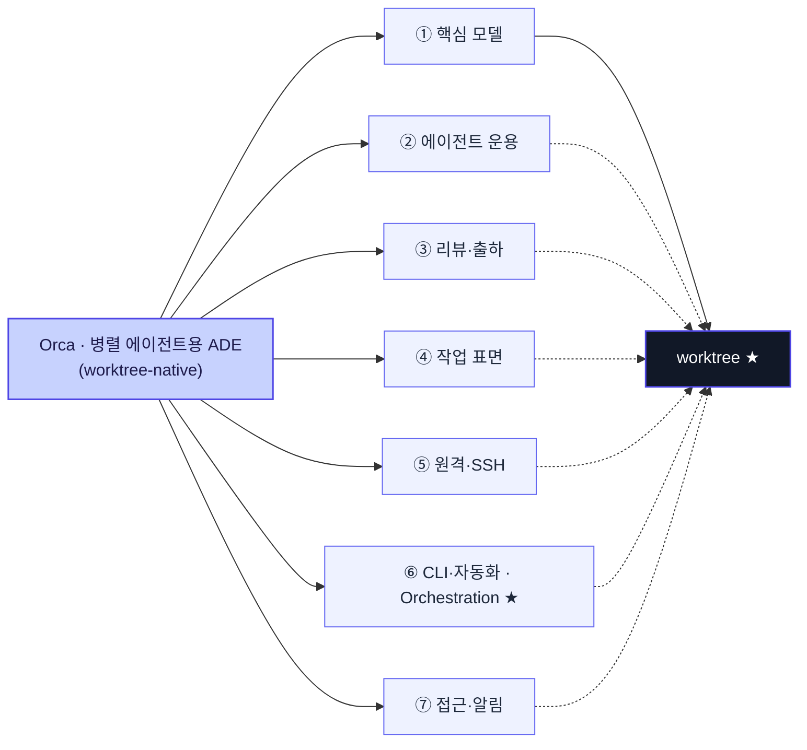

> 한 줄 명제: Orca는 ==여러 AI 코딩 에이전트(Claude Code·Codex·Cursor CLI·GLM 등)를 각자 격리된 git worktree에서 동시에 돌리는 데스크톱 "ADE(Agent Development Environment)"==로, 브랜치 저글링 없이 병렬 에이전트를 안전하게 굴리고 그 결과를 진지하게 리뷰·출하하는 것을 하나의 앱으로 묶는다.

## 큰 그림 — 요약 지도

Orca 문서(`/docs`)의 사이드바 구조를 상위 레이어 순으로 압축한 지도다. **worktree가 뿌리**이고, 나머지 레이어는 전부 "한 worktree 안에서 무엇을 하느냐"의 확장이다.

- **실선 `-->`** = Orca의 레이어 분해(포함).
- **점선 `-.->`** = worktree 귀속(scope) — ②~⑦ 레이어는 모두 "하나의 worktree 안에서" 동작한다(원본 ASCII의 "모든 레이어가 하나의 worktree에 귀속" 밴드).
- **★** = 가장 하중받는 뿌리 개념: `worktree`(①), `Orchestration`(⑥).
- 각 레이어의 **세부 기능은 아래 §레이어별 요약**에 있다 — 지도는 뼈대만 담는다.

## 레이어별 요약 (상위 → 하위)

### ⓪ 뿌리 정체성 — ADE
- **(사실)** Orca 스스로의 정의는 "여러 AI 코딩 에이전트를 나란히 돌리는 데스크톱 IDE"이자 **ADE(Agent Development Environment)** — "당신과 당신의 에이전트를 위해 만들어진, worktree·터미널·브라우저·CLI를 한 앱에 담은 환경"이다.
- **(사실)** 무료·오픈소스, macOS·Windows·Linux 크로스플랫폼, 데스크톱/모바일/VPS로 실행. 제작사는 stablyai(GitHub `stablyai/orca`).
- **(분석)** 포지셔닝의 핵심은 "IDE"가 아니라 "**에이전트 함대(fleet)를 위한 작업 환경**"이라는 점 — 사람이 코드를 치는 곳이 아니라, 여러 에이전트가 병렬로 일하고 사람은 조율·리뷰하는 곳으로 프레이밍한다.

### ① 핵심 모델 (The Orca Model) — worktree가 뿌리
Orca의 모든 기능이 여기서 파생한다. 문서가 스스로를 "**worktree-native**"라 부른다.

- **(사실) Worktree** — 작업(태스크)마다 `git worktree`로 **레포의 독립 on-disk 사본**을 하나씩 준다. 각 worktree는 자체 브랜치·디렉토리·에이전트 터미널·에디터 탭·브라우저 탭·터미널 pane을 가진다. → "병렬 에이전트가 서로의 파일을 밟지 않게" 만드는 안전장치. 실제 표준 git worktree라 일반 git 명령과 호환되고, 생성은 백그라운드로 돈다. 각 레포는 `base ref`(보통 `origin/main`), 각 worktree는 분기 시작점인 `start-from ref`를 가진다.
- **(사실) Tabs · panes · split layouts** — 하나의 worktree "안에서" 에디터/터미널/diff/브라우저를 분할 배치. 태스크 모양에 맞춰 pane을 짠다.
- **(사실) Agents & sessions** — worktree의 격리 환경 안에서 도는 AI 도구(agent)와 그 런타임 컨텍스트(session).
- **(사실) Session restore / Quick Open & Jump Palette** — 세션 복원, 그리고 다수 worktree 사이를 빠르게 오가는 팔레트.
- **(분석)** 관계 요약: `worktree(태스크 컨테이너) ⊃ tab/pane(그 안의 분할) · agent(그 안에서 도는 도구) · session(agent의 런타임)`. **"태스크 1개 = worktree 1개"**가 멘탈 모델의 축.

### ② 에이전트 운용 (Working with Agents)
- **(사실)** 지원 에이전트: **Claude Code, Codex, Cursor CLI, GLM-5.2(Orca ADE), OpenCode, Grok** 등 — "아무 에이전트 CLI나" 자신의 기존 구독을 꽂아 나란히 실행.
- **(사실)** 운용 기능: **커스텀 CLI 에이전트** 등록, **Codex 계정 hot-swap**, **세션 히스토리**, **에이전트 hibernation(휴면)**, **사용량·rate-limit 추적**, **hooks & memory**.
- **(분석)** "자기 구독을 그대로 꽂는다(BYO subscription)"가 상업적 차별점 — Orca가 모델을 재판매하지 않고 실행 환경만 판다.

### ③ 리뷰 · 출하 (Reviewing & Shipping Code)
- **(사실)** **Diff viewer**, **Annotate AI Diff**(AI가 만든 diff에 주석), **Attribution**(누가/무엇이 만들었는지 귀속), **Commit & Push**(Orca 안에서 바로), **GitHub 호스티드 리뷰·이슈·Actions**, **Linear items drawer**, **Jira items drawer**.
- **(분석)** 이 레이어가 "그냥 에이전트 러너"와 Orca를 가르는 지점 — 병렬로 쏟아진 AI diff를 **사람이 진지하게 리뷰한 뒤 출하**하는 워크플로를 1급으로 둔다.

### ④ 작업 표면 — 편집 · 브라우저 · 터미널
- **(사실) 편집**: Monaco 에디터 + autosave, 리치 마크다운 에디터, Mermaid·PDF·이미지 뷰어, 파일 탐색기(외부 drag-drop 지원).
- **(사실) 브라우저 & Design Mode**: **worktree별 브라우저 탭**으로 실행 중인 앱을 그 자리에서 테스트, **Design Mode**로 UI 디버깅, 브라우저 프로필 관리.
- **(사실) 터미널**: 에이전트와 별개의 일반 터미널.
- **(분석)** "앱 사이를 튀지 않게(without bouncing between apps)" 편집·미리보기·브라우저·터미널을 worktree 안으로 끌어들인 것.

### ⑤ 원격 & SSH (Remote & SSH)
- **(사실)** 실행 방식(ways to run): 로컬 데스크톱 / **SSH worktree** / **원격 Orca 서버(self-host)** / 온디맨드 VM.
- **(분석)** worktree 추상이 로컬 디스크에 묶이지 않고 원격 머신으로 확장된다 — "무거운 빌드/격리는 원격, 조율은 로컬" 구도.

### ⑥ CLI & 자동화 (Orca CLI & Skills) — 오케스트레이션이 하중점
- **(사실)** CLI overview·reference, **Orchestration**, **Scheduled automations**, **Computer use**, **Worktree checkpoints**, **Skills registry & MCP**.
- **(사실) Orchestration**은 터미널 간 **메시지 기반 조율** 시스템:
  - **Messages** — `status·dispatch·worker_done·escalation·decision_gate·heartbeat` 타입을 갖는 터미널↔터미널 영속 노트.
  - **Tasks** — spec·의존성·상태(pending/ready/dispatched/completed/failed/blocked)를 가진 작업 항목.
  - **Dispatch / Decision Gates** — 태스크를 특정 터미널에 배정(재시도 가능), 코디네이터가 소유하는 질문이 진행을 막는 게이트.
  - 주요 명령: `orca orchestration task-create / dispatch --inject / task-list --json`, `send`/`check`(점대점), `ask`(블로킹 질문), **`orca orchestration run --max-concurrent`**(코디네이터 루프를 Orca가 돌려 가용 에이전트에 작업 분배). `@all·@idle·@codex` 같은 그룹 메시징.
- **(분석)** ①의 worktree 격리가 "병렬을 안전하게" 만든다면, ⑥의 orchestration은 "병렬을 **coordinator↔worker 프로토콜로 지휘**"하는 층 — 사람이 아니라 스크립트/코디네이터가 함대를 몬다.

### ⑦ 접근 · 알림 (Mobile / Notifications)
- **(사실)** **모바일 컴패니언** — 라이브 에이전트 상태·사용량 확인, 계정 전환, 자리를 비운 사이 터미널 작업 유지.
- **(사실)** **Notifications & Inbox**, **Agents feed(activity)** — 에이전트 활동 피드와 알림.

### (참고) Recipes · Settings
- **(사실)** Recipes: "같은 태스크로 에이전트 3개 경주 시키기", "AI diff 줄단위 리뷰", "worktree 10개 사이 점프", "Design Mode로 UI 버그 고치기", "SSH 원격에서 작업". Settings/Privacy·Telemetry/Troubleshooting/GitHub 에러.

## 판단 / 시사점
- **(분석)** 기능을 하나로 꿰는 축은 **worktree**다. "격리(①)→에이전트(②)→리뷰(③)→작업 표면(④)→원격(⑤)→오케스트레이션(⑥)"이 전부 같은 worktree 단위에 얹힌다. 이 노트도 그 순서로 읽으면 전체가 한 번에 잡힌다.
- **(분석)** 다른 에이전트 러너와의 진짜 차별점 후보는 두 개 — ③ **리뷰·출하를 1급으로** 둔 것, ⑥ **coordinator↔worker 메시지 프로토콜(orchestration)**. 단순 "여러 터미널 띄우기"를 넘어 병렬 함대를 지휘하는 층이 있다는 점.
- **(분석)** BYO 구독 + 오픈소스 모델이라 "실행 환경(shell)"을 팔지 "모델(substrate)"을 팔지 않는다. → 나중에 shell-substrate/해자 관점으로 따로 볼 가치가 있는 후보.

## 확인 질문 (승격 전 검증용)
- **Q1** 이 캡처의 하위 페이지 상당수는 **사이드바 라벨 기준**이라 세부 동작은 미확인이다. 노트로 승격한다면 어느 레이어(예: orchestration, Design Mode)를 실제 페이지까지 파고들 것인가?
- **Q2** "요약 지도"의 목적이 (a) 내가 도구를 쓰기 위한 사용 지도인지, (b) 제품 설계/해자를 분석하기 위한 구조 지도인지 — 방향에 따라 심화 축이 달라진다.
- **Q3** Orca를 실제로 설치해 3-agent 세션까지 돌려보고 검증할 계획이 있는가? (있다면 recipes의 "3 에이전트 경주"가 첫 실습 후보.)

## 레퍼런스
- What is Orca? — https://www.onorca.dev/docs · (1차) · ADE 정의·주요 기능·전체 문서 내비게이션 트리. 확인: 2026-07-24.
- The Orca Model — Worktrees — https://www.onorca.dev/docs/model/worktrees · (1차) · worktree-native 격리 메커니즘(파일/에이전트/안전), base ref·start-from ref, tab/pane/agent/session 관계. 확인: 2026-07-24.
- Orca CLI — Orchestration — https://www.onorca.dev/docs/cli/orchestration · (1차) · 메시지/태스크/dispatch/decision-gate 모델, `orca orchestration run --max-concurrent` 등 명령. 확인: 2026-07-24.
- Orca 랜딩 — https://www.onorca.dev/ · (1차) · "가장 강력한 ADE" 포지셔닝, 지원 에이전트·오픈소스·크로스플랫폼. 확인: 2026-07-24.
- stablyai/orca (GitHub) — https://github.com/stablyai/orca · (1차) · 제작 주체·오픈소스 여부·"fleet of parallel agents" 설명. 확인: 2026-07-24.
- (미확인) `/docs/model/*`, `/docs/agents/*`, `/docs/review/*` 등 하위 페이지 다수는 `/docs` 사이드바 라벨만 취했고 개별 페이지는 미열람 — 세부 동작은 승격 시 재확인 필요. 확인: 2026-07-24.
