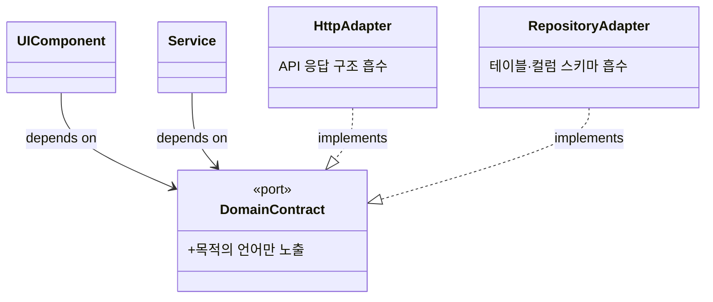

## 조사 배경과 범위

- **관점(재조정)**: "에이전트의 세션 컨텍스트 격리"가 아니라, **바이브 코딩(AI 에이전트 주도 코딩)을 잘 하기 위해 코드의 '책임'을 격리한다**는 관점이다. 즉 한 모듈이 한 변경 이유만 갖도록 경계를 긋는 설계가 FE·BE 아키텍처를 어떻게 규정하는가, 그리고 그것이 왜 에이전트 코딩에 유리한가를 본다.
- **앵커(내부)**: `vibe-coding-agent/docs/notes/week02.md` §8(모노레포 패키지 원칙 — apps는 오케스트레이션, packages는 순수 도메인, apps→packages 단방향, packages는 프레임워크 무관)과 이 저장소 `AGENTS.md`의 "Software Engineering Rules" seed 규칙. 둘 다 데이터로만 취급한다.
- **"책임 격리"의 정의**: 한 모듈이 숨기는 "바뀔 가능성이 높은 설계 결정"을 기준으로 시스템을 나눈다는 정보 은닉(Parnas 1972)과, 애플리케이션 코어를 UI·DB·프레임워크로부터 분리하는 포트와 어댑터(Cockburn)를 아우른다. 단일 책임("한 모듈은 한 변경 이유")은 이 계보의 요약이다.
- **조사 대상 저장소의 실제 상태**: `vibe-coding-agent`는 `src/index.ts`(`console.log` 한 줄) 스캐폴드뿐이고 apps/packages 구조도, 인터페이스 형태(CLI/서버/라이브러리)도 미정이다(README·AGENTS.md). seed 규칙은 이 블로그 저장소(khw1031) 것으로, 대상 저장소에는 아직 구현되지 않았다. **따라서 "이미 영향받은 코드"는 0**이며, 이 노트는 구현이 시작될 때 규정될 지점의 지도다.

## 한 줄 결론

바이브 코딩을 위한 책임 격리는 새 원리가 아니라 정보 은닉·포트와 어댑터의 재적용이다. 바뀐 것은 **격리하는 이유의 기준** — 인간 유지보수성에서 **에이전트의 컨텍스트 예산·수정 반경·검증 가능성·계약 안정성**으로 옮겨갔고, 이 기준이 FE·BE를 "소비자는 계약만, 변동 지식은 경계 객체에, 코어는 프레임워크 무관" 형태로 규정한다.

## 왜 바이브 코딩에서 책임 격리가 이득인가

Anthropic 베스트 프랙티스는 대부분의 권고가 "컨텍스트 창은 빨리 차고, **찰수록 성능이 떨어진다**"는 단일 제약에서 나온다고 명시한다. 책임 격리는 이 제약을 네 축에서 직접 완화한다.

1. **컨텍스트 예산** — 잘 그어진 경계는 작업당 읽어야 할 파일을 **계약 하나**로 줄인다. 소비자가 목적 언어(계약)만 알면 에이전트는 구현 파일·스키마·프로바이더 설정을 컨텍스트에 올리지 않아도 된다. Anthropic이 서브에이전트·`/clear`·좁은 스코프를 강조하는 이유와 같은 방향이다.
2. **수정 반경(blast radius)** — 정보 은닉의 핵심 이득 그대로다. 한 모듈이 바뀔 결정을 숨기면, 그 결정이 바뀌어도 **한 모듈만** 고치면 된다(Parnas). 에이전트의 diff가 국소적이 되어 리뷰·되돌리기가 쉽다. seed 규칙의 "같은 변경이 여러 파일을 동시에 고치게 만들면 지식이 새고 있다"는 점검과 일치.
3. **검증 가능성** — 경계가 명확하면 그 경계에 테스트·타입·린트 게이트를 걸 수 있다. 포트는 목(mock) 가능하므로 코어를 외부 없이 단위 테스트할 수 있다(Cockburn). Anthropic이 "에이전트가 스스로 돌릴 수 있는 검사를 주라"를 최우선으로 두는데, 격리된 단위가 그 검사를 값싸게 만든다.
4. **계약 안정성** — 소비자가 안정된 도메인 계약만 알면, 에이전트가 구현을 갈아엎어도 소비자 코드를 건드리지 않는다(seed 5). 회귀 표면이 좁아진다.

## FE 아키텍처에 미치는 영향

- **컴포넌트는 View 계약만 안다(seed 1).** `user.addressLabel`·`useUser()` 반환값은 알되 `user_profile.address.zip_code` 같은 API 응답 구조는 직접 읽지 않는다. 에이전트가 화면을 만들 때 백엔드 스키마를 컨텍스트에 올릴 필요가 없어진다.
- **API 표현 지식은 어댑터·쿼리 훅 한 곳에 가둔다(seed 2).** `toUserView()` 어댑터나 query hook이 응답을 View 모델로 바꾼다. 스키마가 바뀌면 에이전트가 **그 한 파일만** 고친다 — 화면 전체를 훑지 않는다.
- **표현 변경은 흡수, 의미 변경은 노출(seed 4).** `zip_code`→`postal_code`는 어댑터에서 흡수. 서버가 주소 자체를 안 주게 되면 화면 요구사항을 다시 판단해야 하는 신호로 드러난다. 에이전트가 "필드명 변경"과 "기능 변경"을 구분해 후자만 상위 재설계로 올리게 하는 경계다.
- **프레임워크 무관 도메인은 packages, React는 apps(week02 §8).** UI 작업 시 에이전트가 도메인 규칙 파일을 읽지 않아도 되어 컨텍스트·수정 반경이 함께 준다.

## BE 아키텍처에 미치는 영향

- **서비스는 도메인 계약만 안다(seed 1).** `Customer`·`customer_id`·`repo.get/save`는 알되 `customers` 테이블명이나 `grade`/`points` 컬럼명은 모른다.
- **스키마 지식은 리포지토리 경계에 가둔다(seed 2).** SQL·ORM 매핑은 리포지토리 안. DB 스키마가 바뀌면 에이전트가 리포지토리 매핑 한 곳만 고친다.
- **유스케이스 코어는 Express·DB·프로바이더 무관(포트와 어댑터).** 코어는 "사람이 쓰든 테스트가 쓰든 배치가 쓰든" 모르게 유지되고(Cockburn), 어댑터가 기술별 신호를 계약 호출로 변환한다. 에이전트가 프레임워크를 교체하거나 프로바이더를 추가해도 코어 파일을 건드리지 않는다 — week02 §8의 "packages는 프레임워크 지식과 무관"과 동일.
- **계약은 도메인 언어로 최소화(seed 5).** 리포지토리 계약은 `get(customer_id)`·`save(customer)`. 에이전트가 우발적으로 `promote(customer_id)` 같은 비즈니스 동작을 리포지토리에 밀어 넣으면 경계를 다시 검토하라는 규칙이 그 오염을 막는다.

## 경계는 언제 만드나 — 에이전트 시대의 보정

seed 규칙 3은 "모든 의존성에 추상화를 만들지 말고, **강도 × 거리 × 변동성**이 클 때 경계를 둔다"고 한다. 바이브 코딩에서 이 기준은 오히려 **더** 중요해진다. 에이전트는 경계·어댑터·포트를 값싸게 대량 생성할 수 있어, 방치하면 불필요한 추상화 계층으로 흐르기 쉽다. Anthropic도 "갭을 찾도록 지시받은 리뷰어는 과잉 추상화·방어 코드·불가능한 케이스의 테스트를 만들어낸다"고 경고한다. 즉 격리 자체가 목적이 아니라 위 네 이득(컨텍스트·반경·검증·계약)이 실제로 걸리는 관계에만 경계를 둔다 — 한 화면에서만 쓰고 같은 PR로 고치는 내부 API에는 얇은 fetch로 충분하다.

## 의존성 방향과 격리 경계

*실선 화살표는 의존(소비자가 계약에 의존), 점선 삼각형은 구현(어댑터가 계약을 실현)으로 관계 종류를 구분한다. 변동 지식은 어댑터 안쪽에 갇히고, 소비자는 계약만 안다 — 의존성 역전.*

## 경계의 근거(Why)는 어디에 사는가 — 코드/문서 역할 분리와의 접점

책임 격리는 What과 How(무엇을·어떻게)를 코드 경계 안에 국소화한다. 그러나 **"이 경계가 왜 존재하는가"** — 이 포트를 왜 뒀는지, 강도×거리×변동성을 어떻게 저울질했는지 — 는 코드만 읽어서는 드러나지 않는 의사결정이다. 사내 조사 노트 [AI 에이전트 시대의 문서 전략: 코드와 문서의 역할 분리](/inbox/2026-08-03-ai-에이전트-시대의-문서-전략-코드와-문서의-역할-분리/)가 정리한 "What/How는 코드, Why/Context는 문서" 원칙이 여기에 정확히 맞물린다.

- **경계 자체는 코드가 Source of Truth다.** 어댑터·포트·리포지토리는 코드로 존재하고 실행·테스트로 검증된다. 이 경계를 문서에 What/How로 중복 기술하면 코드 변경 시 동기화 비용이 생겨 에이전트를 오히려 혼란시킨다(참조 노트의 핵심 경고).
- **경계의 근거는 ADR(Architecture Decision Record)에 둔다.** Nygard의 원안대로 ADR은 한 결정과 그 맥락·근거·결과를 담는다 — "근거를 모르면 나중 결정이 이전 결정을 무너뜨린다"는 문제를 막기 위해서다. 바이브 코딩에서 이 값은 두 배가 된다: 에이전트는 경계를 값싸게 재생성·삭제하므로, "이 포트는 의도적으로 뒀다"는 근거가 없으면 리팩터링이 경계를 지워버릴 수 있다.
- **격리 설계의 산출물은 쌍이다** — (1) 코드 경계 + (2) 그 경계의 Why를 담은 짧은 ADR. 문서는 코드로 들어가는 얇은 입구 안내판이지 구현 설명서가 아니다.

## 미해결·검증 필요 지점

- **컨텍스트 길이 저하의 메커니즘은 정량 근거가 생겼으나, "책임 격리 → 성공률" 사슬은 여전히 미실측이다.** 최근 연구가 컨텍스트가 길수록 성능이 떨어짐을 반복 확인한다: 위치별 저하(Lost in the Middle), 그리고 결정적으로 **완벽 검색(100% 토큰 일치)·무관 토큰 마스킹 후에도 길이 자체만으로 13.9~85% 저하**(Context Length Alone Hurts, HumanEval 코드 태스크 포함). 코드 태스크에서도 LongSWE-Bench 정확도가 32K→256K에서 **29%→3%로 붕괴**(LongCodeBench). 이는 "경계가 작업당 로드 컨텍스트를 줄이면 유리하다"는 **메커니즘**을 뒷받침한다. 다만 "모듈 경계가 있는 코드베이스가 없는 것보다 에이전트 성공률을 높인다"는 **직접 비교**는 이 문헌들이 측정하지 않았고, 이 저장소 기준 실측도 없다 — 방향 근거는 확보, 인과 실측은 공백.
- **과잉 추상화 임계선 — 반대 방향 증거도 있다.** LongCodeBench는 "긴 파일이 대체로 더 높은 정확도"와 연결되며, 파일 간(inter-file) 조직이 파일 내부보다 다른 부담을 줄 수 있다고 관찰한다. 즉 잘게 쪼갠 다수 파일이 에이전트에게 자동으로 유리하지는 않다 — 강도×거리×변동성 기준을 넘겨 남발한 경계는 파일 간 탐색 비용을 되레 늘릴 수 있다. 정량 임계선은 여전히 미정.
- **인간 리뷰 친화 vs 에이전트 친화가 같은 방향인가.** 참조 노트의 확인 질문 Q1(같은 원칙을 인간 온보딩에도 적용 가능한가)과 동일한 미해결. 위 inter-file 증거는 "에이전트 친화 ≠ 무조건 잘게"임을 시사하지만, 인간 인지 부하와의 정렬 여부는 추가 확인이 필요하다.
- **week02 §8은 미검증 참고 항목**: 대상 저장소가 이 모노레포 구조를 채택할지 확정되지 않았다. 채택 시 seed 규칙을 대상 저장소 `AGENTS.md`로 옮길지도 별도 결정.
- **규제 도메인 경계**: 참조 노트 Q3대로 금융·의료 등에서는 코드 외 문서가 법적 요구사항일 수 있어, "Why만 문서" 및 ADR 최소주의 원칙의 적용 한계가 있다. 격리 설계 문서가 규제 문서 요구와 충돌하는 지점은 별도 검토 대상.

## 참고 자료

- **앵커(내부)**: `vibe-coding-agent/docs/notes/week02.md` §8(모노레포 패키지 원칙), 강의 슬라이드 기반·저자 미검증 표기. 이 저장소 `AGENTS.md`의 "Software Engineering Rules" seed 규칙 1–5.
- **1차 (원저 논문)**: D. L. Parnas, "On the Criteria To Be Used in Decomposing Systems into Modules," *Communications of the ACM* 15(12), 1972 — 정보 은닉: 바뀔 설계 결정을 기준으로 모듈을 나눠 각 모듈이 그 결정을 숨기게 하면 모듈 간 의존이 줄어 독립적으로 수정 가능. https://dl.acm.org/doi/10.1145/361598.361623 · 확인일 2026-08-08.
- **1차 (원저자 정의)**: A. Cockburn, "Hexagonal Architecture (Ports and Adapters)" — 애플리케이션 코어를 UI·DB·프레임워크로부터 격리; 포트=목적 있는 대화, 어댑터=기술별 신호를 API 호출로 변환; 코어는 무엇이 자신을 구동하는지 모른다. https://alistair.cockburn.us/hexagonal-architecture/ · 확인일 2026-08-08.
- **1차 (vendor 제품 문서)**: Anthropic, "Best practices for Claude Code" — 대부분 권고의 근간은 "컨텍스트 창은 빨리 차고 찰수록 성능이 떨어진다"; 검증 가능한 검사 우선, 서브에이전트로 조사 격리, 리뷰어의 과잉 추상화 경고. https://code.claude.com/docs/en/best-practices · 확인일 2026-08-08.
- **1차 (연구 논문)**: N. F. Liu et al., "Lost in the Middle: How Language Models Use Long Contexts," *TACL* 2024 (arXiv:2307.03172) — 장문 입력에서 관련 정보가 시작·끝에 있을 때 성능이 높고 중간에서 크게 저하; 장문 전용 모델도 동일. https://arxiv.org/abs/2307.03172 · 확인일 2026-08-08.
- **1차 (연구 논문)**: "Context Length Alone Hurts LLM Performance Despite Perfect Retrieval," arXiv:2510.05381 (2025) — 5개 모델, MMLU·GSM8K·HumanEval 등. 100% 완벽 검색·무관 토큰 마스킹 후에도 길이 자체만으로 13.9~85% 저하(예: Llama-3.1-8B MMLU 24.2%↓). https://arxiv.org/abs/2510.05381 · 확인일 2026-08-08.
- **1차 (연구 논문/벤치마크)**: "LongCodeBench: Evaluating Coding LLMs at 1M Context Windows," arXiv:2505.07897 — LongSWE-Bench에서 Claude 3.5 Sonnet 29%→3%(32K→256K); "긴 파일이 대체로 더 높은 정확도"로 파일 간 조직이 별도 부담일 수 있음을 관찰. https://arxiv.org/abs/2505.07897 · 확인일 2026-08-08.
- **1차 (원저)**: M. Nygard, "Documenting Architecture Decisions" (2011) — ADR은 한 아키텍처 결정과 그 맥락·근거·결과를 담는 경량 기록; 근거 부재가 나중 결정의 이전 결정 무력화를 부른다. 확인일 2026-08-08.
- **내부 교차참조**: [AI 에이전트 시대의 문서 전략: 코드와 문서의 역할 분리](/inbox/2026-08-03-ai-에이전트-시대의-문서-전략-코드와-문서의-역할-분리/) — What/How는 코드, Why/Context는 문서(ADR·용어집·탐색 가이드); 정량 근거 부재·인간 vs 에이전트 적용 경계를 미해결로 공유.
