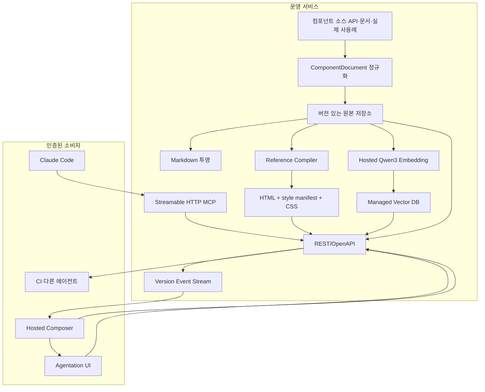

> 프로젝트 명제: ==컴포넌트의 목적·사용 시나리오·API·호환성·검증된 사용례를 원격의 편집 가능한 하나의 원본으로 관리하고, Claude Code가 API로 문서와 HTML·스타일 참조 구현을 조회하게 하면 특정 클라이언트 기술에 종속되지 않고 근거를 바탕으로 UI를 조합할 수 있다.==

## 1. 프로젝트 한눈에 보기

사용자는 “결제 실패 원인을 설명하고 다시 시도할 수 있게 해줘”처럼 UI의 목적을 입력한다. 시스템은 단어가 비슷한 컴포넌트만 찾지 않고 다음 질문에 차례로 답한다.

1. 이 의도와 사용 시나리오에 적절한 컴포넌트는 무엇인가?
2. 현재 디자인 시스템에 실제로 존재하는 정확한 컴포넌트와 API는 무엇인가?
3. 서로 호환되는 컴포넌트 조합인가?
4. 실제 프로젝트에서 사용한 조합이 있는가?
5. 같은 목적을 다른 성격으로 해결하는 대안 조합은 무엇인가?

사용자는 두 경로로 시스템을 이용한다. 디자이너는 호스팅된 Composer에서 참조 구현을 렌더링하고 Agentation으로 화면의 특정 조각에 수정 지시를 남긴다. Claude Code는 원격 Streamable HTTP MCP와 문서 API를 통해 같은 문서와 참조 구현을 검색하고, 사용자의 React·Vue·iOS 프로젝트 방식에 맞게 구현한다.

결과의 공통 근거는 특정 프레임워크 컴포넌트가 아니라 **의미 구조를 보여 주는 HTML과 플랫폼 중립 스타일 정보**다. HTML은 계층과 상태를 설명하고, 스타일 정보는 token, layout, typography, appearance를 표현한다. 각 클라이언트는 이 결정을 자기 구현 방식으로 번역한다.

```text
의도 입력
→ 관련 컴포넌트와 사용례 검색
→ 정확한 카탈로그·API 확인
→ 호환되지 않는 후보 제거
→ 기존 검증 조합을 Base로 선택
→ 성격이 다른 대안 조합 생성
→ HTML + 스타일 참조 구현 조회
→ React·Vue·iOS 구현 방식으로 번역
→ 호스팅 Composer에서 주석·API 갱신·다시 조회
```

## 2. 해결할 문제

일반 LLM은 사내 디자인 시스템의 최신 컴포넌트, prop, 조합 규칙과 프로젝트 사용례를 학습하지 못했다. 이름이 그럴듯한 컴포넌트나 존재하지 않는 prop을 생성할 수 있고, 개별 컴포넌트가 존재하더라도 함께 사용 가능한지는 보장하지 못한다.

기존 문서도 검색과 생성에 바로 쓰기 어렵다.

- 코드와 API에는 “어떻게 호출하는가”가 있지만 “왜·언제 사용하는가”가 부족하다.
- 자연어 가이드에는 목적이 있지만 실제 존재하는 API와 버전이 보장되지 않는다.
- 실제 프로젝트에는 좋은 조합이 있지만 재사용 가능한 근거로 정리되지 않는다.
- 문서 전체를 문자열 하나로 임베딩하면 일부 내용 수정에도 전체를 다시 처리해야 하고, 검색 결과가 어느 근거와 일치했는지 설명하기 어렵다.
- React 예제만 제공하면 Vue와 iOS 소비자는 같은 디자인 결정을 다시 추론해야 한다.
- 원격 문서가 사람이 보는 페이지로만 제공되면 Claude Code가 검색 결과와 참조 구현을 안정적으로 가져올 계약이 없다.

이 프로젝트는 LLM의 기억을 개선하려는 것이 아니라, 정확성을 검색·검증·렌더링 계층으로 옮긴다.

## 3. 목표와 비목표

### 목표

- 자연어 의도에서 적절한 컴포넌트 후보를 찾는다.
- API·CLI·파일 분석으로 실제 존재하는 컴포넌트와 prop을 확인한다.
- 호환성 규칙과 실제 프로젝트 사용례를 근거로 조합을 평가한다.
- 기존 검증 조합이 있으면 이를 Base로 먼저 제안한다.
- Base와 다른 장단점을 가진 대안 조합을 여러 개 제안한다.
- ComponentDocument와 참조 구현을 원격 서버에서 버전 있는 API로 제공한다.
- Claude Code가 검색·문서 조회·참조 구현 조회·조합 검증 API를 사용할 수 있게 한다.
- HTML과 플랫폼 중립 스타일 정보로 구성된 공통 참조 구현을 제공한다.
- React·Vue·iOS가 동일한 참조 구현을 각자의 코드와 컴포넌트로 번역할 수 있게 한다.
- 호스팅된 Composer에서 참조 구현을 렌더링하고 Agentation으로 조각을 지목한다.
- Claude Code가 원격 Streamable HTTP MCP에 인증해 검색·조회·변경 도구를 사용하게 한다.
- Claude Code가 Agentation 주석을 해석해 원격 draft API를 갱신하면 Composer가 다시 조회한다.
- 문서와 규칙, 생성 결과를 조각별로 편집하고 부분 재생성한다.
- 변경된 문서 블록만 증분 임베딩한다.
- 호스팅 모델과 관리형 저장소를 운영 기본값으로 삼고 개발 대체 구현과 계약을 공유한다.

### 비목표

- Figma 및 Figma 플러그인 연동
- 자유 벡터 드로잉 도구
- 검증되지 않은 LLM 생성 HTML·CSS·JavaScript의 직접 실행
- 디자인 시스템에 없는 새 컴포넌트의 자동 발명
- React·Vue·SwiftUI 같은 플랫폼별 구현 코드를 공통 원본으로 채택
- 하나의 참조 구현이 플랫폼별 네이티브 동작까지 자동으로 동일하게 보장한다고 가정
- 첫 버전부터 완전한 디자인 시스템 문서 관리 SaaS 제공
- 임베딩 유사도만으로 API 호환성과 접근성을 판정

## 4. 사용자 경험

웹 기반 Composer는 인증된 사용자가 접속하는 호스팅 애플리케이션으로 실행한다. 원격 서버는 게시 문서와 draft, 참조 구현, annotation, 검색·변경·검증 API를 제공하고 Composer는 이를 조회해 편집 화면을 만든다.

```text
┌──────────────────────┬──────────────────────────┐
│ ComponentDocument    │ HTML 참조 구현 미리 보기│
│                      │                          │
│ 목적                 │ [Alert]                  │
│ 사용 시나리오        │ 결제를 완료하지 못했습니다│
│ 피해야 하는 상황     │                          │
│ 조합·접근성 규칙     │ [취소] [다시 시도]       │
│ 검증된 사용례        │                          │
├──────────────────────┴──────────────────────────┤
│ Agentation 주석·적용 규칙·생성 근거·경고        │
└─────────────────────────────────────────────────┘
```

사용자는 다음 작업을 할 수 있어야 한다.

- 프롬프트를 수정하고 전체 대안을 다시 생성한다.
- 문서의 목적·사용 시나리오·조합 규칙을 각각 편집한다.
- 렌더링된 참조 구현의 node를 Agentation으로 선택하고 수정 이유를 남긴다.
- “버튼 영역만 대안으로 변경”처럼 특정 조각만 다시 생성한다.
- AI가 적용한 규칙, 검색한 사용례, 제외한 후보와 이유를 확인한다.
- 결과를 검증된 사용례로 저장하거나 재사용 가능한 규칙 초안으로 승격한다.
- 초안은 자유롭게 바꾸고 게시 시점에만 검색 인덱스를 갱신한다.

편집 루프는 다음과 같다.

```text
호스팅 Composer가 원격 draft + 참조 구현 조회
→ 디자이너가 Agentation으로 node를 지목하고 주석 작성
→ Agentation callback이 인증된 annotation API로 주석 저장
→ 원격 MCP가 Claude Code에 pending annotation 제공
→ Claude Code가 현재 문서와 참조 구현을 원격 API에서 재조회
→ 변경안을 원격 draft API에 PATCH
→ 원격 서버가 버전·schema·규칙 검증 후 새 draft version 반환
→ Composer가 version event를 받고 refetch·재렌더링
```

Agentation은 화면의 selector, 위치와 문맥을 전달하는 피드백 UI다. ComponentDocument를 직접 수정하는 저장소로 사용하지 않는다. 공식 React package는 `onAnnotationAdd`, `onSubmit`, `endpoint`, `webhookUrl`을 제공하므로 운영 Composer는 structured annotation을 제품의 인증된 API에 직접 저장할 수 있다. [Agentation package README](https://github.com/benjitaylor/agentation/blob/main/package/README.md)의 callback 계약을 이용하고, 로컬 SQLite·stdio를 기본으로 하는 `agentation-mcp` 서버는 개발 도구와 참조 구현으로만 사용한다.

## 5. 핵심 설계 결정

### 5.1 ComponentDocument의 원본은 구조화 데이터다

Markdown과 HTML 중 하나를 ComponentDocument 원본으로 고르지 않는다. 원격 서버의 구조화된 블록이 편집과 버전 관리의 원본이고, Markdown·임베딩·참조 구현은 목적별 파생물이다. 참조 구현도 문서 버전과 연결된 별도 산출물로 관리한다.

| 표현 | 역할 | 원본 여부 |
| --- | --- | --- |
| 구조화 데이터 | 블록 편집, 버전, 검증, 관계 관리 | 원본 |
| Markdown | 사람의 리뷰, LLM 컨텍스트, 문서 내보내기 | 파생물 |
| 임베딩 벡터 | 의미 검색 | 재생성 가능한 파생물 |
| HTML + 스타일 manifest | 플랫폼 공통의 구조·시각 결정·상태 참조 | 버전 있는 파생물 |
| compiled CSS | Composer가 참조 구현을 렌더링하는 웹용 표현 | 재생성 가능한 파생물 |

`하나의 문서`는 파일이나 벡터 하나가 아니라, 안정적인 `documentId` 아래 여러 블록과 표현이 연결된 논리적 단위다.

```ts
interface ComponentDocument {
  id: string;
  componentId: string;
  version: number;
  status: 'draft' | 'published';
  blocks: ComponentBlock[];
}

interface ComponentBlock {
  id: string;
  type:
    | 'identity'
    | 'purpose'
    | 'use_cases'
    | 'avoid_when'
    | 'props'
    | 'compatibility'
    | 'accessibility'
    | 'prompt_rules'
    | 'verified_usages';
  order: number;
  content: unknown;
  contentHash: string;
  version: number;
}
```

`id`와 `order`를 분리한다. 문서 중간에 새 블록을 넣거나 순서를 바꿔도 기존 블록의 정체성과 임베딩은 유지된다.

### 5.2 의미 검색과 정확한 판정을 분리한다

임베딩 검색은 “어떤 컴포넌트가 이 의도와 비슷한가?”에 답한다. 실제 존재 여부와 호환성은 구조화된 데이터와 검증기로 판정한다.

후보 판정의 우선순위는 다음과 같다.

1. **호환성·접근성·API 유효성** — 통과하지 못하면 후보에서 제외한다.
2. **실제 조합 사용례** — 같은 목적의 검증된 조합이 있으면 Base로 우선한다.
3. **프로젝트 맥락** — 제품 영역, 플랫폼, 화면 제약에 맞게 순위를 조정한다.
4. **의미 유사도** — 유효한 후보 사이의 검색 순위에 사용한다.

이 순서는 벡터 점수가 높다는 이유로 사용할 수 없는 조합이 선택되는 것을 막는다.

### 5.3 Hard constraint와 Soft prompt rule을 분리한다

Hard constraint는 프로그램이 결정적으로 검사하고 프롬프트로 무시할 수 없게 한다.

- 등록된 컴포넌트와 prop인가?
- 지원되는 버전인가?
- 함께 사용할 수 있는 구조인가?
- 필수 접근성 속성과 상태 전이를 만족하는가?
- 허용된 토큰과 variant만 사용하는가?

Soft prompt rule은 디자이너가 편집하는 선호와 지침이다.

- 주요 행동은 하나를 우선한다.
- 오류 문구는 원인과 복구 행동을 함께 설명한다.
- 좁은 화면에서는 행동을 세로로 배치한다.
- 파괴적 행동은 일반 행동과 시각적으로 구분한다.

규칙 범위는 `디자인 시스템 → 컴포넌트·패턴 → 프로젝트 → 현재 문서·생성 실행` 순으로 구체화한다. Hard constraint와 충돌하는 하위 규칙은 적용하지 않고 이유를 표시한다.

### 5.4 AI는 임의 HTML이 아니라 CompositionPlan을 생성한다

AI가 반환할 수 있는 출력 집합을 등록된 컴포넌트와 prop으로 제한한다.

```ts
interface CompositionPlan {
  id: string;
  layout: {
    type: 'stack' | 'grid' | 'inline';
    direction?: 'horizontal' | 'vertical';
    gap?: string;
  };
  components: PlanNode[];
  evidenceIds: string[];
  ruleIds: string[];
  warnings: string[];
}

interface PlanNode {
  instanceId: string;
  componentId: string;
  props: Record<string, unknown>;
  children?: PlanNode[];
  locked?: boolean;
}
```

서버는 계획을 schema, 컴포넌트 registry, prop 계약, 호환성 규칙으로 검증한다. 검증된 계획만 Reference Compiler가 semantic HTML, 스타일 manifest와 미리 보기용 CSS로 컴파일한다. Composer는 이 산출물을 격리된 iframe에서 보여 주며 임의 script, event handler, 외부 asset URL은 허용하지 않는다.

### 5.5 참조 구현은 HTML과 플랫폼 중립 스타일 정보의 묶음이다

HTML만으로는 iOS에서 같은 결정을 참조할 수 없고, CSS만으로는 native layout·typography·상태로 안정적으로 번역하기 어렵다. 따라서 “HTML + 스타일 정보”를 다음 세 표현의 묶음으로 정의한다.

1. `html` — 요소의 계층, 의미 role, content, 상태와 안정적인 `data-reference-node-id`
2. `styleManifest` — token 참조, layout, typography, appearance, responsive 조건을 플랫폼 중립 JSON으로 표현
3. `compiledCss` — Composer의 웹 미리 보기용으로 manifest에서 생성한 CSS

```ts
interface ReferenceImplementation {
  id: string;
  documentId: string;
  compositionId: string;
  version: number;
  html: string;
  styleManifest: {
    tokenSetVersion: string;
    nodes: Record<string, {
      layout?: {
        axis?: 'horizontal' | 'vertical' | 'overlay';
        gap?: string;
        padding?: string;
        alignment?: string;
      };
      typography?: string;
      appearance?: Record<string, string>;
      states?: Record<string, Record<string, string>>;
    }>;
  };
  compiledCss: string;
  accessibility: AccessibilityReference;
  behavior: BehaviorReference;
  evidenceIds: string[];
}
```

스타일 값은 가능한 한 raw `16px`, `#2563eb`보다 `spacing.300`, `color.action.primary`, `typography.body.medium`처럼 token 참조로 전달한다. 토큰 교환 형식은 도구와 기술 사이 상호 운용을 목적으로 하는 [Design Tokens Format Module 2025.10](https://www.designtokens.org/tr/2025.10/format/)을 기본으로 삼고, layout·상태처럼 표준이 다루지 않는 항목만 versioned extension으로 둔다.

같은 참조 구현을 소비하더라도 출력 코드는 달라진다.

| 소비자 | HTML에서 참조 | 스타일 manifest에서 참조 | 산출물 |
| --- | --- | --- | --- |
| React | 계층·role·상태·node ID | token과 layout 결정 | 프로젝트의 React 컴포넌트와 props |
| Vue | 같은 계층·role·상태 | 같은 token과 layout 결정 | 프로젝트의 Vue 컴포넌트와 props |
| iOS | semantic role과 상태 흐름 | token, stack 방향, 간격, typography | SwiftUI/UIKit 컴포넌트 |

여기서 보장하는 것은 동일한 소스 코드나 완전한 pixel 일치가 아니라 **같은 디자인 결정과 근거를 참조하는 것**이다. 플랫폼별 접근성 API와 interaction 관용구는 각 구현이 별도로 검증한다.

### 5.6 한 가지 답 대신 성격이 다른 조합을 제안한다

출력은 같은 구성을 표현만 바꾼 세 사본이 아니어야 한다. 각 제안은 해결 전략이 달라야 한다.

- **Base** — 동일하거나 가까운 실제 프로젝트 사용례에 근거한 안전한 조합
- **Compact** — 공간과 행동 수를 줄인 간결한 조합
- **Guided** — 설명과 복구 절차를 강화한 조합
- **Alternative** — 다른 패턴으로 같은 목적을 해결하는 조합

각 대안에는 선택 근거, 잃는 것, 사용한 규칙과 실제 사용례를 함께 표시한다.

### 5.7 HTTP API가 정본 인터페이스다

원격 서버는 사람용 문서 페이지와 별개로 JSON·Markdown·참조 구현을 버전 있는 HTTP API로 제공한다. REST/OpenAPI를 도메인 정본으로 두고, 그 위에 원격 Streamable HTTP MCP adapter를 제공한다. Claude Code는 `https://<service>/mcp`에 인증해 접속하며 다른 에이전트와 CI도 같은 HTTP 계약을 재사용한다.

원격 문서 API는 저장 위치와 생명주기의 정본이다.

```text
GET   /v1/components
GET   /v1/components/:componentId
GET   /v1/documents/:documentId?version=published
GET   /v1/documents/:documentId.md?version=published
GET   /v1/references/:referenceId
POST  /v1/compositions/validate
GET   /v1/sync/manifest?since=:cursor

GET   /v1/drafts/:documentId
PATCH /v1/drafts/:documentId/blocks/:blockId
POST  /v1/drafts/:documentId/publish
GET   /v1/events?documentId=:documentId
```

검색 API는 호스팅된 embedding과 vector DB를 사용한다.

```text
POST /v1/retrieve

Hosted Design System API
→ Vercel AI Gateway의 alibaba/qwen3-embedding-0.6b
→ Qdrant Cloud 또는 Neon pgvector
```

조회 API는 기본적으로 게시 버전을 반환한다. 변경 API는 사용자 인증과 권한, `baseVersion` 또는 `If-Match`를 요구하고 충돌하면 덮어쓰지 않고 `409 Conflict`를 반환한다. API 응답에는 `documentVersion`, `referenceVersion`, `contentHash`, `embeddingProfileId`를 포함해 Claude Code가 사용한 근거를 기록할 수 있게 한다.

원격 MCP adapter는 최소한 다음 도구를 노출한다.

```text
design_system_search
design_system_get_component
design_system_get_document
design_system_get_reference
design_system_validate_composition
design_system_list_annotations
design_system_watch_annotations
design_system_patch_draft
design_system_resolve_annotation
```

`design_system_search`는 호스팅된 retrieval API를 호출하고 검색 결과에 원격 문서 ID와 `referenceId`를 함께 반환한다. LLM은 Retrieve 결과의 요약만 보고 구현하지 않고, 선택한 후보의 참조 구현까지 원격 API에서 가져온 뒤 프로젝트 파일·프레임워크·컴포넌트 registry에 맞게 코드를 작성한다.

Claude Code 프로젝트에는 URL과 credential 이름만 둔다.

```json
{
  "mcpServers": {
    "design-system": {
      "type": "http",
      "url": "${DESIGN_SYSTEM_API_URL}/mcp",
      "headers": {
        "Authorization": "Bearer ${DESIGN_SYSTEM_ACCESS_TOKEN}"
      }
    }
  }
}
```

원격 MCP는 사용자 저장소 전체를 받지 않는다. Claude Code가 로컬 파일과 framework 맥락을 읽고, MCP에서 받은 문서·reference와 결합해 구현한다. 검증 API에도 전체 source file 대신 component ID, platform, CompositionPlan과 필요한 contract 정보만 보낸다.

MCP transport는 기존 SSE가 아니라 Streamable HTTP를 사용한다. MCP는 Claude Code의 도구 호출 transport이고, Composer의 화면 갱신 이벤트는 별도의 SSE 또는 WebSocket 채널이다. 두 stream을 하나로 합치지 않는다. Claude Code는 원격 HTTP MCP의 bearer header와 OAuth를 지원한다. [Claude Code MCP 문서](https://code.claude.com/docs/en/mcp)는 원격 연결에 HTTP를 권장하고 기존 SSE transport를 deprecated로 표시한다.

Streamable HTTP 연결만으로 서버가 쉬고 있는 Claude Code 세션을 깨우지는 못한다. 사용자가 watch mode를 시작하면 Claude Code가 `design_system_watch_annotations(cursor, timeout)`을 long-poll하고, bounded batch를 처리한 뒤 다음 cursor로 다시 호출한다. 항상 실행되는 자동 처리가 필요하면 사용자 Claude Code가 아니라 별도의 hosted worker가 annotation queue를 소비해야 한다.

## 6. 전체 흐름



운영 서비스가 문서 원본, 참조 구현, 임베딩과 vector index의 published version을 함께 관리한다. 게시 transaction은 변경 블록 저장, 참조 구현 재생성, 해당 블록 재임베딩이 모두 성공한 뒤 active version을 전환한다. Composer와 Claude Code가 서로 다른 시점의 문서와 참조 구현을 보지 않도록 모든 응답에 version을 포함한다.

### Claude Code 구현 흐름

```text
사용자 구현 요청 + 현재 저장소 맥락
→ design_system_search 또는 POST /v1/retrieve
→ 후보 문서·검증 사용례·referenceId 반환
→ 선택 후보의 ComponentDocument와 ReferenceImplementation 조회
→ HTML 계층 + style manifest + behavior·접근성 근거 해석
→ 현재 프로젝트가 가진 React·Vue·iOS 컴포넌트와 API 확인
→ 프로젝트 방식으로 CompositionPlan과 코드 생성
→ 원격 validate API + 로컬 타입·테스트·렌더링 검증
```

Gemini는 의도 구조화, 대안 조합 계획과 설명을 담당할 수 있다. Qwen3 Embedding은 의미 검색을 담당한다. 정확한 컴포넌트 목록, API와 호환성은 모델이 아니라 카탈로그와 검증기가 담당한다. 참조 구현은 생성 답변에 곁들이는 예제가 아니라 Retrieve 이후 반드시 조회하는 구현 근거다.

## 7. 임베딩 설계

### 7.1 문서 하나에 여러 벡터를 둔다

```text
ComponentDocument: Alert
├── purpose 벡터
├── use_cases 벡터
├── compatibility 벡터
├── verified_usages 벡터
└── 선택 사항: 전체 문서 벡터
```

초기 버전은 블록별 검색 결과를 `documentId`로 묶어 컴포넌트 점수를 계산한다. 전체 문서 벡터는 검색 결과가 지나치게 파편화될 때 추가한다.

### 7.2 문서 중간 수정은 변경된 블록만 다시 임베딩한다

고정 토큰 수로 문서를 자르면 중간 삽입으로 뒤쪽 청크 경계가 모두 밀린다. 이 프로젝트는 제목과 schema가 정의한 의미 블록을 사용한다.

```text
블록 편집
→ 정규화된 임베딩 입력 생성
→ contentHash 비교
→ 변경된 블록만 재임베딩
→ 전체 Markdown 재생성
→ 새 문서 버전 활성화
```

- 내용이 그대로이고 `order`만 바뀌면 재임베딩하지 않는다.
- 새 블록은 새 벡터만 추가한다.
- 블록 분할·병합은 기존 벡터를 비활성화하고 새 블록을 임베딩한다.
- 블록이 길면 안정적인 fragment ID를 가진 하위 조각으로 나눈다.
- 키 입력마다 임베딩하지 않고 `publish` 시점에 갱신한다.
- 새 버전의 모든 벡터 저장이 성공한 뒤 검색의 active version을 전환한다.

### 7.3 EmbeddingProfile을 버전 관리한다

벡터 재현에는 모델 이름만으로 부족하다.

```ts
interface EmbeddingProfile {
  id: 'component-retrieval-qwen3-v1';
  provider: 'vercel-ai-gateway';
  model: 'alibaba/qwen3-embedding-0.6b';
  modelRevision: string;
  dimensions: 1024;
  distance: 'cosine';
  queryInstructionVersion: 'v1';
  documentTemplateVersion: 'component-block-v1';
  normalizationVersion: 'v1';
}
```

Qwen3 Embedding은 instruction-aware 모델이다. 질의에는 검색 목적을 명시하고 문서에는 컴포넌트, facet, 제목을 포함한 고정 템플릿을 적용한다. 공식 모델 카드는 질의 instruction 사용이 대부분의 검색 평가에서 성능을 높인다고 설명한다. [Qwen3-Embedding-0.6B 모델 카드](https://huggingface.co/Qwen/Qwen3-Embedding-0.6B)에서 0.6B 모델의 32K 문맥, 최대 1024차원, 100개 이상 언어, Matryoshka Representation Learning 지원을 확인할 수 있다. 운영 profile에는 AI Gateway model ID와 실제 routing provider metadata를 함께 기록하고, 로컬 GGUF의 quantization 정보는 별도 개발 profile에 둔다.

## 8. 데이터 모델

최소 엔터티는 다음과 같다.

```text
component_documents
├── id, component_id, status, version, active_version

component_blocks
├── id, document_id, type, order, content
├── content_hash, status, version, updated_by, updated_at

component_contracts
├── component_id, package_version, props_schema, variants

compatibility_rules
├── source_component_id, target_component_id
├── relation, condition, severity, version

verified_usages
├── id, project_scope, intent, composition_plan
├── evidence_ref, status, version

prompt_rules
├── id, scope, condition, priority, content
├── status, version

annotations
├── id, tenant_id, project_id, session_id
├── reference_id, reference_version, reference_node_id
├── selector, position, context, comment, intent, severity
├── status, thread, author_id, created_at, resolved_at

reference_implementations
├── id, document_id, composition_id, version
├── html, style_manifest, compiled_css
├── token_set_version, accessibility, behavior
├── evidence_ids, content_hash, status

embedding_records
├── document_id, block_id, fragment_id, facet
├── embedding_profile_id, content_hash, vector_ref

composition_runs
├── id, prompt, project_context, target_platform
├── composition_plan, reference_id
├── rule_versions, evidence_ids, validation_result
├── user_changes, created_at

draft_mutations
├── id, document_id, block_id, base_version, next_version
├── source, annotation_id, actor_id, patch, created_at
```

운영 Composer의 Agentation callback은 annotation 원문을 tenant와 project 범위가 있는 원격 저장소에 기록한다. annotation은 reference node를 지목하는 피드백이고, 실제 ComponentDocument 변경은 별도의 `draft_mutations`에 기록한다. 따라서 주석을 삭제하거나 resolve해도 적용된 문서 변경 이력은 사라지지 않는다.

vector index에는 검색과 복구에 필요한 식별자와 버전만 복제한다. `ComponentDocument`와 `ReferenceImplementation`의 유일한 원본은 원격 저장소에 둔다.

## 9. 구현 경계

공급자와 저장소가 소비자 코드에 퍼지지 않도록 작은 도메인 계약을 둔다.

```ts
interface EmbeddingService {
  embedDocument(input: DocumentEmbeddingInput): Promise<number[]>;
  embedQuery(input: QueryEmbeddingInput): Promise<number[]>;
}

interface VectorIndex {
  upsert(records: VectorRecord[]): Promise<void>;
  search(query: VectorQuery): Promise<VectorResult[]>;
  deactivate(ids: string[]): Promise<void>;
}

interface ComponentCatalog {
  list(): Promise<ComponentContract[]>;
  get(componentId: string): Promise<ComponentContract | null>;
}

interface CompositionValidator {
  validate(plan: CompositionPlan): Promise<ValidationResult>;
}

interface DocumentApi {
  getDocument(id: string, version?: number): Promise<ComponentDocument>;
  patchBlock(input: PatchBlockInput): Promise<DocumentVersion>;
}

interface ReferenceRepository {
  get(referenceId: string): Promise<ReferenceImplementation>;
}
```

컴포넌트 검색과 생성 흐름은 `retrieve`, `getReference`, `validate`, `patchDraft`라는 목적의 언어만 알고, AI Gateway 응답 구조나 vector index 설정, 원격 DB schema를 직접 알지 않는다.

## 10. 운영 기준 기술 구성

| 영역 | 운영 기본값 | 이유 |
| --- | --- | --- |
| Composer | 호스팅된 React 18+ 웹 애플리케이션 | Agentation UI와 인증된 편집·미리 보기 제공 |
| 도메인 API | TypeScript REST/OpenAPI | 문서·참조 구현·annotation·draft 변경의 정본 계약 |
| Claude Code 연결 | 원격 Streamable HTTP MCP | 설치형 로컬 프로세스 없이 조직 사용자에게 동일 도구 제공 |
| 인증·권한 | 조직·프로젝트 scope가 있는 OAuth 또는 access token | 읽기·draft 변경·publish 권한 분리 |
| 시각 피드백 | `agentation` callbacks → Annotation API | 화면 node 지목 데이터를 제품 저장소와 audit log에 연결 |
| 생성 모델 | Gemini BYOK + AI SDK | 의도 구조화, 조합안과 설명 생성 |
| 임베딩 | Vercel AI Gateway의 `alibaba/qwen3-embedding-0.6b` | 모델 직접 서빙 없이 1024차원 다국어 임베딩 사용 |
| 원본·초기 vector index | Neon PostgreSQL + pgvector | 문서 version과 vector의 운영 시스템 수를 줄이고 transaction 경계를 단순화 |
| 확장 vector index | Qdrant Cloud adapter | multi-vector·hybrid 검색이나 독립 scaling이 필요할 때 교체 |
| 참조 구현 | semantic HTML + DTCG token + style manifest | React·Vue·iOS가 같은 디자인 결정을 참조 |
| 미리 보기 | sanitized HTML + generated CSS + sandboxed iframe | 시각 확인과 임의 script 실행 차단 |
| 변경 알림 | SSE 또는 WebSocket + versioned refetch | MCP transport와 분리해 Composer 상태 갱신 |
| 추적 | OpenTelemetry trace + audit log | 검색 후보·규칙·모델·mutation·사용자를 한 실행으로 연결 |

Vercel AI Gateway는 현재 `alibaba/qwen3-embedding-0.6b`를 임베딩 모델로 제공한다. AI SDK에서 모델 문자열로 호출할 수 있고 기본 출력은 1024차원이다. [Vercel AI Gateway의 Qwen3 Embedding 0.6B](https://vercel.com/ai-gateway/models/qwen3-embedding-0.6b/faq)와 [AI Gateway 문서](https://vercel.com/docs/ai-gateway)를 기준으로 한다.

### 운영 요청 경계

```text
Browser
→ CDN/WAF
→ Composer + REST API
→ AuthZ·rate limit·tenant scope
→ Neon
→ AI Gateway

Claude Code
→ HTTPS /mcp
→ OAuth 또는 bearer token
→ MCP adapter
→ 같은 domain service·retrieval·validator
```

REST와 MCP가 각각 DB와 모델을 직접 호출하지 않는다. 둘은 같은 domain service를 호출하는 두 driving adapter다. 그래야 HTTP endpoint와 MCP tool이 서로 다른 권한·검증·검색 결과를 만들지 않는다.

### Agentation 운영 흐름

```text
Agentation onSubmit
→ POST /v1/annotation-sessions/:sessionId/annotations
→ tenant·referenceVersion·referenceNodeId 검증
→ annotation 저장·event 발행
→ Claude Code가 MCP로 pending annotation 조회
→ draft PATCH(baseVersion 포함)
→ 새 draftVersion event
→ Composer refetch
```

Agentation의 selector와 computed style은 보조 근거다. 실제 대상 식별은 렌더러가 삽입한 `data-reference-node-id`와 `referenceVersion`으로 한다. selector만 저장하면 재렌더링 뒤 다른 요소를 가리킬 수 있다.

draft 수정과 published 검색 index 갱신도 분리한다. Composer는 새 draft를 즉시 refetch하지만, 임베딩은 publish transaction에서만 갱신한다. 따라서 미완성 피드백은 Claude Code의 기본 검색 결과에 섞이지 않는다.

### 개발 환경 대체 구현

개발자가 비용 없이 같은 계약을 검증할 때만 hosted adapter를 다음처럼 바꿀 수 있다.

```text
Hosted Qwen3 Embedding → LM Studio Qwen3-Embedding-0.6B-GGUF
Neon pgvector          → Docker Qdrant 또는 로컬 PostgreSQL
Remote HTTP MCP        → stdio MCP
```

이는 배포 아키텍처가 아니라 adapter 호환성 검사다. 운영 요구사항과 테스트는 원격 인증, tenant 격리, 동시 수정, 재연결과 감사 추적을 기준으로 작성한다.

## 11. 운영 교체 가능성

원격 문서 API와 MCP tool 계약을 유지하면 임베딩과 vector DB를 바꿔도 소비자 설정은 바뀌지 않는다.

### Neon pgvector에서 Qdrant Cloud로 확장하는 경우

원본 블록과 EmbeddingProfile로 새 Qdrant collection을 만들고, 같은 평가 질의를 양쪽에 실행한 뒤 retrieval adapter를 전환한다. 기존 vector를 그대로 복사하는 것보다 원본에서 재생성하는 편이 모델·instruction·정규화의 재현성을 함께 검증할 수 있다.

반대로 개발 단계에서 Qdrant로 만든 데이터를 운영 Qdrant Cloud로 옮겨야 한다면 snapshot 또는 Migration Tool을 사용할 수 있다. [Qdrant Migration and Recovery](https://qdrant.tech/documentation/migration-recovery-options/)는 snapshot과 Migration Tool의 적용 조건을 구분한다.

### 임베딩 모델을 바꾸는 경우

서로 다른 임베딩 모델의 벡터는 같은 공간에 있지 않다. 기존 벡터를 변환하거나 같은 collection에 섞지 않고 새 인덱스를 만든다.

```text
component_blocks_qwen3_v1       현재 검색
component_blocks_new_model_v1   새 모델 평가
```

새 인덱스의 검색 품질과 비용이 기준을 통과하면 설정 또는 alias를 전환한다. 원본 블록을 보존했기 때문에 모델 교체는 데이터 복구가 아니라 파생 인덱스 재생성 문제가 된다.

## 12. MVP 범위

첫 버전은 `Alert`, `Button`, `Dialog`, `Form`, `Input`처럼 목적과 조합 차이가 분명한 5~10개 컴포넌트만 대상으로 한다.

### 포함

- ComponentDocument와 블록 편집
- 게시 문서·Markdown·reference·draft 변경을 위한 원격 HTTP API
- Claude Code용 원격 Streamable HTTP MCP
- 인증된 호스팅 React Composer
- Agentation callback과 원격 annotation session·watch·resolve 흐름
- 컴포넌트 registry와 props schema
- 호환성 규칙
- 실제 사용례 10개 이상
- AI Gateway Qwen3 블록 임베딩과 Neon pgvector 검색
- Gemini 기반 CompositionPlan 생성
- schema·registry·호환성 검증
- semantic HTML, style manifest와 compiled CSS 참조 구현
- sandboxed HTML 미리 보기
- 같은 reference를 사용한 React와 다른 플랫폼 1종의 구현 실험
- 특정 PlanNode의 부분 재생성
- Base와 성격이 다른 대안 2개 이상
- 결과 근거와 제외 사유 표시

### 제외

- 다중 사용자 실시간 공동 편집
- 문서·draft·publish를 넘어선 세밀한 조직 결재 체계
- 이미지 임베딩
- 자동 배포와 패키지 게시
- 임의 레이아웃 에디터
- 디자인 시스템 전체 자동 수집
- React·Vue·iOS용 완전 자동 code generator 각각의 제품화

## 13. 구현 단계

### 1단계 — 운영 원본과 정확한 카탈로그

- tenant·project·role이 있는 인증과 권한 경계를 만든다.
- ComponentDocument, draft, reference의 versioned API를 만든다.
- 대표 컴포넌트의 props schema를 등록한다.
- compatibility와 접근성 hard constraint를 작성한다.
- 유효하지 않은 component ID와 prop을 거부하는 테스트를 만든다.

### 2단계 — ComponentDocument와 호스팅 증분 임베딩

- 블록 원본과 Markdown 투영을 구현한다.
- contentHash 기반 변경 감지와 pgvector upsert를 구현한다.
- 삽입·순서 변경·분할·병합에 대한 재임베딩 범위를 테스트한다.

### 3단계 — 원격 검색과 Claude Code 연결

- 한글 사용자 의도 20~30개와 기대 컴포넌트·사용례를 작성한다.
- query instruction 유무, 블록 구성, top-k를 비교한다.
- 단순 유사도와 hard filter 결합 결과를 비교한다.
- 원격 Streamable HTTP MCP에서 search·get document·get reference·validate를 호출한다.
- OAuth 또는 bearer token의 tenant scope와 tool별 권한을 검증한다.

### 4단계 — 조합과 플랫폼 공통 참조 구현

- 검색 근거로 CompositionPlan을 생성한다.
- 검증된 plan에서 semantic HTML과 style manifest를 생성한다.
- style manifest에서 웹 미리 보기 CSS를 생성한다.
- Base와 다른 성격의 대안을 함께 렌더링한다.
- 같은 reference 하나로 React와 다른 플랫폼 1종을 구현해 빠진 정보가 무엇인지 확인한다.

### 5단계 — Agentation 편집 루프와 추적

- 호스팅 Composer에 Agentation을 붙이고 안정적인 `data-reference-node-id`를 제공한다.
- Agentation callback을 annotation API에 연결하고 Claude Code가 주석을 보고 draft block을 PATCH하게 한다.
- version event 뒤 refetch하고 잠근 조각을 보존하며 부분 재생성한다.
- 검색 후보, 적용 규칙, 검증 실패, 모델 입력·출력을 실행 단위로 추적한다.

## 14. 평가 기준

MVP는 보기 좋은 데모가 아니라 다음 판정 기준으로 평가한다.

| 축 | 기준 |
| --- | --- |
| 정확한 후보 | 평가 질의의 기대 컴포넌트가 top-5에 포함되는 비율 |
| Base 품질 | 같은 목적의 검증된 사용례가 있을 때 이를 우선 제시하는 비율 |
| 유효성 | 존재하지 않는 컴포넌트·prop이 최종 렌더링에 도달한 횟수 0 |
| 호환성 | hard constraint 위반 조합이 최종 렌더링에 도달한 횟수 0 |
| 다양성 | 대안들이 서로 다른 컴포넌트·레이아웃 전략을 갖는 비율 |
| 설명 가능성 | 각 결과에 evidence ID와 적용 rule ID가 연결된 비율 100% |
| 증분 갱신 | 블록 하나 수정 시 영향 없는 블록의 재임베딩 횟수 0 |
| 편집 보존 | 특정 조각 재생성 시 잠근 조각이 변경된 횟수 0 |
| Claude Code 소비 | 검색 결과에서 reference까지 한 tool 흐름으로 조회 가능 |
| 피드백 왕복 | Agentation 주석이 draft API 변경과 refetch 결과로 연결됨 |
| 플랫폼 재사용 | 같은 reference ID를 React와 다른 플랫폼 1종이 함께 사용 |
| 스타일 추적 | 렌더링의 주요 색·간격·타이포가 style manifest token으로 설명됨 |
| 동시 수정 | 오래된 baseVersion의 PATCH가 덮어쓰지 않고 충돌로 거부됨 |
| tenant 격리 | 다른 조직의 문서·주석·검색 결과가 반환된 횟수 0 |
| MCP 운용 | 연결 중단 뒤 재접속하고 같은 tool 계약을 복구할 수 있음 |
| 감사 가능성 | annotation → MCP call → mutation → publish를 actor와 trace ID로 연결 |
| 마이그레이션 | 원본과 EmbeddingProfile만으로 빈 인덱스를 재구축할 수 있음 |

검색 평가는 모델 성능만 측정하지 않는다. `검색 → hard filter → 실제 사용례 우선 → 프로젝트 맥락 반영` 전체 파이프라인이 올바른 결정을 내리는지를 측정한다.

## 15. 주요 위험과 대응

| 위험 | 대응 |
| --- | --- |
| 문서가 실제 코드와 어긋남 | API·CLI·파일 분석 결과를 계약 원본으로 수집하고 게시 시 검증 |
| 좋은 문서지만 검색에 약함 | 사용 의도별 평가셋으로 블록과 instruction을 조정 |
| 벡터 유사도가 호환성처럼 사용됨 | 호환성은 별도 관계와 validator로 강제 |
| 대안이 이름만 다른 동일 구성 | 전략 유형과 차이를 schema와 평가 기준에 포함 |
| 디자이너 수정이 재생성으로 사라짐 | 안정적인 instanceId와 `locked` 상태, target regeneration 사용 |
| Agentation selector가 재렌더링 뒤 달라짐 | selector 외에 안정적인 `data-reference-node-id`를 reference에 삽입 |
| Agentation이 도메인 저장소처럼 확장됨 | 주석은 피드백 엔터티, 실제 변경은 versioned mutation으로 책임 분리 |
| 두 Claude Code 세션이 같은 draft를 덮어씀 | `baseVersion`·ETag 기반 optimistic concurrency와 mutation log 사용 |
| MCP write tool이 과도한 권한을 가짐 | read·draft:write·publish scope 분리와 tool별 서버 권한 검사 |
| tenant ID가 vector filter에서 누락됨 | 모든 retrieval 계약에 서버가 tenant filter를 강제하고 교차 tenant 회귀 테스트 |
| 대형 HTML·스타일이 MCP context를 소모함 | search는 ID·요약만 반환하고 reference를 facet·node 단위로 지연 조회 |
| HTML이 web 정답 코드로 오해됨 | HTML은 의미 구조 참조, style manifest가 플랫폼 공통 디자인 결정임을 API에 명시 |
| iOS가 CSS를 번역하지 못함 | DTCG token + 플랫폼 중립 layout·typography·state manifest를 별도 제공 |
| 참조 구현이 동작 정보를 잃음 | behavior와 accessibility reference를 HTML·스타일과 함께 versioning |
| 원격 API 장애로 작업이 멈춤 | 마지막 게시 버전 read-only CDN cache, mutation idempotency key와 재시도 queue 제공 |
| vector DB가 원본 저장소가 됨 | ComponentDocument 원본을 별도 저장하고 vector index를 파생물로 취급 |
| 모델·vector DB 교체 뒤 검색 결과가 다름 | EmbeddingProfile 고정, 동일 평가셋 재실행, blue-green 인덱스 전환 |
| 0.6B 모델이 도메인 의도를 구분하지 못함 | 평가 결과를 근거로 4B, 상용 API 또는 reranker를 별도 비교 |

## 16. 열린 결정

- 원격 ComponentDocument 원본을 PostgreSQL과 versioned object store 중 어디에 둘지
- 원격 API 인증을 개인 token, 조직 OAuth, mTLS 중 어디서 시작할지
- Claude Code MCP adapter가 mutation까지 허용할지 조회와 validate만 제공할지
- Agentation 주석 하나를 자동 PATCH할지 Claude Code의 변경안 확인 단계를 둘지
- 컴포넌트 API schema를 TypeScript 타입, Storybook metadata, 별도 manifest 중 어디서 추출할지
- `styleManifest`의 layout·behavior extension schema를 어디까지 MVP에서 고정할지
- HTML node와 ComponentDocument block·CompositionPlan node를 어떤 안정 ID로 연결할지
- 첫 교차 플랫폼 검증 대상을 Vue와 SwiftUI 중 무엇으로 고를지
- 실제 프로젝트 사용례를 어떤 승인 절차로 `verified` 상태로 올릴지
- 규칙 충돌을 어떤 우선순위와 UI로 설명할지
- 블록 검색 점수를 문서 단위 점수로 합치는 방식
- 전체 문서 임베딩과 reranker가 MVP에 필요한지
- AI Gateway Qwen3 0.6B가 한글 디자인 의도 평가셋에서 충분한지
- 어떤 검색 규모·기능 지점에서 Neon pgvector를 Qdrant Cloud로 분리할지

이 결정들은 구현 전에 모두 확정할 필요가 없다. MVP에서는 원본 재생성 가능성과 평가셋을 먼저 확보하고, 검색 품질이나 운영 제약이 실제로 나타날 때 교체 비용이 큰 결정을 내린다.

## 관련 내부 문서

- [실행 가능한 디자인 시스템 워크스페이스](/idea/executable-design-system-workspace/) — 하나의 형식화된 원본에서 소비자별 표현을 파생하는 상위 제품 아이디어. 이 프로젝트는 그중 컴포넌트 검색·조합·렌더링 루프를 Figma 없이 검증하는 좁은 실행안이다.
- [DESIGN.md](/inbox/2026-07-05-design-md/) — 기계가 읽는 토큰과 사람이 읽는 의도를 한 문서에 결합하는 외부 포맷 참고 자료.
- [Qdrant 벡터 검색 엔진 공식 문서 개요](/inbox/2026-07-05-qdrant-벡터-검색-엔진-공식-문서-개요/) — Qdrant의 point, payload, dense 검색과 migration 관련 내부 조사.
- [바이브코딩과 에이전트](/notes/vibe-coding-and-agents/) — 입력을 벡터화하고 변환된 벡터를 검색·생성·판정에 활용하는 개념적 배경.

## 외부 근거

_확인일 2026-08-11. 모두 공식 저장소·공식 문서·공식 모델 카드·정식 기술 보고서인 1차 자료다._

- [Qwen3-Embedding-0.6B](https://huggingface.co/Qwen/Qwen3-Embedding-0.6B) — 0.6B 임베딩 모델의 문맥 길이, 최대 차원, 다국어와 instruction-aware 특성.
- [Qwen3-Embedding-0.6B-GGUF](https://huggingface.co/Qwen/Qwen3-Embedding-0.6B-GGUF) — 공식 GGUF 파일과 llama.cpp의 마지막 토큰 풀링 실행 방법.
- [LM Studio Embeddings API](https://lmstudio.ai/docs/developer/openai-compat/embeddings) — 로컬 OpenAI 호환 임베딩 endpoint.
- [AI SDK OpenAI Compatible Providers](https://ai-sdk.dev/providers/openai-compatible-providers) — 공급자별 base URL과 `embeddingModel()`을 통한 교체 가능한 연결.
- [Vercel AI Gateway — Qwen3 Embedding 0.6B](https://vercel.com/ai-gateway/models/qwen3-embedding-0.6b/faq) — 운영 embedding model ID, 1024차원과 지원 범위.
- [Claude Code MCP](https://code.claude.com/docs/en/mcp) — 원격 Streamable HTTP MCP, 인증 header·OAuth와 기존 SSE transport deprecation.
- [MCP Transports](https://modelcontextprotocol.io/specification/draft/basic/transports) — stdio와 Streamable HTTP의 공식 transport 정의.
- [Qdrant Migration and Recovery](https://qdrant.tech/documentation/migration-recovery-options/) — snapshot, Migration Tool과 Qdrant Cloud backup의 적용 범위.
- [Agentation](https://github.com/benjitaylor/agentation) — React 18+ 화면에서 element·text·영역을 지목하고 selector·위치·문맥을 구조화하는 시각 피드백 도구.
- [Agentation MCP](https://github.com/benjitaylor/agentation/tree/main/mcp) — 로컬 HTTP API, Claude Code용 MCP 도구, SQLite 저장, SSE와 webhook을 제공하는 공식 하위 패키지.
- [Design Tokens Format Module 2025.10](https://www.designtokens.org/tr/2025.10/format/) — 플랫폼과 도구 사이에서 디자인 token을 교환하기 위한 안정 Community Group Report. W3C 표준 트랙의 Recommendation은 아니다.
