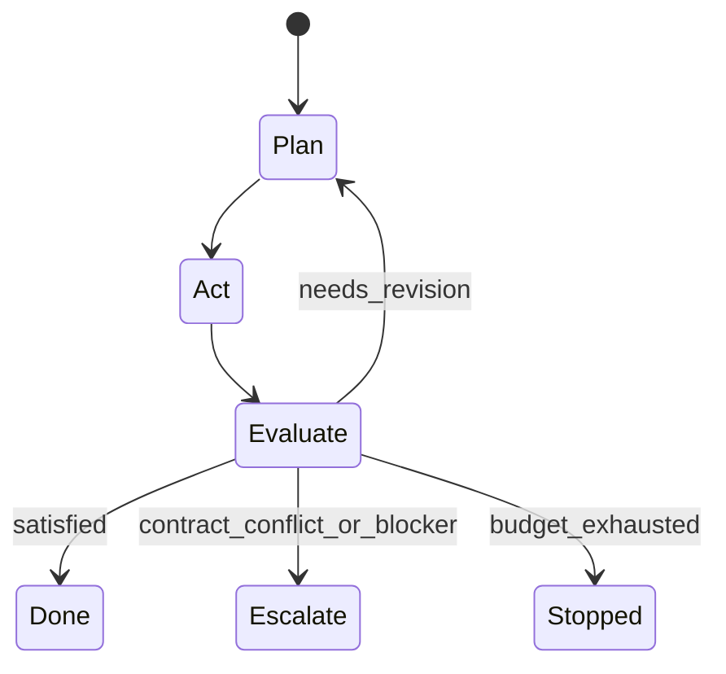

## TL;DR

이 조사에서 말하는 AI 지시서는 Human이 혼자 작성해 Agent에게 건네는 긴 명령문이 아니다. **Human이 제시한 문제와 의도를 Agent와 함께 명확히 해 만든 `Goal Contract`**다. 이 계약이 확정된 뒤에는 Agent가 목표 달성 수단과 실행 순서를 자율적으로 정한다.

전체 구조는 세 층이면 충분하다.

1. **Goal Contract** — 이번 과업에서 무엇을 달성하고 무엇으로 성공을 증명할지 정한 계약
2. **Runtime Policy** — Graph, Loop, 위임, Context 관리, 권한처럼 여러 과업에 재사용하는 실행 규칙
3. **Runtime State** — 실행 중 바뀌는 계획, 관찰, 도구 결과, Eval 결과, 체크포인트

Human의 최초 입력은 Graph의 `Initial Input`이 아니다. 먼저 `Goal Definition`에 들어가야 한다. Human과 Agent가 문제, Goal, 제약, 성공 증거, Eval을 합의한 뒤 확정된 Goal Contract만 Graph에 넣는다. 이후 Graph는 상태 전이를 통제하고, Loop는 `계획 → 실행 → 관찰 → 평가`를 반복한다. **방법은 Agent가 선택하지만 완료는 Agent의 선언이 아니라 Eval 통과로 정한다.**

코딩 Agent의 기본 실행 환경은 호스트 전체를 Container로 옮기는 방식이 아니라 **Agent Session과 실행 도구만 Docker 안에 두는 방식**으로 잡는다. Docker Desktop을 기본 환경으로 삼고, Repository는 Container 전용 Volume 안에 Clone한다. 사용자는 SSH로만 Container에 접속하며, Host의 인증 디렉터리나 Agent 설정은 Mount하지 않는다. Git Credential과 무인 실행용 API Key는 Docker Secret으로 전달하고, Claude·Codex의 구독 로그인 상태와 개인 설정·Memory는 Container 전용 Volume에 보존한다.

`Goal Contract`는 조사 자료의 표준 용어를 그대로 옮긴 것이 아니라, 여러 1차 자료에 흩어진 `outcome`, `rubric`, `success criteria`, `specification`, `run input`을 이 관점에 맞게 묶은 이 조사의 합성 용어다.

## 조사 질문과 범위

조사 질문은 하나다.

> Human과 Agent가 함께 정의한 Goal을 자율 Agent Graph의 Initial Input으로 쓰려면, 과업별 지시서와 재사용 실행 구조에 각각 무엇이 들어가야 하는가?

이 질문은 기존 조사보다 범위가 좁다. Workflow 패턴 전체를 다시 나열하지 않고, 다음 경계를 정하는 데 집중한다.

- Human이 최초에 제공해야 하는 Input
- Agent와 함께 확정해야 하는 Goal Definition 결과
- 과업별 Goal Contract와 재사용 Runtime Policy의 경계
- Success Evidence와 Eval의 관계
- Graph, Loop, 위임, Context 관리의 위치
- 정보은닉, Ports and Adapters, Single Responsibility Principle과 실행 격리의 위치

## 1. 핵심 모델 — 세 층

### 1.1 Goal Contract

Goal Contract는 **이번 과업에만 적용하는 승인된 목표 계약**이다. 다음을 고정한다.

- 해결할 문제
- 달성할 Goal
- 범위와 제약
- 성공을 보여 줄 관찰 가능한 증거
- 성공을 판정할 Eval
- Agent의 권한과 금지 사항
- 계약을 바꾸지 않고는 진행할 수 없을 때의 중단·보고 조건

자율 실행 중 Agent는 방법을 바꿀 수 있지만 Goal Contract를 임의로 바꾸면 안 된다. 문제나 성공 기준을 바꿔야 한다면 실행을 멈추고 Goal Definition으로 돌아간다.

### 1.2 Runtime Policy

Runtime Policy는 **여러 과업에 재사용하는 실행 규칙**이다.

- Graph의 상태와 전이 조건
- Loop의 반복 조건과 상한
- 도구 선택 및 권한 규칙
- 서브 Agent 위임 조건과 반환 형식
- Context 적재, 압축, 외부 메모리, 체크포인트 규칙
- Eval 실행 순서와 판정 기록 방식
- 실패, 충돌, 고위험 행동의 중단·보고 방식

과업마다 이 규칙을 복사해 넣기보다 이름과 버전을 Goal Contract에서 참조하는 편이 단순하다. Anthropic의 Agent 정의도 재사용 가능한 System Prompt·Tools·Skills·Multi-agent 설정과 세션별 Outcome을 분리한다. OpenAI Agents SDK도 Agent 설정, Run Input, Session/Run State를 별개 개념으로 둔다.

### 1.3 Runtime State

Runtime State는 **실행하면서 바뀌는 사실**이다.

- 현재 계획과 다음 행동
- 완료·대기 중인 Task
- 관찰과 도구 결과
- 생성한 산출물
- Eval 결과와 수정 요청
- Context 요약과 외부 메모리
- 체크포인트와 재개 위치

Goal Contract와 Runtime Policy를 상태에 섞으면 실행 중 관찰이 계약을 덮어쓸 수 있다. LangGraph가 Input/Output Schema와 내부 State를 분리하고 Checkpoint를 별도로 저장하는 구조는 이 구분을 구현하는 한 방법이다.

## 2. Goal Definition — Human Input에서 공동 계약까지

### 2.1 Human이 처음 제공할 Input

Human은 완성된 지시서를 처음부터 쓸 필요가 없다. 대신 자신만이 제공할 수 있는 판단 재료를 준다.

| Human Input | 뜻 | 예시 |
| --- | --- | --- |
| Initial Problem Definition | 지금 무엇이 왜 문제인지 | “완료 선언은 있는데 실제 검증이 빠진다.” |
| Goal Intent | 원하는 변화의 방향 | “검증을 통과해야만 완료되는 실행 구조가 필요하다.” |
| Initial Constraints | 처음부터 지켜야 할 경계 | “기존 API는 바꾸지 않는다.” |
| Evidence and Context | 문제를 이해할 근거 | 실패 로그, 기존 문서, 코드, 사용자 반응 |
| Priorities and Risk | 무엇을 우선하고 무엇을 피할지 | 정확성 우선, 비용 상한, 되돌릴 수 없는 작업 금지 |

`Goal Intent`는 아직 최종 Goal이 아니다. Human이 문제를 잘못 설명했거나 해결책을 문제처럼 제시했을 수 있으므로 Agent가 근거를 확인하고 모호함, 충돌, 숨은 가정을 드러내야 한다. 반대로 가치 판단, 우선순위, 감수할 위험은 Agent가 대신 정하지 않는다.

### 2.2 공동 Goal Definition

Goal Definition은 Human의 Input을 실행 가능한 계약으로 바꾸는 짧은 협의 단계다.

1. Agent가 문제와 원하는 변화를 자기 말로 다시 적는다.
2. 모호한 용어, 빠진 범위, 서로 충돌하는 제약을 찾는다.
3. 성공했을 때 관찰할 증거를 정한다.
4. 그 증거를 판정할 기준, 방법, 도구를 정한다.
5. Agent가 자율적으로 결정해도 되는 범위와 보고해야 할 경계를 정한다.
6. Human이 Goal Contract를 승인한다.

과업이 분명한 단순 작업과 문제 정의가 필요한 복잡한 작업에 서로 다른 문서 형식은 필요하지 않다. **같은 과정의 깊이만 다르게 적용**하면 된다.

- **Fast Path** — 입력이 충분하면 Agent가 짧은 Goal Contract를 제안하고 Human이 바로 승인한다.
- **Deep Path** — 문제나 성공 기준이 불명확하면 근거 조사와 대화를 거쳐 계약을 확정한다.

GitHub Spec Kit도 요구사항의 `WHAT/WHY`와 기술 계획의 `HOW`를 나누고, 모호함을 추측하지 말고 명시적으로 해소한 뒤 구현 계획으로 넘어간다. 이 구조에서는 Goal Definition이 `WHAT/WHY`를 확정하고, 자율 실행이 `HOW`를 선택한다.

## 3. Goal Contract — Graph가 받아야 할 Initial Input

Graph의 Initial Input에는 실행 방법을 길게 적기보다 다음 계약이 들어가야 한다.

### Problem Definition

- 현재 상태와 원하는 상태의 차이
- 그 차이가 실제 문제인 근거
- 누구에게 어떤 영향이 있는지

### Goal

- Agent가 만들어야 할 최종 상태
- 하나의 문장으로 다시 확인할 수 있는 결과

### Scope and Constraints

- 포함 범위와 제외 범위
- 시간, 비용, 호환성, 보안 제약
- 반드시 보존해야 하는 기존 동작

### Inputs, Evidence, and Resources

- 신뢰할 수 있는 자료와 시작 상태
- 사용할 수 있는 저장소, 도구, 환경
- 확인되지 않은 가정

### Success Evidence

- 성공했을 때 남아야 하는 산출물이나 관찰 가능한 상태
- 예: 테스트 통과 기록, 변경된 파일, 재현 가능한 실행 결과, 승인된 문서

### Evaluation Contract

- `Criteria` — 무엇이면 통과인가
- `Method` — 어떤 절차로 확인하는가
- `Tool` — 어떤 실행 수단을 쓰는가
- `Evaluator` — 누가 판정하는가
- `Order` — 어떤 검사를 어떤 순서로 하는가

### Authority, Prohibitions, Stop, and Escalation

- Agent가 승인 없이 할 수 있는 일
- 금지된 일과 별도 승인이 필요한 일
- 계약 충돌, 검증 불가, 예산 소진, 고위험 행동에서 멈추는 조건

### Required Invariants

- 구현 방법 중에서도 반드시 지켜야 하는 구조적 조건
- 예: 특정 도메인 규칙이 Adapter 밖으로 새지 않아야 함

### Environment and Isolation

- Agent Session을 실행할 Container와 Workspace·개인 State Volume의 범위
- 외부 Network, Credential, File System 권한의 범위

### Runtime Policy Reference

- 적용할 Workflow, Graph, 위임, Context, Checkpoint 정책의 이름과 버전

모든 항목을 매번 길게 채우는 것이 목적은 아니다. 해당 과업의 성공과 안전에 영향을 주는 내용만 남긴다. 비어 있는 항목을 억지로 채우기보다 `해당 없음`을 명시하는 편이 낫다.

## 4. Graph와 Loop — 수단은 Agent가 정하고 종료는 Eval이 정한다

Graph와 Loop는 같은 것이 아니다.

- **Graph** — 어떤 상태가 있고 어떤 조건에서 다음 상태로 이동하는지 정한다.
- **Loop** — 한 상태 구간에서 계획, 실행, 관찰, 평가를 반복한다.

가장 작은 자율 실행 구조는 다음과 같다.



OpenAI Agents SDK의 기본 Runner는 최종 출력, Handoff, Tool Call, 최대 Turn을 중심으로 Loop를 돈다. 하지만 최종 출력은 Goal 달성 증거와 같지 않다. Goal 지향 실행이라면 `Evaluate → Done` 전이에 별도의 Eval Gate가 필요하다.

Anthropic Managed Agents의 Outcome Loop는 이 구조와 가장 가까운 현재 사례다. `description`, 필수 `rubric`, 선택 `max_iterations`를 받은 뒤 Agent가 추가 사용자 메시지 없이 실행하고, 별도 Grader가 `satisfied` 또는 `needs_revision`을 판정한다. `max_iterations_reached`는 성공이 아니라 중단 결과다. 이 기능은 2026년 현재 Beta이므로 개념 근거로는 쓸 수 있지만 안정된 표준으로 취급하면 안 된다.

Workflow는 Agent의 수단을 미리 고정하는 절차서가 아니라 **상태 전이와 경계를 강제하는 구조**여야 한다. 예를 들어 `Evaluate`를 거치지 않고 `Done`으로 갈 수 없게 만들되, `Plan`과 `Act`에서 어떤 수단을 쓸지는 Agent가 고른다.

## 5. Runtime Policy — Workflow·위임·Context 관리

### 5.1 위임 조건

서브 Agent는 다음 중 하나가 성립할 때 쓴다.

- 서로 독립적인 탐색을 병렬로 할 수 있다.
- 별도 전문 지식이나 도구가 필요하다.
- 하위 과업의 경계와 반환값을 분명히 정할 수 있다.
- Main Agent의 Context를 보호할 만큼 자료량이 크다.

단순 작업, 강하게 맞물린 작업, 결과를 합치는 비용이 더 큰 작업에는 위임하지 않는다. Anthropic의 Multi-agent 연구도 단순 사실 확인과 넓은 병렬 조사의 Agent 수를 다르게 하고, OpenAI Agents SDK도 Manager와 Handoff를 목적에 따라 구분한다.

위임할 때는 최소한 다음 계약을 함께 보낸다.

- 하위 Objective
- Output Format
- 허용된 Tools와 Sources
- 하지 말아야 할 범위
- Main Agent에게 돌려줄 Evidence

Main Agent가 최종 Goal Contract와 결과 통합을 계속 소유한다면 `Manager` 방식이 기본이다. 대화와 다음 단계의 소유권까지 전문가에게 넘겨야 할 때만 `Handoff`가 맞다.

### 5.2 Context 관리

Context Window는 실행 기록 전체를 담는 저장소가 아니다. Runtime Policy는 다음을 정해야 한다.

- Goal Contract와 핵심 제약은 항상 접근 가능하게 둔다.
- 필요한 자료는 Just-in-time으로 불러온다.
- Tool 결과 원문은 외부 저장소에 두고 Context에는 판단에 필요한 부분만 남긴다.
- 길어지면 Compaction하되 결정, 근거, 미해결 항목을 보존한다.
- 서브 Agent는 격리된 Context에서 일하고 압축한 결과와 Evidence만 반환한다.
- Checkpoint와 외부 메모리는 Context Window와 별도로 저장한다.

Anthropic은 장기 과업의 핵심 수단으로 Compaction, 구조화된 Note-taking, Multi-agent를 제시한다. LangGraph의 Persistence는 각 단계의 State를 Checkpoint로 남겨 재개, Human-in-the-loop, Replay, Fault Tolerance에 사용한다. 즉 **Context 압축은 기억의 전부가 아니며, 실행 상태의 영속화와 분리해야 한다.**

## 6. Eval — Success Evidence와 판정 수단 분리

다음 용어를 섞지 않아야 한다.

| 용어 | 질문 | 예시 |
| --- | --- | --- |
| Success Evidence | 성공했다면 무엇이 보여야 하는가? | 테스트 결과, 생성된 파일, 응답 시간 측정값 |
| Eval Criteria | 어떤 상태면 통과인가? | 모든 회귀 테스트 통과, 응답 시간 200ms 이하 |
| Eval Method | 어떻게 확인하는가? | 고정 Dataset으로 세 번 실행해 최댓값 비교 |
| Eval Tool | 무엇으로 실행하는가? | Test Runner, Benchmark, Lint, Static Analyzer |
| Eval Verdict | 그래서 다음 상태는 무엇인가? | satisfied, needs_revision, failed |

`Lint`는 Eval 전체가 아니라 Eval Tool 하나다. 문법과 형식은 잘 잡지만, 문제를 해결했는지까지 증명하지는 못한다.

Eval은 가능한 한 다음 순서가 단순하다.

1. 결정론적 검사 — Test, Schema, Type Check, Lint, Security Scan
2. 측정 기반 검사 — 성능, 비용, 정확도, 재현성
3. 별도 Context의 Model Grader — 정성적 Rubric
4. 필요한 경우 Human Review — 가치 판단, 고위험 결정, 자동 판정이 불가능한 항목

생성 Agent가 자신의 설명만으로 통과를 선언하면 안 된다. 정성 판정에는 별도 Grader Context를 쓰고, 그 Grader도 표본에 대한 Human Audit으로 신뢰도를 확인해야 한다. OpenAI의 Eval 자료는 목적, 결과, 의사결정 지점, 성공과 회피할 결과를 함께 정하고, 현실적인 Test Environment와 Golden Set으로 평가하라고 권한다.

## 7. 코드 경계와 실행 격리

사용자가 언급한 정보은닉, Ports and Adapters, Single Responsibility Principle은 **코드가 변화를 흡수하는 경계**를 정한다. Sandbox, Container, Volume은 **실행과 파일 변경의 충돌 범위**를 제한한다. 둘은 목적이 다르다.

### 코드 Architecture Invariant

- **정보은닉** — 바뀌기 어렵거나 자주 바뀌는 설계 결정을 Module 내부에 숨긴다.
- **Ports and Adapters** — Domain과 외부 기술 사이의 대화를 Port로 정의하고 기술별 Adapter를 둔다.
- **Single Responsibility Principle** — 같은 이유로 바뀌는 것은 모으고 다른 이유로 바뀌는 것은 나눈다.

이 원칙이 프로젝트의 필수 조건이면 Goal Contract의 `Required Invariants`에 넣는다. 단지 가능한 구현 방법 중 하나라면 Runtime Plan에서 Agent가 선택하게 둔다. 모든 과업에 세 원칙을 의무화하면 불필요한 추상화가 생길 수 있다.

### Execution Isolation

- **Sandbox/Container** — Agent Process, Shell, Compiler, Test Tool의 활동 환경을 호스트의 Agent 환경과 분리한다.
- **Workspace Volume** — Repository와 `.git`, Linux용 Dependency를 Container 전용 저장 공간에 둔다.
- **개인 State Volume** — 팀원별 Agent 설정, Skill, Session, Memory와 구독 로그인 상태를 Container의 Home에 유지한다.
- **Docker Secret** — Git Credential과 무인 실행용 API Key처럼 시작 시 주입할 고정 비밀 정보를 `/run/secrets`에 제한해 제공한다.
- **SSH 접속** — Host Terminal과 Editor가 Container를 하나의 독립된 개발 환경처럼 사용하게 하는 유일한 접속 통로다.
- **별도 Test Environment** — 운영 데이터와 실행을 분리하고 동일 조건에서 Eval을 반복한다.

이 조사에서 기본안은 **Docker Desktop에 지속 실행되는 Agent Container를 두고 SSH로만 접속하는 구조**다.

| 위치 | 소유하는 것 |
| --- | --- |
| Host | Container 접속용 SSH Private Key, Secret 공급원, 기본 Git 사용자 정보, Docker Desktop |
| Docker Secret | 사용자별 Container 전용 Git SSH Private Key, 선택적인 GitHub·Bitbucket API Token과 AI API Key |
| Workspace Volume | Repository Clone, `.git`, Source, Project `AGENTS.md`·`CLAUDE.md`, Linux용 Dependency |
| Personal Volume | 팀원별 Codex·Claude 설정, Skill, Session, Memory, 구독 OAuth 로그인 상태 |
| Container | SSH Server, Codex·Claude Code Session, Shell, Compiler, Lint·Test, Git Clone·Pull·Commit·Push |

실행 흐름은 다음이면 충분하다.

```text
Secret을 공급해 Container 시작 → Host에서 SSH 접속 → Workspace Volume의 Clone에서 Agent 실행
→ Agent가 수정·Test·Commit·Push → SSH Session 종료
```

Host의 `~/.ssh`, `~/.config/gh`, `~/.claude`, `~/.codex`, Source Directory를 Mount하지 않는다. Host가 Container에 접속할 때는 Private Key를 Host에 그대로 두고 대응하는 Public Key만 Container의 `authorized_keys`에 등록한다. 이 Public Key는 비밀 정보가 아니라 접속 허용 설정이다.

GitHub·Bitbucket에는 각 사용자의 **Container 전용 Git SSH Key**를 등록한다. 그 Private Key만 Docker Secret으로 Container에 전달한다. Host의 주 SSH Key를 재사용하지 않으므로 Agent가 얻는 Remote 권한과 폐기 단위를 분리할 수 있다. 한 Key를 두 Provider에 함께 등록하는 것이 가장 단순하지만, 권한의 폭을 줄여야 한다면 Provider나 Repository별로 Secret을 나눈다.

최소 실행 구조는 다음과 같다.

```yaml
services:
  agent:
    build: .
    working_dir: /workspace/project
    environment:
      HOME: /home/agent
      CODEX_HOME: /home/agent/.codex
      CLAUDE_CONFIG_DIR: /home/agent/.claude
      AGENT_SSH_PUBLIC_KEY: ${AGENT_SSH_PUBLIC_KEY}
      REPOSITORY_SSH_URL: ${REPOSITORY_SSH_URL}
      GIT_BASE_USER_NAME: ${HOST_GIT_USER_NAME}
      GIT_BASE_USER_EMAIL: ${HOST_GIT_USER_EMAIL}
    ports:
      - "127.0.0.1:2222:22"
    volumes:
      - agent-workspace:/workspace
      - agent-home:/home/agent
      - agent-ssh:/etc/ssh
    secrets:
      - source: git_ssh_key
        uid: "1000"
        gid: "1000"
        mode: 0o400
    restart: unless-stopped

secrets:
  git_ssh_key:
    environment: AGENT_GIT_SSH_PRIVATE_KEY

volumes:
  agent-workspace:
  agent-home:
  agent-ssh:
```

`AGENT_SSH_PUBLIC_KEY`, Repository URL, Git 사용자명과 이메일은 비밀 정보가 아닌 시작 설정이다. `AGENT_GIT_SSH_PRIVATE_KEY` 값은 저장소의 `.env`나 Compose File에 기록하지 않고 OS Keychain이나 팀 Secret Manager에서 Container를 시작하는 Process에만 공급한다. Compose의 `environment:` Secret Source를 사용하면 Host Credential File이나 인증 Directory를 직접 Mount하지 않고 값을 `/run/secrets/git_ssh_key`로 제공할 수 있다. `gh`로 Pull Request나 API를 다뤄야 한다면 Host의 `~/.config/gh` 대신 별도 GitHub Token Secret을 추가하고, `gh` 실행 Wrapper가 그 File을 읽어 해당 Process에만 `GH_TOKEN`으로 전달한다.

```bash
docker compose up -d
ssh -p 2222 agent@127.0.0.1
cd /workspace/project
claude # 또는 codex
```

Container Image는 UID `1000`인 `agent` User와 그 User가 소유한 `/home/agent`, `/workspace`를 미리 만든다. Startup Script는 Root 권한으로 SSH Server를 준비하되 Clone과 Git 설정은 `agent` User로 실행한다. Public Key를 `authorized_keys`에 기록하고, Repository가 없으면 Git 전용 Secret으로 Clone한다. 이후 Repository Local 설정에 같은 SSH Command를 남기므로 Pull·Push에도 전용 Key가 사용된다. 마지막에는 SSH Server를 Foreground로 실행한다. GitHub·Bitbucket의 Host Key는 Image의 `known_hosts`에 검증된 값으로 고정하며 `StrictHostKeyChecking=no`로 우회하지 않는다.

```bash
install -d -o agent -g agent -m 700 /home/agent/.ssh
printf '%s\n' "${AGENT_SSH_PUBLIC_KEY}" > /home/agent/.ssh/authorized_keys
chown agent:agent /home/agent/.ssh/authorized_keys
chmod 600 /home/agent/.ssh/authorized_keys

if ! runuser -u agent -- git -C /workspace/project rev-parse --git-dir >/dev/null 2>&1; then
  runuser -u agent -- env \
    GIT_SSH_COMMAND='ssh -i /run/secrets/git_ssh_key -o IdentitiesOnly=yes' \
    git clone "${REPOSITORY_SSH_URL}" /workspace/project
fi

runuser -u agent -- git -C /workspace/project config --local \
  core.sshCommand 'ssh -i /run/secrets/git_ssh_key -o IdentitiesOnly=yes'
runuser -u agent -- git -C /workspace/project config --local \
  user.name "${GIT_BASE_USER_NAME} (agent)"
runuser -u agent -- git -C /workspace/project config --local \
  user.email "${GIT_BASE_USER_EMAIL}"

ssh-keygen -A
exec /usr/sbin/sshd -D -e
```

`exec` 전에 `ssh-keygen -A`를 실행해 `/etc/ssh` Volume에 SSH Server Host Key가 없을 때만 생성한다. Host Key를 Image에 굽지 않고 Volume에 유지하면 Container를 다시 만들어도 Host가 같은 Server로 확인할 수 있다. `docker compose up`과 중지는 Host의 관리 작업이고, Container 안의 대화형 작업은 SSH로만 수행한다.

예를 들어 Host의 `user.name`이 `Kim Hynu`라면 Container가 만든 Commit은 `Kim Hynu (agent)`로 표시된다. 이메일은 기존 값을 유지해 GitHub·Bitbucket의 사용자 연결을 보존한다. 이 설정은 해당 Clone의 `.git/config`에만 기록되며 Host Global Git 설정을 바꾸지 않는다.

Repository의 `AGENTS.md`와 `CLAUDE.md`는 Workspace Volume의 Clone에서 Project 규칙으로 읽는다. Container 전역 지시와 Auto Memory는 `agent-home` Volume에 둔다. 팀원과 프로젝트마다 다른 Volume을 사용하면 서로의 Memory와 Agent 설정이 섞이지 않는다.

Claude·Codex를 구독 계정으로 사용한다면 최초 한 번 SSH Session 안에서 Browser Login을 완료하고 그 상태를 `agent-home` Volume에 보존한다. OAuth Credential과 갱신 상태는 단일 고정 Secret이 아니므로 Docker Secret으로 변환하지 않는다. 반대로 사람의 로그인 없이 실행해야 한다면 `ANTHROPIC_API_KEY`나 `OPENAI_API_KEY`를 별도 Docker Secret으로 추가한다. 이때 API 사용은 구독 로그인의 이용 조건·과금·기능과 같다고 가정하면 안 된다.

Docker Compose Secret은 보이지 않는 변수 주입이나 일회성 전달이 아니라 Container가 실행되는 동안 `/run/secrets`에 제공되는 Read-only File이다. 특히 `file:` Source는 내부적으로 Host File의 Bind Mount를 사용하므로, Host 인증 File을 Mount하지 않으려면 위 예시처럼 `environment:` Source를 사용한다. Swarm Secret은 암호화 저장과 Memory Mount를 제공하지만 단일 개발 머신에 Swarm 운영을 추가하는 것은 이 구조의 설명력에 비해 복잡하다.

Secret은 이미지·저장소·일반 환경 변수에 Credential이 섞이는 사고와 Host Credential 전체가 노출되는 범위를 줄인다. 그러나 Git을 실행하는 Agent User가 `/run/secrets/git_ssh_key`를 읽을 수 있으므로 **실행 중인 Agent 자체로부터 Credential을 숨기는 경계는 아니다.** 따라서 전용 Key에는 필요한 Remote 권한만 주고 별도로 폐기할 수 있어야 한다.

2026-08-13 기존 실증에서는 Host SSH Agent Socket과 `gh` 설정을 연결해 GitHub SSH, API, Remote Read, Push Dry-run이 성공했다. 실제 Codex Prompt에는 Container Global과 Source Project `AGENTS.md`가 함께 들어갔고 Host Agent Global은 들어가지 않았다. Host의 macOS용 `node_modules`를 Mount했을 때 Linux용 Native Dependency가 맞지 않아 Pre-push Hook이 실패했으므로, **Host Source Mount보다 Workspace Volume 안의 별도 Clone과 Container 내부 Dependency 설치가 적합하다.** 이 실증은 규칙 격리와 별도 Clone의 근거로만 남긴다. 최종 기본안인 `SSH Server + Compose Secret` 조합은 아직 별도 실증이 필요하다.

## 8. Directive의 재배치

`Directive`를 과업별 지시서의 중심에 둘 필요가 없다. 이 구조에서 범용 Directive는 Runtime Policy에 가까운 한 문장이다.

> 승인된 Goal Contract를 Runtime Policy에 따라 실행하고, Eval이 통과하거나 중단·보고 조건에 닿을 때까지 자율적으로 진행한다.

과업별 문서는 단계별 행동을 지시하지 않는다. Outcome, Boundary, Evidence를 계약한다. 실행 도중 Human이 새 요구를 추가하면 단순한 다음 명령으로 누적하기보다 Goal Contract 변경인지 먼저 판단한다.

## 9. 실제로 쓰는 Markdown 골격

XML Tag 없이 다음 한 문서로 충분하다. 처음 다섯 항목은 Goal Definition의 입력이고, 승인 뒤 `Goal Contract` 부분만 Graph의 Initial Input으로 사용한다.

```markdown
# Human Input

## Initial Problem Definition
- 현재 문제:
- 문제라는 근거:
- 영향을 받는 대상:

## Goal Intent
- 원하는 변화:

## Initial Constraints
- 반드시 지킬 것:
- 하지 말아야 할 것:

## Evidence and Context
- 자료:
- 확인되지 않은 가정:

## Priorities and Risk
- 우선순위:
- 감수할 수 없는 위험:

---

# Goal Contract

## Problem Definition
- 합의한 문제:

## Goal
- 만들어야 할 최종 상태:

## Scope and Constraints
- 포함:
- 제외:
- 제약:

## Success Evidence
- 성공하면 남아야 하는 증거:

## Evaluation Contract
- Criteria:
- Method:
- Tool:
- Evaluator:
- Order:

## Authority and Escalation
- Agent가 자율적으로 할 수 있는 일:
- 금지하거나 별도 승인이 필요한 일:
- 멈추고 보고할 조건:

## Required Invariants
- 반드시 지킬 코드·구조 조건:

## Environment and Isolation
- 접속 방식과 Host Loopback Port:
- Workspace Clone·Volume:
- 개인 설정·Memory·OAuth State Volume:
- Git Credential Secret과 권한 범위:
- AI 인증 방식: 구독 OAuth / API Key Secret
- Container에 허용할 Network:
- Container Git 사용자명 표기:
- Container가 담당할 Git 작업:
- Container 종료 뒤 보존할 State:

## Runtime Policy Reference
- 정책 이름과 버전:

## Approval
- Human 승인:
- 승인 시각:
```

이 골격은 완전성을 확인하는 Checklist이지 모든 항목을 길게 쓰라는 뜻이 아니다. 간단한 과업은 각 항목을 한 줄로 끝내도 된다.

## 한계와 미해결 지점

- `Goal Contract`는 이 조사의 합성 용어다. 제품 간 호환되는 공식 표준은 아니다.
- Goal Definition을 별도 작성 단계로 둘지 Graph의 승인 전 단계로 포함할지는 구현 선택이다. **Goal Contract를 Initial Input으로 삼는다는 관점을 지키려면 별도 단계가 더 명확하다.**
- Anthropic Managed Agents는 Beta다. `Outcome Loop`는 직접적인 사례지만 API와 동작은 바뀔 수 있다.
- 정성적 Success Evidence를 Model Grader만으로 완전히 증명할 수는 없다. 고위험 판단에는 Human Gate가 남는다.
- “Human 개입 없이 자율 실행”은 승인된 계약 안에서만 성립한다. 계약 변경, 모순된 Rubric, 사용할 수 없는 Evaluator, 되돌릴 수 없는 고위험 행동은 자율성의 실패가 아니라 의도된 중단 조건이다.
- Architecture Invariant는 Domain에 따라 달라진다. 정보은닉, Ports and Adapters, Single Responsibility Principle을 모든 과업의 기본 요구로 고정하면 단순 작업까지 복잡해질 수 있다.
- Compose Secret은 Host 인증 Directory의 공유 범위를 없애지만 실행 중인 Agent에게서 Credential을 숨기지는 않는다. Agent가 직접 Push하면 안 되는 과업에서는 Git Secret을 주입하지 않고 Patch나 Artifact만 반출해야 한다.
- 구독 OAuth 상태는 Docker Secret에 맞지 않아 개인 State Volume에 남는다. Container를 폐기할 때 이 Volume까지 지우면 Claude·Codex 로그인을 다시 해야 한다.
- `SSH Server + Compose Secret` 기본안은 아직 최종 실증 전이다. 전용 Key의 Clone·Push, Container 재시작 뒤 OAuth State 유지, Host Global 규칙 비상속을 같은 Docker Desktop 환경에서 확인해야 한다.

## 관련 저장소 문서

- [Agent Workflow Architecture·Loop·Goal 설계 종합 조사](/inbox/2026-08-10-에이전트-워크플로-아키텍처-루프-goal-설계-종합-조사/) — Workflow와 Agent 구분, Loop Primitive, Goal과 Eval, Multi-agent Pattern의 넓은 지도
- [마일스톤 분해·종료 판정·자율 Loop·Orchestration 조사](/inbox/2026-08-06-마일스톤-분해-종료-판정-자율-루프-오케스트레이션/) — 반복 상한, 종료 판정, 장기 실행, Checkpoint에 대한 세부 조사
- [Event Log·Gateway·Eval Gate 기반 실행 체계](/notes/event-log-gateway-and-eval-gate/) — 완료를 Eval 통과 Event로 기록하는 저장소 Note
- [Goal 지향 Task Harness 재설계](/notes/goal-oriented-task-harness-redesign/) — Goal, Task, Eval을 함께 다루는 기존 저장소 Note

## 참고

확인일: 2026-08-13.

### 1차 — Agent, Goal, Eval

- [Define outcomes — Anthropic Managed Agents](https://platform.claude.com/docs/en/managed-agents/define-outcomes) — Outcome `description`, 필수 `rubric`, 별도 Grader, 자율 반복과 종료 상태. Beta Header `managed-agents-2026-04-01` 기준.
- [Define your agent — Anthropic Managed Agents](https://platform.claude.com/docs/en/managed-agents/agent-setup) — 재사용 Agent 설정과 세션별 작업의 분리. Beta Header `managed-agents-2026-04-01` 기준.
- [Multi-agent orchestration — Anthropic Managed Agents](https://platform.claude.com/docs/en/managed-agents/multiagent-orchestration) — 격리 Context, 병렬 작업, 전문화, Escalation Pattern. Beta Header `managed-agents-2026-04-01` 기준.
- [Building effective agents — Anthropic](https://www.anthropic.com/engineering/building-effective-agents) — 정해진 경로의 Workflow와 동적 과정을 선택하는 Agent의 구분, 조합 가능한 Pattern, 명확한 Success Criteria와 Feedback Loop. 2024-12-19 게시본.
- [Running agents — OpenAI Agents SDK](https://openai.github.io/openai-agents-python/running_agents/) — Run Input과 Built-in Agent Loop, Final Output, Handoff, Tool Call, `max_turns`의 관계.
- [Agent orchestration — OpenAI Agents SDK](https://openai.github.io/openai-agents-python/multi_agent/) — Manager, Handoff, Code-driven Loop와 Evaluator 결합.
- [Evals drive the next chapter of AI — OpenAI](https://openai.com/index/evals-drive-next-chapter-of-ai/) — 목적·Outcome·Decision Point·Success 공동 정의, 현실적 Test Environment, Golden Set과 Grader Audit.
- [Graders — OpenAI API](https://platform.openai.com/docs/api-reference/graders) — String, Text Similarity, Model Grader 등 판정 수단.
- [Spec-driven development — GitHub Spec Kit](https://github.com/github/spec-kit/blob/c1bceb625cd40c2de87a73493a49b4419f77ab00/spec-driven.md) — `WHAT/WHY`와 `HOW` 분리, 모호함 해소, 측정 가능하고 검증 가능한 요구사항. Commit `c1bceb625cd40c2de87a73493a49b4419f77ab00` 기준.

### 1차 — Context, Graph, 위임

- [Effective context engineering for AI agents — Anthropic](https://www.anthropic.com/engineering/effective-context-engineering-for-ai-agents) — Just-in-time Context, Compaction, 구조화 Note-taking, 격리된 Sub-agent Context. 2025-09-29 게시본.
- [How we built our multi-agent research system — Anthropic](https://www.anthropic.com/engineering/multi-agent-research-system) — 과업에 맞춘 위임 규모, Objective·Output·Tools·Boundary를 포함한 위임, 결과 압축. 2025-06-13 게시본.
- [Graph API — LangGraph](https://docs.langchain.com/oss/python/langgraph/graph-api) — Input/Output Schema와 내부 State Channel의 분리.
- [Persistence — LangGraph](https://docs.langchain.com/oss/python/langgraph/persistence) — Checkpoint, Thread, Memory, Replay, Fault Tolerance.
- [Interrupts — LangGraph](https://docs.langchain.com/oss/python/langgraph/interrupts) — 실행 중단, State 저장, 승인·수정 후 재개.
- [LangGraph Repository](https://github.com/langchain-ai/langgraph/tree/644815f9e5bc52ad8f7a5227a456227e9c3e639b) — 공식 문서와 구현의 확인 기준 Commit `644815f9e5bc52ad8f7a5227a456227e9c3e639b`.
- [OpenAI Agents SDK Repository](https://github.com/openai/openai-agents-python/tree/5250cb86053f50abea9d30e7d06b8fc4b5b6adb1) — SDK 문서와 구현의 확인 기준 Commit `5250cb86053f50abea9d30e7d06b8fc4b5b6adb1`.

### 1차 — Architecture와 Isolation

- [On the Criteria To Be Used in Decomposing Systems into Modules — D. L. Parnas](https://sunnyday.mit.edu/16.355/parnas-criteria.html) — 변경 가능성이 큰 설계 결정을 Module에 숨기는 분해 기준. 1972년 논문의 재게시본이며 페이지가 전자화 정확성을 보증하지 않는다고 밝힘.
- [Hexagonal Architecture — Alistair Cockburn](https://alistair.cockburn.us/hexagonal-architecture) — Inside/Outside 경계, Port와 Adapter, 외부 기술과 분리한 Test. 2005년 원문 재게시본.
- [The Single Responsibility Principle — Robert C. Martin](https://blog.cleancoder.com/uncle-bob/2014/05/08/SingleReponsibilityPrinciple.html) — 같은 이유로 바뀌는 것을 모으고 다른 이유로 바뀌는 것을 나누는 설명. 2014-05-08 게시본.
- [Environments — Anthropic Managed Agents](https://platform.claude.com/docs/en/managed-agents/environments) — 세션별 새 격리 Sandbox와 재사용 Environment 설정. Beta Header `managed-agents-2026-04-01` 기준.
- [Sandbox agent concepts — OpenAI Agents SDK](https://openai.github.io/openai-agents-python/sandbox/guide/) — Agent 정의, 새 Workspace, Run 설정, 저장된 Runtime State의 분리. Beta 기능, Agents SDK Commit `5250cb86053f50abea9d30e7d06b8fc4b5b6adb1` 기준.
- [Bind mounts — Docker](https://docs.docker.com/engine/storage/bind-mounts/) — Container가 연결된 Host File을 기본적으로 수정할 수 있다는 경계와 Read-only Mount 선택지.
- [Volumes — Docker](https://docs.docker.com/engine/storage/volumes/) — Container Lifecycle과 분리해 개인 설정·Memory 같은 State를 유지하는 Docker 관리 저장소.
- [Manage secrets securely in Docker Compose — Docker](https://docs.docker.com/compose/how-tos/use-secrets/) — Compose Secret을 Service별 `/run/secrets` File로 제공하고 일반 환경 변수 노출을 줄이는 방식.
- [Compose services: secrets — Docker](https://docs.docker.com/reference/compose-file/services/#secrets) — `environment:` Source에서 `uid`, `gid`, `mode`를 지정하는 방식과 `file:` Source가 Bind Mount를 사용한다는 제한.
- [Manage sensitive data with Docker secrets — Docker](https://docs.docker.com/engine/swarm/secrets/) — Swarm에서 Secret을 암호화된 Raft Log에 저장하고 허용된 Service의 Memory File System에 제공하는 방식.
- [Authentication — OpenAI Codex](https://learn.chatgpt.com/docs/auth) — ChatGPT 구독 로그인과 API Key 로그인의 차이, Browser Login, API Key의 별도 과금과 기능 제한.
- [Set up Claude Code — Anthropic](https://docs.anthropic.com/en/docs/claude-code/getting-started) — Claude App 구독 OAuth, Anthropic Console API, Enterprise Provider 인증 방식의 구분.
- [Custom instructions with AGENTS.md — OpenAI Docs](https://learn.chatgpt.com/docs/agent-configuration/agents-md) — `CODEX_HOME`의 전역 지시와 Repository 경로의 프로젝트 지시를 계층적으로 읽는 Codex 구조.
- [How Claude remembers your project — Claude Code Docs](https://code.claude.com/docs/en/memory) — 사용자·프로젝트 `CLAUDE.md`의 범위, 프로젝트별 Auto Memory 위치와 별도 Memory Directory 설정.
