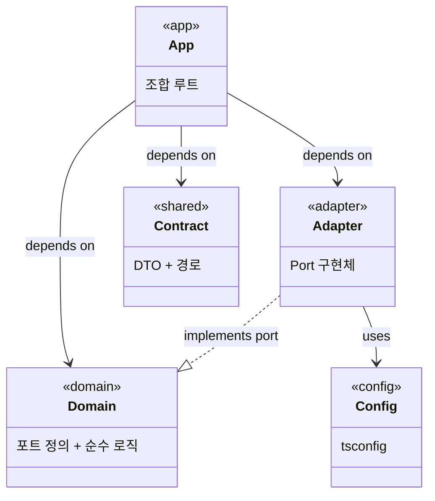

## 이 문서의 범위

Turborepo 기반으로 웹(React/Vite) + API(NestJS) 프로젝트를 구성할 때의 10개 설계 포인트를 다룬다. 각 포인트마다 **결정·근거·대안·실증**을 정리한다.

근거가 되는 자료:

- [모노레포 에이전트 팀의 서비스 격리와 공통 코드 전략](/inbox/2026-07-22-모노레포-에이전트-팀의-서비스-격리와-공통-코드-전략)
- [Turborepo·Nx·경량 모노레포 관리 방식 서베이](/inbox/2026-07-22-turborepo-nx-경량-모노레포-관리-방식-서베이)
- [헥사고날 아키텍처(Ports & Adapters) 조사](/inbox/2026-07-22-헥사고날-아키텍처-포트와-어댑터-조사)
- [바이브 코딩을 위한 코드 책임 격리 FE·BE 아키텍처 영향](/inbox/2026-08-08-바이브-코딩을-위한-코드-책임-격리-fe-be-아키텍처-영향)
- 실증 프로젝트: `turborepo-platform-lab` (M01–M18 완료)

---

## 1. 모노레포 도구 선택: Turborepo

**결정**: pnpm workspaces + Turborepo.

**근거**:

- JS/TS 전용 프로젝트에서 Turborepo는 "80% 이득을 20% 복잡도로" 제공한다. 캐싱·파이프라인·`--filter` affected가 핵심이고, 설정이 얕다.
- Nx는 경계 강제(`enforce-module-boundaries`)가 성숙하지만 학습·설정 비용이 크고, 폴리글롯이 아닌 JS/TS 전용이면 그 비용이 과하다.
- 경량(pnpm만)도 가능하지만, 서비스 격리를 turbo boundary tags로 **기계적으로 강제**하려면 Turborepo가 필요하다.

**대안과 트레이드오프**:

| 선택지 | 장점 | 단점 |
|---|---|---|
| pnpm만 | 설정 비용 0 | 경계 강제 수동, 캐싱 없음 |
| Turborepo | 캐싱+경계(experimental), 설정 얕음 | Boundaries 아직 experimental, Vercel 종속 |
| Nx | 성숙한 경계 강제, 코드 생성 | 학습 비용 높음, JS/TS만이면 과한 설정 |

**실증**: turborepo-platform-lab에서 turbo 2.10.x의 boundary tags로 domain/shared/adapter/config/app 분류와 svc-* 서비스 격리를 구현하고, CI에서 `turbo boundaries`로 검증 중.

---

## 2. 워크스페이스 토폴로지: apps/ + packages/

**결정**: `apps/`(조합 루트) + `packages/`(도메인·계약·어댑터·설정) 2분할.

```
apps/
  api/          # NestJS API 서버 (조합 루트)
  web/          # React + Vite SPA
packages/
  core/         # 도메인 로직 (순수)
  contracts/    # 플랫폼 공통 HTTP 계약
  {svc}-contract/  # 서비스별 HTTP 계약
  {svc}-core/      # 서비스별 도메인 로직
  adapter-*/    # 포트 구현체
  tsconfig/     # 공유 TS 설정
```

**근거**:

- `apps/`는 오케스트레이션(DI, 라우팅, 환경 설정)만 담당하고, `packages/`는 재사용 가능한 순수 로직·계약·어댑터를 담는다.
- 이 분리가 turbo boundary tags의 기본 단위가 된다 — `app` 태그는 제한 없이 모든 패키지를 의존할 수 있고, `domain`·`shared`·`adapter` 태그는 각각 허용 범위가 제한된다.
- pnpm workspaces의 non-hoisted 구조가 미선언 의존성 import를 자동 차단한다.

**실증**: lab 프로젝트의 `pnpm-workspace.yaml`이 `apps/*`, `packages/*`를 워크스페이스로 선언. web은 `@platform/contracts`만, api는 모든 패키지를 의존하는 구조가 작동 중.

---

## 3. 패키지 분류 체계와 Turbo Boundary Tags

**결정**: 5개 태그로 패키지를 분류하고, turbo.json에서 태그 간 의존 방향을 강제.

| 태그 | 역할 | 의존 금지 |
|---|---|---|
| `domain` | 순수 도메인 로직, 외부 의존 없음 | app, shared, adapter |
| `shared` | 플랫폼/서비스 공통 HTTP 계약 (DTO, 경로) | app, adapter |
| `adapter` | Port 구현체 (domain만 알아야 함) | app, shared — domain·config만 허용 |
| `config` | 공유 설정 (tsconfig) | 제한 없음 |
| `app` | 조합 루트 (api, web) | 제한 없음 |

**근거**:

- 헥사고날 아키텍처의 의존 방향(밖→안)을 패키지 그래프 수준에서 기계적으로 강제한다.
- `domain`이 adapter·shared를 의존하지 못하게 하면, 도메인 코어에 기술 지식이 스며드는 것을 구조적으로 차단한다.
- `adapter`가 domain과 config만 의존할 수 있게 하면, 어댑터가 다른 어댑터나 앱 코드에 결합되지 않는다.

**turbo.json 설정** (lab 프로젝트 기반):

```json
{
  "boundaries": {
    "tags": {
      "domain":  { "deny": ["app", "shared", "adapter"] },
      "shared":  { "deny": ["app", "adapter"] },
      "adapter": {
        "dependencies": { "allow": ["domain", "config"] },
        "dependents":   { "allow": ["app"] }
      }
    }
  }
}
```

---

## 4. 서비스 격리: svc-* 태그

**결정**: 서비스별 `svc-*` 태그를 부여하고, 서비스 간 상호 의존을 turbo boundaries로 금지.

```json
{
  "svc-design":  { "deny": ["svc-finance"] },
  "svc-finance": { "deny": ["svc-design"] }
}
```

**근거**:

- 서비스 간 구현 의존이 없어야 독립 개발·배포·테스트가 가능하다.
- 두 서비스가 공유해야 할 것은 `shared` 태그의 **계약 패키지**뿐이다. 구현은 각자의 domain·adapter 패키지에 격리된다.
- 에이전트 병렬 작업에서 서비스 간 의미 충돌을 구조적으로 방지 — "태스크 = 서비스 = 소유 경계 하나"가 되어 blast radius가 줄어든다.

**패키지 배치 예시**:

| 패키지 | 태그 |
|---|---|
| `@platform/core` | domain, svc-design |
| `@platform/design-contract` | shared, svc-design |
| `@platform/adapter-echo` | adapter, svc-design |
| `@platform/finance-core` | domain, svc-finance |
| `@platform/finance-contract` | shared, svc-finance |
| `@platform/contracts` | shared (플랫폼 공통, 서비스 태그 없음) |

**검증**: lab 프로젝트의 `check-service-isolation.mjs`는 mutation test로 검증한다 — 일시적으로 cross-service 의존(finance-contract → design-contract)을 추가하고, `turbo boundaries`가 실패하는지 확인한 뒤 원복.

---

## 5. BE 내부 구조: NestJS + 헥사고날

**결정**: Core가 Port 인터페이스를 소유하고, Adapter가 이를 구현하며, App(NestJS)이 조합 루트(composition root)에서 DI로 연결.

```
apps/api/src/
  {service}/
    {service}.controller.ts   ← HTTP 번역 (DTO ↔ 도메인, 에러 → HTTP 상태)
    {service}.service.ts      ← 앱 서비스 (@Inject로 Port 주입, Core use case 호출)
    {service}.module.ts       ← NestJS 모듈 (DI 바인딩)
    *.binding.ts              ← 조합 루트 (어댑터 선택 팩토리/라우터)

packages/{svc}-core/src/
    {resource}/port.ts        ← Port 인터페이스 (도메인 어휘만)
    {usecase}.ts              ← Core use case (Port를 받아 실행)
    {rule}.ts                 ← 도메인 규칙 (검증, 정규화)
    internal/                 ← exports 밖, 외부 접근 불가

packages/adapter-{impl}/src/
    {impl}-adapter.ts         ← Port 구현체
```

**근거**:

- 헥사고날의 핵심은 **"안쪽 코드가 바깥을 모른다"**는 단일 규칙이다 (Cockburn 2005). Port는 도메인이 정의한 인터페이스이고, Adapter는 그 포트와 외부 기술 사이의 변환기다.
- NestJS의 DI가 이 패턴과 자연스럽게 맞물린다: `COMPLETION_PORT` Symbol 토큰으로 Port를 주입하고, binding 파일에서 환경에 따라 어댑터를 선택한다.
- Port surface 어휘 검증(`check-port-surface`)으로 도메인 인터페이스에 `apiKey`, `model`, `http`, `fetch` 같은 구현 어휘가 침투하지 못하게 한다 — `port-surface.config.json`에 43개 금지 용어 정의.

**과잉 추상화 경고**: 모든 의존에 Port를 씌우지 않는다. **강도 × 거리 × 변동성**이 높은 경계(예: LLM 프로바이더)에만 Port/Adapter를 적용한다. 에이전트는 경계를 값싸게 대량 생성할 수 있어, 방치하면 불필요한 추상화로 흐르기 쉽다.

**어댑터 선택 생명주기** (lab에서 구현된 두 가지):

- **startup**: 싱글턴 팩토리가 부트스트랩 시 환경 변수(`CompletionConfig`)로 어댑터를 한 번 결정. 환경 변수는 읽는 즉시 frozen snapshot으로 고정.
- **request**: 요청 스코프 `CompletionRouter`가 `x-completion-adapter` 헤더로 런타임 어댑터 선택. 싱글턴 Echo/HTTP 인스턴스에 위임.

---

## 6. FE 내부 구조: React/Vite + Contracts-Only

**결정**: web 앱은 `@platform/contracts`(플랫폼 공통 계약)만 의존하고, 서비스 domain·adapter를 직접 import하지 않는다.

```typescript
// apps/web — 이것만 가능
import { HEALTH_PATH, type HealthResponse } from '@platform/contracts'

// @platform/core, @platform/adapter-* 등은 turbo boundaries가 차단
```

**근거**:

- 프론트엔드가 백엔드 도메인 구현을 모르면, API 응답 구조 변경이 web 코드에 전파되지 않는다.
- 에이전트가 화면을 만들 때 백엔드 코어를 컨텍스트에 올릴 필요가 없어 컨텍스트 예산이 절감된다.
- API 응답 흡수는 어댑터/쿼리 훅 한 곳에서 한다: 스키마가 바뀌면 그 파일 하나만 수정.

**확장 선택지 — Feature-Sliced Design(FSD)**:

web이 커지면 FSD + Steiger 린터 도입을 고려한다:

- 상위 층 import 금지
- 같은 층 slice 간 cross-import 금지
- 모든 slice 공개 API 필수

현재(초기)는 contracts-only 의존 + 단순 컴포넌트 구조로 충분하다. Sheriff 수동 배선 대신 FSD가 규칙+도구를 한 번에 제공하므로, 규모가 커질 때 FSD를 채택하면 설정 비용이 낮다.

---

## 7. 의존성 방향 규칙

**결정**: 단방향 — app → adapter → domain. 역방향 금지.



**강제 방법 3가지**:

1. **turbo boundaries** — 패키지 그래프 수준에서 태그별 의존 방향 검증. `domain`이 `adapter`를 의존하면 즉시 실패.
2. **package.json `exports`** — 패키지 내부 모듈(`internal/`)을 외부에서 접근 불가. `@platform/core`의 `MAX_PROMPT_CHARS`(internal)는 외부 패키지가 참조 불가.
3. **TypeScript 컴파일** — 컴파일된 패키지 소비(`exports`가 `dist/`를 가리킴) + `dependsOn: ["^build"]`로 상위 패키지가 먼저 빌드되어야 typecheck 가능.

**실증**: lab 프로젝트에서 `turbo typecheck`(exports 밖 접근 차단) + `turbo boundaries`(의존 방향 차단)가 상호 보완적으로 작동. 둘 중 하나만으로는 전 평면을 커버하지 못한다.

---

## 8. 공통 코드 전략: Contract 패키지

**결정**: "모두의 shared 폴더" 대신, **명시적 소유자와 공개 API를 가진 contract 패키지**로 관리.

**패키지 구분**:

- `@platform/contracts` — 플랫폼 공통 계약 (`HealthResponse`, `HEALTH_PATH`). 모든 앱이 의존 가능. 서비스 태그 없음.
- `@platform/{svc}-contract` — 서비스별 계약 (`DesignAssistRequest`, `DESIGN_ASSIST_PATH`). 해당 서비스의 svc-* 태그 포함.

**근거**:

- "모두가 소유"하는 shared 폴더는 아무도 책임지지 않는 dumping ground가 된다.
- Contract 패키지는 **이름·목적·공개 API(`index.ts`)·소유 태그**가 있는 단위다. 소비자는 계약만 알고 내부 구현은 모른다.
- 공통 변경은 직렬화 지점 — 공통 패키지를 먼저 머지하고, 서비스 적용을 후속 태스크로 쪼갠다.
- Contract 패키지는 구현 import를 포함하지 않는다 — `check-service-isolation`이 계약 순수성(contract purity)을 검증한다.

---

## 9. 검증 도구 체계: 3축

**결정**: 구조(boundaries) + 어휘(port-surface) + 격리(service-isolation)의 3축 검증.

| 검증 도구 | 대상 | 잡는 것 | 못 잡는 것 |
|---|---|---|---|
| `turbo boundaries` | 패키지 의존 그래프 | 미선언 의존, 방향 위반, 패키지 밖 import | exports 위반, 이름 오염 |
| `turbo typecheck` | TypeScript exports | exports 밖 internal 모듈 접근 | 의존 방향, 이름 오염 |
| `check:port-surface` | 도메인 공개 표면 | 구현 어휘 침투 (43개 금지어: apiKey, model, http, fetch, nest 등) | 의존 방향, 의미적 적절성 |
| `check:service-isolation` | 서비스 간 경계 | cross-service 의존, 계약 순수성 | 의미적 충돌 |

**근거**:

어떤 단일 도구도 모든 평면을 검사하지 못한다. 4개 도구가 각자의 축을 담당하며, CI에서 전부 통과해야 머지가 가능하다. 기계 검증 게이트는 에이전트 코딩에서 "done = 검증 통과"의 기반이 된다.

---

## 10. 개발 환경 격리

**결정**: git worktree로 세션 격리, `turbo --filter`로 서비스 단위 빌드/테스트.

**세션 격리** (에이전트 병렬 작업):

- 각 에이전트/세션이 독립 working directory + index를 갖고, `.git` object store만 공유한다.
- 서로의 미커밋 변경을 볼 수 없다.
- 수 시간 수명의 짧은 브랜치 + merge queue로 합류. 경로가 겹치지 않는 PR은 병렬 머지, 겹치면 자동 직렬화.

**서비스 단위 개발**:

```bash
# design 서비스 관련 패키지만 빌드
turbo build --filter='@platform/core...' --filter='apps/api'

# finance 서비스만 테스트
turbo test --filter='@platform/finance-core'

# 변경된 패키지만 typecheck
turbo typecheck --filter='...[origin/main]'
```

**서비스별 dev 서버 격리**:

- **api**: NestJS의 `PORT` 환경 변수로 포트 분리. 서비스별 모듈을 독립 등록 가능(`DesignModule.register(config)` 패턴).
- **web**: Vite dev server는 contract만 의존하므로, api 없이도 독립 개발 가능 — stub/mock으로 API 응답을 대체하면 된다 (lab 프로젝트의 `stub-completion-server.mjs` 참조).

---

## 참조 자료

### 내부 (이 저장소 inbox)

- [모노레포 에이전트 팀의 서비스 격리와 공통 코드 전략](/inbox/2026-07-22-모노레포-에이전트-팀의-서비스-격리와-공통-코드-전략)
- [Turborepo·Nx·경량 모노레포 관리 방식 서베이](/inbox/2026-07-22-turborepo-nx-경량-모노레포-관리-방식-서베이)
- [헥사고날 아키텍처(Ports & Adapters) 조사](/inbox/2026-07-22-헥사고날-아키텍처-포트와-어댑터-조사)
- [바이브 코딩을 위한 코드 책임 격리 FE·BE 아키텍처 영향](/inbox/2026-08-08-바이브-코딩을-위한-코드-책임-격리-fe-be-아키텍처-영향)

### 실증 프로젝트

- `turborepo-platform-lab` — M01–M18 완료. 이 가이드의 모든 패턴이 구현·검증된 학습 저장소.
