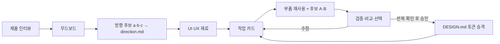

AI가 만든 결과물을 보면 ‘AI가 만든 것 같다’는 느낌이 날 때가 많습니다. 하지만 무엇이 문제인지 딱 집어 말하기는
어렵습니다. 사람이 템플릿을 짜깁기해도 비슷한 결과가 나올 수 있어서, 이런 인상을 AI의 흔적이라고 단정하기도
어렵습니다. 디자인을 잘 모르는 사람이라면 특히 “아, 뭔가 마음에 안 든다. AI 티가 너무 난다”처럼 막연한 생각만
드는 경우가 많습니다. ‘AI 티’라고 느끼는 화면에는 제품과 맞지 않는 구성, 어디서 본 듯한 무난함, 의미 없이
반복되는 이모지나 보더 같은 장식, 화면마다 달라지는 규칙, 긴 제목이나 많은 항목이 들어왔을 때 정렬과 간격이
깨지는 문제 등이 함께 나타날 가능성이 높습니다.

이런 문제는 레퍼런스나 요구사항이 분명하지 않을 때 더 쉽게 생깁니다. 에이전트가 사용자와 사용자가 하려는 일,
제품이 중요하게 보여줄 것과 피할 것을 충분히 알지 못하면 익숙한 화면 요소를 조합해 무난한 결과를 만들 가능성이
커집니다. 화면은 그럴듯하고 기능도 작동합니다. 하지만 왜 이런 구조와 표현을 골랐는지는 설명하기 어렵습니다.
우리가 느끼는 어색함은 색 하나가 잘못돼서가 아니라, 여러 선택이 제품의 목적과 사용자가 하려는 일을 함께
설명하지 못해서 생깁니다. 그래서 긴 프롬프트 하나보다 제품의 방향을 먼저 정하고, 그 방향을 화면에서 계속
확인하는 과정이 필요합니다.

좋은 디자인을 판단하는 기준도 여기서 출발합니다. 특정 색이나 유행을 따랐는지가 아니라, 제품의 방향이 화면에
드러나는지, 여러 화면에서 같은 기준을 지키는지, 실제 데이터와 상태에서도 사용자의 일을 돕는지를 봐야 합니다.
결국 세 가지 질문으로 정리할 수 있습니다. 제품에서 무엇을 중요하게 보여줘야 하는지, 정한 방향을 어떻게 매번
적용할지, 그 방향을 지킨 결과가 사용자에게 적합한지를 살펴보는 것입니다. 첫 번째는 제품의 방향을 정하는 일이고,
두 번째는 반복 적용할 기준을 만드는 일이며, 세 번째는 결과를 비교하고 선택하는 일입니다. 따라서 좋은 문서 한
장이나 긴 프롬프트 하나만으로는 충분하지 않습니다. 세 판단을 한곳에 섞으면 무엇이 바뀌었고 왜 바뀌었는지
추적하기 어렵습니다.

이 세 가지 질문에 한 번에 답하려고 하면 무엇을 정했고, 무엇을 바꿨고, 왜 바꿨는지 알기 어려워집니다. 그래서
제품의 방향을 정하는 일과, 그 방향을 여러 화면에 반복해서 적용하는 일을 나눠서 기록해야 합니다.

먼저 `direction.md`에는 제품의 방향을 적습니다. 사용자가 누구인지, 무엇을 하려는지, 무엇을 중요하게 보여줘야
하는지, 어떤 인상을 주고 피해야 하는지를 정리하는 문서입니다. 레퍼런스를 보며 어떤 점을 가져오고 버릴지도
이곳에서 결정합니다. 핵심 질문은 “이 제품은 무엇을 중요하게 보여줘야 하는가?”입니다.

`DESIGN.md`에는 여러 화면에서 반복해서 확인된 기준을 적습니다. 색과 간격 같은 토큰, 버튼과 카드 같은 부품,
빈 화면·로딩·오류 상태에서 지켜야 할 규칙이 여기에 들어갑니다. 핵심 질문은 “정한 방향을 화면과 코드에서 매번
어떻게 적용할 것인가?”입니다.

| 구분 | `direction.md` | `DESIGN.md` |
| --- | --- | --- |
| 목적 | 방향을 정하고 후보를 비교합니다 | 반복해서 적용할 기준을 정합니다 |
| 내용 | 사용자·사용자의 일·우선순위·피할 인상·레퍼런스 해석 | 토큰·부품·상태별 적용 규칙 |
| 표현 | 상황에 따라 설명이 달라질 수 있습니다 | 화면·코드와 대조할 수 있는 구체적인 규칙입니다 |
| 정본 범위 | 제품의 방향입니다 | 구현 기준입니다 |

작은 프로젝트라면 두 내용을 한 파일에 함께 적어도 괜찮습니다. 하지만 화면과 작업하는 사람이 늘어나면 제품의
방향과 구현 기준이 서로 다른 속도로 바뀌기 시작합니다. 그때 두 문서를 나누면 아직 결정하지 않은 방향과 여러
화면에서 이미 확인된 규칙을 구분해서 관리할 수 있습니다.

# 1. 절차 — 무드에서 화면 루프까지

방법을 세 묶음으로 나눈다. 방향은 제품 단위로 한 번 잡고, 화면은 매번 반복한다.

## Phase A — 방향 (제품 단위 1회)

1. **제품 인터뷰.** 누가·어떤 상황에서·무엇을 하려는지, 주고 싶은 인상과 **피할 인상**을 듣는다.
2. **레퍼런스 조사 → 무드보드.** 방향에 맞는 레퍼런스를 모으되 각각에 **가져올 것 / 버릴 것**을 한 줄로
   해석해 붙인다(복제 아님). 수집처는 두 갈래로 둔다.
   - **자동**: `Are.na` 공개 API(주제 채널·블록), `Unsplash`·`Pexels` API로 톤 이미지를 모은다. 다만
     서비스별 API 승인·호출 제한·사용 조건과 출처 표기 규칙을 확인한 뒤 자동화한다.
   - **보조**: 실제 앱 UI(`Mobbin`·`UXArchive` 등)는 약관·구독 제약이 있어, 에이전트가 검색어만 만들고
     이미지는 사람이 선별한다.
3. **방향 후보 a·b·c 제안.** 서로 다른 판단을 담은 후보 셋을 나란히 보여 주고, 사람이 하나를 **이유와
   함께** 고른다. 코드 한 줄 짜기 전에 가장 싼 단계에서 방향을 확정하는 것이다. 여기서 나온 것이
   `direction.md`다.

## Phase B — 재료 (한 번 만들고 갱신)

4. **UI 부품 리스트업(`ui-inventory.md`).** shadcn 등 **실제 존재하는** 컴포넌트만 카탈로그로 정리한다.
   없는 컴포넌트를 지어내는 문제를 원천 차단한다.
5. **UX 패턴 리스트업(`ux-patterns.md`).** **상태**(빈·로딩·오류·성공)와 **흐름/네비**(화면 전환·확인
   다이얼로그·네비게이션)를 정리한다.

## Phase C — 화면 (화면마다 반복)

6. **작업 카드.** 이번 화면 + **실제에 가까운 데이터** + 반드시 확인할 상태를 한 장에 적는다. 디자인이
   아니라 채점 기준을 먼저 정하는 단계다.
7. **부품 조회 → 생성.** 인벤토리에 맞는 부품이 있으면 **그대로 재사용**하고, 없을 때만 새로 만든다(제품
   전반 일관성). 그 위에서 후보 A·B를 만들되, 어떤 모델·프롬프트가 만들었는지 **가리고** 비교한다.
8. **검증 → 비교 → 선택.** (아래 2·3장)
9. **승격.** 반복 확인된 패턴은 `DESIGN.md`·토큰으로, 새 부품은 `ui-inventory.md`로 올린다.

# 2. 검증은 세 층으로 나눈다

검증은 좋은 결과를 고르는 게 아니라, 후보가 합의한 조건을 지켰는지 확인하는 일이다.

| 층 | 확인 | 예시 |
| --- | --- | --- |
| 계약 유효성 | 문서·토큰이 모순 없이 읽히나 | 토큰 참조·구조 검사 |
| 계약 적용 | 코드가 그 토큰·컴포넌트를 실제로 쓰나 | 소스 대조, 정적 검사 |
| 운영 가능성 | 실제 상태에서 화면을 쓸 수 있나 | 빌드, 접근성, 빈·오류 상태 |

층을 나눠야 “문서가 맞다”를 “구현도 맞다”로 착각하지 않는다.

# 3. 평가와 수렴

검증을 통과했다고 다 채택하진 않는다. 사람은 같은 조건에서 어떤 후보가 과업을 더 돕는지 판단하고,
**유지·수정·회피**와 그 이유를 남긴다. 이것이 평가다. 검증과 달리 평가는 보류·이견을 실패로 보지 않는다.

라운드가 늘었다고 나아진 것도 아니다. 이전 장점이 남고, 고치기로 한 문제가 줄고, 더 큰 문제가 안 생겼을
때만 수렴이다.

| 상태 | 무슨 일 | 다음 행동 |
| --- | --- | --- |
| 수렴 | 장점 유지 + 문제 감소 | 범위를 더 좁힌다 |
| 정체 | 같은 문제가 표현만 바뀜 | 규칙을 더 구체화한다 |
| 후퇴 | 고치며 이전 장점 상실 | 이전 기준으로 되돌린다 |
| 표류 | 목표·비교 조건이 바뀜 | 별도 라운드로 분리한다 |

# 4. 승격과 강등 — 루프를 닫는 법

핵심은 잘 쓴 문서를 보관하는 게 아니라, **반복 확인된 판단만** 규칙으로 남기는 것이다. 한 번의 평가를
곧장 토큰에 넣으면 개인 취향이 전역 규칙이 된다(조기 경화). 여러 화면에서 반복 확인되고 사람이 적용 범위를
승인했을 때만 가장 좁은 정본에 넣는다. 반대로 예외가 늘거나 효과가 없으면 **강등**해 개별 판단으로
되돌린다. 루프가 닫혔다는 건 규칙을 계속 쌓는다는 뜻이 아니라 잘못 굳은 규칙도 되돌린다는 뜻이다.

# 5. 트레이드오프

이 절차는 불확실성을 없애는 게 아니라, 무엇을 자동화하고 무엇을 사람에게 남길지 분명히 하는 장치다.

| 위험 | 어떻게 실패하나 | 완화 |
| --- | --- | --- |
| 조기 경화 | 첫 후보의 취향을 전역 규칙으로 승격 | 여러 화면에서 반복 확인 후 범위 승인 |
| 컨텍스트 충돌 | 방향·토큰·코드가 같은 값을 다르게 말함 | 값은 한 정본에, 나머지는 이유만 |
| 평가 병목 | 사소한 변화까지 사람 리뷰를 기다림 | 반복 확인 가능한 건 검사로, 핵심만 평가 |
| 검사 통과 착각 | 빌드 통과를 좋은 디자인으로 여김 | 검증 기록과 선택 기록을 분리 |

레퍼런스는 언제나 **해석만 하고 복제하지 않는다**. 저작권과 API 약관을 지켜야 하기 때문이기도 하다. 예를
들어 `Unsplash` API는 출처 표기와 API가 반환한 이미지 주소 사용을 요구한다. 무드보드의 목적 자체도 “이
화면을 베낀다”가 아니라 “여기서 밀도와 관계를 해석한다”는 데 있다.

# 6. 결론

에이전트가 제품에 맞는 디자인을 반복하게 하는 건 뛰어난 프롬프트 한 번이나 긴 `DESIGN.md`가 아니다.
흐릿한 방향을 레퍼런스로 뾰족하게 만들고, 검사 가능한 규칙으로 옮기고, 화면을 생성·검증·평가한 뒤, 반복
확인된 판단만 규칙으로 남기는 과정이다.

가장 작은 시작은 이렇다. 제품 인터뷰로 방향을 잡고, 후보 a·b·c에서 하나를 고르고, 실제 데이터와 상태에서
확인하고, 후보 둘을 같은 조건에서 비교한다. 문서는 이 루프의 정답이 아니라, 방향과 구현 사이에서 판단이
세션마다 사라지지 않게 붙잡는 한 계층이다.
