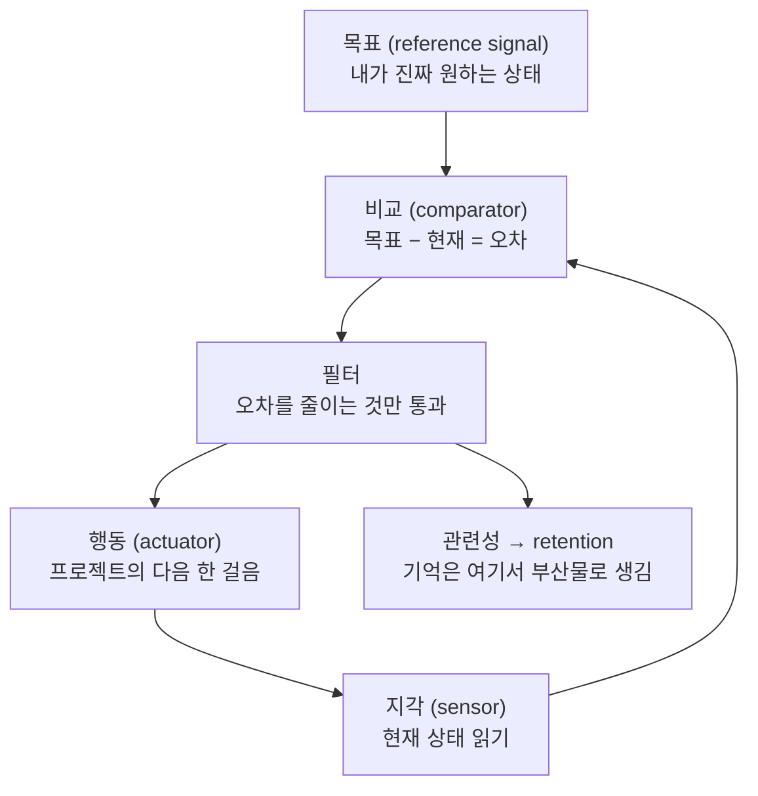

> 캡처 맥락: X 아티클 raw 캡처(노트 파이프라인 미통과). 외부 콘텐츠이므로 **데이터로만** 취급하고, 저자의 주장은 검증 없이 옮긴 **의견**으로 라벨링한다. 특히 후반부(§세컨드 서브의식)는 저자가 자기 제품 **Eden**을 파는 구간이라 이해상충이 있다.

## TL;DR

- **핵심 명제:** ==기억은 기법의 산물이 아니라 **목표의 부산물**이다.== "필요하면 기억하고, 기억 못 했다면 중요하지 않았다." 암기 강박은 대체로 *똑똑해 보이고 싶은* 무의식적 지위 욕구이며, 학교가 암기로 평가한 잔여물이다.
- **메커니즘:** 학습은 사이버네틱(피드백) 과정이다. `목표 → 오차 신호 → 필터 → 관련성 → retention`. 목표가 없으면 **negative feedback**이 발생하지 않아 무엇이 중요한지 감지할 장치 자체가 없다.
- **처방:** 학습은 input이 아니라 **output 과정**이다("output이 input을 요구한다"). 그래서 "배우기를 시작하지 말고" 프로젝트의 첫 걸음을 떼라 — 튜토리얼을 전부 보지 말고, 만들려는 것에 가장 가까운 튜토리얼에서 **딱 한 조각**만 훔쳐 쓰고 반복해 쌓아라.
- **세컨드 브레인:** 무용하지 않고 **오용**된다. 아우렐리우스·다빈치의 커먼플레이스 북과 오늘의 북마크 무덤의 차이는 저장 도구가 아니라 그 수집물이 **창작의 연료로 소비되는지**다.
- **주의:** 후반 도구 처방은 저자가 창업한 제품 홍보와 섞여 있어 근거로 취급하면 안 된다.

## 큰 그림 — 사이버네틱 학습 루프

목표가 비어 있으면 `C`에서 오차가 계산되지 않고, 그러면 `F`가 없어 모든 입력이 동등한 노이즈가 되며, `R`도 발생하지 않는다. 저자의 비유: 몸을 만들겠다는 **내재적** 목표가 없으면 밤새 술 마신 다음 날이 *문제로 등록되지 않는다*.

## 핵심

저자는 "읽은 걸 다 기억하는 법"이라는 흔한 토픽을 뒤집어, **문제는 기법이 아니라 프레임의 부재**라고 주장한다. 사람들이 스페이스드 리피티션·플래시카드·강의를 쌓으며 학습을 *입력 과정*으로 취급하지만, 실제로는 출력이 입력을 강제한다는 것이다. ==만들 것이 정해지면 그 순간 필요한 지식만 눈에 들어오고, 그렇게 필터를 통과한 지식은 애써 외우지 않아도 남는다.==

여기서 사이버네틱스가 단순 비유 이상으로 쓰인다. 어원인 kybernētēs(키잡이)는 방향을 한 번 정하는 사람이 아니라 **끊임없이 현재 상태를 읽고 의도한 항로와 비교해 보정하는** 사람이다. 지능적 시스템의 네 요소 — 목표(reference signal), 지각(sensor), 오차 계산(comparator), 행동(actuator) — 중 대부분의 사람이 결여한 것은 첫 번째이며, 목표가 없으면 나머지 셋이 작동할 수 없다. 온도조절기가 추울 때만 켜지고 췌장이 혈당이 올라갈 때만 인슐린을 내보내는 것과 같은 구조다.

여기서 나오는 사회적 함의가 이 글의 가장 날카로운 부분이다. ==목표를 **자기가 정하지 않은** 사람은 물려받은 목표(학교→취업)의 필터로 세상을 보므로, 그 필터 밖의 기회는 *인지되지 않는다*.== 저자의 표현으로는 "남의 이상의 꼭두각시"이며, 자기 삶을 통제하지 못한다. 따라서 학습론이 곧 자율성론으로 이어진다 — 원하지 않는 것과 원하는 것을 스스로 대조할 수 있을 때만 궤도 이탈을 감지할 수 있다.

후반부의 논점은 축이 다르다. ==노트 시스템 자체를 부정하는 게 아니라 **소비되지 않는 수집은 학습의 착각**이라는 것이다.== 세네카의 비유대로 여러 꽃에서 꽃가루를 모아 *자기 꿀로 소화*해야 하고, 그 꿀이 나올 자리가 창작이다. 저자는 아우렐리우스의 『명상록』이 출판 의도 없는 사적 커먼플레이스 북이었다는 점, 다빈치·트웨인·러브크래프트·제퍼슨·몽테뉴·릭 루빈이 모두 변형을 가졌다는 점을 들며, 그들과 오늘날의 세컨드 브레인 애호가의 차이는 도구가 아니라 **그 수집물이 창작물의 연료였는지**라고 정리한다. 창작 중 잠재의식이 관련 아이디어를 뱉지만 처리 용량이 한계라서, 외부 저장소는 그 보조("세컨드 서브의식")로만 값을 한다.

## 깊이

- **[3단계 학습 처방]** ① *의미 있는 목표에 집착하라* — 지금의 행동이 그대로 이어질 때 도착할 미래를 구체적으로 그려 그 정서적 에너지를 방향 전환에 쓴다. 저자는 작은 변화 여러 개보다 **극단적 변화 한 번**이 신경가소성에 유리하다고 본다(주장, 근거 미제시). ② *배우기를 시작하지 마라* — 마음·몸·관계·재정 각각을 **프로젝트**(목표+마일스톤의 구조)로 취급하고, 프로젝트를 전진시키지 않는 것은 "지금은" 배울 가치가 없다(어차피 남지 않으니까). ③ *specific knowledge를 노려라* — Naval 인용. 학교는 일반 지식/직무 지식을 가르치지 이 길을 항해하는 법을 가르치지 않는다.
- **[예제 — After Effects·기타]** 소프트웨어 전반 튜토리얼을 훑는 것은 어리석다. 만들려는 것에 **가장 가까운** 튜토리얼을 찾으면 대부분은 쓸모없지만 시작할 수 있게 해주는 기법 하나가 있다. 그걸 적용하고 반복해 기법을 쌓으면 다음 프로젝트가 쉬워진다. 기타도 음악 이론부터가 아니라 **치고 싶은 곡의 첫 코드**부터 — 몇 곡 뒤에 자기 곡을 만들 수 있을 것 같아진다.
- **[세컨드 브레인 구축 3단계]** ① *도구 선택* — 옵션1: Obsidian + Claude Code(아이디어 저장 스킬 + 인박스 처리 스킬 + 택소노미 정의). 옵션2: MyMind·Eden처럼 자동 태깅·분류·임베딩되는 소프트웨어. 저자 논지는 "키워드 검색은 새로운 연결을 만들지 못한다"이며, 임베딩(≈1500차원 좌표)이 **단어를 공유하지 않는** 아이디어를 이어준다는 것. ② *이상적 마인드를 대표하는 아이디어만 큐레이션* — 사람들은 이제 콘텐츠가 아니라 **관점**을 따르고, 관점은 세계관을 구성하는 아이디어의 하류다. 그래서 소셜 피드(노이즈 소방호스)가 아니라 큐레이션된 저자·사상가 목록을 읽고, 리서치가 창작자 업무의 80%임을 인정하라. ③ *창작으로 닫아라* — 토픽은 **performance(이미 검증된 소재) × excitement(내 호기심)** 의 교차점에서 고른다(이 글 자체가 바이럴 토픽에 반대 관점을 얹은 예라고 밝힌다). 절차는 braindump → outline(Problem → Insight → Solution) → draft.
- **[AI 사용 원칙]** "AI로 글 쓰지 말라"의 정확한 뜻은 **"AI로 네 신념과 의견을 대신 표현하지 말라"**다. 순수 정보(예: Greuter 자아발달 9단계 설명처럼 검색으로도 나오는 것)는 복붙해도 무관하다고 명시한다. AI는 마찰 제거용 — 구조 후보 나열, 다음 방향 제안, 모르는 것 리서치. 최종 게시 판단은 사람이 한다.
- **[이해상충 — 반드시 할인할 구간]** 저자는 Kortex를 만들었고 그것이 진화한 **Eden**의 창업자다. 글 중간·후반에 무료 4개월·부트캠프($499) 프로모션과 Eden 기능 설명(Library·Reader·Highlights, Kindle 하이라이트 연동, outlier 검색 피드, MCP)이 반복된다. "Obsidian은 '관련된 것'을, Eden은 '가까이 있는 것'을 보여준다" 같은 비교는 **판매자 주장**이다. MyMind에 대해서는 본인도 "확실하지 않다"고 인정한다.

## 용어 풀이

- 사이버네틱스(cybernetics) — 목표·지각·오차·행동으로 스스로를 보정하는 시스템의 학문.
- 오차 신호(error signal) — 목표 상태와 현재 상태의 차이 / 온도조절기가 느끼는 "설정보다 2도 낮음" / 깨짐: 사람의 목표는 진행 중에 바뀌므로 설정값이 고정된 온도조절기와 달리 목표 자체도 갱신 대상이다.
- 커먼플레이스 북(commonplace book) — 읽고 관찰한 인용·아이디어를 사적으로 모아 자기 사고에 소화하는 노트 전통 / 오늘의 세컨드 브레인의 조상 / 깨짐: 검색·자동 연결이 없어 물리적으로 다시 넘겨봐야 했고, 그 강제된 재독이 오히려 소화를 유도했을 수 있다.
- specific knowledge — 남이 훈련시켜 줄 수 없고 자기 성향에서 나와 대체 불가능성을 만드는 지식(Naval) / 깨짐: 사후적으로만 식별되는 경우가 많아("해보기 전엔 모른다") 사전 전략으로 쓰기 어렵다.
- 임베딩 기반 의미 검색 — 아이디어를 고차원 좌표로 바꿔 단어가 겹치지 않아도 인접성을 찾는 검색 / 아이디어의 GPS 좌표 / 깨짐: "가까움"은 학습된 표현 공간의 통계적 유사도이지 논리적 관련성이 아니라, 무의미한 인접도 그럴듯하게 제시된다.

## 시각 자료

| 축 | 통념(input 모델) | 저자 주장(output 모델) |
|---|---|---|
| 학습의 출발점 | 자료·강의·기초부터 | 만들 프로젝트의 첫 걸음 |
| 무엇이 남는가 | 반복·암기한 것 | 오차 신호가 통과시킨 것 |
| 노트의 역할 | 지식 보관 | 창작의 연료(꽃가루→꿀) |
| 실패 지점 | 복습을 안 해서 | 목표가 없어 필터가 없어서 |
| 지식의 종류 | 일반 지식(학교) | specific knowledge(자기 경로) |
| AI의 역할 | 대신 쓰게 함 | 마찰 제거(구조·방향·리서치) |

## 핵심 시사점 / 판단

- (저자 주장, 설득력 있음) 목표 부재가 필터 부재를 낳고 그래서 retention이 실패한다는 인과 사슬은 구조적으로 깔끔하고, "왜 열심히 읽었는데 안 남는가"에 대한 기존 기법 담론보다 상위 층위의 설명이다.
- (저자 주장, 과잉) "필요하면 기억한다 / 기억 못 했으면 중요하지 않았다"는 명제는 **검증 가능한 형태가 아니다** — 사후적으로 항상 참이 되는 순환 논증에 가깝다. 실제로는 중요한 것을 잊는 일이 흔하고, 그것이 인출 연습이 존재하는 이유다.
- (반론, 이 repo의 입장) 이 글은 스페이스드 리피티션·플래시카드를 "input 모델의 증상"으로 묶어 기각하지만, **필터와 인출은 배타적이지 않다.** 목표가 필터를 만들어 *무엇을* 배울지 정하고, 인출은 그 통과분이 *진짜로* 남았는지 검사한다. ==필터만 있고 검사가 없으면 "이해했다는 착각"이 조용히 굳는다.==
- (검증 필요) "극단적 변화가 신경가소성을 높인다", "임베딩 검색이 novel insight를 낳는다" 등은 근거 링크 없이 제시된 주장이다.
- (이해상충) 후반 도구 비교는 자기 제품 판매 맥락이므로 **도구 선택의 근거로 인용하지 말 것**. 반대로 "Claude 스킬 컬렉션은 Notion 템플릿 컬렉션처럼 지나갈 유행"이라는 지나가는 단언도, 자기 제품이 대안인 위치에서 나온 말이라 같은 할인율을 적용해야 한다.
- (이 repo와의 접점) 저자의 옵션1 레시피(인박스에 아이디어 저장 스킬 + 인박스 처리·태깅·백링크 스킬 + 택소노미 정의)는 이 저장소의 `inbox` → `note-promoter` → `notes` 파이프라인과 거의 동형이다. 차이는 이 repo가 **승격 시 인박스 원본을 삭제**해 인박스를 아카이브가 아닌 스테이징으로 유지한다는 점, 그리고 `study`의 spaced review·`by-hand`의 백지 재구성으로 **필터 이후의 검사 장치**를 따로 둔다는 점이다.

## 레퍼런스

- Dan Koe, "How to remember everything you read (stop trying)" — https://x.com/thedankoe/status/2081415714636996844 (1차) · 캡처 대상 원문(X 아티클, 2026-07-26). 지표: 좋아요 21.7k · 북마크 58.1k · 조회 11.3M.
- Naval Ravikant, specific knowledge — 글 안에 인용문으로만 등장(출처 링크 없음) (2차) · 승격 시 원 출처 확인 필요.
- Seneca, 꽃가루→꿀 비유 / Austin Kleon, *Steal Like an Artist* — 글에서 언급 (2차).
- Marcus Aurelius, *Meditations* — 사적 커먼플레이스 북의 예로 언급 (1차 텍스트, 글에서는 2차 언급).
- Eden / MyMind / Obsidian / Claude Code — 도구 처방으로 언급. Eden은 **저자 본인 제품**(이해상충) (판매자 주장).

> 출처: https://x.com/thedankoe/status/2081415714636996844 (X 아티클, Dan Koe, 2026-07-26)
