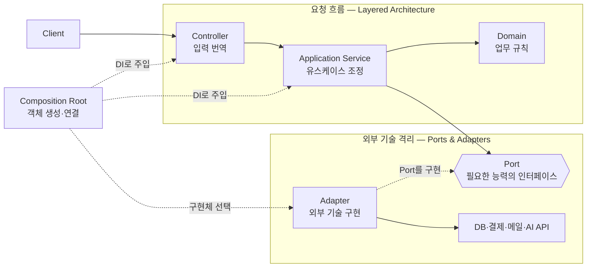

> 한 줄: 실제 코드가 어려운 이유는 패턴 하나를 보는 것이 아니라 **여러 패턴이 한꺼번에 겹친 결과**를 보고 있기 때문이며, 이 패턴들은 경쟁 관계가 아니라 **각각 다른 질문에 답한다.**

## 큰 그림

| 질문 | 흔한 패턴 | 핵심 용어 |
| --- | --- | --- |
| 요청은 어떤 단계를 거치는가? | Layered Architecture | Controller, Application Service, Domain |
| 업무 로직을 외부 기술에서 어떻게 보호하는가? | Ports & Adapters | Port, Adapter |
| 객체가 필요한 의존성을 어떻게 받는가? | Dependency Injection | constructor, token, provider |
| 실제 객체를 어디서 만들고 연결하는가? | Composition Root | bootstrap, module, binding |
| 여러 구현 중 무엇을 쓸지 어떻게 정하는가? | Strategy, Factory, Router | 선택 정책, 생성, 요청별 라우팅 |
| 경계를 넘는 데이터 모양을 어떻게 합의하는가? | DTO·Contract | Request, Response, Schema |

한 장으로 겹쳐 보면 이렇다.



위쪽의 실제 요청 흐름과 아래쪽의 조립 흐름을 **분리해서** 보는 것이 이 그림을 읽는 방법이다.

```text
요청이 들어온 뒤: Client → Controller → Application → Domain → Port → Adapter
시작할 때 한 번: Composition Root가 객체를 만들고 서로 연결
```

## 핵심

패턴 이름을 외우는 대신 **하나의 기능을 여섯 번 다르게 보는 연습**이 빠르다. 같은 그림을 여섯
장의 트레이싱지로 겹쳐 놓은 것과 같다 — 종이를 한 장씩 들어내면 각 장에 무엇이 그려져 있는지
보이지만, 겹쳐 두면 선이 뒤엉켜 보인다.

"주문을 결제한다"는 기능 하나를 놓고 시작한다.

```text
POST /orders/123/pay
        ↓
PaymentController
        ↓
CheckoutService
        ↓
Order
        ↓
PaymentPort
        ↓
StripePaymentAdapter
        ↓
Stripe API
```

**1. Layered Architecture — 요청 흐름을 역할별로 나눈다.** 답하는 질문은 "요청을 받고 결과를
돌려줄 때 각 단계가 무엇을 담당하는가"다.

```text
Controller → Application Service → Domain → Repository
```

Controller는 HTTP 요청을 Application이 이해할 입력으로 바꾸고, Application Service는 유스케이스의
실행 순서를 조정하고, Domain은 결제 가능 여부 같은 업무 규칙을 판단하고, Repository는 데이터
읽기·저장을 추상화한다.

```ts
class CheckoutService {
  async pay(orderId: string) {
    const order = await orders.find(orderId);
    order.checkPayable();
    await payment.pay(order.totalPrice);
    order.markPaid();
    await orders.save(order);
  }
}
```

Layered Architecture의 관심은 **호출 순서와 역할 분담**이다. 구현체를 어떻게 교체하는지는 아직
설명하지 않는다.

**2. Ports & Adapters — 외부 기술을 Core에서 떼어낸다.** 답하는 질문은 "결제 업체·데이터베이스·
메일 서비스가 바뀌어도 업무 규칙을 유지하려면 어떻게 하는가"다.

```ts
interface PaymentPort {
  pay(amount: number): Promise<void>;
}

class StripePaymentAdapter implements PaymentPort { /* Stripe API 호출 */ }
class FakePaymentAdapter implements PaymentPort { /* 테스트에서 실제 결제 없이 성공 */ }
```

Repository도 데이터 저장을 위한 Output Port의 흔한 형태이고, Controller는 HTTP를 Application
호출로 바꾸는 Input Adapter로 볼 수 있다. 이 패턴의 관심은 **의존 방향과 기술 격리**다.

## 깊이

### Dependency Inversion과 Dependency Injection — 비슷하지만 다르다

가장 자주 섞이는 한 쌍이다. **Dependency Inversion Principle**은 의존 *방향*에 대한 원칙이다.

```text
잘못된 방향: Application → Stripe 구체 구현
뒤집은 방향: Stripe Adapter → Application이 소유한 PaymentPort
```

고수준 정책이 저수준 기술을 직접 알지 않고, 고수준 쪽이 인터페이스를 소유한다.

**Dependency Injection**은 객체를 *전달하는 방법*이다.

```ts
class CheckoutService {
  constructor(private readonly payment: PaymentPort) {}
}
```

Service가 직접 `new StripePaymentAdapter()`를 하지 않고 바깥에서 받은 객체를 사용한다.

```text
Dependency Inversion = 어떤 방향으로 의존해야 하는가
Dependency Injection = 필요한 객체를 어떻게 전달하는가
```

둘은 같이 쓰이는 경우가 많지만 같은 개념이 아니다. DI 컨테이너를 쓰면서도 구체 클래스에 직접
의존하면 Injection만 있고 Inversion은 없다. 반대로 컨테이너 없이 `main`에서 손으로 넘겨줘도
Inversion은 완전히 성립한다.

### Composition Root — `new`와 연결을 한곳에 모은다

"Application이 구현체를 고르지 않는다면 누가 실제 객체를 만들고 연결하는가"에 답한다. 가장
단순한 Composition Root는 `main` 함수다.

```ts
const payment = new StripePaymentAdapter();
const checkout = new CheckoutService(payment);
const controller = new PaymentController(checkout);
```

이 세 줄이 전체 객체 그래프를 조립한다. NestJS에서는 Module과 Provider 설정이 같은 일을 한다.

```ts
@Module({
  controllers: [PaymentController],
  providers: [
    CheckoutService,
    { provide: PAYMENT_PORT, useClass: StripePaymentAdapter },
  ],
})
class PaymentModule {}
```

따라서 `Module`은 아키텍처의 중심 개념이 아니라 **프레임워크가 Composition Root를 표현하는
문법**이다. `Binding`도 별도의 거대한 패턴이 아니라 "`PAYMENT_PORT` 자리에는
`StripePaymentAdapter`를 넣는다"는 연결 관계를 뜻한다.

### Strategy·Factory·Router — 여러 구현 중 하나를 고른다

"같은 Port를 구현하는 Adapter가 여러 개라면 언제, 어떻게 하나를 선택하는가"에 답한다.

**Strategy** — 같은 인터페이스로 교체할 수 있는 여러 구현체.

```text
PaymentPort
├─ StripePaymentAdapter
├─ PayPalPaymentAdapter
└─ FakePaymentAdapter
```

**Factory** — 구현체를 생성하고 선택한다. 배포 단위에서 구현체 하나를 고정할 때 흔하다.

```ts
function createPayment(config: Config): PaymentPort {
  return config.provider === 'stripe'
    ? new StripePaymentAdapter()
    : new PayPalPaymentAdapter();
}
```

**Router** — 요청마다 구현체를 선택한다.

```ts
class PaymentRouter implements PaymentPort {
  pay(request: PaymentRequest) {
    const adapter = request.country === 'KR'
      ? this.koreanPayment
      : this.globalPayment;

    return adapter.pay(request);
  }
}
```

```text
Factory  = 시작할 때 어떤 객체를 만들지 선택
Router   = 실행 중 요청마다 어디로 보낼지 선택
Strategy = 선택 가능한 공통 규격의 구현체들
```

### DTO와 Contract — 경계를 넘는 데이터 모양을 정한다

"서로 다른 계층이나 서비스가 어떤 데이터 모양으로 대화하는가"에 답한다.

```text
PayRequest       → HTTP 경계를 넘는 데이터
Order            → 업무 규칙과 상태를 가진 Domain 객체
PaymentPort      → 외부 기능에 대한 인터페이스
```

DTO·Contract는 데이터를 운반하는 약속이며 Domain 객체와 같은 것이 아니다.

### 어떤 순서로 배우면 덜 헷갈리는가

1. **Layered Architecture** — Controller, Application, Domain의 역할을 구분한다.
2. **인터페이스와 다형성** — 같은 인터페이스를 여러 객체가 구현할 수 있음을 익힌다.
3. **Dependency Inversion** — 인터페이스를 왜 Core 쪽이 소유하는지 이해한다.
4. **Ports & Adapters** — 외부 기술을 Port 뒤로 밀어낸다.
5. **Dependency Injection** — 실제 객체를 생성자 인자로 전달한다.
6. **Composition Root** — 객체 생성과 연결을 한곳으로 모은다.
7. **Strategy·Factory·Router** — 구현체가 여러 개일 때만 선택 정책을 추가한다.
8. 마지막에 **프레임워크의 Module·Provider·Token**으로 같은 개념을 번역한다.

처음부터 Module, Provider, symbol token, 중간 Binding 객체를 보면 프레임워크 문법과 아키텍처
개념이 섞여 이해하기 어렵다. 먼저 `new` 세 줄짜리 조립이 자연스럽게 읽혀야 하고, 프레임워크는
그 세 줄을 선언적인 설정으로 바꾸는 도구로 보여야 한다.

### 패턴을 적용하지 않아도 되는 경우

패턴은 많이 넣을수록 좋은 것이 아니다.

- 구현체가 하나이고 교체·테스트 문제가 없다면 Port가 불필요할 수 있다.
- 유스케이스가 단순하면 Service 클래스 대신 함수 하나면 충분하다.
- Composition Root는 별도 프레임워크 없이 `main.ts` 몇 줄일 수 있다.
- 요청별 선택이 없다면 Router는 필요 없다.
- Binding용 중간 객체도 관련 값을 함께 유지해야 할 때만 필요하다.

기억할 기준은 이것이다.

> **먼저 직접 연결한 단순한 코드를 만들고, 실제로 바뀌는 이유가 갈라질 때 경계와 패턴을 추가한다.**

프로젝트 안에서만 통하는 구현 장치를 널리 알려진 패턴으로 착각하지 않는 것도 여기에 포함된다.
예컨대 선택된 Adapter와 관찰용 이름을 함께 묶은 `{ port, label }` 같은 객체는 별도 아키텍처
패턴이 아니라 그 코드베이스의 지역적인 장치다.

## 용어 풀이

- **계층형 아키텍처(Layered Architecture)** — 요청 처리 단계를 역할별로 쌓아 나누는 스타일.
  깨짐: 계층이 곧 배포 단위라고 오해.
- **포트-어댑터(Ports & Adapters)** — 외부 기술을 인터페이스 뒤로 밀어내 업무 규칙을 격리하는
  구조. 깨짐: 계층형과 대립하는 선택지로 착각 — 둘은 다른 질문에 답한다.
- **의존성 역전 원칙(Dependency Inversion Principle, DIP)** — 고수준이 인터페이스를 소유하게
  해 의존 방향을 뒤집는 원칙. 깨짐: DI와 동일시.
- **의존성 주입(Dependency Injection, DI)** — 필요한 객체를 바깥에서 전달받는 기법. 깨짐:
  컨테이너를 쓰면 자동으로 DIP가 지켜진다고 오해.
- **조립 지점(Composition Root)** — 객체 생성과 연결을 한곳에 모은 자리. 깨짐: 프레임워크
  Module을 아키텍처 개념으로 승격.
- **전략·팩토리·라우터(Strategy·Factory·Router)** — 교체 가능한 구현체 집합 / 시작 시 선택 /
  요청별 선택. 깨짐: 셋을 한 덩어리로 묶어 이해.
- **DTO·계약(Contract)** — 경계를 넘는 데이터 운반 약속. 깨짐: Domain 객체를 그대로 사용.

## 확인 질문

1. NestJS의 `@Module` 설정은 여섯 질문 중 어느 것에 답하는가?
   <details><summary>답</summary>"실제 객체를 어디서 만들고 연결하는가" — Composition Root다. 프레임워크가 `new` 사슬을 선언적 설정으로 바꾼 것이며, 요청 흐름의 한 단계가 아니다.</details>
2. DI 컨테이너를 도입했지만 Service가 `StripePaymentAdapter` 타입을 직접 생성자에 적었다. 어떤
   원칙이 지켜지고 어떤 원칙이 빠졌나? <details><summary>답</summary>Dependency Injection은 지켜졌고(객체를 바깥에서 받는다) Dependency Inversion은 빠졌다(고수준이 구체 구현에 의존한다). 주입 방식과 의존 방향은 별개 축이다.</details>
3. (본문 밖) 결제 업체를 국가별로 나누되 배포마다 하나로 고정하고 싶다면 Factory와 Router 중
   무엇을 쓰고, 반대로 한 배포에서 한국 요청만 다른 업체로 보내야 하면 무엇으로 바뀌나?
   <details><summary>답</summary>배포마다 고정이면 시작 시 선택이므로 Factory다. 요청의 국가 값에 따라 갈라야 하면 실행 중 선택이므로 Router이며, 이때 Router 자신이 같은 Port를 구현해 호출자에게는 하나로 보이게 한다.</details>

## 근거

- 학습 세션 실측: 하나의 NestJS 유스케이스 코드에 Layered·Ports & Adapters·Factory·Composition
  Root·DTO가 동시에 나타나 혼란이 생겼고, 패턴별로 이름을 따로 붙여 정리한 기록 —
  `turborepo-platform-lab` M02 검토(2026-08-14).
- Martin Fowler, [Inversion of Control Containers and the Dependency Injection pattern](https://martinfowler.com/articles/injection.html)
  — DI와 IoC 컨테이너의 구분. 2차 정리(저자 원문). 2026-08-14 세션에서 인용한 출처로, 이 노트를
  쓰며 다시 열어 확인하지는 않았다.
- Eric Evans, *Domain-Driven Design* / Robert C. Martin, *Clean Architecture* — Domain 객체와
  DTO의 구분, Dependency Rule의 표준 서술.

## 관련 개념

- 앞: [Core–Port–Adapter의 역할 분담과 의존성 역전 정리](/study-note/software-architecture/hexagonal-core-port-adapter/) — 이 지도의 중심에 있는 구조를 먼저 하나만 본다.
- 관련: [계층별 책임 구분과 오류 번역 위치](/study-note/software-architecture/layer-responsibility/) — Layered 항목을 실제 코드 층위로 내려 본 경우.
- 관련: [NestJS 의존성 주입 동작](/study-note/nestjs/dependency-injection/) — Composition Root와 DI를 프레임워크가 구현하는 방식.
- 관련: [NestJS 동적 모듈 구성](/study-note/nestjs/dynamic-module/) — Factory 선택을 모듈 설정으로 표현하는 방법.
