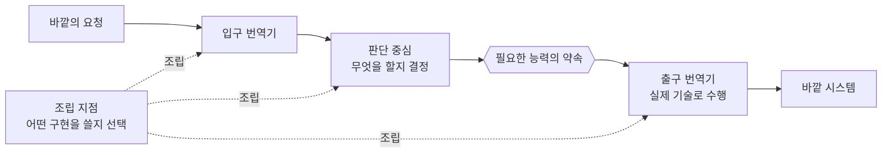

> 한 줄: 이 구조의 본질은 **"무엇을 해야 하는가"라는 정책과 "어떻게 해내는가"라는 기술을 떼어 놓고, 그 사이를 Port라는 약속 하나로만 잇는 것**이다.

## 큰 그림

`Controller`, `Service`, `Module` 같은 이름을 잠시 내려놓으면 전체는 다섯 역할뿐이다.



실선은 요청이 흐르는 방향(호출)이고, 점선은 시작할 때 한 번 일어나는 조립이다. 이 둘을 같은
파이프라인으로 읽는 것이 가장 흔한 혼란의 원인이다 — **조립 지점은 요청을 처리하지 않는다.**
프로그램이 켜질 때 "이번 실행에는 이 구현을 꽂아라"라고 정하고 물러난다.

더 짧게 줄이면 이렇다.

```text
요청을 번역한다 → 판단한다 → 필요한 일을 요청한다 → 실제 기술로 수행한다
```

## 핵심

주방으로 바꿔 보면 한 번에 잡힌다. **Core는 주방장**이다 — 주문을 받아들일지, 무엇을 만들지
판단한다. **Port는 주문표**다 — "토마토를 가져다 달라"까지만 적혀 있고, 어느 시장에서 어떻게
사 올지는 적히지 않는다. **Adapter는 심부름꾼**이다 — 동네 가게에 뛰어가든 온라인으로 주문하든,
주문표에 적힌 것을 실제로 가져온다. 주방장은 심부름 방법이 바뀌어도 요리법을 바꾸지 않는다.

메커니즘으로 내려가자. 요구사항 하나를 예로 든다.

> 회원가입이 끝나면 사용자에게 환영 메시지를 보낸다.

**판단 중심 — Core.**

```ts
async function welcome(name: string, sender: MessageSender) {
  if (name.trim() === '') throw new Error('이름이 필요하다');
  await sender.send(`${name}님, 환영합니다`);
}
```

Core가 판단하는 것은 두 가지뿐이다 — 이름이 비어 있으면 거절하고, 가입이 끝나면 환영 메시지를
보낸다. 이메일인지 SMS인지는 판단하지 않는다.

**필요한 능력의 약속 — Port.**

```ts
interface MessageSender {
  send(message: string): Promise<void>;
}
```

Core가 말하는 것은 "문자열을 전달하면 보내 줄 수 있는 무언가가 필요하다"뿐이다. Port는 메시지를
보내는 물건이 아니라 **Core가 바깥에 요구하는 능력의 모양**이다.

**실제 기술 — Adapter.**

```ts
class EmailSender implements MessageSender {
  async send(message: string) {
    // 이메일 API 호출
  }
}

class SmsSender implements MessageSender {
  async send(message: string) {
    // SMS API 호출
  }
}
```

이메일과 SMS는 방식이 완전히 다르지만 둘 다 `send(message)`라는 같은 약속을 지킨다.

**어떤 구현을 쓸지 선택 — 조립 지점.**

```ts
const sender = env.MESSAGE_TYPE === 'sms'
  ? new SmsSender()
  : new EmailSender();

await welcome('현우', sender);
```

Core가 아니라 애플리케이션 시작 지점이 구현체를 고른다. 그래서 이메일을 SMS로 바꿔도
`welcome()`의 판단은 한 글자도 변하지 않는다.

분리하지 않으면 Core가 이렇게 된다.

```ts
if (messageType === 'email') {
  callEmailApi();
} else {
  callSmsApi();
}
```

이제 이메일 API가 바뀌어도, SMS 업체가 바뀌어도, 테스트용 가짜 구현이 필요해도 Core를 고쳐야
한다. **업무 판단과 기술 변경이 한 덩어리**가 된 것이다. 판단 기준은 하나다.

```text
바뀌는 이유가 다르면 분리한다.

환영 메시지를 언제 보낼지가 바뀜 → Core 변경
이메일 업체가 바뀜               → Email Adapter 변경
이메일 대신 SMS를 사용함          → 조립 지점 변경
HTTP 요청 형식이 바뀜             → Controller·Contract 변경
```

## 깊이

**Port를 Core가 소유하는 이유 — 의존성 역전.** Core가 HTTP Adapter를 직접 가져오면 의존
방향은 `Core → HTTP 기술`이 된다. 외부 호출 방식이 바뀔 때마다 Core가 바뀐다. Port는 이 방향을
뒤집는다.

```text
Core → Port라는 요구사항        (Core가 Port를 소유)
HTTP Adapter → 그 Port를 구현
Echo Adapter → 같은 Port를 구현
```

여기서 **소스 코드 의존 방향과 실행 중 호출 방향이 반대**라는 점이 핵심이다. 소스에서는
Adapter가 Core 쪽 인터페이스를 향해 의존하고, 실행 중에는 Core가 주입된 Adapter 객체의
`send()`/`complete()`를 호출한다. 이 어긋남이 의존성 역전(Dependency Inversion)의 실물이며,
Port 선언이 Adapter 쪽이 아니라 **Core 쪽에 있어야** 성립한다. Port를 Adapter 패키지에 두면
이름만 인터페이스이고 방향은 그대로다.

**여덟 이름은 같은 층위가 아니다.** 이것이 전체 그림이 안 잡히는 진짜 원인이다.

```text
아키텍처의 중심: Core — Port — Adapter
입력 쪽의 한 구현: Controller
유스케이스 조정 방식: Service
프레임워크의 조립 도구: Module
실제 구현 선택 장소: Composition Root
경계를 넘는 데이터 약속: Contract
```

- **Controller** — HTTP 같은 바깥 요청을 안쪽 호출로 바꾸는 **입력 Adapter**다. 포트-어댑터
  어휘로는 Controller도 Adapter의 한 종류이지, 별개 범주가 아니다.
- **Service** — 한 유스케이스의 실행 순서를 조정하는 역할. 프로젝트에 따라 Core에 가깝기도 하고
  Controller와 Core를 잇는 얇은 연결자이기도 하다. **반드시 별도 클래스여야 하는 것은 아니며,
  이름이 Service라고 해서 핵심 업무 규칙을 가져야 하는 것도 아니다.**
- **Module** — 객체를 만들고 연결하도록 프레임워크에 알려 주는 등록 문법. NestJS의 도구이지
  아키텍처의 본질이 아니다.
- **Composition Root / Binding** — 이메일과 SMS 중 무엇을 꽂을지 실제로 결정하는 조립 지점.
  가장 단순한 형태는 `main` 함수 세 줄이다.
- **Contract** — HTTP 요청·응답처럼 경계를 넘는 데이터의 모양. Domain 객체와 같은 것이 아니다.

**규칙을 어디에 둘지 판단하는 질문.** 어떤 규칙이 Core와 Adapter 중 어디에 속하는지 헷갈리면
이렇게 묻는다.

> **기술 구현을 다른 것으로 바꿔도 이 규칙이 남는가?**

- "모든 환영 메시지는 100자 이하여야 한다"가 제품 전체 정책이면, 이메일에서 SMS로 바꿔도 남으므로
  **Core 규칙**이다.
- "이 SMS 업체는 한 번에 80자만 받는다"라면 업체를 바꾸면 사라지므로 **SMS Adapter의 제약**이다.

**(곁가지) 같은 질문을 prompt 길이 제한에 적용하면.** 어떤 AI 구현을 쓰더라도 입력을 2,000자로
제한한다는 제품 정책이면 `MAX_PROMPT_CHARS`처럼 공급자 중립적인 단위로 Core가 소유할 수 있다.
반대로 특정 공급자만 가진 제한이면 그 Adapter의 설정이나 오류 변환에 가깝다. 주의할 점은
**"Core에 두는 구조가 설명 가능한 것"과 "숫자 2,000의 근거가 있는 것"은 별개**라는 것이다.
구조는 정당해도 숫자는 제품 요구사항이나 측정 결과로 따로 확정해야 하며, 문자 수와 token 수는
같은 단위도 아니다. 구조가 맞다고 값까지 정당해지지는 않는다.

**기억할 최소 문장.**

> **Core는 무엇을 할지 결정하고, Port는 무엇이 필요한지 말하고, Adapter는 그것을 특정 기술로
> 해낸다. 조립 지점은 어떤 Adapter를 쓸지 고른다.**

이 문장이 잡히면 Controller, Service, Module은 그 주변에서 입력을 번역하고 실행 순서를 조정하고
객체를 조립하는 도구로 보이기 시작한다.

## 용어 풀이

- **판단 중심(Core / Domain)** — 기술과 무관하게 유지해야 할 제품·업무 판단. 깨짐: 프레임워크
  타입이나 HTTP status를 Core가 알기 시작하면 이미 Core가 아니다.
- **포트(Port)** — Core가 바깥에 요구하는 능력의 인터페이스. "무슨 HTTP 요청을 보내라"가 아니라
  "입력을 주면 결과를 돌려달라"까지만 말한다. 깨짐: 선언 위치가 Adapter 쪽이면 역전이 성립하지
  않는다.
- **어댑터(Adapter)** — Port를 특정 기술로 구현한 코드. 깨짐: 입력 쪽 Controller도 Adapter라는
  점을 놓치면 그림이 좌우로 안 닫힌다.
- **의존성 역전(Dependency Inversion)** — 고수준 정책이 저수준 기술을 직접 알지 않고, 고수준
  쪽이 인터페이스를 소유하는 원칙. 깨짐: 객체를 생성자로 전달하는 방법(Dependency Injection)과
  혼동.
- **조립 지점(Composition Root)** — `new`와 연결을 한곳에 모은 자리. 깨짐: 프레임워크 Module
  문법을 아키텍처 개념으로 착각.
- **계약(Contract / DTO)** — 경계를 넘는 데이터의 공용 양식. 깨짐: Domain 객체를 그대로 계약으로
  내보내면 내부 변경이 곧 외부 breaking change가 된다.

## 확인 질문

1. Port 인터페이스를 Adapter 패키지 쪽에 선언해 두고 Core가 그것을 import하면, 무엇이 무너지나?
   <details><summary>답</summary>소스 의존 방향이 `Core → Adapter`로 되돌아가 의존성 역전이 성립하지 않는다. 인터페이스를 썼다는 사실만으로는 역전이 아니며, 소유 위치가 방향을 결정한다.</details>
2. "이 SMS 업체는 한 번에 80자만 받는다"는 제약을 Core의 공통 규칙으로 올리면 나중에 어떤 일이
   생기나? <details><summary>답</summary>업체를 바꾸면 사라질 제약이 Core에 남는다. 새 업체가 200자를 받아도 Core가 80자에서 거절하고, 제약을 걷어내려면 기술 교체 때마다 Core를 고쳐야 한다 — Port를 둔 이유가 사라진다.</details>
3. (본문 밖) 어떤 팀이 Port와 Adapter를 다 만들었는데, Adapter 구현이 하나뿐이고 테스트에서도
   실제 구현을 그대로 쓴다. 이 Port는 값을 내고 있나? <details><summary>답</summary>거의 내지 않는다. Port가 파는 상품은 구현 교체 가능성과 테스트 대체 가능성인데 둘 다 쓰지 않으므로, 간접 층 하나만 늘어난 상태다. 먼저 직접 연결한 단순한 코드를 두고, 바뀌는 이유가 실제로 갈라질 때 Port를 넣는 편이 낫다.</details>

## 근거

- 학습 세션 실측: `packages/core`(판단 중심과 Port 선언), `apps/api`(Controller·Service·Module과
  환경 변수로 Adapter를 고르는 binding), Echo·HTTP 두 Adapter가 같은 `CompletionPort`를 구현하는
  구성 — `turborepo-platform-lab` M02 검토(2026-08-14).
- Alistair Cockburn, [Hexagonal Architecture](https://alistair.cockburn.us/hexagonal-architecture/)
  — 포트-어댑터의 원 제안. 1차 출처.
- Robert C. Martin, *Clean Architecture* — Dependency Rule("의존은 항상 안쪽으로")과 component
  정의. 2차 정리서.
- 위 두 외부 출처는 2026-08-14 학습 세션에서 이름으로 인용된 것이며, 이 노트를 쓰며 다시 열어
  확인하지는 않았다.

## 관련 개념

- 뒤: [겹치는 아키텍처 패턴들의 질문별 역할 지도](/study-note/software-architecture/common-patterns-map/) — 여기서 본 구조가 실제로는 여러 패턴이 겹친 결과임을 분리해서 본다.
- 뒤: [도메인·애플리케이션·어댑터 계층의 책임 구분](/study-note/software-architecture/domain-application-adapter/) — 세 역할에 코드를 실제로 배치할 때의 판단.
- 뒤: [경계에서의 입력 검증 위치 판정](/study-note/software-architecture/validation-at-boundary/) — "기술을 바꿔도 남는 규칙인가"를 검증 규칙에 적용한 경우.
- 관련: [NestJS 의존성 주입 동작](/study-note/nestjs/dependency-injection/) — 조립 지점을 프레임워크가 대신 수행하는 방식.
